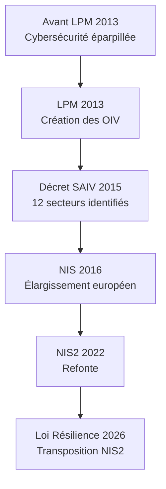
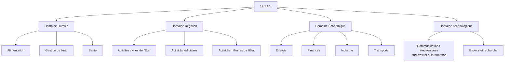
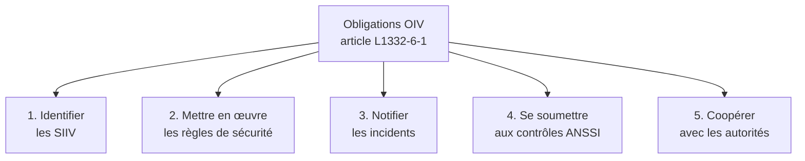
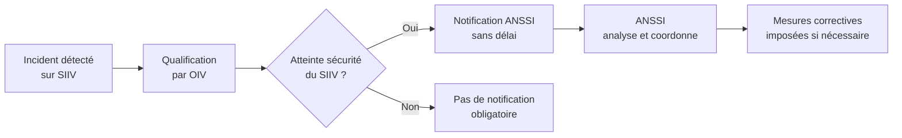
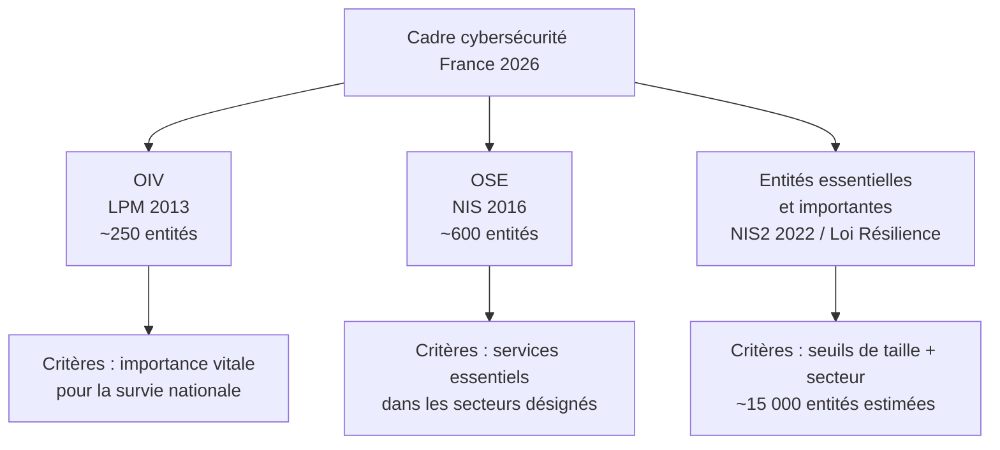
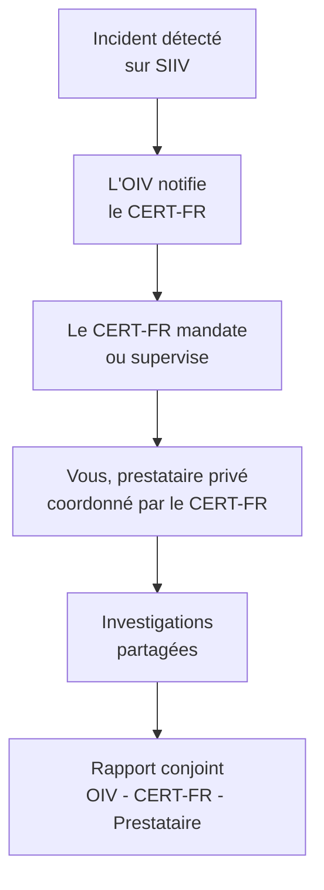

# Loi de Programmation Militaire 2013 et OIV

!!! note "**Livrables :** _Cartographie des secteurs OIV, fiche obligations_"
!!! note "**Auto-explication :** _8 minutes_"

 

---

 

!!! quote "L'analogie de l'ossature du corps"

    Dans le corps humain, certains organes sont vitaux, d'autres importants, d'autres simplement utiles. Une coupure au doigt cicatrise sans séquelles, mais une atteinte au cœur, aux poumons ou au cerveau peut être fatale en quelques minutes. La société moderne a la même structure. Certaines infrastructures sont vitales : si elles s'effondrent, le pays s'effondre avec elles. C'est ce que la France a formalisé avec la notion d'Opérateur d'Importance Vitale, créée par la Loi de Programmation Militaire de 2013. Pour vous, analyste forensic, comprendre ce concept est essentiel : si vous travaillez un jour pour un OIV, le cadre est radicalement différent. Procédures plus strictes, obligations de notification renforcées, audits ANSSI obligatoires, peines aggravées en cas d'attaque.

## Objectifs pédagogiques

!!! tip "À la fin de ce chapitre, vous serez capable de :"

    - Définir ce qu'est un OIV et identifier les secteurs concernés.
    - Citer les principales obligations imposées par la LPM 2013.
    - Distinguer OIV, OSE et entités essentielles NIS2.
    - Identifier les autorités de tutelle et leur rôle.
    - Anticiper l'évolution du cadre avec la Loi Résilience 2026.

 

---

 

## Le contexte de la LPM 2013

### Naissance du concept d'OIV

La **Loi de Programmation Militaire (LPM) du 18 décembre 2013** est le texte qui a inscrit la cybersécurité au cœur de la défense nationale française. Avant elle, la cybersécurité relevait de textes éparses et de circulaires ministérielles.

La LPM 2013 a créé l'**article L1332-1 et suivants du Code de la défense**, qui définissent les **Opérateurs d'Importance Vitale (OIV)**.

> Le schéma suivant retrace l'évolution temporelle de ces réglementations :

### Pourquoi cette catégorie spéciale

Trois constats ont motivé la création des OIV :

| Constat | Explication |
|---|---|
| Interdépendance des infrastructures | Une attaque sur un secteur paralyse les autres (énergie → transports → santé) |
| Asymétrie attaquant-défenseur | Coût d'attaque très inférieur au coût de défense |
| Insuffisance du droit pénal | Punir après ne suffit pas, il faut prévenir en amont |

La logique étatique est passée de **réactive** (poursuivre les attaquants après les faits) à **proactive** (obliger les opérateurs à se sécuriser massivement).

 

---

 

## Définition et désignation des OIV

### Définition légale

!!! quote "Texte en vigueur (Article L1332-1 du Code de la défense)"
    
    > Les opérateurs d'importance vitale sont les opérateurs publics ou privés exploitant des établissements ou utilisant des installations et ouvrages, dont l'indisponibilité risquerait de diminuer d'une façon importante le potentiel de guerre ou économique, la sécurité ou la capacité de survie de la Nation.

### Les douze secteurs d'activité d'importance vitale

Le décret n°2015-350 du 27 mars 2015 a défini **douze Secteurs d'Activité d'Importance Vitale (SAIV)**, regroupés en quatre domaines.

> Cette carte mentale présente l'arborescence des 12 SAIV :

### Désignation des OIV

Tous les acteurs d'un SAIV ne sont pas classés OIV. La désignation est **nominative et confidentielle** par arrêté du Premier ministre.

| Caractéristique | Précision |
|---|---|
| Décision | Arrêté du Premier ministre, sur proposition du ministre coordonnateur |
| Confidentialité | La liste des OIV est classifiée Secret Défense |
| Nombre | Environ 250 OIV en France (chiffre estimé, non public) |
| Notification | L'opérateur est officiellement informé de sa désignation |

!!! info "Pourquoi la confidentialité ?"
    La liste des OIV est secrète parce qu'elle révèle les **points névralgiques** de l'État français. Si un attaquant étatique disposait de la liste complète, il pourrait cibler ses opérations de manière optimale pour paralyser le pays. La confidentialité fait partie intégrante du dispositif de protection.

### Exemples publics ou notoires

Bien que la liste exhaustive soit confidentielle, certains OIV sont de notoriété publique de par leur position monopolistique ou dominante :

| Secteur | OIV notoires |
|---|---|
| Énergie | EDF, Engie, RTE, GRTgaz, TotalEnergies |
| Transports | SNCF, RATP, Aéroports de Paris, Air France |
| Santé | AP-HP, principaux CHU régionaux |
| Finances | Banque de France, principales banques systémiques (BNP, SG, Crédit Agricole) |
| Communications | Orange, SFR, Bouygues Telecom (en partie) |
| Eau | Veolia, Suez (selon délégations de service) |

 

---

 

## Obligations imposées aux OIV

### Vue d'ensemble

Les OIV sont soumis à **cinq grandes catégories d'obligations** issues de l'article L1332-6-1 du Code de la défense.

### Identification des SIIV

Le **Système d'Information d'Importance Vitale (SIIV)** est le périmètre technique soumis aux obligations renforcées. L'OIV a l'obligation légale d'identifier ses SIIV, c'est-à-dire les réseaux ou applications dont l'atteinte aurait des conséquences vitales.

| Critère d'un SIIV | Exemple concret |
|---|---|
| SI impliqué dans la production de l'activité d'importance vitale | Le SCADA (réseau industriel) d'une centrale nucléaire |
| SI dont l'indisponibilité aurait des effets en cascade | L'ERP central (dossiers patients) d'un grand hôpital |
| SI traitant des données extrêmement critiques | La base d'authentification centralisée (Active Directory) gérant les accès au réseau métier |

L'identification des SIIV est obligatoirement validée par l'autorité de tutelle (le ministère coordonnateur).

### Règles de sécurité ANSSI

L'**ANSSI publie des règles techniques strictes** que les OIV doivent appliquer sur leurs SIIV. Ces règles sont de niveau très élevé et couvrent une vingtaine de domaines techniques.

| Catégorie | Exemples de règles |
|---|---|
| Gouvernance | Politique de sécurité formelle, RSSI désigné et doté de moyens, audit annuel |
| Architecture | Cloisonnement réseau fort, bastion d'administration, zones de confiance |
| Protection | Durcissement des configurations systèmes, gestion rigoureuse des identités |
| Détection | Sondes réseau (idéalement qualifiées PDIS), journalisation centralisée, SOC 24/7 |
| Réaction | Procédures de réponse à incident (PRIS), équipe de crise (CERT/CSIRT), exercices réguliers |
| MCO Sécurité | Patch management ultra-rapide sur les vulnérabilités critiques |

### Notification d'incidents

Les OIV doivent notifier à l'ANSSI tout incident affectant (ou menaçant) la sécurité de leurs SIIV, **sans délai**.

Le canal exclusif de notification est le **CERT-FR** (rattaché à l'ANSSI), joignable 24 heures sur 24, 7 jours sur 7.

### Contrôles ANSSI

L'ANSSI peut **contrôler à tout moment** la conformité et le niveau de sécurité des SIIV des OIV. Ces contrôles peuvent prendre plusieurs formes :

| Type de contrôle | Modalités |
|---|---|
| Sur pièces | Audit documentaire, examen des politiques, PRA, journaux |
| Sur site | Visite physique des locaux (datacenters, NOC), inspection technique sur machine |
| Inopinés | Sans préavis, déclenchés en cas de soupçon ou d'urgence cyber |
| Tests d'intrusion | Pentest mandaté par l'ANSSI (Red Teaming légal et sans limite) |

!!! danger "Coopération obligatoire"
    Le refus de se soumettre à un contrôle ANSSI ou l'entrave volontaire à l'inspection constitue une grave infraction pénale sanctionnée par le Code de la défense.

### Sanctions pénales

L'**article L1332-7 du Code de la défense** sanctionne lourdement le non-respect des obligations incombant aux OIV :

| Infraction | Peine encourue (Personne physique) |
|---|---|
| Non-respect des règles de sécurité ANSSI | 150 000 € d'amende |
| Non-notification d'un incident au CERT-FR | 150 000 € d'amende |
| Refus de contrôle de l'ANSSI | 150 000 € d'amende |
| Entrave volontaire à un contrôle | Peines aggravées avec risque d'emprisonnement |

Pour les personnes morales (l'entreprise OIV elle-même), ces montants sont **multipliés par 5** (article 131-38 du Code pénal), soit jusqu'à **750 000 €**.

 

---

 

## Articulation OIV, OSE et NIS2

### Distinction des trois statuts

> Le schéma suivant montre la gradation des acteurs critiques en France :

### Tableau comparatif OIV / OSE / NIS2

| Caractéristique | OIV | OSE | NIS2 (Entités Essentielles/Importantes) |
|---|---|---|---|
| Origine du texte | LPM 2013 (Strictement National) | Directive NIS 2016 (Européen) | Directive NIS2 2022 / Loi Résilience 2026 |
| Mode de Désignation | Nominative (secrète) | Nominative (semi-publique) | Auto-déclaration (sur seuils CA/Effectifs) |
| Volume (France) | ~250 entités | ~600 entités | ~15 000 entités estimées |
| Gendarme cyber | ANSSI | ANSSI | ANSSI |
| Régime de sanction | Amende pénale lourde | Amende administrative | Amende administrative (jusqu'à 10M€ ou 2% CA) |
| Confidentialité | Secret Défense total | Variable selon les secteurs | Public |

### Cumul de statuts (Le millefeuille)

Une entreprise d'envergure peut (et va souvent) cumuler les trois statuts. Par exemple, le groupe EDF est :
- **OIV** sous LPM 2013 (avec plusieurs dizaines de SIIV formellement identifiés).
- **OSE** sous la première directive NIS 2016.
- **Entité essentielle (EE)** sous la directive NIS2 / Loi Résilience 2026.

Dans ce cas, les obligations se **superposent**, elles ne se substituent pas. L'opérateur doit appliquer la règle la **plus exigeante** (généralement celle de la LPM sur le périmètre des SIIV, et NIS2 sur le reste de son système d'information).

### L'évolution avec la Loi Résilience 2026

La **Loi Résilience de 2026** (transposition de NIS2 en droit français) ne supprime pas du tout le statut d'OIV. Elle élargit considérablement le socle d'hygiène cyber aux PME et ETI sous-traitantes (les entités essentielles ou importantes). Le cadre OIV reste le sommet de la pyramide, dédié uniquement à la sécurité et à la survie de la Nation.

 

---

 

## Le cas du forensic dans un contexte OIV

### Si vous intervenez chez un OIV

Si une PME standard est victime d'une attaque, vous appliquez vos procédures forensic classiques avec pour seul client le dirigeant. **Si un OIV vous mandate pour un SIIV**, le paradigme change radicalement.

| Spécificité du contexte OIV | Implication sur votre mission |
|---|---|
| Habilitation de sécurité de Défense | Peut être un prérequis absolu pour accéder aux logs ou à l'architecture. |
| Coordination avec l'ANSSI | Le CERT-FR devient partie prenante des investigations. Vous lui rendez des comptes. |
| Confidentialité renforcée | Vos rapports peuvent être classifiés (Diffusion Restreinte, voire Secret Défense). |
| Outils imposés | L'usage de certains de vos outils non homologués peut être strictement interdit sur les SIIV. |
| Délais imposés | L'obligation de notification "sans délai" compresse votre temps d'analyse de la compromission initiale. |

### L'habilitation de défense (CD / SD)

Pour intervenir techniquement sur certains SIIV (par exemple, le cœur de réseau d'un fournisseur d'énergie majeur), une **habilitation Confidentiel Défense (CD)** ou **Secret Défense (SD)** peut être exigée par l'OIV. Elle se demande au Ministère de la Défense :

| Niveau d'habilitation | Délai d'instruction moyen | Durée de validité |
|---|---|---|
| Confidentiel Défense | 6 à 12 mois | 7 ans |
| Secret Défense | 12 à 18 mois | 7 ans |

L'enquête, appelée "criblage", est menée par la Direction du Renseignement et de la Sécurité de la Défense (DRSD). Vos antécédents, votre vie privée, votre situation financière, et vos contacts internationaux seront minutieusement examinés.

### Coordination avec l'ANSSI (CERT-FR)

Sur un périmètre OIV, le **CERT-FR coordonne** activement la réponse à incident. Vous travaillez en co-construction **avec** lui, pas dans votre coin.

### Outils homologués ou pas ?

L'ANSSI maintient une **liste de produits qualifiés** pour les systèmes critiques. Pour certaines opérations réseau de l'OIV, seuls ces produits sont autorisés.

Exemples de catégories qualifiées :
- Pare-feu réseaux et chiffreurs qualifiés.
- Sondes de détection (systèmes PDIS).
- HSM (modules matériels cryptographiques) qualifiés.

Pour le forensic, peu d'outils logiciels d'investigation sont nominativement "qualifiés" ou "certifiés" par l'ANSSI, mais l'État peut exiger l'usage d'outils dont le code est maîtrisé, auditable, et dont la chaîne logistique est souveraine (exit certains EDR étrangers ou outils open-source douteux sur les environnements très sensibles).

 

---

 

## Pièges et bonnes pratiques

!!! failure "Piège 1 - Croire que les OIV ne sont que les monstres du CAC 40"
    Certains OIV sont des **structures de taille modeste** en effectif ou en chiffre d'affaires (par exemple : le fournisseur unique d'une molécule chimique indispensable au traitement de l'eau, ou l'éditeur d'un logiciel métier de trafic aérien). La taille de l'entreprise n'est pas le critère ; seule sa criticité compte.

!!! failure "Piège 2 - Sous-estimer l'exigence de confidentialité (Bavardage)"
    Si vous intervenez techniquement chez un OIV, **ne mentionnez jamais** son nom, le détail de ses systèmes, ou même le fait que vous y avez réalisé une mission cyber sur votre LinkedIn ou dans une conférence. Le manquement au secret de la défense nationale (si applicable) ou à la simple clause de confidentialité OIV peut ruiner votre carrière instantanément.

!!! failure "Piège 3 - Confondre les différents acronymes (OIV, OSE, NIS2)"
    Ne supposez jamais rien. Demandez systématiquement et formellement à votre nouveau client de **préciser son statut cyber**. Être sous NIS2 implique de protéger des données et processus d'entreprise, être OIV implique de protéger la Nation. Les enjeux et la pression étatique ne sont pas les mêmes.

 

## Les bonnes pratiques de l'Analyste

!!! tip "1. Apprendre par cœur les 12 SAIV"
    Les douze Secteurs d'Activité d'Importance Vitale sont facilement mémorisables. En connaissant les domaines (Humain, Régalien, Éco, Techno), vous pouvez presque deviner si un prospect PME/ETI qui vous approche risque de tomber sous le joug de la LPM.

!!! tip "2. Préparer stratégiquement l'habilitation"
    Si l'ambition de votre cabinet (ou votre ambition personnelle) est de travailler pour le top 250 de l'industrie française (les OIV), le délai de 12 à 18 mois pour obtenir une habilitation Secret Défense doit impérativement être intégré dans le plan de développement de l'entreprise. Vous ne pourrez pas l'obtenir "en urgence" le jour d'une cyberattaque.

!!! tip "3. S'abonner aux publications ANSSI (Veille obligatoire)"
    L'ANSSI publie régulièrement des bulletins, alertes, et guides d'architecture de référence. Les OIV sont réglementairement tenus d'en tenir compte. En tant que prestataire qui audite ou dépanne un OIV, vous passeriez pour un amateur en ignorant la dernière recommandation du CERT-FR.

 

---

 

## Manipulation pratique - Exercices

### Exercice 1 - Identifier un SAIV

> Le tableau ci-dessous liste des entreprises fictives ou réelles. Déterminez dans quel Secteur d'Activité d'Importance Vitale (SAIV) elles s'inscrivent.

!!! quote "Solution"

    | Entreprise ou infrastructure | SAIV correspondant |
    |---|---|
    | La centrale nucléaire de Gravelines | Énergie |
    | L'Assistance Publique des Hôpitaux de Paris (AP-HP) | Santé |
    | Le Crédit Agricole ou la BNP Paribas | Finances |
    | Réseau de Transport d'Électricité (RTE) | Énergie |
    | La SNCF (Réseau ferré national) | Transports |
    | Le groupe Suez Eau France | Gestion de l'eau |
    | Orange SA (Cœur de réseau national) | Communications électroniques |
    | Naval Group (Sous-marins) | Activités militaires de l'État |
    | Lactalis (Centrale d'approvisionnement nationale) | Alimentation |

 

### Exercice 2 - Différencier OIV / OSE / Entité NIS2

> Pour chaque situation décrite, qualifiez le statut réglementaire le plus probable de l'entité.

!!! quote "Solution"

    | Cas d'entreprise | Statut réglementaire probable en 2026 |
    |---|---|
    | L'énergéticien national EDF exploitant des réacteurs | **OIV** (LPM) + **OSE** (NIS) + **Entité Essentielle** (NIS2) |
    | Une PME de 80 salariés fabriquant des seringues médicales | **NIS2** (Probablement Entité Importante) |
    | Un cabinet d'avocats indépendant de 30 salariés | Hors champ (sauf contrat direct avec la défense) |
    | L'éditeur européen du logiciel d'antivirus majeur | **NIS2** (Entité Essentielle en tant que service de cybersécurité) |
    | Un Centre Hospitalier Régional Universitaire (CHRU) | **OIV** (selon la taille) + **Entité Essentielle** (NIS2) |
    | Un FAI fibre optique régional de 50 employés | **NIS2** (Entité Essentielle car infrastructures DNS/Comms) |

 

### Exercice 3 - La procédure de notification d'incident SIIV

Vous êtes analyste SOC chez un OIV (Secteur Énergie). Vous découvrez avec certitude une compromission majeure (un shell sur le serveur Active Directory gérant le SIIV) à 14h30 un vendredi veille de pont. Décrivez les étapes et temporalités de la notification obligatoire.

!!! quote "Solution (Chronologie légale exigée)"

    **Procédure de notification d'incident majeur sur SIIV - Vendredi 14h30**
    
    *Étape 1 (immédiate - Les 15 premières minutes) :*
    - Constatation factuelle (pas de doutes, c'est une compromission avérée).
    - Lancement de la procédure interne de préservation des preuves (Snapshot mémoire).
    - Escalade urgente vers le RSSI et le Directeur de Crise de l'OIV.
    
    *Étape 2 (Sous 1 à 2 heures - Qualification juridique) :*
    - Vérification dans le référentiel LPM interne : L'Active Directory touché fait-il
      officiellement partie du périmètre SIIV ? OUI.
    - Qualification de l'incident : "Atteinte avérée à la sécurité d'un SIIV".
    
    *Étape 3 (SANS DÉLAI - Notification formelle le vendredi même) :*
    - Notification officielle et immédiate au **CERT-FR** de l'ANSSI via :
      `cert-fr.cossi@ssi.gouv.fr` ou par la ligne téléphonique rouge 24/7 (astreinte).
    - Envoi d'un premier rapport (TLP:AMBER/RED) précisant la nature de l'attaque, les
      premières IoCs (Indicateurs de compromission) et les mesures conservatoires prises.
    
    *Étape 4 (Samedi/Dimanche - Coopération sous pression) :*
    - L'équipe OIV, vous, et l'astreinte ANSSI/CERT-FR échangez en permanence (boucle
      sécurisée) sur le démantèlement de l'attaque. L'ANSSI peut ordonner des mesures.
    
    *Le refus ou le retard intentionnel de notification un vendredi veille de week-end prolongé pour "étouffer l'affaire" constitue un délit pénal puni de 150 000 € d'amende (L1332-7).*

 

---

 

## Auto-évaluation

!!! question "Testez vos connaissances (sans relire)"
    1. Que signifie très exactement l'acronyme OIV ?
    2. Combien de Secteurs d'Activité d'Importance Vitale (SAIV) existent en France ?
    3. Qui a le pouvoir juridique de désigner formellement les OIV ?
    4. La liste des entreprises classées OIV est-elle accessible sur Légifrance ? Pourquoi ?
    5. Que signifie l'acronyme SIIV dans le cadre réglementaire de l'entreprise ?
    6. Quelle est la sanction pénale maximale (pour une personne physique) en cas de refus de notification d'un incident cyber ?
    7. Quelle est l'autorité étatique qui édicte les règles et contrôle les OIV ?
    8. Pourquoi le statut d'OIV n'a-t-il pas été supprimé par l'arrivée massive de la directive européenne NIS2 ?

> _Prenez le temps de retrouver les réponses dans le chapitre avant de continuer, ces concepts sont le socle de la cybersécurité stratégique française._

 

---

 

## Synthèse mémo

!!! success "À retenir absolument"
    
    **LPM 2013 - Les Opérateurs d'Importance Vitale**
    
    **Le Cadre Juridique Souverain :** 
    Code de la défense (Article L1332-1). Uniquement national, indépendant de l'UE.
    Décret de 2015 fixant les **12 SAIV** (Humain, Régalien, Économie, Technologique).
    
    **Désignation et Poids :** 
    Environ **250 entités** en France. La désignation est **Nominative** et classifiée **Secret Défense**. L'objectif est de protéger la capacité de survie de la Nation, pas seulement son économie.
    
    **Les 5 Obligations Lourdes (L1332-6-1) :**
    1. Cartographier et déclarer ses réseaux critiques (**SIIV**).
    2. Appliquer les règles de durcissement extrêmes de l'**ANSSI**.
    3. Notifier "**sans délai**" le CERT-FR en cas de compromission d'un SIIV.
    4. Se soumettre docilement aux contrôles inopinés de l'État (Pentests ANSSI).
    5. Coopérer techniquement en cas de crise majeure.
    
    **Les Sanctions Pénales :** 
    **150 000 €** pour une personne physique (RSSI, Dirigeant), multiplié par 5 (**750 000 €**) pour la personne morale en cas de manquement grave (non-notification, entrave).
    
    **L'Articulation 2026 : Le Millefeuille Cyber**
    - **OIV (LPM)** : Sécurité nationale militaire/civile (Le sommet strict).
    - **OSE (NIS1)** : Sécurité des services essentiels européens.
    - **EE/EI (NIS2)** : Hygiène cyber de masse pour la résilience économique large.

 

---

 

## Pour aller plus loin

| Ressource | Type | Description |
|---|---|---|
| Légifrance - Code de la défense L1332-1 | Base Légale | Le fondement juridique des obligations OIV |
| Site ANSSI - Espace dédié aux OIV | Référentiel | Démarches, règles d'architecture et guides de l'ANSSI |
| Décret n°2015-350 du 27 mars 2015 | Réglementation | La définition légale des 12 SAIV |
| CERT-FR - Bulletins de Sécurité | Veille active | L'outil de communication officiel des menaces vers les OIV |
| Rapports Parlementaires sur la Cybersécurité | Doctrine | Bilan politique de l'efficacité de la LPM depuis 2013 |

 

---

 

## Auto-explication

!!! tip "Défi pédagogique (Technique Feynman)"
    Pour certifier l'acquisition de la doctrine de cyberdéfense française, enregistrez une vidéo de 8 minutes où vous expliquez à voix haute et sans filet :
    
    1. Les raisons historiques et stratégiques de la création des OIV par la LPM 2013 (1 min).
    2. La logique des 12 SAIV et la confidentialité des désignations (2 min).
    3. La différence concrète entre le réseau bureautique d'un OIV et son "SIIV" (1 min).
    4. Les 5 obligations réglementaires strictes pesant sur l'OIV (2 min).
    5. Le millefeuille réglementaire 2026 : Savoir distinguer un OIV, d'un OSE et d'une PME NIS2 (2 min).
    
    _Conservez précieusement ce fichier vidéo dans votre base de connaissances personnelle._

 

---

 

## Conclusion

!!! quote "Ce qu'il faut retenir"
    Travailler en forensic sur un environnement OIV n'est pas un audit de routine. C'est entrer dans le périmètre de la sécurité nationale. Les outils sont surveillés, le temps est compté par une obligation de notification sans délai, le client est soumis à de lourdes peines pénales en cas de faute, et le gendarme de l'ANSSI regarde par-dessus votre épaule. Ne traitez jamais un OIV comme une PME standard : en LPM, l'improvisation est un délit.

> [Chapitre suivant : 1.7 NIS et NIS2 - Loi Résilience 2026 →](01-7-nis2-loi-resilience.md)
>
> [Retour à l'index →](./index.md)

 
