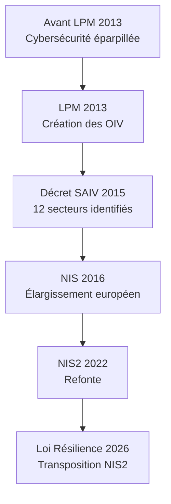
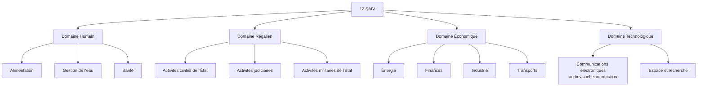
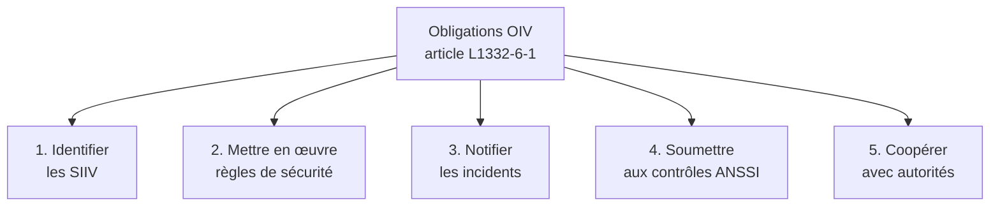
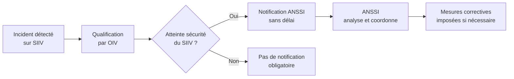
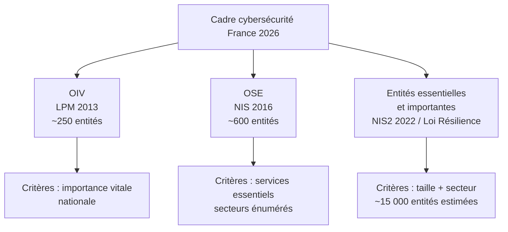
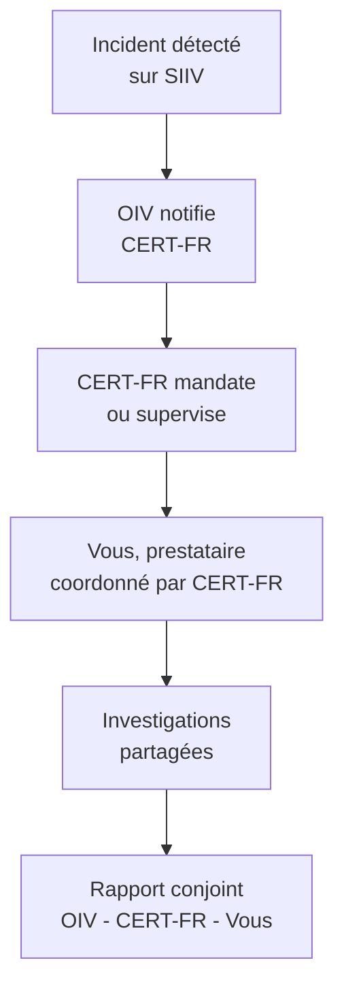

# 1.6 Loi de Programmation Militaire 2013 et OIV

!!! quote "L'analogie de l'ossature du corps"

    Dans le corps humain, certains organes sont vitaux, d'autres importants, d'autres simplement utiles. Une coupure au doigt cicatrise sans séquelles, mais une atteinte au cœur, aux poumons ou au cerveau peut être fatale en quelques minutes. La société moderne a la même structure. Certaines infrastructures sont vitales : si elles s'effondrent, le pays s'effondre avec elles. C'est ce que la France a formalisé avec la notion d'Opérateur d'Importance Vitale, créée par la Loi de Programmation Militaire de 2013. Pour vous, analyste forensic, comprendre ce concept est essentiel : si vous travaillez un jour pour un OIV, le cadre est radicalement différent. Procédures plus strictes, obligations de notification renforcées, audits ANSSI obligatoires, peines aggravées en cas d'attaque.

## Métadonnées du chapitre

| Champ | Valeur |
|---|---|
| Durée estimée | 1 heure |
| Niveau | Standard |
| Prérequis | Chapitres 1.1 à 1.5 |
| Livrables | Cartographie des secteurs OIV, fiche obligations |
| Auto-explication | 8 minutes |

## Objectifs pédagogiques

À la fin de ce chapitre, vous serez capable de :

- Définir ce qu'est un OIV et identifier les secteurs concernés.
- Citer les principales obligations imposées par la LPM 2013.
- Distinguer OIV, OSE et entités essentielles NIS2.
- Identifier les autorités de tutelle et leur rôle.
- Anticiper l'évolution du cadre avec la Loi Résilience 2026.

---

## 1. Le contexte de la LPM 2013

### 1.1 Naissance du concept d'OIV

La **Loi de Programmation Militaire (LPM) du 18 décembre 2013** est le texte qui a inscrit la cybersécurité au cœur de la défense nationale française. Avant elle, la cybersécurité relevait de textes éparses et de circulaires ministérielles.

La LPM 2013 a créé l'**article L1332-1 et suivants du Code de la défense**, qui définissent les **Opérateurs d'Importance Vitale (OIV)**.



### 1.2 Pourquoi cette catégorie spéciale

Trois constats ont motivé la création des OIV :

| Constat | Explication |
|---|---|
| Interdépendance des infrastructures | Une attaque sur un secteur paralyse les autres (énergie → transports → santé) |
| Asymétrie attaquant-défenseur | Coût d'attaque très inférieur au coût de défense |
| Insuffisance du droit pénal | Punir après ne suffit pas, il faut prévenir |

La logique est passée de **réactive** (poursuivre les attaquants) à **proactive** (obliger les opérateurs à se sécuriser).

---

## 2. Définition et désignation des OIV

### 2.1 Définition légale

L'**article L1332-1 du Code de la défense** définit les OIV : *"Les opérateurs d'importance vitale sont les opérateurs publics ou privés exploitant des établissements ou utilisant des installations et ouvrages, dont l'indisponibilité risquerait de diminuer d'une façon importante le potentiel de guerre ou économique, la sécurité ou la capacité de survie de la Nation."*

### 2.2 Les douze secteurs d'activité d'importance vitale

Le décret n°2015-350 du 27 mars 2015 a défini **douze Secteurs d'Activité d'Importance Vitale (SAIV)**, regroupés en quatre domaines.



### 2.3 Désignation des OIV

Tous les acteurs d'un SAIV ne sont pas OIV. La désignation est **nominative et confidentielle** par arrêté du Premier ministre.

| Caractéristique | Précision |
|---|---|
| Décision | Arrêté du Premier ministre, sur proposition du ministre coordonnateur |
| Confidentialité | La liste des OIV est classifiée Secret Défense |
| Nombre | Environ 250 OIV en France (chiffre estimé, non public) |
| Notification | L'opérateur est officiellement informé de sa désignation |

!!! info "Pourquoi la confidentialité"

    La liste des OIV est secrète parce qu'elle révèle les **points névralgiques** de l'État. Si un attaquant disposait de la liste complète, il pourrait cibler optimalement. La confidentialité fait partie du dispositif de protection.

### 2.4 Exemples publics ou notoires

Bien que la liste soit confidentielle, certains OIV sont notoires :

| Secteur | OIV notoires |
|---|---|
| Énergie | EDF, Engie, RTE, GRTgaz, TotalEnergies |
| Transports | SNCF, RATP, Aéroports de Paris, Air France |
| Santé | AP-HP, principaux CHU, certaines mutuelles |
| Finances | Banque de France, principales banques systémiques |
| Communications | Orange, SFR, Bouygues Telecom (en partie) |
| Eau | Veolia, Suez (selon délégations) |

---

## 3. Obligations imposées aux OIV

### 3.1 Vue d'ensemble

Les OIV sont soumis à **cinq grandes catégories d'obligations** issues de l'article L1332-6-1 du Code de la défense.



### 3.2 Identification des SIIV

Le **Système d'Information d'Importance Vitale (SIIV)** est le périmètre technique soumis aux obligations renforcées. L'OIV doit identifier ses SIIV, c'est-à-dire les SI dont l'atteinte aurait des conséquences vitales.

| Critère SIIV | Exemple |
|---|---|
| SI impliqué dans la production de l'activité d'importance vitale | SCADA d'une centrale nucléaire |
| SI dont l'indisponibilité aurait des effets cascade | ERP central d'un hôpital |
| SI traitant des données critiques | Base patient d'un CHU |

L'identification des SIIV est validée par l'autorité de tutelle (ministère coordonnateur).

### 3.3 Règles de sécurité ANSSI

L'**ANSSI publie des règles techniques** que les OIV doivent appliquer sur leurs SIIV. Ces règles couvrent une vingtaine de domaines techniques.

| Catégorie | Exemples de règles |
|---|---|
| Gouvernance | Politique de sécurité, RSSI désigné, audit annuel |
| Architecture | Cloisonnement réseau, zones sensibles, DMZ |
| Protection | Antivirus à jour, durcissement des configurations |
| Détection | Sondes réseau, journalisation centralisée, SOC interne ou externalisé |
| Réaction | Procédures de réponse à incident, équipe de crise, exercices réguliers |
| Maintien en conditions de sécurité | Patch management, gestion des vulnérabilités |

### 3.4 Notification d'incidents

Les OIV doivent notifier à l'ANSSI tout incident affectant la sécurité de leurs SIIV, **sans délai**.



Le canal de notification est le **CERT-FR** de l'ANSSI, joignable 24/7.

### 3.5 Contrôles ANSSI

L'ANSSI peut **contrôler à tout moment** les SIIV des OIV. Les contrôles peuvent être :

| Type | Modalités |
|---|---|
| Sur pièces | Audit documentaire, examen des procédures |
| Sur site | Visite des locaux, inspection technique |
| Inopinés | Sans préavis, en cas de soupçon |
| Tests d'intrusion | Pentest mandaté par l'ANSSI |

Le refus de contrôle ou l'entrave constitue une infraction sanctionnée.

### 3.6 Sanctions pénales

L'**article L1332-7 du Code de la défense** sanctionne le non-respect des obligations OIV :

| Infraction | Peine |
|---|---|
| Non-respect des règles de sécurité ANSSI | 150 000 € d'amende (personne physique) |
| Non-notification d'un incident | 150 000 € |
| Refus de contrôle ANSSI | 150 000 € |
| Entrave à un contrôle | Peines aggravées |

Pour les personnes morales, **multiplication par 5** (article 131-38 du Code pénal), soit jusqu'à **750 000 €**.

---

## 4. Articulation OIV, OSE et NIS2

### 4.1 Distinction des trois statuts



### 4.2 Tableau comparatif

| Caractéristique | OIV | OSE | NIS2 |
|---|---|---|---|
| Origine | LPM 2013 (national) | NIS 2016 (européen) | NIS2 2022 (européen) |
| Désignation | Nominative confidentielle | Nominative semi-publique | Auto-déclaration sur critères |
| Nombre France | ~250 | ~600 | ~15 000 prévus |
| Autorité | ANSSI | ANSSI | ANSSI |
| Sanctions | Amende pénale | Amende administrative | Amende administrative jusqu'à 10M€ |
| Confidentialité | Secret défense | Variable | Public |

### 4.3 Cumul de statuts

Une entreprise peut cumuler les trois statuts. Par exemple, EDF est :

- **OIV** sous LPM 2013 (cinq SIIV identifiés)
- **OSE** sous NIS 2016
- **Entité essentielle** sous NIS2 / Loi Résilience 2026

Les obligations se **superposent**, pas se substituent. L'opérateur doit respecter le **plus exigeant** sur chaque sujet.

### 4.4 Évolution avec la Loi Résilience

La **Loi Résilience 2026** ne supprime pas le statut OIV. Elle ajoute le statut **entité essentielle ou importante** au sens de NIS2. Le cadre OIV reste plus strict pour la sécurité nationale, le cadre NIS2 est plus large pour la résilience économique.

---

## 5. Le cas du forensic dans un contexte OIV

### 5.1 Si vous intervenez chez un OIV

Si une PME victime d'attaque vous mandate, vous appliquez les procédures classiques. **Si un OIV vous mandate**, plusieurs spécificités s'imposent.

| Spécificité | Implication |
|---|---|
| Habilitation Confidentiel Défense ou Secret Défense | Peut être requise selon les SIIV concernés |
| Coordination avec l'ANSSI | Le CERT-FR est partie prenante des investigations |
| Confidentialité renforcée | Vos rapports peuvent être classifiés |
| Outils homologués | Certains outils non homologués peuvent être interdits |
| Délais imposés | Notification sans délai à l'ANSSI |

### 5.2 Habilitation de défense

Pour intervenir sur certains SIIV, une **habilitation Confidentiel Défense** ou **Secret Défense** peut être requise. Elle se demande au :

| Niveau | Délai d'instruction | Validité |
|---|---|---|
| Confidentiel Défense | 6 à 12 mois | 7 ans |
| Secret Défense | 12 à 18 mois | 7 ans |

L'enquête est menée par la Direction du renseignement et de la sécurité de la défense (DRSD). Vie privée, parcours, contacts internationaux sont examinés.

### 5.3 Coordination avec l'ANSSI

Sur un OIV, le **CERT-FR coordonne** la réponse à incident. Vous travaillez **avec** lui, pas en parallèle.



### 5.4 Outils homologués ou pas

L'ANSSI maintient une **liste de produits qualifiés** pour les SIIV. Pour certaines opérations, seuls ces produits sont autorisés.

Exemples de catégories qualifiées :

- Pare-feu qualifiés
- Sondes qualifiées
- HSM (modules cryptographiques) qualifiés

Pour le forensic, peu d'outils sont nominativement qualifiés, mais l'ANSSI peut exiger l'usage d'outils maîtrisés et auditables.

---

## 6. Pièges et bonnes pratiques

### Piège 1 - Croire que les OIV sont seulement des grandes entreprises

Certains OIV sont des **structures de taille modeste** (un fournisseur unique d'un composant critique, par exemple). La taille n'est pas le critère, c'est la criticité.

### Piège 2 - Sous-estimer la confidentialité

Si vous travaillez sur un OIV, **ne mentionnez jamais** ses noms, ses systèmes, ou même votre intervention dans des conversations professionnelles ou sur LinkedIn. Le manquement à la confidentialité est sanctionné.

### Piège 3 - Confondre OIV et autre statut

Demandez systématiquement à votre client de **préciser son statut** au sens de la LPM, de NIS et de la Loi Résilience. Ces statuts changent radicalement les obligations.

### Bonne pratique 1 - Connaître les SAIV

Les douze SAIV sont mémorisables. Connaissez-les pour identifier rapidement si un client potentiel pourrait être OIV.

### Bonne pratique 2 - Préparer une habilitation

Si votre ambition est de travailler pour des OIV, anticipez la demande d'habilitation. Le délai de 12-18 mois doit être pris en compte dans votre plan de carrière.

### Bonne pratique 3 - Suivre les publications ANSSI

L'ANSSI publie régulièrement des bulletins, alertes, guides. Les OIV sont tenus de les appliquer. En tant que prestataire, vous devez les connaître. Inscription à la newsletter du **CERT-FR** : essentielle.

---

## 7. Manipulation pratique

### Exercice 7.1 - Identifier un SAIV

Pour chaque entreprise ci-dessous, identifiez le SAIV concerné :

| Entreprise | SAIV |
|---|---|
| Une centrale nucléaire | Énergie |
| Un hôpital de référence régional | Santé |
| Une banque systémique | Finances |
| Un gestionnaire de réseau ferré | Transports |
| Un gestionnaire de réseau d'eau potable | Gestion de l'eau |
| Un opérateur télécoms majeur | Communications électroniques |
| Un fabricant de matériel militaire | Activités militaires de l'État |
| Un grand groupe agroalimentaire | Alimentation |

### Exercice 7.2 - Différencier OIV / OSE / NIS2

Pour chaque cas, qualifiez le statut probable de l'entité :

| Cas | Statut probable |
|---|---|
| EDF, exploitant de centrales nucléaires | OIV + OSE + Entité essentielle NIS2 |
| Une PME de 80 salariés dans la livraison de matériel médical | NIS2 (entité importante) probable |
| Un cabinet d'avocats de 30 salariés | Hors champs sauf clientèle ministère |
| Un éditeur de logiciels de cybersécurité de 200 salariés | NIS2 (entité essentielle - service de cybersécurité) |
| Un hôpital régional | OIV + OSE + Entité essentielle |
| Un fournisseur Internet local de 50 salariés | NIS2 (DNS/communications) |

### Exercice 7.3 - Procédure de notification

Vous découvrez un incident sur un SIIV à 14h30 un vendredi. Décrivez la procédure de notification.

**Réponse attendue** :

```text
Procédure de notification d'incident sur SIIV - Vendredi 14h30

Étape 1 (immédiate) :
  - Constatation factuelle
  - Préservation des preuves volatiles (RAM, logs)
  - Information du RSSI de l'OIV

Étape 2 (sous 1 heure) :
  - Qualification de l'incident
  - Identification du SIIV impacté
  - Préparation des éléments factuels

Étape 3 (sans délai - dans la journée) :
  - Notification au CERT-FR via :
    cert-fr.cossi@ssi.gouv.fr
    Ligne d'urgence : voir annuaire interne
  - Éléments transmis : nature, périmètre, mesures prises

Étape 4 (suivi continu) :
  - Coordination avec le CERT-FR
  - Investigation forensic encadrée
  - Notifications complémentaires si évolution

Étape 5 (post-incident) :
  - Rapport définitif au CERT-FR
  - Mesures correctives validées
  - Retour d'expérience
```

---

## 8. Auto-évaluation

| # | Question | Réponse attendue |
|---|---|---|
| 1 | Que signifie OIV ? | Opérateur d'Importance Vitale |
| 2 | Combien de SAIV en France ? | 12 |
| 3 | Qui désigne les OIV ? | Le Premier ministre par arrêté |
| 4 | La liste des OIV est-elle publique ? | Non, classifiée Secret Défense |
| 5 | Que signifie SIIV ? | Système d'Information d'Importance Vitale |
| 6 | Sanction pour non-notification d'incident ? | 150 000 € (personne physique) |
| 7 | Quelle autorité contrôle les OIV ? | ANSSI |
| 8 | Comment obtenir une habilitation Secret Défense ? | Demande à la DRSD, instruction 12-18 mois |

---

## 9. Synthèse mémo

```text
LPM 2013 - Opérateurs d'Importance Vitale

Cadre juridique : Code de la défense L1332-1 et suivants
Décret SAIV : 27 mars 2015

12 SAIV en 4 domaines :
  - Humain    : Alimentation, Eau, Santé
  - Régalien  : Civil État, Justice, Militaire
  - Économie  : Énergie, Finances, Industrie, Transports
  - Techno    : Communications, Espace

Désignation OIV : nominative, confidentielle, ~250 entités

Obligations principales :
  1. Identifier les SIIV
  2. Appliquer les règles ANSSI
  3. Notifier les incidents au CERT-FR
  4. Se soumettre aux contrôles
  5. Coopérer avec les autorités

Sanctions : 150 000 € personnes physiques, x5 personnes morales

Articulation 2026 :
  OIV (LPM)        : sécurité nationale, secret défense
  OSE (NIS)        : services essentiels
  NIS2 (Résilience): résilience économique large
```

---

## 10. Pour aller plus loin

| Ressource | Type |
|---|---|
| Légifrance - Code de la défense L1332-1 | Texte officiel |
| Site ANSSI - Espace OIV | Référentiels et guides |
| Décret n°2015-350 du 27 mars 2015 | Liste des SAIV |
| CERT-FR - Bulletins et alertes | Veille opérationnelle |
| Rapport annuel ANSSI | Bilan et orientations |

---

## 11. Auto-explication

Pour valider ce chapitre, enregistrez une vidéo de 8 minutes où vous expliquez :

1. Pourquoi la France a créé les OIV (1 minute)
2. Les 12 SAIV et leurs domaines (2 minutes)
3. Les 5 grandes obligations des OIV (2 minutes)
4. La distinction OIV / OSE / NIS2 (2 minutes)
5. Les implications pour le forensic (1 minute)

---

**Chapitre précédent** : [1.5 LCEN 2004 et conservation des données](01-5-lcen-2004.md)

**Chapitre suivant** : [1.7 NIS et NIS2 - Loi Résilience 2026](01-7-nis2-loi-resilience.md)
