# 1.7 NIS et NIS2 - Loi Résilience 2026

!!! quote "L'analogie de la pandémie sanitaire"

    Quand une épidémie sanitaire se propage, on n'attend pas qu'elle touche les hôpitaux pour réagir. On vaccine massivement, on impose des protocoles, on contrôle les frontières, on informe le public. La logique de NIS2 applique ce raisonnement aux pandémies cyber. NIS1 en 2016 vaccinait seulement quelques centaines d'opérateurs jugés essentiels. Avec NIS2, l'Europe vaccine quinze mille entreprises françaises et près de cent mille européennes parce que les attaques modernes ne touchent plus seulement les centrales nucléaires, elles touchent les boulangeries qui dépendent du logiciel SaaS, les laboratoires médicaux indépendants, les transporteurs régionaux. Pour vous, analyste forensic, NIS2 est le cadre qui va définir vos clients pour la prochaine décennie. Comprendre cette directive, c'est comprendre où sera votre marché.

## Métadonnées du chapitre

| Champ | Valeur |
|---|---|
| Durée estimée | 2 heures |
| Niveau | Exhaustif |
| Prérequis | Chapitres 1.1 à 1.6 |
| Livrables | Cartographie des secteurs NIS2, fiche obligations comparative |
| Auto-explication | 15 minutes |

## Objectifs pédagogiques

À la fin de ce chapitre, vous serez capable de :

- Citer les dates clés de NIS, NIS2 et de la Loi Résilience.
- Distinguer entités essentielles et entités importantes selon les critères taille et secteur.
- Lister les 18 secteurs concernés répartis en hautement critiques et critiques.
- Citer les 10 mesures techniques de l'article 21 NIS2.
- Identifier les obligations de notification d'incident et leurs délais.
- Connaître le ReCyF et son articulation avec NIS2.
- Estimer le marché forensic ouvert par NIS2 pour OmnyVia.

---

## 1. Histoire et architecture du cadre européen

### 1.1 Genèse de NIS

La **directive NIS** (Network and Information Security) du 6 juillet 2016 a été le premier texte européen général de cybersécurité. Elle a été transposée en France par la **loi du 26 février 2018** et son décret d'application.

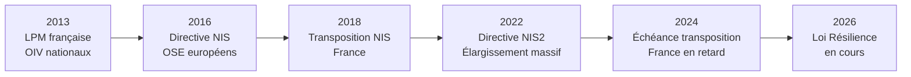

### 1.2 Pourquoi NIS2 remplace NIS

Trois constats ont motivé la refonte de 2022 :

| Constat NIS1 | Réponse NIS2 |
|---|---|
| Périmètre trop étroit (~500 OSE en France) | Élargissement à ~15 000 entités |
| Inégalité de transposition entre États | Cadre plus prescriptif |
| Sanctions insuffisamment dissuasives | Plafonds alignés sur RGPD |
| Pas de couverture chaîne d'approvisionnement | Inclusion des fournisseurs critiques |
| Notification d'incident peu cadrée | Délais et procédures harmonisés |

### 1.3 Calendrier législatif français en avril 2026

| Date | Étape |
|---|---|
| 14 décembre 2022 | Adoption directive NIS2 par UE |
| 17 octobre 2024 | Échéance européenne de transposition (France en retard) |
| 15 octobre 2024 | Présentation du projet de loi Résilience au Conseil des ministres |
| 11-12 mars 2025 | Adoption en première lecture au Sénat |
| 10 septembre 2025 | Examen en commission spéciale à l'Assemblée nationale |
| 17 mars 2026 | Publication du **ReCyF** (Référentiel Cyber France) par l'ANSSI |
| Q1-Q2 2026 | Promulgation attendue de la Loi Résilience |
| Q2-Q3 2026 | Décrets d'application ANSSI |
| 2027 | Premiers contrôles structurés ANSSI |
| 2029 | Conformité totale exigée (période transitoire 3 ans) |

### 1.4 Position française par rapport à l'Europe

Au 28 avril 2026, seuls quatre États européens ont transposé NIS2 dans les délais : **Belgique, Croatie, Italie, Lituanie**. La France fait partie des États en retard, ce qui peut entraîner :

- **Procédure d'infraction** par la Commission européenne contre la France
- **Effet direct vertical** de la directive : possibilité pour des particuliers d'invoquer NIS2 contre l'État français devant les juridictions

Cela signifie que **certaines obligations sont déjà invocables** indépendamment de la Loi Résilience.

---

## 2. Périmètre d'assujettissement

### 2.1 Les 18 secteurs concernés

NIS2 couvre **18 secteurs** répartis en deux annexes : **hautement critiques** (annexe I, 11 secteurs) et **critiques** (annexe II, 7 secteurs).

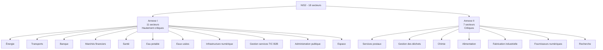

### 2.2 Critères de taille

L'assujettissement combine **secteur** et **taille**. Une entreprise est concernée si elle dépasse l'un des seuils suivants ET opère dans un secteur listé.

| Catégorie | Seuils cumulatifs (l'un d'entre eux) |
|---|---|
| Entité essentielle | ≥ 250 salariés OU CA ≥ 50 M€ OU bilan ≥ 43 M€ |
| Entité importante | 50 à 249 salariés OU CA 10 à 50 M€ OU bilan 10 à 43 M€ |

### 2.3 Matrice de classification

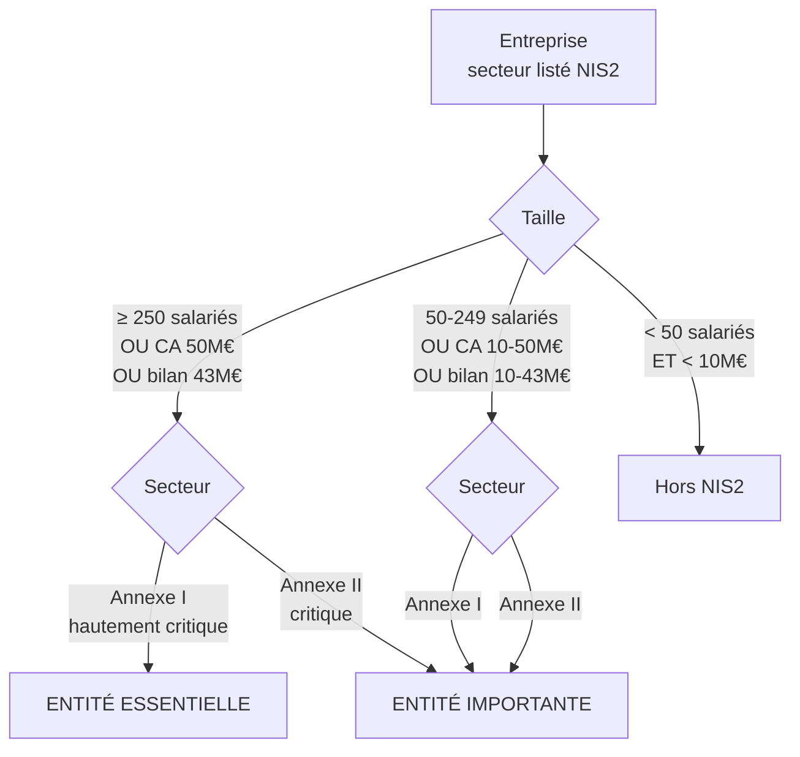

### 2.4 Cas particuliers d'assujettissement automatique

Certaines entités sont **assujetties indépendamment de leur taille** :

| Cas | Justification |
|---|---|
| Fournisseurs de services DNS, registres TLD | Rôle névralgique infrastructure |
| Prestataires de services de confiance qualifiés (eIDAS) | Confiance numérique |
| Fournisseurs de services de communications électroniques | Infrastructure critique |
| Administrations centrales | Service public |
| Tout opérateur identifié comme critique par l'État | Décision discrétionnaire |

### 2.5 Effet de cascade sur la chaîne de fournisseurs

NIS2 oblige les entités essentielles et importantes à **gérer les risques de leur chaîne d'approvisionnement** (article 21). En pratique, cela signifie qu'une PME non assujettie directement peut être contrainte par ses clients de **respecter les mêmes standards**.

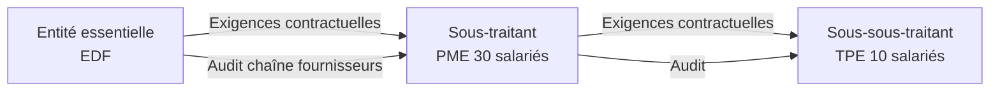

**Implication forensic** : votre marché potentiel inclut non seulement les 15 000 entités directement assujetties, mais aussi **plusieurs dizaines de milliers** de sous-traitants soumis indirectement.

---

## 3. Les 10 mesures de l'article 21 NIS2

L'**article 21 de la directive NIS2** fixe **10 mesures techniques et organisationnelles** que les entités assujetties doivent mettre en œuvre.

### 3.1 Liste exhaustive des 10 mesures

| # | Mesure | Description |
|---|---|---|
| 1 | Politiques d'analyse des risques et de sécurité des systèmes d'information | Cartographie risques, analyse régulière, plan de traitement |
| 2 | Gestion des incidents | Procédures détection, réponse, retour à la normale |
| 3 | Continuité des activités et gestion des crises | Plan de continuité (PCA), plan de reprise (PRA) |
| 4 | Sécurité de la chaîne d'approvisionnement | Évaluation fournisseurs, exigences contractuelles |
| 5 | Sécurité de l'acquisition, du développement et de la maintenance des SI | Cycle de vie sécurisé, gestion des vulnérabilités |
| 6 | Politiques et procédures pour évaluer l'efficacité | Audit interne, tableaux de bord |
| 7 | Pratiques de cyberhygiène et formation à la cybersécurité | Sensibilisation, formation continue |
| 8 | Politiques et procédures relatives à l'utilisation de la cryptographie et du chiffrement | Standards crypto, gestion des clés |
| 9 | Sécurité des ressources humaines, contrôle d'accès et gestion des actifs | Profils, accès, inventaire |
| 10 | Utilisation de solutions d'authentification multi-facteurs ou continue, communications sécurisées vocales, vidéo et texte, communications sécurisées d'urgence | MFA, communications chiffrées |

### 3.2 Articulation avec ReCyF

L'**ANSSI a publié le ReCyF (Référentiel Cyber France) le 17 mars 2026**. C'est la déclinaison française des 10 mesures de l'article 21.

| Caractéristique ReCyF | Précision |
|---|---|
| Statut | Référentiel non obligatoire mais opposable en cas de contrôle |
| Source | ANSSI |
| Contenu | Mesures détaillées, justifications, correspondances normes ISO |
| Avantage | Présomption de conformité si appliqué |
| Date publication | 17 mars 2026 |

Si une entité applique le ReCyF, elle peut s'en prévaloir auprès de l'ANSSI lors d'un contrôle pour démontrer sa conformité.

### 3.3 Détail de la mesure 10 - Authentification multifacteur

Cette mesure mérite une attention particulière car elle modifie significativement les architectures.

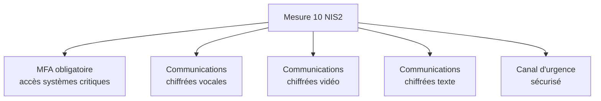

| Type d'accès | MFA exigé |
|---|---|
| Accès administrateur | Toujours, sans exception |
| Accès distant (VPN, RDP) | Toujours |
| Accès aux applications critiques | Toujours |
| Accès aux données personnelles sensibles | Toujours |
| Accès utilisateur standard | Recommandé |

---

## 4. Obligations de notification d'incident

### 4.1 Délais à respecter

L'**article 23 de NIS2** impose des délais stricts de notification aux autorités (en France, l'ANSSI) en cas d'incident significatif.

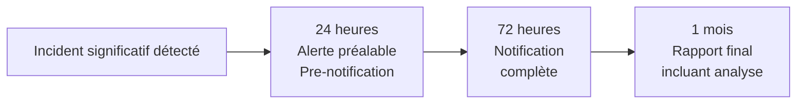

| Délai | Contenu |
|---|---|
| 24 heures | Pre-notification : nature, impact estimé, mesures initiales |
| 72 heures | Notification complète : description, indicateurs, premières corrélations |
| 1 mois | Rapport final : analyse, IOC, mesures correctives définitives |

### 4.2 Définition d'un incident significatif

Un incident est **significatif** au sens de NIS2 lorsqu'il :

| Critère | Précision |
|---|---|
| Cause une perturbation grave | Disponibilité dégradée ou interrompue |
| Affecte un grand nombre d'utilisateurs | Critère quantitatif variable selon secteur |
| Cause des dommages importants | Financiers, réputationnels, matériels |
| Affecte la sécurité ou la santé | Critère lié au secteur (santé, transport) |
| Implique des données sensibles | Données à caractère personnel notamment |

### 4.3 Articulation avec autres notifications

Une attaque significative peut déclencher **simultanément** plusieurs obligations de notification.

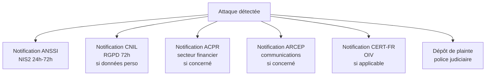

**Pratique** : tenir un **canevas de notification multiple** pré-rempli, prêt à diffuser en quelques minutes.

---

## 5. Sanctions

### 5.1 Plafonds de sanctions

NIS2 introduit des sanctions **alignées sur le RGPD** en gravité.

| Catégorie | Sanction maximale |
|---|---|
| Entité essentielle | 10 M€ ou 2% du CA mondial annuel (le plus élevé) |
| Entité importante | 7 M€ ou 1,4% du CA mondial annuel (le plus élevé) |

### 5.2 Sanctions complémentaires

Au-delà des amendes, l'ANSSI peut prononcer :

| Type de sanction | Effet |
|---|---|
| Avertissement public | Communication officielle, impact réputationnel |
| Injonction de mise en conformité | Obligation d'agir sous délai |
| Suspension temporaire de certification | Perte d'agrément ou qualification |
| Interdiction d'exercer certaines fonctions | Pour les dirigeants responsables |
| Communication publique de la sanction | "Name and shame" |

### 5.3 Période transitoire pour les sanctions

La Loi Résilience prévoit une **période transitoire de 3 ans** pendant laquelle les sanctions ne seront pas appliquées dans toute leur rigueur. Cela laisse le temps aux entités de se conformer.

| Période | Régime |
|---|---|
| Promulgation à 2027 | Pédagogie, aucune sanction lourde |
| 2027 à 2028 | Premières sanctions modérées |
| 2029 et après | Régime plein de sanctions |

### 5.4 Responsabilité personnelle des dirigeants

NIS2 introduit une **responsabilité personnelle des dirigeants** (article 20) qui ne peut être déléguée. Le directeur de l'entité essentielle ou importante est :

- **Personnellement responsable** de la mise en conformité
- Susceptible de **suspension temporaire de fonction** en cas de manquement grave
- Tenu de **suivre une formation cybersécurité** et de garantir la formation des équipes

---

## 6. Architecture de gouvernance en France

### 6.1 ANSSI - Autorité centrale

L'**ANSSI** (Agence nationale de la sécurité des systèmes d'information) est désignée comme **autorité nationale unique** pour NIS2.

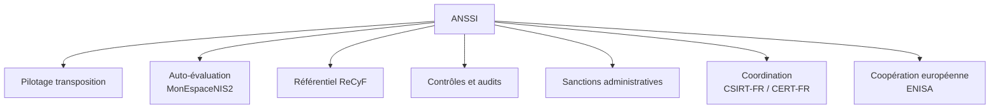

### 6.2 MonEspaceNIS2

L'ANSSI a déployé un **portail dédié** pour les entités assujetties : **MonEspaceNIS2**. Il permet :

- Auto-évaluation du statut (essentielle, importante, hors champ)
- Auto-déclaration auprès de l'ANSSI
- Suivi des obligations
- Notification d'incidents
- Accès aux référentiels

### 6.3 Autres acteurs institutionnels

| Acteur | Rôle |
|---|---|
| ANSSI | Autorité centrale |
| CSIRT-FR / CERT-FR | Réponse à incident |
| CNIL | Articulation RGPD |
| ARCEP | Secteur télécoms |
| ACPR | Secteur financier (DORA) |
| Ministères coordonnateurs | Sectoriels (santé, énergie...) |

---

## 7. Coûts de mise en conformité

### 7.1 Estimations ANSSI

| Catégorie | Coût initial | Coût annuel maintien |
|---|---|---|
| Entité importante | 100 000 à 200 000 € | 10 000 à 20 000 € |
| Entité essentielle | 450 000 à 880 000 € | 45 000 à 90 000 € |

### 7.2 Décomposition typique

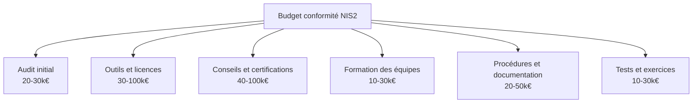

### 7.3 Marché ouvert pour OmnyVia

Avec 15 000 entités assujetties + dizaines de milliers de fournisseurs indirects, le marché total NIS2 en France représente plusieurs **milliards d'euros sur 5 ans**.

| Prestation | Tarification indicative |
|---|---|
| Audit initial NIS2 | 5 000 à 25 000 € selon taille |
| Mise en conformité accompagnée | 30 000 à 200 000 € |
| Tests d'intrusion annuels | 10 000 à 50 000 € |
| Forensic post-incident | 20 000 à 100 000 € (cas) |
| Astreinte CSIRT | 5 000 à 30 000 €/an |

---

## 8. Articulation avec OIV et autres cadres

### 8.1 Tableau synoptique

| Cadre | Périmètre | Spécificité | Compatibilité |
|---|---|---|---|
| OIV (LPM 2013) | ~250 entités sécurité nationale | Confidentialité Défense | Cumul avec NIS2 |
| OSE (NIS 2016) | ~600 services essentiels | Devient obsolète avec NIS2 | Remplacé |
| NIS2 (Loi Résilience) | ~15 000 entités | Cadre général | - |
| DORA (UE 2022/2554) | Secteur financier uniquement | Lex specialis | NIS2 ne s'applique pas si DORA |
| RGPD | Toute entité | Données personnelles | Cumul possible |

### 8.2 Cas typique de superposition

EDF est **simultanément** :

- OIV (LPM, 5 SIIV identifiés)
- Entité essentielle NIS2 (secteur énergie, taille)
- Soumis à RGPD (données clients)

Les obligations se cumulent. EDF doit respecter le **plus exigeant** sur chaque sujet.

### 8.3 Cas du secteur financier

Le règlement **DORA** (Digital Operational Resilience Act) du 14 décembre 2022 s'applique au secteur financier depuis le 17 janvier 2025. Pour ce secteur, **DORA prime sur NIS2** comme lex specialis.

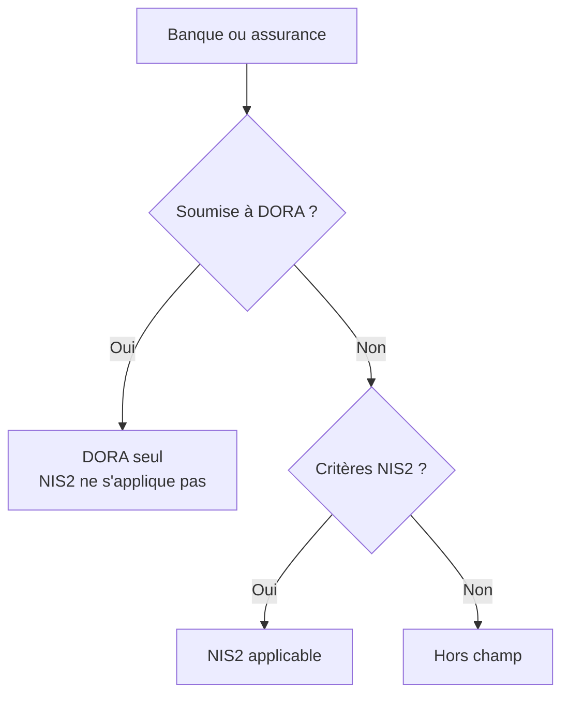

Voir chapitre 1.9 pour DORA en détail.

---

## 9. Impact sur le forensic

### 9.1 Multiplication des clients potentiels

NIS2 fait passer le marché français de 250 OIV + 600 OSE à **15 000 entités**, soit une multiplication par 18.

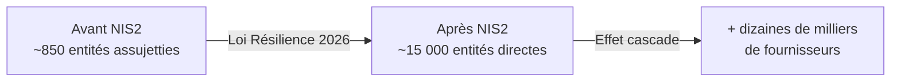

### 9.2 Demande accrue de prestations spécifiques

| Prestation | Demande NIS2 |
|---|---|
| Tests d'intrusion réguliers | Mesure 6 (évaluation efficacité) |
| Forensic post-incident | Mesure 2 (gestion incidents) |
| Audit chaîne d'approvisionnement | Mesure 4 |
| Accompagnement notification ANSSI | Articles 23 délais |
| Formation cybersécurité dirigeants | Article 20 obligation |
| Mise en place SOC ou MDR | Mesure 6 et détection |

### 9.3 Spécificités forensic en contexte NIS2

Si vous intervenez sur une entité NIS2, plusieurs spécificités s'appliquent :

| Aspect | Spécificité |
|---|---|
| Coordination ANSSI | Le CSIRT-FR peut être sollicité ou imposé |
| Notification 24h | Vos premières conclusions doivent permettre la pre-notification |
| Documentation renforcée | Le rapport doit alimenter la notification 72h et le rapport 1 mois |
| Conformité ReCyF | Vos mesures correctives doivent s'aligner sur le ReCyF |
| Chaîne d'approvisionnement | Élargissement du périmètre forensic possible |

### 9.4 Calendrier de positionnement OmnyVia

| Période | Action recommandée |
|---|---|
| Avril-Juin 2026 | Étudier ReCyF, se former, identifier prospects |
| Juillet-Décembre 2026 | Lancer offre d'audit NIS2 chez prospects identifiés |
| 2027 | Premiers contrôles ANSSI, demande explose |
| 2028-2029 | Maturité du marché, positionnement consolidé |

---

## 10. Pièges et bonnes pratiques

### Piège 1 - Penser que NIS2 ne concerne que les grandes entreprises

15 000 entités françaises, dont une majorité de PME et ETI. Beaucoup de TPE sont concernées indirectement via la chaîne d'approvisionnement.

### Piège 2 - Attendre la promulgation pour s'y mettre

La directive a un effet direct partiel. Les obligations de notification d'incident s'appliquent dès la promulgation. Plusieurs grandes entreprises exigent déjà la conformité de leurs fournisseurs.

### Piège 3 - Sous-estimer l'aspect chaîne d'approvisionnement

Un fournisseur non conforme peut faire perdre un marché à son client assujetti. Cet effet domino crée une demande forte chez des entités hors champ direct.

### Bonne pratique 1 - Maîtriser le ReCyF

Le ReCyF est votre **outil opérationnel** de référence. Le télécharger, l'étudier, le maîtriser est indispensable pour intervenir sur des clients NIS2.

### Bonne pratique 2 - Cartographier le marché local

Identifiez dans votre zone les entités probablement assujetties : hôpitaux, transporteurs, agroalimentaire, industrie. Préparez-leur une offre dédiée.

### Bonne pratique 3 - S'inscrire à MonEspaceNIS2

Même sans être assujetti, créer un compte permet de suivre l'actualité ANSSI et d'être informé des évolutions.

---

## 11. Manipulation pratique

### Exercice 11.1 - Qualifier des entreprises

| Entreprise | Statut probable NIS2 |
|---|---|
| EDF (secteur énergie, > 250 salariés) | Entité essentielle |
| Une PME industrielle de 80 salariés et 12 M€ CA fabriquant des composants médicaux | Entité importante (santé indirect) |
| Un cabinet d'avocats de 30 salariés | Hors champ |
| Une commune de 4 000 habitants | Selon décrets, probablement entité importante |
| Un éditeur SaaS de 60 salariés et 8 M€ CA | Entité importante (numérique) |
| Un hôpital régional public | Entité essentielle (santé) |
| Un transporteur routier de 70 salariés et 15 M€ CA | Entité importante (transports) |
| Un data center de 25 salariés | Entité essentielle (infrastructure numérique, taille indifférente) |

### Exercice 11.2 - Plan de notification

Une entité essentielle subit une attaque ransomware le **lundi 14 mars 2026 à 03h14**. Elle découvre l'incident à **07h30**. Construisez le calendrier de notifications obligatoires.

| Échéance | Action |
|---|---|
| Lundi 14 mars 07h30 | Constatation, qualification d'incident significatif |
| Lundi 14 mars 11h00 | Pre-notification ANSSI (sous 24h après détection, large marge) |
| Mardi 15 mars 07h30 | Échéance finale 24h ANSSI |
| Lundi 14 mars 14h00 | Évaluation données personnelles compromises, préparation notification CNIL |
| Mardi 15 mars 07h30 | Notification CNIL si confirmation données touchées (sous 72h RGPD) |
| Jeudi 17 mars 07h30 | Notification complète NIS2 sous 72h |
| Lundi 14 avril 07h30 | Rapport final 1 mois ANSSI |

### Exercice 11.3 - Estimation marché

Vous identifiez dans votre zone 30 prospects probablement assujettis NIS2 (mix EE et EI). Estimez le potentiel de chiffre d'affaires sur 3 ans pour OmnyVia.

| Prestation | Pénétration estimée | Tarif moyen | CA potentiel |
|---|---|---|---|
| Audit initial NIS2 | 50% (15 clients) | 12 000 € | 180 000 € |
| Mise en conformité | 30% (9 clients) | 60 000 € | 540 000 € |
| Pentest annuel | 40% (12 clients) | 15 000 € | 180 000 €/an x 3 = 540 000 € |
| Astreinte CSIRT | 20% (6 clients) | 12 000 €/an | 72 000 €/an x 3 = 216 000 € |
| Forensic incident | 30% (9 incidents) | 35 000 € | 315 000 € |
| **Total 3 ans** | | | **1 791 000 €** |

Ce chiffre est ambitieux mais montre la **réalité économique** du marché NIS2.

---

## 12. Auto-évaluation

| # | Question | Réponse attendue |
|---|---|---|
| 1 | Date d'adoption de NIS2 ? | 14 décembre 2022 |
| 2 | Nom de la transposition française ? | Loi Résilience |
| 3 | Combien de secteurs concernés ? | 18 (11 hautement critiques + 7 critiques) |
| 4 | Critères entité essentielle ? | ≥ 250 salariés OU CA ≥ 50 M€ OU bilan ≥ 43 M€ + secteur Annexe I |
| 5 | Délai pre-notification ? | 24 heures |
| 6 | Délai notification complète ? | 72 heures |
| 7 | Sanction max entité essentielle ? | 10 M€ ou 2% du CA mondial |
| 8 | Que signifie ReCyF ? | Référentiel Cyber France de l'ANSSI |
| 9 | Date publication ReCyF ? | 17 mars 2026 |
| 10 | Combien d'entités françaises concernées ? | ~15 000 |

---

## 13. Synthèse mémo

```text
NIS2 - Loi Résilience 2026

Cadre :
  - Directive UE 2022/2555 du 14 décembre 2022
  - Transposition française : Loi Résilience (promulgation Q1-Q2 2026)
  - Référentiel : ReCyF de l'ANSSI publié le 17 mars 2026

Périmètre :
  - 18 secteurs (11 hautement critiques + 7 critiques)
  - ~15 000 entités françaises
  - 2 catégories : essentielles (EE) et importantes (EI)

Critères entités :
  EE : ≥ 250 sal OU CA ≥ 50M€ OU bilan ≥ 43M€ + secteur annexe I
  EI : 50-249 sal OU CA 10-50M€ OU bilan 10-43M€ + secteur

Article 21 : 10 mesures techniques
Article 23 : notification 24h / 72h / 1 mois
Article 20 : responsabilité personnelle dirigeants

Sanctions :
  EE : jusqu'à 10 M€ ou 2% CA mondial
  EI : jusqu'à 7 M€ ou 1,4% CA mondial

Période transitoire 3 ans avant sanctions pleines
Conformité totale exigée 2029

Marché OmnyVia : ouverture historique
```

---

## 14. Pour aller plus loin

| Ressource | Type |
|---|---|
| Site ANSSI - Espace NIS2 (cyber.gouv.fr) | Référence officielle |
| Référentiel ReCyF v2.5 | Document opérationnel |
| Directive 2022/2555 EUR-Lex | Texte européen original |
| Projet de Loi Résilience - Sénat et Assemblée | Suivi législatif |
| MonEspaceNIS2 | Portail ANSSI |
| Guide NIS2 - Aventris, BEAROPS, AdevWeb | Guides pratiques 2026 |

---

## 15. Auto-explication

Pour valider ce chapitre, enregistrez une vidéo de 15 minutes où vous expliquez :

1. La généalogie NIS → NIS2 → Loi Résilience (2 minutes)
2. Les 18 secteurs et leur répartition (2 minutes)
3. Les critères d'assujettissement (entité essentielle vs importante) (2 minutes)
4. Les 10 mesures de l'article 21 (3 minutes)
5. Les délais de notification (1 minute)
6. Les sanctions (1 minute)
7. Le ReCyF de l'ANSSI (1 minute)
8. L'impact pour OmnyVia (3 minutes)

---

**Chapitre précédent** : [1.6 Loi de Programmation Militaire 2013 et OIV](01-6-lpm-oiv.md)

**Chapitre suivant** : [1.8 RGPD - Focus articles 32, 33, 34](01-8-rgpd-articles-32-33-34.md)
