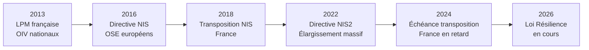
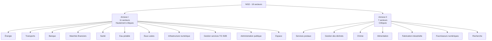
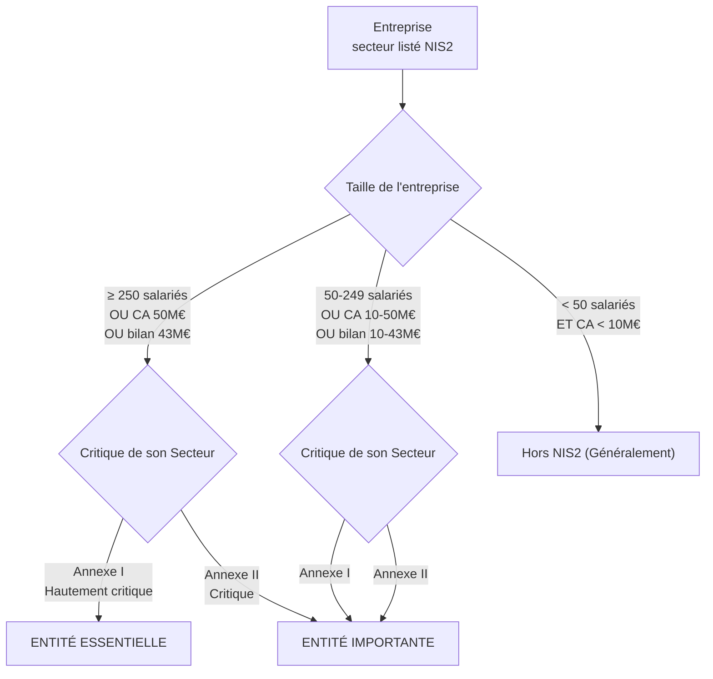
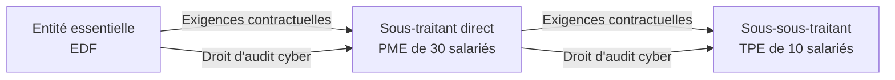
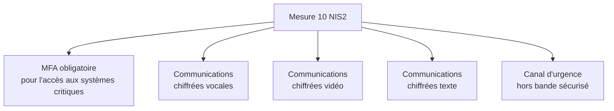
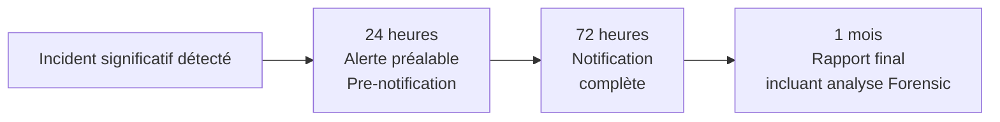
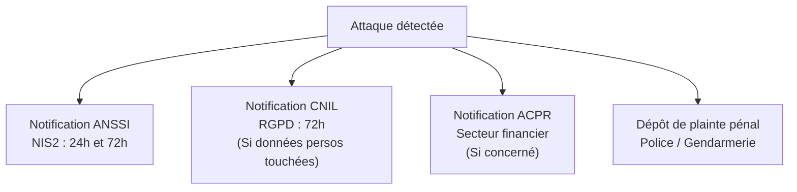
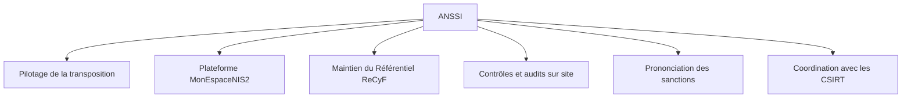

# NIS et NIS2 - Loi Résilience 2026

!!! note "**Livrables :** _Cartographie des secteurs NIS2, fiche obligations comparative_"
!!! note "**Auto-explication :** _15 minutes_"

 

---

 

!!! quote "L'analogie de la pandémie sanitaire"

    Quand une épidémie sanitaire se propage, on n'attend pas qu'elle touche les hôpitaux pour réagir. On vaccine massivement, on impose des protocoles, on contrôle les frontières, on informe le public. La logique de NIS2 applique ce raisonnement aux pandémies cyber. NIS1 en 2016 vaccinait seulement quelques centaines d'opérateurs jugés essentiels. Avec NIS2, l'Europe vaccine quinze mille entreprises françaises et près de cent mille européennes parce que les attaques modernes ne touchent plus seulement les centrales nucléaires, elles touchent les boulangeries qui dépendent du logiciel SaaS, les laboratoires médicaux indépendants, les transporteurs régionaux. Pour vous, analyste forensic, NIS2 est le cadre qui va définir vos clients pour la prochaine décennie. Comprendre cette directive, c'est comprendre où sera votre marché.

## Objectifs pédagogiques

!!! tip "À la fin de ce chapitre, vous serez capable de :"

    - Citer les dates clés de NIS, NIS2 et de la Loi Résilience.
    - Distinguer entités essentielles et entités importantes selon les critères taille et secteur.
    - Lister les 18 secteurs concernés répartis en hautement critiques et critiques.
    - Citer les 10 mesures techniques de l'article 21 NIS2.
    - Identifier les obligations de notification d'incident et leurs délais.
    - Connaître le ReCyF et son articulation avec NIS2.
    - Estimer le marché forensic ouvert par NIS2 pour OmnyVia.

 

---

 

## Histoire et architecture du cadre européen

### Genèse de NIS

La **directive NIS** (Network and Information Security) du 6 juillet 2016 a été le premier texte européen général de cybersécurité. Elle a été transposée en France par la **loi du 26 février 2018** et son décret d'application.

> Évolution temporelle du cadre NIS :

### Pourquoi NIS2 remplace NIS

Trois constats majeurs ont motivé la refonte de 2022 :

| Constat NIS1 | Réponse NIS2 |
|---|---|
| Périmètre trop étroit (~500 OSE en France) | Élargissement à ~15 000 entités |
| Inégalité de transposition entre États | Cadre plus prescriptif et harmonisé |
| Sanctions insuffisamment dissuasives | Plafonds alignés sur les sanctions du RGPD |
| Pas de couverture de la chaîne d'approvisionnement | Inclusion des fournisseurs critiques |
| Notification d'incident peu cadrée | Délais et procédures strictement harmonisés |

### Calendrier législatif français en avril 2026

> Ce calendrier met en évidence le décalage de transposition de la France :

| Date | Étape |
|---|---|
| 14 décembre 2022 | Adoption de la directive NIS2 par l'UE |
| 17 octobre 2024 | Échéance européenne de transposition (France en retard) |
| 15 octobre 2024 | Présentation du projet de loi Résilience au Conseil des ministres |
| 11-12 mars 2025 | Adoption en première lecture au Sénat |
| 10 septembre 2025 | Examen en commission spéciale à l'Assemblée nationale |
| 17 mars 2026 | Publication du **ReCyF** (Référentiel Cyber France) par l'ANSSI |
| Q1-Q2 2026 | Promulgation attendue de la Loi Résilience |
| Q2-Q3 2026 | Décrets d'application ANSSI |
| 2027 | Premiers contrôles structurés ANSSI |
| 2029 | Conformité totale exigée (période transitoire de 3 ans) |

### Position française par rapport à l'Europe

Au 28 avril 2026, seuls quatre États européens ont transposé NIS2 dans les délais : **Belgique, Croatie, Italie, Lituanie**. La France fait partie des États en retard, ce qui entraîne deux conséquences juridiques :

- **Procédure d'infraction** par la Commission européenne contre la France.
- **Effet direct vertical** de la directive : possibilité pour des particuliers ou des concurrents d'invoquer NIS2 contre l'État français devant les juridictions.

!!! danger "Attention au piège de l'attente"
    Cela signifie que **certaines obligations sont déjà invocables** indépendamment de la Loi Résilience. Vos clients ne doivent pas attendre la publication des décrets français pour commencer leur mise en conformité.

 

---

 

## Périmètre d'assujettissement

### Les 18 secteurs concernés

NIS2 couvre **18 secteurs d'activité** répartis en deux annexes : **hautement critiques** (annexe I, 11 secteurs) et **critiques** (annexe II, 7 secteurs).

### Critères de taille

L'assujettissement combine obligatoirement **le secteur** et **la taille**. Une entreprise est concernée si elle dépasse l'un des seuils suivants ET opère dans un secteur listé.

| Catégorie | Seuils cumulatifs (il suffit de dépasser l'un d'entre eux) |
|---|---|
| Entité Essentielle (EE) | ≥ 250 salariés OU CA ≥ 50 M€ OU bilan ≥ 43 M€ |
| Entité Importante (EI) | 50 à 249 salariés OU CA 10 à 50 M€ OU bilan 10 à 43 M€ |

### Matrice de classification

> Logigramme de décision pour qualifier une entité :

### Cas particuliers d'assujettissement automatique

Certaines entités sont **assujetties indépendamment de leur taille** (même une TPE de 3 personnes sera concernée) :

| Cas | Justification |
|---|---|
| Fournisseurs de services DNS, registres TLD | Rôle névralgique pour l'infrastructure internet mondiale |
| Prestataires de services de confiance qualifiés (eIDAS) | Confiance numérique et cryptographie |
| Fournisseurs de services de communications électroniques | Infrastructure critique de transport de l'information |
| Administrations centrales | Service public continu de l'État |
| Tout opérateur identifié comme critique par l'État | Décision discrétionnaire du Premier Ministre |

### Effet de cascade sur la chaîne de fournisseurs

NIS2 oblige les entités essentielles et importantes à **gérer les risques de leur chaîne d'approvisionnement** (article 21). En pratique, cela signifie qu'une PME non assujettie directement peut (et va) être contrainte par ses gros clients de **respecter les mêmes standards de sécurité**.

!!! abstract "Implication opérationnelle pour le Forensic"
    Votre marché potentiel inclut non seulement les 15 000 entités directement assujetties, mais aussi **plusieurs dizaines de milliers** de sous-traitants (TPE, PME) soumis indirectement par la pression commerciale de leurs donneurs d'ordres.

 

---

 

## Les 10 mesures de l'article 21 NIS2

L'**article 21 de la directive NIS2** fixe le socle : **10 mesures techniques et organisationnelles** que les entités assujetties doivent impérativement mettre en œuvre.

### Liste exhaustive des 10 mesures

| # | Mesure de l'article 21 | Application concrète |
|---|---|---|
| 1 | Politiques d'analyse des risques et de SSI | Cartographie des risques, analyse régulière, plan de traitement |
| 2 | Gestion des incidents | Procédures de détection, réponse (SOC/CERT), retour à la normale |
| 3 | Continuité des activités et gestion de crise | Plan de continuité (PCA), plan de reprise (PRA), gestion des sauvegardes |
| 4 | Sécurité de la chaîne d'approvisionnement | Évaluation des fournisseurs, clauses d'audit |
| 5 | Sécurité de l'acquisition, dev et maintenance | Cycle de vie sécurisé (SecOps), gestion des vulnérabilités logicielles |
| 6 | Politiques pour évaluer l'efficacité | Audits internes, pentests réguliers, tableaux de bord de sécurité |
| 7 | Cyberhygiène et formation à la cybersécurité | Sensibilisation du personnel, formation continue technique |
| 8 | Politiques d'utilisation de la cryptographie | Standards crypto robustes, gestion sécurisée des clés de chiffrement |
| 9 | Sécurité des ressources humaines, contrôle d'accès | Moindre privilège, gestion des identités, inventaire des actifs |
| 10 | MFA et communications sécurisées | Authentification multi-facteurs partout, canaux de crise sécurisés |

### Articulation avec le ReCyF de l'ANSSI

L'**ANSSI a publié le ReCyF (Référentiel Cyber France) le 17 mars 2026**. C'est la déclinaison extrêmement précise et "à la française" des 10 mesures de l'article 21.

| Caractéristique du ReCyF | Précision opérationnelle |
|---|---|
| Statut | Référentiel non "strictement" obligatoire, mais opposable en cas de contrôle ANSSI |
| Source | L'autorité nationale (ANSSI) |
| Contenu | Mesures détaillées, exigences par catégorie, équivalences ISO 27001 |
| Avantage juridique | Offre une "présomption de conformité" si l'entité démontre qu'elle l'applique |

Si une entité applique scrupuleusement le ReCyF, elle sera à l'abri des sanctions de l'ANSSI lors d'un contrôle. C'est votre bible pour l'accompagnement des PME.

### Focus : La mesure 10 (MFA)

Cette mesure mérite une attention particulière car c'est celle qui modifie le plus drastiquement l'architecture au quotidien pour les utilisateurs.

Le MFA n'est plus une simple bonne pratique, il devient une contrainte légale.

| Type d'accès | Le MFA est-il exigé ? |
|---|---|
| Accès administrateur | Toujours, sans aucune exception |
| Accès distant (VPN, RDP) | Toujours |
| Accès aux applications métier critiques | Toujours |
| Accès aux données personnelles sensibles | Toujours |
| Accès utilisateur standard interne | Fortement recommandé |

 

---

 

## Obligations de notification d'incident

### Délais à respecter

L'**article 23 de NIS2** impose des délais extrêmement stricts de notification à l'ANSSI en cas d'incident "significatif".

| Délai maximal | Contenu exigé par le législateur |
|---|---|
| 24 heures | Pre-notification : nature de la menace, impact estimé, premières mesures |
| 72 heures | Notification complète : description technique, premiers indicateurs (IoC) |
| 1 mois | Rapport final : analyse complète, cause racine, mesures correctives définitives |

### Définition d'un incident "significatif"

Un incident est considéré comme **significatif** (et déclenche l'alerte 24h) lorsqu'il :

- Cause une perturbation grave de la continuité du service (panne, ransomware).
- Affecte un grand nombre d'utilisateurs.
- Cause des dommages matériels ou financiers importants.
- Implique une atteinte massive à des données sensibles.

### Articulation avec les autres notifications

!!! warning "Le cauchemar administratif de la notification multiple"
    Une attaque majeure peut déclencher **simultanément** plusieurs obligations de déclaration à des autorités différentes, chacune avec ses propres délais et formulaires.

 

---

 

## Sanctions applicables

### Plafonds de sanctions (Alignement RGPD)

NIS2 dote enfin l'ANSSI d'un pouvoir de sanction dissuasif, calqué sur les montants du RGPD.

| Catégorie | Sanction pécuniaire maximale encourue |
|---|---|
| Entité Essentielle (EE) | 10 M€ ou 2% du Chiffre d'Affaires mondial annuel (le plus élevé retenu) |
| Entité Importante (EI) | 7 M€ ou 1,4% du Chiffre d'Affaires mondial annuel (le plus élevé retenu) |

### Sanctions administratives complémentaires

Au-delà des amendes, l'ANSSI a le pouvoir de prononcer des décisions impactant gravement la vie de l'entreprise :

- Avertissement public (Name and Shame).
- Injonction de mise en conformité (sous astreinte financière).
- Suspension temporaire de certification ou d'agrément.
- Interdiction temporaire d'exercer des fonctions de direction.

### Responsabilité personnelle des dirigeants

NIS2 introduit une **responsabilité personnelle et inaliénable des dirigeants** (article 20). Le comité de direction de l'entité :

- Est **personnellement responsable** de la non-mise en conformité de son entreprise.
- Peut subir une **suspension temporaire de fonction** en cas de manquement grave.
- Est tenu légalement de **suivre une formation à la cybersécurité** (et de financer celle de ses équipes).

!!! info "La fin du parapluie du RSSI"
    Avec NIS2, un directeur général ne peut plus rejeter la faute sur son RSSI en cas de piratage dû à une négligence d'investissement. C'est le DG qui porte le risque administratif et personnel.

 

---

 

## Architecture de gouvernance en France

### L'ANSSI - Autorité centrale

L'**ANSSI** (Agence nationale de la sécurité des systèmes d'information) a été désignée comme l'**autorité nationale unique et centrale** pour la supervision de NIS2 en France.

### MonEspaceNIS2

L'ANSSI déploie un **portail dédié** pour les entreprises : **MonEspaceNIS2**. C'est le guichet unique qui permet l'auto-évaluation du statut, l'auto-déclaration de l'entreprise, et la notification sécurisée des incidents sous 24h.

 

---

 

## Articulation avec les OIV, DORA et RGPD

Le marché français subit un véritable "millefeuille" de réglementations. 

> Synthèse de la superposition des cadres en 2026 :

| Cadre Juridique | Périmètre d'application | Spécificité et Compatibilité |
|---|---|---|
| OIV (LPM 2013) | ~250 entités (Sécurité nationale) | Confidentialité absolue. Se cumule avec NIS2 sur le reste du SI. |
| OSE (NIS 2016) | ~600 services essentiels | Devient **obsolète** et est remplacé par NIS2. |
| NIS2 (Loi Résilience) | ~15 000 entités + Sous-traitants | Le nouveau socle général européen. |
| DORA (UE 2022) | Strictement le Secteur financier | Lex specialis : **DORA remplace NIS2** pour les banques/assurances. |
| RGPD | Toute entité traitant de la donnée | Protection de la vie privée. Se cumule avec NIS2. |

 

---

 

## Impact Forensic et Potentiel Marché (OmnyVia)

### L'explosion de la Demande

NIS2 fait passer le marché français qualifié de 850 entités régulées (OIV+OSE) à **plus de 15 000 entités directes**.

| Prestation d'expertise | Déclencheur NIS2 |
|---|---|
| Tests d'intrusion / Red Teaming | Mesure 6 de l'art. 21 (Évaluation de l'efficacité des mesures) |
| Intervention Forensic et Réponse (DFIR) | Mesure 2 (Gestion des incidents) et article 23 (Notification ANSSI) |
| Audit de la Supply Chain Cyber | Mesure 4 (Sécurité de la chaîne d'approvisionnement) |
| Formation C-Level | Article 20 (Obligation de formation des dirigeants) |

### Spécificités du DFIR en contexte NIS2

Si vous êtes appelé en urgence chez un client fraîchement assujetti à NIS2, votre temporalité d'investigation change :
1. **La course contre la montre (24h) :** Vous devez trouver la root cause ou l'impact initial très vite pour rédiger la pre-notification.
2. **Le rapport sous 1 mois :** Votre rapport forensic de fin d'incident sera lu par l'ANSSI. Il doit être formel, exhaustif, et justifier des mesures de remédiation conformes au référentiel ReCyF.

 

---

 

## Pièges et bonnes pratiques

!!! failure "Piège 1 - Attendre bêtement les décrets d'application"
    La directive a déjà un effet direct partiel. La mesure 2 sur la notification d'incident et la gestion de la chaîne d'approvisionnement forcent déjà les grands groupes à exiger la conformité de leurs petits fournisseurs en 2026, décrets publiés ou non.

!!! failure "Piège 2 - Le syndrome de la case à cocher"
    NIS2 (via le ReCyF) exige une **efficacité prouvée**, pas juste du papier. Avoir une politique de sauvegarde (papier) sans la tester (exercice) sera sanctionné par l'ANSSI.

!!! tip "1. Apprivoiser le ReCyF"
    Le ReCyF est votre bible de conseil. Chaque recommandation que vous ferez à un client (PME/ETI) devra être rattachée à une règle du ReCyF pour qu'il puisse justifier de son investissement lors de son prochain audit ANSSI.

!!! tip "2. Préparer des canevas de notification"
    Le stress d'une compromission majeure empêche de rédiger proprement. Préparez pour vos clients des modèles pré-remplis de notification ANSSI et CNIL à dégainer dès la 5ème heure de crise.

 

---

 

## Manipulation pratique - Exercices

### Exercice 1 - Qualification du statut d'entreprise

> Pour chaque cas ci-dessous, déterminez si l'entreprise est soumise à NIS2, et si oui, sous quelle catégorie.

!!! quote "Solution"

    | Profil de l'entreprise | Statut NIS2 applicable en France |
    |---|---|
    | Hôpital Régional (1500 salariés, CA 200 M€) | **Entité Essentielle** (Secteur Santé, Annexe I, Dépasse les seuils max) |
    | Startup SaaS d'analyse IA (60 salariés, CA 12 M€) | **Entité Importante** (Fournisseur Numérique, Annexe II, Dépasse le seuil bas) |
    | Boulangerie industrielle régionale (200 salariés, 25 M€ CA) | **Entité Importante** (Alimentation, Annexe II, Seuil bas) |
    | Opérateur TLD (Registre de noms de domaine .fr) | **Entité Essentielle** (Secteur critique sans condition de seuil) |
    | Cabinet d'architecture local (15 salariés, 2 M€ CA) | **Hors Champ** NIS2 direct. Mais contraint si sous-traitant d'un marché public. |
    | Société de transport maritime (300 salariés, CA 80 M€) | **Entité Essentielle** (Transports, Annexe I, Dépasse les seuils max) |

 

### Exercice 2 - Planification de crise (Les fameux délais)

Une Entité Importante subit le déploiement d'un ransomware paralysant sa production le **lundi 14 mars à 03h14**. Le RSSI découvre les dégâts en arrivant à **07h30**. Rédigez l'agenda strict des actions légales.

!!! quote "Solution"

    | Échéance limite (Deadline légale) | Action réglementaire exigée par NIS2 / RGPD |
    |---|---|
    | Lundi 14 mars - **11h00** | Réunion de crise. Qualification formelle de "l'incident significatif". |
    | Mardi 15 mars - **07h30** (Max 24h) | Dépôt de la **Pre-Notification** sur MonEspaceNIS2 (Nature de la crise). |
    | Jeudi 17 mars - **07h30** (Max 72h) | Envoi de la **Notification Complète** ANSSI (Bilan IoC, surface d'attaque). |
    | Jeudi 17 mars - **07h30** (Max 72h) | Si fuite de données avérée : **Notification CNIL** exigée par le RGPD. |
    | Jeudi 14 Avril - **07h30** (Max 1 mois)| Dépôt du **Rapport d'Incident Final** à l'ANSSI contenant l'audit Forensic et les mesures ReCyF correctives. |

 

---

 

## Auto-évaluation

!!! question "Testez vos connaissances (sans relire)"
    1. Quelle est la différence majeure d'approche entre NIS1 (2016) et NIS2 (2022) ?
    2. Combien de secteurs d'activité figurent dans les annexes de la directive NIS2 ?
    3. Quels sont les trois critères chiffrés permettant de basculer du statut TPE (hors champ) au statut d'Entité Importante ?
    4. Comment se nomme le référentiel publié par l'ANSSI en mars 2026 pour encadrer ces règles techniques ?
    5. Quelle est l'exigence formelle de la mesure 10 concernant l'authentification réseau ?
    6. Quel est le montant maximal théorique d'une amende pour une Entité Essentielle négligente ?
    7. Un directeur général peut-il reporter la faute sur son RSSI en cas de sanction administrative de l'ANSSI ?

> _Si vous hésitez sur les délais de notification ou les seuils financiers, relisez la matrice de classification : c'est ce qui vous permettra de vendre un audit à un futur client._

 

---

 

## Synthèse mémo

!!! success "À retenir absolument"
    
    **NIS2 & Loi Résilience 2026**
    
    **Le Concept :** Passer d'une cybersécurité d'élites (OIV) à une hygiène numérique de masse pour protéger l'économie de la supply-chain européenne.
    
    **Le Périmètre :** 
    - Concerne **18 secteurs** critiques ou hautement critiques.
    - Touche **15 000 entités** en France (Entités Essentielles et Importantes).
    - Basé sur des critères de taille (> 50 salariés ou > 10M€ CA).
    
    **L'Article 21 (Le Référentiel ReCyF) :**
    - Impose 10 mesures techniques (Analyse de risque, Incident, Backup, MFA, Supply chain, Cryptographie...).
    
    **L'Article 23 (La Notification Pression) :**
    - 24 Heures pour l'alerte précoce.
    - 72 Heures pour le rapport d'étape technique.
    - 1 Mois pour le rapport d'incident Forensic définitif.
    
    **Les Sanctions (Alignement RGPD) :**
    - Jusqu'à 10 Millions d'euros ou 2% du CA mondial pour les EE.
    - Responsabilité **Personnelle** et inaliénable du comité de direction et du DG.

 

---

 

## Pour aller plus loin

| Ressource | Type | Description |
|---|---|---|
| Espace NIS2 sur cyber.gouv.fr | Référence officielle | L'espace de l'ANSSI pour la transition Loi Résilience |
| Référentiel ReCyF | Document Opérationnel | La bible des mesures techniques (publiée mars 2026) |
| Portail MonEspaceNIS2 | Plateforme de l'État | Le guichet d'enregistrement et de notification obligatoire |
| Directive UE 2022/2555 (EUR-Lex) | Texte européen original | Pour comprendre la genèse de la transposition française |

 

---

 

## Auto-explication

!!! tip "Défi pédagogique (Technique Feynman)"
    C'est le module de législation le plus déterminant pour votre futur business. Prenez 15 minutes et expliquez face caméra :
    
    1. Pourquoi NIS1 a échoué et ce que NIS2 vient réparer (2 min).
    2. Comment déterminer avec certitude si une entreprise de votre région est concernée (3 min).
    3. Les 10 mesures phares que vous allez auditer chez votre client (3 min).
    4. La notion "d'effet cascade" sur la supply-chain (2 min).
    5. Le triptyque chronologique (24h/72h/1 mois) d'une cellule de crise (2 min).
    6. Pourquoi le dirigeant est désormais votre interlocuteur décisionnel privilégié (3 min).
    
    _Ce discours, une fois maîtrisé, est votre argumentaire de vente Forensic._

 

---

 

## Conclusion

!!! quote "Ce qu'il faut retenir"
    NIS2 n'est pas une contrainte technocratique de plus, c'est un séisme économique assumé. L'Europe a décidé que la cybersécurité devenait un critère de qualité de service aussi vital que la solvabilité financière. Pour une PME, refuser la conformité NIS2, c'est prendre le risque d'être sortie du catalogue des fournisseurs des grands groupes (EDF, Airbus, SNCF). Pour vous, cabinet d'expertise, NIS2 est une opportunité sans précédent de structurer, conseiller, et dépanner le tissu industriel français. L'heure de l'amateurisme cyber est révolue.

> [Chapitre suivant : 1.8 RGPD - Focus articles 32, 33, 34 →](01-8-rgpd-articles-32-33-34.md)
>
> [Retour à l'index →](./index.md)

 
