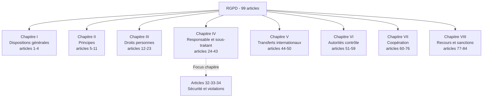
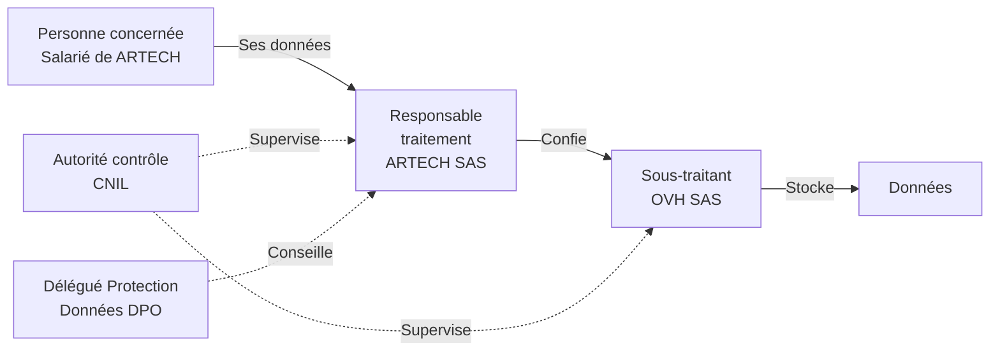
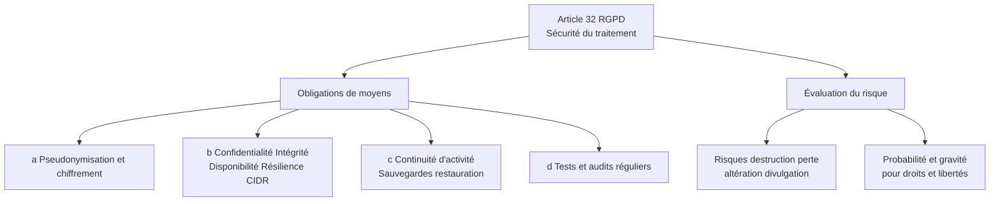
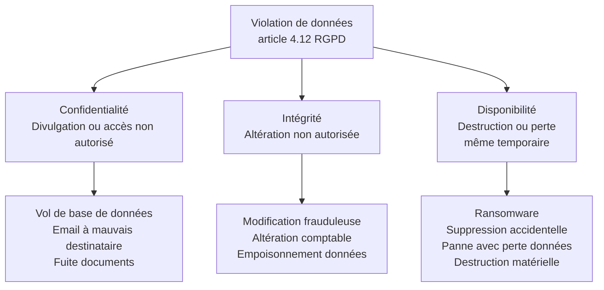
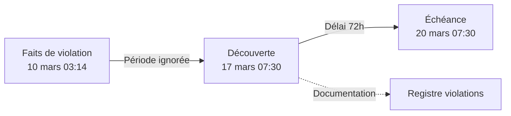
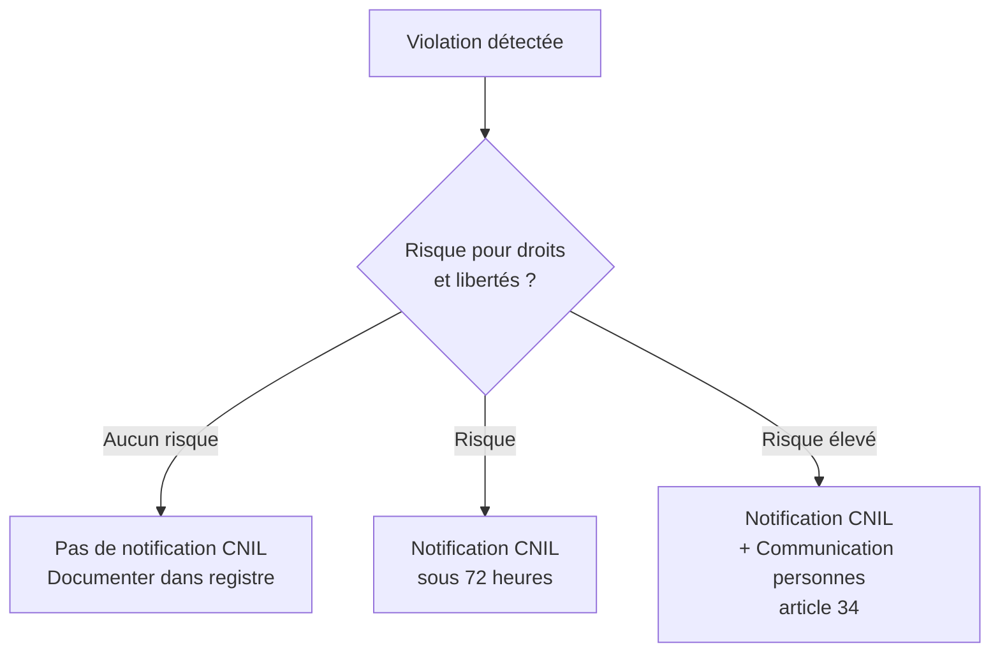
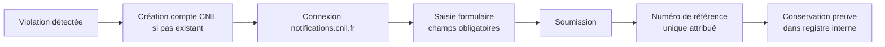
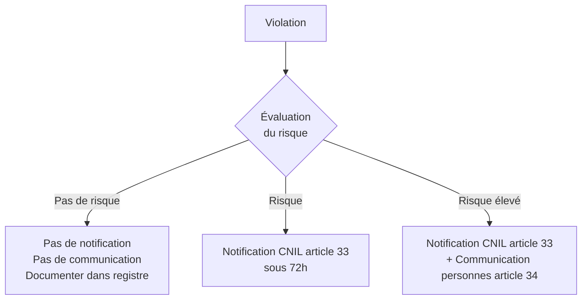
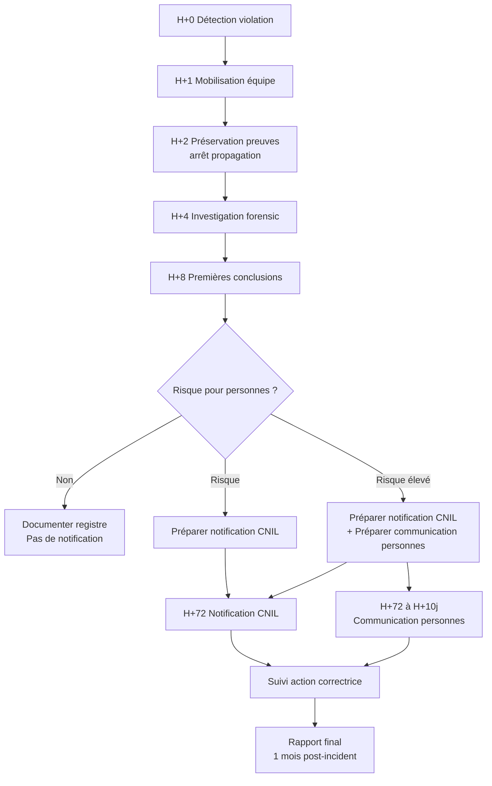
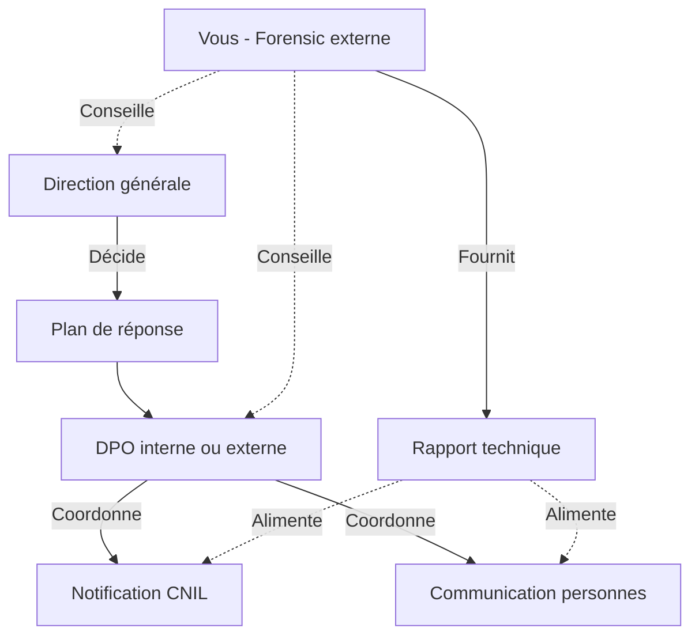

# 1.8 RGPD - Focus articles 32, 33, 34

!!! quote "L'analogie du médecin et du diagnostic"

    Quand un médecin diagnostique une maladie contagieuse, il ne se contente pas de soigner son patient. Il doit déclarer la pathologie aux autorités sanitaires, informer les personnes potentiellement exposées, mettre en place des mesures pour limiter la propagation. Cette obligation de déclaration n'est pas un détail administratif : elle est ce qui distingue une médecine moderne d'une médecine archaïque. Le RGPD applique exactement cette logique aux violations de données personnelles. Une attaque qui touche des données est une pathologie contagieuse. Le responsable du traitement doit la diagnostiquer, la déclarer à la CNIL sous 72 heures, communiquer aux personnes concernées si nécessaire, prendre les mesures correctives. Pour vous, analyste forensic, comprendre les articles 32, 33 et 34 est doublement vital : ce sont les seules dispositions qui transforment votre travail technique en obligation juridique opposable au client. Sans rapport forensic, le client ne peut pas notifier correctement. Sans notification correcte, il s'expose à des sanctions colossales.

## Métadonnées du chapitre

| Champ | Valeur |
|---|---|
| Durée estimée | 4 heures |
| Niveau | Exhaustif |
| Prérequis | Chapitres 1.1 à 1.7 |
| Livrables | Modèle de notification CNIL, registre des violations, fiche obligations |
| Auto-explication | 18 minutes |

## Objectifs pédagogiques

À la fin de ce chapitre, vous serez capable de :

- Citer le texte des articles 32, 33 et 34 du RGPD.
- Distinguer responsable de traitement, sous-traitant, et leurs responsabilités respectives.
- Qualifier une violation de données personnelles (confidentialité, intégrité, disponibilité).
- Évaluer le risque pour les droits et libertés des personnes concernées.
- Construire une notification CNIL conforme dans les 72 heures.
- Construire une communication aux personnes concernées si requise.
- Identifier les sanctions encourues et les éléments aggravants.
- Articuler le RGPD avec NIS2 et le secret des correspondances.

---

## 1. Contexte et architecture

### 1.1 Le RGPD - Vue d'ensemble

Le **Règlement Général sur la Protection des Données** (Règlement UE 2016/679) du 27 avril 2016, entré en application le 25 mai 2018, est le texte de référence en matière de données personnelles dans l'Union européenne.



### 1.2 Pourquoi ces trois articles spécifiquement

Les **articles 32, 33 et 34** forment un **triptyque opérationnel** central pour le forensic :

| Article | Objet | Lien forensic |
|---|---|---|
| Article 32 | Sécurité du traitement | Mesures préventives audit forensic |
| Article 33 | Notification à l'autorité (CNIL) | Le rapport forensic alimente la notification |
| Article 34 | Communication aux personnes concernées | Évaluation issue du rapport forensic |

Ce sont **les articles qui se déclenchent en cas d'incident**, donc **les articles que vous mobilisez en forensic**.

### 1.3 Vocabulaire fondamental

Avant tout, sept termes RGPD à maîtriser. Leur méconnaissance est la première cause d'erreur de qualification.

| Terme | Définition | Exemple |
|---|---|---|
| Donnée à caractère personnel | Toute information relative à une personne physique identifiée ou identifiable | Nom, IP, email, ADN, photo |
| Traitement | Toute opération sur des données | Collecte, stockage, transmission, suppression |
| Responsable du traitement | Personne qui détermine finalités et moyens | Entreprise cliente |
| Sous-traitant | Personne qui traite pour le responsable | Hébergeur, prestataire SaaS |
| Personne concernée | La personne dont les données sont traitées | Client, salarié, utilisateur |
| Violation de données | Atteinte à confidentialité, intégrité, disponibilité | Fuite, perte, chiffrement |
| Autorité de contrôle | Autorité nationale (CNIL en France) | CNIL |



### 1.4 Cas typiques en forensic

Toute investigation forensic implique presque inévitablement le RGPD. Voici les cas fréquents.

| Situation forensic | Implication RGPD |
|---|---|
| Acquisition mémoire d'un poste utilisateur | Données personnelles dans la RAM (sessions, cookies, emails) |
| Acquisition disque d'un serveur web | Base de clients, logs IP, sessions |
| Analyse de logs de connexion | Adresses IP = données personnelles selon CJUE |
| Analyse de boîte mail | Données très sensibles |
| Récupération de fichiers supprimés | Toutes les données récupérées sont des DCP |
| Investigation sur smartphone | Photos, contacts, géolocalisation |
| Analyse réseau Wireshark | Trafic = données personnelles |

Dans **chacun de ces cas**, vous traitez des données personnelles au sens du RGPD et tombez sous des obligations.

---

## 2. Article 32 - Sécurité du traitement

### 2.1 Texte intégral

> **Article 32 - Sécurité du traitement**
> 
> *1. Compte tenu de l'état des connaissances, des coûts de mise en œuvre et de la nature, de la portée, du contexte et des finalités du traitement ainsi que des risques, dont le degré de probabilité et de gravité varie, pour les droits et libertés des personnes physiques, le responsable du traitement et le sous-traitant mettent en œuvre les mesures techniques et organisationnelles appropriées afin de garantir un niveau de sécurité adapté au risque, y compris entre autres, selon les besoins :*
> 
> *a) la pseudonymisation et le chiffrement des données à caractère personnel ;*
> 
> *b) des moyens permettant de garantir la confidentialité, l'intégrité, la disponibilité et la résilience constantes des systèmes et des services de traitement ;*
> 
> *c) des moyens permettant de rétablir la disponibilité des données à caractère personnel et l'accès à celles-ci dans des délais appropriés en cas d'incident physique ou technique ;*
> 
> *d) une procédure visant à tester, à analyser et à évaluer régulièrement l'efficacité des mesures techniques et organisationnelles pour assurer la sécurité du traitement.*
> 
> *2. Lors de l'évaluation du niveau de sécurité approprié, il est tenu compte en particulier des risques que présente le traitement, résultant notamment de la destruction, de la perte, de l'altération, de la divulgation non autorisée de données à caractère personnel transmises, conservées ou traitées d'une autre manière, ou de l'accès non autorisé à de telles données, de manière accidentelle ou illicite.*

### 2.2 Décomposition de l'article 32

L'article 32 impose **quatre obligations de moyens** (alinéa 1, points a à d) et un **principe d'évaluation du risque** (alinéa 2).



### 2.3 La triade CIDR (alinéa 1.b)

L'article 32 introduit explicitement la **CIDR** (Confidentialité, Intégrité, Disponibilité, Résilience). C'est un **standard de sécurité** que vous évaluerez systématiquement.

| Lettre | Définition | Mesure typique |
|---|---|---|
| **C**onfidentialité | Seules les personnes autorisées accèdent | Chiffrement, contrôle d'accès |
| **I**ntégrité | Les données ne sont pas altérées | Hash, signatures, journaux |
| **D**isponibilité | Les données sont accessibles quand nécessaire | Sauvegardes, redondance |
| **R**ésilience | Le système se rétablit après incident | PRA, PCA |

### 2.4 Pseudonymisation et chiffrement (alinéa 1.a)

L'article 32 cite explicitement **deux techniques** :

**Pseudonymisation** : remplacer les identifiants directs par des pseudonymes, de sorte que les données ne soient plus rattachables à une personne sans information complémentaire conservée séparément.

```text
Donnée brute      : "Alain Guillon a acheté pour 500€ le 15/03/2026"
Pseudonymisée     : "USER_X7K2 a acheté pour 500€ le 15/03/2026"
                    + table de correspondance USER_X7K2 = Alain Guillon
                    (conservée séparément, accès limité)
```

**Chiffrement** : transformation cryptographique rendant les données illisibles sans clé.

| Type de chiffrement | Cas d'usage |
|---|---|
| Chiffrement au repos | Disques, sauvegardes (LUKS, BitLocker, FileVault) |
| Chiffrement en transit | Communications (TLS, VPN) |
| Chiffrement de bout en bout | Messageries (Signal, WhatsApp) |
| Chiffrement applicatif | Champs spécifiques en base (carte bancaire) |

### 2.5 Tests et audits (alinéa 1.d)

L'article 32 impose explicitement de **tester régulièrement l'efficacité** des mesures. C'est précisément ce qui ouvre le marché des **audits forensic et tests d'intrusion**.

| Type de test | Fréquence recommandée |
|---|---|
| Audit organisationnel | Annuel |
| Test d'intrusion externe | Annuel ou semestriel |
| Test d'intrusion interne | Annuel |
| Audit de code applicatif | À chaque release majeure |
| Exercice de restauration sauvegardes | Trimestriel |
| Exercice de gestion de crise | Annuel |

### 2.6 Articulation avec NIS2

L'article 32 RGPD et l'article 21 NIS2 (chapitre 1.7) se **chevauchent largement**. L'entité assujettie aux deux doit respecter le plus exigeant.

| Sujet | RGPD article 32 | NIS2 article 21 |
|---|---|---|
| Périmètre | Données personnelles | Tout le SI |
| Obligation de moyens | Oui (CIDR) | Oui (10 mesures) |
| Précision technique | Générale | Plus prescriptive |
| Sanction | Jusqu'à 2% CA / 10M€ | Jusqu'à 2% CA / 10M€ |
| Compatibilité | Cumulatif | Cumulatif |

### 2.7 Sanctions

Le manquement à l'article 32 est sanctionné par l'**article 83.4.a du RGPD** : amende administrative jusqu'à **10 000 000 €** ou **2% du chiffre d'affaires annuel mondial total**, le montant le plus élevé étant retenu.

---

## 3. Article 33 - Notification à l'autorité de contrôle

### 3.1 Texte intégral

> **Article 33 - Notification à l'autorité de contrôle d'une violation de données à caractère personnel**
> 
> *1. En cas de violation de données à caractère personnel, le responsable du traitement en notifie la violation en question à l'autorité de contrôle compétente conformément à l'article 55, dans les meilleurs délais et, si possible, 72 heures au plus tard après en avoir pris connaissance, à moins que la violation en question ne soit pas susceptible d'engendrer un risque pour les droits et libertés des personnes physiques. Lorsque la notification à l'autorité de contrôle n'a pas lieu dans les 72 heures, elle est accompagnée des motifs du retard.*
> 
> *2. Le sous-traitant notifie au responsable du traitement toute violation de données à caractère personnel dans les meilleurs délais après en avoir pris connaissance.*
> 
> *3. La notification visée au paragraphe 1 doit, à tout le moins :*
> 
> *a) décrire la nature de la violation de données à caractère personnel y compris, si possible, les catégories et le nombre approximatif de personnes concernées par la violation et les catégories et le nombre approximatif d'enregistrements de données à caractère personnel concernés ;*
> 
> *b) communiquer le nom et les coordonnées du délégué à la protection des données ou d'un autre point de contact auprès duquel des informations supplémentaires peuvent être obtenues ;*
> 
> *c) décrire les conséquences probables de la violation de données à caractère personnel ;*
> 
> *d) décrire les mesures prises ou que le responsable du traitement propose de prendre pour remédier à la violation de données à caractère personnel, y compris, le cas échéant, les mesures pour en atténuer les éventuelles conséquences négatives.*
> 
> *4. Si, et dans la mesure où, il n'est pas possible de fournir toutes les informations en même temps, les informations peuvent être communiquées de manière échelonnée sans autre retard indu.*
> 
> *5. Le responsable du traitement documente toute violation de données à caractère personnel, en indiquant les faits concernant la violation des données à caractère personnel, ses effets et les mesures prises pour y remédier. La documentation ainsi constituée permet à l'autorité de contrôle de vérifier le respect du présent article.*

### 3.2 Notion de "violation de données"

Le RGPD définit la violation à l'**article 4.12** : *"une violation de la sécurité entraînant, de manière accidentelle ou illicite, la destruction, la perte, l'altération, la divulgation non autorisée de données à caractère personnel transmises, conservées ou traitées d'une autre manière, ou l'accès non autorisé à de telles données."*

Cette définition englobe **trois types** de violations correspondant à la triade CIA.



### 3.3 Cas pratiques de qualification

| Situation | Type de violation |
|---|---|
| Ransomware chiffrant les bases de données | Disponibilité (et possiblement confidentialité si exfiltration) |
| Email envoyé à mauvais destinataire | Confidentialité |
| Vol d'ordinateur portable contenant des données | Confidentialité |
| Disque dur défaillant sans sauvegarde | Disponibilité |
| Modification frauduleuse d'écritures comptables | Intégrité |
| Hacking d'un site web et défacement | Intégrité (potentiellement confidentialité) |
| Phishing aboutissant au vol de credentials | Préparatoire à confidentialité |
| Erreur de configuration exposant un bucket S3 | Confidentialité (même sans accès prouvé) |

### 3.4 Le délai de 72 heures

Le délai est compté **à partir de la prise de connaissance**, pas à partir de la survenance des faits. C'est une distinction cruciale.



Le délai de 72h commence le **17 mars 07:30** dans cet exemple, pas le 10 mars.

**Seuils horaires à mémoriser** :

| Échéance | Action |
|---|---|
| H+0 | Découverte |
| H+1 à H+12 | Qualification, première analyse, mobilisation forensic |
| H+12 à H+48 | Approfondissement, premières conclusions |
| H+48 à H+72 | Rédaction notification, validation, envoi |
| H+72 | Échéance impérative |

### 3.5 Cas où la notification n'est pas requise

L'article 33 paragraphe 1 prévoit une **exception** : la notification n'est pas obligatoire si la violation **n'est pas susceptible d'engendrer un risque pour les droits et libertés** des personnes.



Exemples de violations sans risque significatif :

| Cas | Justification |
|---|---|
| Email envoyé à un destinataire interne erroné | Pas de divulgation externe, données restent dans l'entreprise |
| Perte d'un disque dur correctement chiffré (clé non compromise) | Données illisibles |
| Suppression accidentelle de données disponibles en sauvegarde | Pas d'impact réel |

### 3.6 Construction de la notification

L'article 33 paragraphe 3 liste les **éléments minimaux** de la notification. Voici la décomposition.

| Élément | Article RGPD | Source forensic |
|---|---|---|
| Nature de la violation | 33.3.a | Rapport forensic phase qualification |
| Catégories de personnes | 33.3.a | Inventaire des bases impactées |
| Nombre approximatif personnes | 33.3.a | Comptage SQL ou estimation |
| Catégories de données | 33.3.a | Schéma des bases affectées |
| Nombre approximatif enregistrements | 33.3.a | Volumétrie estimée |
| Coordonnées DPO ou contact | 33.3.b | Annuaire interne |
| Conséquences probables | 33.3.c | Analyse du risque |
| Mesures prises | 33.3.d | Plan de remédiation forensic |
| Mesures d'atténuation | 33.3.d | Plan correctif |

### 3.7 Modalités pratiques en France

En France, la notification se fait via le **téléservice CNIL** : `notifications.cnil.fr`.



Le formulaire CNIL comporte une **vingtaine de champs** structurés selon l'article 33. Vous pouvez sauvegarder en brouillon et compléter par étapes.

### 3.8 Le sous-traitant - Article 33 paragraphe 2

Si vous êtes sous-traitant (par exemple, hébergeur de données pour un client) et que la violation se produit dans votre périmètre, vous devez **notifier le responsable du traitement** dans les meilleurs délais.

C'est ensuite le responsable qui notifie la CNIL. Vous n'avez **pas** à notifier directement la CNIL en tant que sous-traitant.

**Implication contractuelle** : votre contrat de sous-traitance doit contenir une **clause de notification rapide** (généralement 24 heures) pour permettre au responsable de respecter le délai de 72h vis-à-vis de la CNIL.

### 3.9 Le registre des violations

L'article 33 paragraphe 5 impose la **documentation** de toute violation, même celles non notifiées. Ce registre est tenu par le DPO ou le responsable.

Modèle de registre :

```text
REGISTRE DES VIOLATIONS DE DONNÉES PERSONNELLES
================================================

ENTRÉE N° : 2026-014
Date découverte    : 17/03/2026 07:30 UTC
Date faits         : 10/03/2026 (estimation)
Nature             : Confidentialité + Disponibilité (ransomware)
Catégories         : Clients particuliers, salariés
Nombre personnes   : ~1 247 (clients) + 42 (salariés)
Catégories données : Identité, IBAN, données santé partielles, RH
Nombre enregistr.  : ~14 000 enregistrements
Conséquences       : Usurpation identité, fraude bancaire, intimité
Notification CNIL  : Oui, ref. CNIL-2026-XYZ du 20/03/2026
Communication      : Oui, courrier individuel envoyé le 25/03/2026
Mesures prises     : Isolation, restauration, dépôt plainte, audit complet
Statut             : Clos le 30/04/2026

Signataire DPO : ________________________
```

---

## 4. Article 34 - Communication à la personne concernée

### 4.1 Texte intégral

> **Article 34 - Communication à la personne concernée d'une violation de données à caractère personnel**
> 
> *1. Lorsqu'une violation de données à caractère personnel est susceptible d'engendrer un risque élevé pour les droits et libertés d'une personne physique, le responsable du traitement communique la violation de données à caractère personnel à la personne concernée dans les meilleurs délais.*
> 
> *2. La communication à la personne concernée visée au paragraphe 1 du présent article décrit, en des termes clairs et simples, la nature de la violation de données à caractère personnel et contient au moins les informations et mesures visées à l'article 33, paragraphe 3, points b), c) et d).*
> 
> *3. La communication à la personne concernée visée au paragraphe 1 n'est pas nécessaire si l'une ou l'autre des conditions suivantes est remplie :*
> 
> *a) le responsable du traitement a mis en œuvre les mesures de protection techniques et organisationnelles appropriées et ces dernières ont été appliquées aux données à caractère personnel affectées par ladite violation, en particulier les mesures qui rendent les données à caractère personnel incompréhensibles pour toute personne qui n'est pas autorisée à y avoir accès, telles que le chiffrement ;*
> 
> *b) le responsable du traitement a pris des mesures ultérieures qui garantissent que le risque élevé pour les droits et libertés des personnes concernées visé au paragraphe 1 n'est plus susceptible de se matérialiser ;*
> 
> *c) elle exigerait des efforts disproportionnés. Dans ce cas, il est plutôt procédé à une communication publique ou à une mesure similaire permettant aux personnes concernées d'être informées de manière tout aussi efficace.*

### 4.2 La distinction risque vs risque élevé

L'article 33 (notification CNIL) se déclenche dès qu'il y a **risque**. L'article 34 (communication aux personnes) se déclenche au **risque élevé**. Cette distinction est cruciale.



### 4.3 Critères du risque élevé

La CNIL et le CEPD (Comité européen de la protection des données) ont défini des critères pour qualifier le risque élevé.

| Critère | Indicateurs |
|---|---|
| Type de données | Données sensibles (santé, religion, orientation sexuelle, données enfants) |
| Volume | Grand nombre de personnes concernées |
| Identifiabilité | Données directement identifiantes (nom + adresse + téléphone) |
| Possibilité d'usurpation | Combinaison nom + date naissance + IBAN |
| Vulnérabilité des personnes | Mineurs, personnes âgées, victimes |
| Caractère permanent | Impossibilité de remédier (ex : ADN) |
| Conséquences potentielles | Discrimination, vol identité, dommage financier |

### 4.4 Cas où la communication n'est pas requise

L'article 34 paragraphe 3 prévoit **trois exceptions** à l'obligation de communication.

| Exception | Cas concret |
|---|---|
| Mesures de protection appropriées (chiffrement) | Disque chiffré perdu avec clé non compromise |
| Mesures ultérieures évitant la matérialisation | Réinitialisation forcée de tous les mots de passe |
| Efforts disproportionnés | Communication publique alternative possible |

### 4.5 Modalités pratiques

La communication doit être faite **dans les meilleurs délais** (sans délai précis). Elle doit être :

| Caractéristique | Précision |
|---|---|
| Claire et simple | Compréhensible par non-techniques |
| Individuelle de préférence | Email, courrier, téléphone |
| Publique si efforts disproportionnés | Communiqué de presse, page web dédiée |
| Documentée | Conservation des preuves d'envoi |

### 4.6 Modèle de communication

```text
[Logo entreprise]
[Date]

Madame, Monsieur,

Nous tenons à vous informer d'un événement de sécurité affectant
certaines de vos données personnelles.

NATURE DE L'INCIDENT
Le 10 mars 2026, notre système d'information a fait l'objet d'une
attaque informatique. Nous avons découvert cet incident le 17 mars 2026.

DONNÉES CONCERNÉES
Les données vous concernant susceptibles d'avoir été touchées sont :
- Votre identité (nom, prénom)
- Votre adresse postale
- Votre adresse email
- Vos coordonnées bancaires (IBAN)

CONSÉQUENCES POSSIBLES
Cette violation pourrait être exploitée par des acteurs malveillants
à des fins de :
- Tentatives de phishing ciblé
- Tentatives d'usurpation d'identité
- Tentatives de fraude bancaire

MESURES QUE NOUS AVONS PRISES
- Isolement immédiat des systèmes concernés
- Restauration depuis sauvegardes saines
- Mandat d'un cabinet forensic indépendant
- Dépôt de plainte auprès des autorités
- Notification à la CNIL le 20 mars 2026

MESURES QUE NOUS VOUS RECOMMANDONS
- Surveiller vos relevés bancaires dans les 6 prochains mois
- Méfiance accrue face aux emails et appels demandant des informations
- Possibilité de demander à votre banque la mise en surveillance de
  votre compte
- En cas de prélèvement frauduleux, contacter immédiatement votre
  banque et déposer plainte

CONTACT
Pour toute question, vous pouvez contacter notre DPO :
- Email : dpo@artech.fr
- Téléphone : 01 XX XX XX XX
- Courrier : ARTECH SAS, Service DPO, [adresse]

VOS DROITS
Conformément au RGPD, vous disposez d'un droit d'accès,
de rectification, d'effacement et d'opposition concernant vos données.

Nous présentons nos plus sincères excuses pour le préjudice causé
et restons mobilisés pour vous accompagner.

[Signature]
Hélène Lefebvre
Directrice générale ARTECH SAS
```

---

## 5. Procédure complète de gestion d'une violation

### 5.1 Workflow opérationnel



### 5.2 Rôle de l'analyste forensic dans cette chaîne

Vous êtes **central** dans cette procédure. Voici votre apport à chaque étape.

| Étape | Apport forensic |
|---|---|
| H+1 Mobilisation | Activation de votre intervention |
| H+2 Préservation | Acquisitions mémoire et disque, hash, scellés |
| H+4 Investigation | Analyse Volatility, Autopsy, timeline |
| H+8 Premières conclusions | Périmètre des données touchées, vecteur, durée |
| H+24 Approfondissement | Identification des bases impactées, volumétrie |
| H+48 Consolidation | Évaluation finale du risque |
| H+72 Notification CNIL | Données factuelles pour le formulaire |
| Communication personnes | Soutien rédactionnel sur les conséquences |
| Rapport 1 mois | Rapport complet exploitable |

### 5.3 Articulation forensic - DPO - Direction

Trois acteurs internes au client, plus vous comme prestataire externe, doivent se coordonner.



---

## 6. Sanctions et jurisprudence CNIL

### 6.1 Régime des sanctions

Les sanctions du RGPD sont définies par l'**article 83**. Elles se répartissent en deux catégories.

| Catégorie | Plafond | Articles concernés |
|---|---|---|
| Sanctions courantes | 10 M€ ou 2% CA mondial | Articles 8, 11, 25-39, 42, 43 |
| Sanctions élevées | 20 M€ ou 4% CA mondial | Articles 5-9, 12-22, 44-49 |

Les articles 32, 33, 34 relèvent du **plafond de 10 M€ / 2% CA**.

### 6.2 Critères de modulation

L'article 83 paragraphe 2 liste 11 critères de modulation des sanctions :

| Critère | Précision |
|---|---|
| Nature, gravité, durée de la violation | Combien de temps les données sont restées exposées |
| Caractère intentionnel ou non | Erreur vs négligence vs acte volontaire |
| Mesures prises pour atténuer | Réactivité, qualité du forensic |
| Degré de responsabilité | Responsable seul ou avec sous-traitant |
| Antériorité | Premier manquement ou récidive |
| Coopération | Avec la CNIL pendant l'enquête |
| Catégories de données | Sensibles ou non |
| Notification | Spontanée ou suite à plainte tierce |
| Respect d'un code de conduite | Adhésion à des codes sectoriels |
| Bénéfices financiers tirés | De la violation |
| Toute autre circonstance | Aggravante ou atténuante |

### 6.3 Sanctions notables 2024-2026

Pour vous donner des ordres de grandeur, voici quelques sanctions CNIL ou d'autres autorités européennes récentes (illustratives, à vérifier sur le site CNIL).

| Entité | Manquement | Sanction |
|---|---|---|
| Grands acteurs Tech US | Cookies non conformes, transferts | Centaines de millions € |
| Distributeurs grand public | Sécurité insuffisante | Plusieurs millions € |
| Établissements bancaires | Violations multiples | Plusieurs millions € |
| PME mid-market | Sécurité insuffisante simple | Dizaines à centaines de milliers € |

### 6.4 Effet aggravant du retard de notification

Le **retard ou l'absence de notification** est un facteur aggravant majeur. Plusieurs sanctions CNIL ont triplé pour ce motif.

**Conséquence opérationnelle** : même si la violation est minime, **notifiez par excès de prudence** plutôt que de prendre le risque d'une non-notification reprochée plus tard.

---

## 7. Articulation avec d'autres cadres

### 7.1 RGPD vs NIS2

| Aspect | RGPD | NIS2 |
|---|---|---|
| Périmètre | Données personnelles | SI au sens large |
| Délai notification | 72 heures | 24h pre-notif + 72h |
| Plafond sanction | 10 M€ ou 2% CA (art. 32-34) | 10 M€ ou 2% CA (essentielle) |
| Autorité | CNIL | ANSSI |
| Personnes concernées | Communication possible | Pas d'obligation directe |

**Cumul**: oui. Une attaque ransomware touchant données personnelles déclenche **les deux** notifications.

### 7.2 RGPD vs LCEN

La LCEN impose la conservation, le RGPD impose la minimisation. Les durées doivent respecter les deux : on conserve **le minimum** imposé par la LCEN, **pas plus**.

### 7.3 RGPD vs DORA

DORA s'applique au secteur financier comme **lex specialis**. RGPD reste applicable en parallèle pour les données personnelles.

### 7.4 RGPD et secret des correspondances (226-15)

Les emails sont à la fois :
- Des **données personnelles** (RGPD)
- Des **correspondances** (article 226-15)

Vos investigations doivent respecter les deux régimes simultanément.

---

## 8. Pièges et bonnes pratiques

### Piège 1 - Confondre 72 heures calendaires et 72 heures ouvrées

Les 72 heures sont **calendaires**. Une violation découverte le vendredi à 18h doit être notifiée avant le lundi 18h, week-end inclus.

### Piège 2 - Sous-estimer le périmètre des données personnelles

Beaucoup d'éléments sont considérés comme données personnelles :

| Élément | Données personnelles ? |
|---|---|
| Adresse IP | Oui (CJUE Breyer 2016) |
| Cookies de tracking | Oui |
| Identifiant publicitaire mobile | Oui |
| Voix enregistrée | Oui |
| Photo de visage | Oui |
| Identifiant pseudonyme | Oui si recoupable |
| Plaque d'immatriculation | Oui |
| Adresse MAC | Oui dans certains contextes |

### Piège 3 - Oublier l'effet de cascade

Une violation chez un sous-traitant déclenche les obligations chez le responsable. Si vous êtes sous-traitant, votre **lenteur à notifier** met votre client en faute envers la CNIL.

### Bonne pratique 1 - Préparer les modèles à l'avance

Tenez prêts dans un dossier dédié :
- Modèle de notification CNIL pré-rempli
- Modèle de communication aux personnes
- Modèle de procès-verbal d'incident
- Liste de contrôle 72h

Cela divise par deux le temps de mobilisation en cas d'incident réel.

### Bonne pratique 2 - Documenter dès la découverte

Le **registre des violations** doit être renseigné **avant** l'envoi à la CNIL. Cela force à structurer la pensée et constitue la trace du raisonnement décisionnel.

### Bonne pratique 3 - Notifier en cas de doute

La CNIL ne sanctionne pas une notification "excessive", elle sanctionne l'absence de notification. **En cas de doute, notifiez**.

---

## 9. Manipulation pratique

### Exercice 9.1 - Qualifier des violations

| Cas | Type | Risque | Action |
|---|---|---|---|
| Email envoyé à mauvais destinataire interne | Confidentialité limitée | Faible | Documenter registre |
| Vol portable chiffré, clé non compromise | Confidentialité | Faible (chiffrement protège) | Documenter, peut-être notifier |
| Ransomware sur serveur de paie | Disponibilité + Confidentialité | Élevé | Notification + Communication |
| Erreur cloud bucket S3 ouvert 1 mois | Confidentialité | Élevé selon données | Notification + souvent Communication |
| Modification frauduleuse écritures comptables | Intégrité | Variable | Notification |
| Phishing vol credentials administrateur | Confidentialité (initial) | Élevé (effets en cascade) | Notification |
| Plantage avec perte 1h données récentes | Disponibilité | Faible | Documenter |

### Exercice 9.2 - Construction d'une notification CNIL

Pour le cas ARTECH (ransomware mars 2026), construisez les éléments de la notification CNIL.

```text
NOTIFICATION DE VIOLATION DE DONNÉES À CARACTÈRE PERSONNEL
=============================================================

A) Nature de la violation
- Type : Ransomware avec exfiltration probable
- Confidentialité : Oui (exfiltration confirmée par analyse forensic)
- Intégrité : Non (données chiffrées mais restaurées depuis sauvegarde)
- Disponibilité : Oui pendant 4 jours (du 14 au 18 mars 2026)

B) Catégories et nombre de personnes concernées
- Clients particuliers : ~1 247 personnes
- Clients professionnels : ~85 entités
- Salariés : 42 personnes
- Total : ~1 374 personnes physiques concernées

C) Catégories et nombre d'enregistrements
- Données identité (nom, adresse, téléphone) : ~14 000 enregistrements
- Données bancaires (IBAN clients) : ~1 247 enregistrements
- Données santé partielles (suivi clients matériel médical) : ~340 enregistrements
- Données RH salariés : ~42 dossiers complets

D) Coordonnées DPO
M. Lemoine (DPO mutualisé)
Email : dpo@artech.fr
Téléphone : 01 XX XX XX XX

E) Conséquences probables
- Risque de phishing ciblé sur les clients
- Risque d'usurpation d'identité
- Risque de fraude bancaire (IBAN exposés)
- Risque de divulgation indirecte de données santé
- Risque d'atteinte à la vie privée des salariés

F) Mesures prises
- Isolement immédiat des systèmes (14/03/2026 09:30)
- Mandat cabinet forensic OmnyVia (14/03/2026 11:00)
- Acquisition forensic des 3 postes et serveur (14-15/03/2026)
- Restauration complète depuis sauvegardes saines (16-18/03/2026)
- Réinitialisation de tous les mots de passe (15/03/2026)
- Audit de toute l'infrastructure (en cours)
- Dépôt de plainte au commissariat (15/03/2026)
- Notification CNIL (20/03/2026)
- Communication aux personnes concernées (25/03/2026)

G) Mesures correctives à venir
- Mise en place EDR sur tous les postes (avril 2026)
- Mise en place SOC managé (mai 2026)
- Sensibilisation phishing tous salariés (avril 2026)
- Audit de conformité NIS2 et ReCyF (juin 2026)
- Mise en place sauvegardes immuables (mai 2026)
```

### Exercice 9.3 - Évaluation du risque

Pour chaque cas, évaluez le risque et l'obligation de communication.

| Cas | Risque | Communication article 34 ? |
|---|---|---|
| Vol de 50 000 emails sans contenu sensible | Modéré | Probablement non |
| Vol de 5 000 dossiers patients d'un hôpital | Élevé | Oui obligatoire |
| Exposition d'une base de 10 000 IBAN | Élevé | Oui |
| Vol de 100 candidatures avec CV | Variable | Selon données sensibles dans CV |
| Compromission d'1 compte administrateur | Élevé (effet cascade potentiel) | Oui pour personnes dont données ont été accessibles |
| Erreur expédiant une lettre par email à 2 personnes au lieu d'1 | Faible | Non, registre suffit |

---

## 10. Auto-évaluation

| # | Question | Réponse attendue |
|---|---|---|
| 1 | Trois articles centraux du RGPD pour le forensic ? | 32, 33, 34 |
| 2 | Délai de notification CNIL ? | 72 heures à compter de la prise de connaissance |
| 3 | Plafond de sanction articles 32-34 ? | 10 M€ ou 2% CA mondial |
| 4 | Définition d'une violation ? | Atteinte à C, I ou D des données personnelles |
| 5 | Quand communiquer aux personnes ? | Risque élevé pour droits et libertés |
| 6 | Le sous-traitant notifie qui ? | Le responsable du traitement, pas la CNIL directement |
| 7 | Que contient le registre des violations ? | Toutes violations même non notifiées |
| 8 | Qu'est-ce que la CIDR ? | Confidentialité Intégrité Disponibilité Résilience |
| 9 | Adresse IP est-elle DCP ? | Oui (CJUE Breyer 2016) |
| 10 | Articulation 33 et NIS2 23 ? | Cumul, deux notifications distinctes possibles |

---

## 11. Synthèse mémo

```text
RGPD - Articles 32, 33, 34

ARTICLE 32 - Sécurité du traitement
  Mesures : pseudonymisation, chiffrement, CIDR
  Tests réguliers obligatoires
  Sanction : 10 M€ ou 2% CA mondial

ARTICLE 33 - Notification à la CNIL
  Délai : 72 heures après prise de connaissance
  Si pas de risque : pas de notification (registre)
  Contenu : nature, personnes, données, conséquences, mesures
  Plateforme : notifications.cnil.fr

ARTICLE 34 - Communication aux personnes
  Si risque ELEVÉ
  Délai : meilleurs délais
  Exceptions : chiffrement, mesures ultérieures, efforts disproportionnés

REGISTRE DES VIOLATIONS
  Obligatoire pour TOUTES violations
  Tenu par DPO ou responsable

VOTRE RÔLE FORENSIC
  Acquisition + analyse alimentent les notifications
  Le rapport forensic est CENTRAL
  Délai 72h impose une réactivité de votre part
```

---

## 12. Pour aller plus loin

| Ressource | Type |
|---|---|
| Texte RGPD complet | EUR-Lex |
| Lignes directrices CEPD sur les violations | 09/2022 |
| FAQ CNIL violations | cnil.fr |
| Guide CNIL sécurité données personnelles | 2018 mis à jour |
| Téléservice notifications.cnil.fr | Plateforme officielle |
| Loi Informatique et Libertés modifiée | Légifrance |

---

## 13. Auto-explication

Pour valider ce chapitre, enregistrez une vidéo de 18 minutes où vous expliquez :

1. Vocabulaire RGPD essentiel (2 minutes)
2. Article 32 et la CIDR (3 minutes)
3. Article 33 et le délai 72 heures (3 minutes)
4. Article 34 et le risque élevé (2 minutes)
5. Procédure complète de gestion d'une violation (3 minutes)
6. Articulation avec NIS2 et 226-15 (2 minutes)
7. Sanctions et leur modulation (2 minutes)
8. Votre rôle forensic dans la chaîne (1 minute)

---

**Chapitre précédent** : [1.7 NIS et NIS2 - Loi Résilience 2026](01-7-nis2-loi-resilience.md)

**Chapitre suivant** : [1.9 DORA pour le secteur financier](01-9-dora.md)
