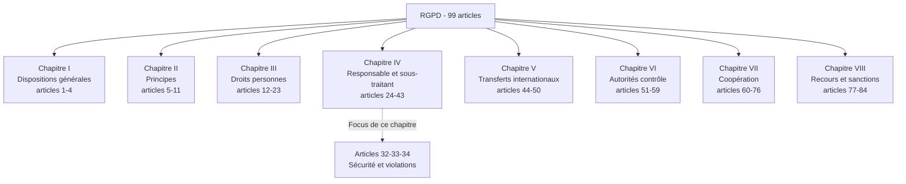
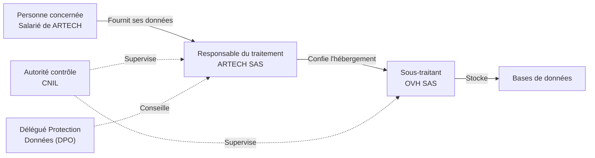
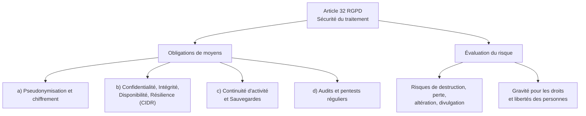
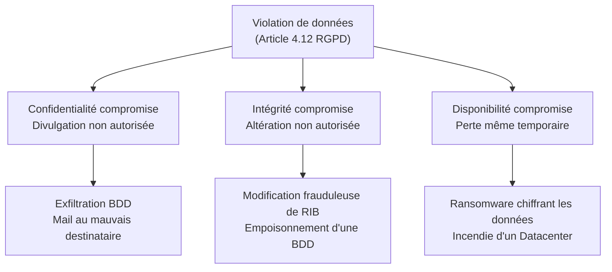
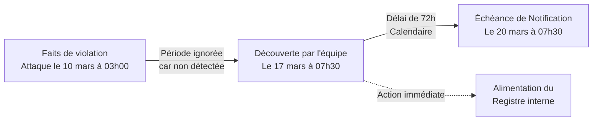
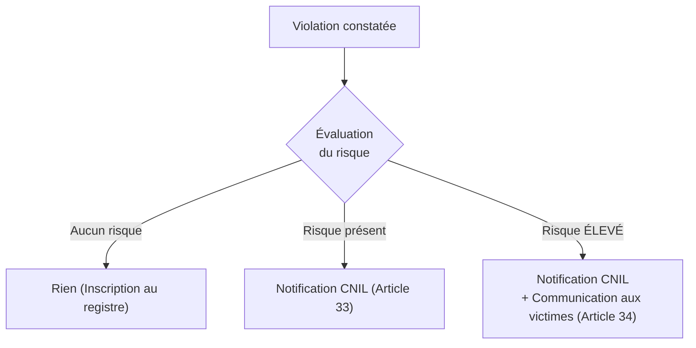
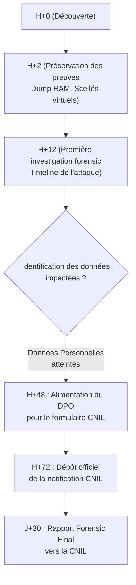

# RGPD - Focus articles 32, 33, 34

!!! note "**Livrables :** _Modèle de notification CNIL, registre des violations, fiche obligations_"
!!! note "**Auto-explication :** _18 minutes_"

 

---

 

!!! quote "L'analogie du médecin et du diagnostic"

    Quand un médecin diagnostique une maladie contagieuse, il ne se contente pas de soigner son patient. Il doit déclarer la pathologie aux autorités sanitaires, informer les personnes potentiellement exposées, mettre en place des mesures pour limiter la propagation. Cette obligation de déclaration n'est pas un détail administratif : elle est ce qui distingue une médecine moderne d'une médecine archaïque. Le RGPD applique exactement cette logique aux violations de données personnelles. Une attaque qui touche des données est une pathologie contagieuse. Le responsable du traitement doit la diagnostiquer, la déclarer à la CNIL sous 72 heures, communiquer aux personnes concernées si nécessaire, prendre les mesures correctives. Pour vous, analyste forensic, comprendre les articles 32, 33 et 34 est doublement vital : ce sont les seules dispositions qui transforment votre travail technique en obligation juridique opposable au client. Sans rapport forensic, le client ne peut pas notifier correctement. Sans notification correcte, il s'expose à des sanctions colossales.

## Objectifs pédagogiques

!!! tip "À la fin de ce chapitre, vous serez capable de :"

    - Citer le texte des articles 32, 33 et 34 du RGPD.
    - Distinguer responsable de traitement, sous-traitant, et leurs responsabilités respectives.
    - Qualifier une violation de données personnelles (confidentialité, intégrité, disponibilité).
    - Évaluer le risque pour les droits et libertés des personnes concernées.
    - Construire une notification CNIL conforme dans les 72 heures.
    - Construire une communication aux personnes concernées si requise.
    - Identifier les sanctions encourues et les éléments aggravants.
    - Articuler le RGPD avec NIS2 et le secret des correspondances.

 

---

 

## Contexte et architecture

### Le RGPD - Vue d'ensemble

Le **Règlement Général sur la Protection des Données** (Règlement UE 2016/679) du 27 avril 2016, entré en application le 25 mai 2018, est le texte de référence en matière de données personnelles dans l'Union européenne.

> Architecture globale du texte :

### Pourquoi ces trois articles spécifiquement ?

Les **articles 32, 33 et 34** forment un **triptyque opérationnel** central pour le forensic en réponse à incident :

| Article | Objet | Lien forensic direct |
|---|---|---|
| **Article 32** | Sécurité du traitement | C'est le référentiel d'audit forensic |
| **Article 33** | Notification à l'autorité (CNIL) | Le rapport forensic sert de base à la notification |
| **Article 34** | Communication aux personnes concernées | Le forensic évalue le risque justifiant (ou non) cette com |

Ce sont **les articles qui s'activent lors d'un incident cyber**, et que vous devez manipuler.

### Vocabulaire fondamental

Avant d'aller plus loin, maîtrisez ces 7 termes RGPD. Leur confusion est la première cause d'erreur d'analyse.

| Terme juridique | Définition | Exemple |
|---|---|---|
| Donnée à caractère personnel (DCP) | Toute information relative à une personne physique identifiée ou identifiable | Nom, IP, email, ADN, photo, cookie |
| Traitement | Toute opération sur des données | Collecter, stocker, transmettre, supprimer |
| Responsable du traitement (RT) | Entité qui détermine les finalités et moyens | Votre entreprise cliente |
| Sous-traitant | Entité qui traite les données *pour le compte* du RT | AWS, un éditeur SaaS, un hébergeur |
| Personne concernée | La personne physique dont les données sont traitées | Le client, le salarié, l'internaute |
| Violation de données | Atteinte à la confidentialité, intégrité, disponibilité | Fuite, altération, ransomware |
| Autorité de contrôle | Autorité nationale souveraine | La CNIL en France |

### Cas typiques en forensic

Toute investigation sur un poste de travail ou un serveur implique inévitablement de traiter des données personnelles.

| Situation forensic | Pourquoi le RGPD s'applique |
|---|---|
| Acquisition de la RAM d'un poste | La RAM contient des identifiants, emails, cookies (DCP) |
| Image disque d'un serveur Web | Capture d'une base de clients ou de logs IP |
| Analyse de logs IIS/Apache | Une adresse IP = donnée personnelle (Jurisprudence CJUE) |
| Analyse de messagerie | Les emails sont saturés de DCP |
| Récupération de fichiers effacés | Les fichiers restaurés sont souvent des DCP |
| Analyse réseau (PCAP) | Le trafic intercepté contient des DCP |

 

---

 

## Article 32 - Sécurité du traitement

### Texte intégral (Extrait)

!!! quote "Texte en vigueur (Article 32 du RGPD)"
    
    > *1. Compte tenu de l'état des connaissances, des coûts de mise en œuvre et de la nature, de la portée, du contexte et des finalités du traitement ainsi que des risques [...] le responsable du traitement et le sous-traitant mettent en œuvre les mesures techniques et organisationnelles appropriées afin de garantir un niveau de sécurité adapté au risque, y compris entre autres :*
    > 
    > *a) la pseudonymisation et le chiffrement des données à caractère personnel ;*
    > 
    > *b) des moyens permettant de garantir la confidentialité, l'intégrité, la disponibilité et la résilience constantes des systèmes et des services de traitement ;*
    > 
    > *c) des moyens permettant de rétablir la disponibilité des données [...] dans des délais appropriés en cas d'incident ;*
    > 
    > *d) une procédure visant à tester, à analyser et à évaluer régulièrement l'efficacité des mesures [...].*

### Décomposition de l'article 32

L'article 32 impose **quatre obligations de moyens** (alinéa 1) fondées sur une **évaluation du risque** préalable (alinéa 2).

### La triade CIDR (alinéa 1.b)

C'est l'acronyme phare de la sécurité de l'information, gravé dans le marbre européen.

| Lettre | Définition métier | Mesure technique typique (Forensic/SecOps) |
|---|---|---|
| **C**onfidentialité | Seules les personnes autorisées y accèdent | Chiffrement au repos, MFA, ACL strictes |
| **I**ntégrité | Les données n'ont pas été altérées illégitimement | Empreintes (Hash), signatures numériques |
| **D**isponibilité | Les données sont accessibles en cas de besoin | PRA, PRA, architecture redondée |
| **R**ésilience | Capacité à subir un choc et repartir | Sauvegardes immuables et déconnectées |

### Pseudonymisation et chiffrement (alinéa 1.a)

L'article cite explicitement ces deux techniques comme références :

- **Pseudonymisation** : Séparer la donnée d'identification de la donnée métier.
- **Chiffrement** : Rendre la donnée mathématiquement illisible.

| Type de chiffrement | Cas d'usage métier |
|---|---|
| Au repos | Disques chiffrés (BitLocker, LUKS) sur les laptops commerciaux |
| En transit | Protocoles robustes (TLS 1.3, VPN IPSec) |
| De bout-en-bout | Messageries sécurisées, flux financiers |

### Tests et audits réguliers (alinéa 1.d)

C'est l'alinéa qui justifie l'existence même des cabinets de conseil cyber. Le RGPD exige de **prouver** l'efficacité des mesures par des tests.

| Type de test requis | Fréquence recommandée (Usage) |
|---|---|
| Pentest externe (Boîte Noire) | Annuel a minima |
| Pentest interne / Active Directory | Annuel |
| Audit d'architecture Cloud | À chaque évolution majeure |
| Exercice de restauration (Disaster Recovery) | Semestriel ou Trimestriel |

### Articulation avec NIS2

L'article 32 RGPD et l'article 21 NIS2 se **chevauchent**. Si une entreprise est soumise aux deux, elle cumule les obligations (RGPD pour la donnée personnelle, NIS2 pour la survie du système global).

 

---

 

## Article 33 - Notification à l'autorité de contrôle (CNIL)

### Texte intégral (Extrait)

!!! quote "Texte en vigueur (Article 33 du RGPD)"
    
    > *1. En cas de violation de données à caractère personnel, le responsable du traitement en notifie la violation en question à l'autorité de contrôle compétente [...] dans les meilleurs délais et, si possible, 72 heures au plus tard après en avoir pris connaissance, à moins que la violation en question ne soit pas susceptible d'engendrer un risque pour les droits et libertés des personnes physiques. Lorsque la notification [...] n'a pas lieu dans les 72 heures, elle est accompagnée des motifs du retard.*

### Notion de "violation de données" (Article 4.12)

Le RGPD qualifie de violation : *"une atteinte à la sécurité entraînant, de manière accidentelle ou illicite, la destruction, la perte, l'altération, la divulgation [...] de données"*.

Ceci correspond parfaitement à la destruction de notre triade "CID" (Confidentialité, Intégrité, Disponibilité).

### Le délai d'enfer : 72 heures

C'est LE délai critique. Il est décompté **à partir de la prise de connaissance** de l'incident, et non pas de l'heure de l'attaque. (72h = 3 jours calendaires, week-ends inclus).

### Cas où la notification CNIL N'EST PAS requise

L'article 33.1 prévoit une exemption très claire : on ne notifie pas si la violation **n'engendre aucun risque** pour les droits et libertés.

| Situation | Pourquoi on ne notifie pas la CNIL |
|---|---|
| PC Portable perdu, mais disque intégralement chiffré (BitLocker robuste) | La donnée reste confidentielle, le risque est nul |
| Mail interne RH envoyé à la mauvaise secrétaire du même service | La donnée n'est pas sortie du cercle de confiance légitime |
| BDD supprimée par erreur, mais restaurée sous 1h via backup | L'impact sur la disponibilité est dérisoire |

!!! abstract "Le Registre des Violations"
    Même si vous ne notifiez pas la CNIL, **toute anomalie doit être inscrite dans le Registre Interne des Violations** de l'entreprise (tenu par le DPO). Ce registre doit justifier pourquoi vous avez estimé inutile d'alerter la CNIL.

### Construction de la Notification

C'est ici que l'Analyste Forensic entre en jeu. La notification exige des faits techniques.

| Ce que demande la CNIL (Art 33.3) | D'où provient l'information |
|---|---|
| Nature exacte de la violation | Rapport de Qualification (Forensic) |
| Nombre de personnes / enregistrements touchés | Scripts d'inventaire sur les BDD compromises |
| Conséquences probables | Évaluation de la menace (Threat Intel) |
| Mesures de remédiation prévues | Plan d'Action Post-Incident (CSIRT) |

*En France, cette procédure s'effectue exclusivement sur le portail étatique : `notifications.cnil.fr`.*

### Le Sous-Traitant (Article 33.2)

!!! danger "Alerte Sous-traitant"
    Si vous êtes un hébergeur Cloud (sous-traitant) et que vous vous faites pirater : **vous ne notifiez pas la CNIL**. Vous avez l'obligation de notifier **votre client** (le Responsable du Traitement) sans aucun délai. C'est ensuite à lui d'évaluer s'il doit notifier la CNIL dans ses 72h.

 

---

 

## Article 34 - Communication à la personne concernée

### La distinction : "Risque" vs "Risque Élevé"

C'est la bascule fondamentale entre l'article 33 et l'article 34.

### Critères qualifiant un "Risque Élevé"

| Facteur de risque | Exemple déclencheur |
|---|---|
| Nature des données | Fiches de paie, dossiers médicaux, orientations sexuelles, mots de passe en clair. |
| Volume massif | Une fuite touchant 100 000 clients d'un coup. |
| Usurpation possible | Fuite simultanée d'une CNI (Carte d'Identité), d'un IBAN et d'un Justificatif de domicile. |

### Les 3 exceptions (Où l'on peut se taire)

Même en cas de risque élevé, l'entreprise peut éviter le bad buzz d'une communication publique si elle remplit l'une des 3 conditions du 34.3 :

1. **Chiffrement préalable** : Les données volées étaient chiffrées de bout en bout (L'attaquant n'a qu'un blob de données inutilisables).
2. **Action post-crise efficace** : L'entreprise a réussi à désamorcer la menace (ex: effacement à distance du mobile volé avant son déverrouillage).
3. **Effort disproportionné** : (Ex: S'il faut envoyer 2 millions de courriers recommandés, une pleine page dans le Figaro suffira).

 

---

 

## Workflow Forensic et Gouvernance de Crise

### Chronologie opérationnelle et Rôle de l'Analyste

> Voici comment le travail forensic s'imbrique dans le délai légal des 72 heures :

En gestion de crise, **le Directeur Général décide, le DPO notifie, mais c'est l'Analyste Forensic qui détient la vérité technique.** Sans un rapport clair estimant le volume de données exfiltrées, le DPO ne peut pas remplir son formulaire CNIL.

 

---

 

## Sanctions et Jurisprudence CNIL

### Le plafond des amendes (Article 83)

Les manquements aux articles 32 (sécurité), 33 (notification) et 34 (information) relèvent de la première tranche de sanctions du RGPD :
**Amende administrative pouvant aller jusqu'à 10 000 000 € ou 2 % du chiffre d'affaires annuel mondial total.**

### Effet aggravant (Le syndrome du tapis)

!!! failure "Le pire choix : Cacher la poussière sous le tapis"
    La CNIL module l'amende en fonction de la coopération. Un retard injustifié de notification, ou pire, une dissimulation (découverte plus tard suite à la revente des bases sur le Dark Web), agit comme un **facteur aggravant colossal**. Une entreprise négligente qui notifie spontanément paiera toujours infiniment moins cher qu'une entreprise négligente qui a tenté de cacher la fuite. **En cas de doute, notifiez.**

 

---

 

## Pièges et bonnes pratiques

!!! failure "Piège 1 - Confondre 'Jours ouvrés' et 'Heures calendaires'"
    La notification CNIL (72h) se moque des week-ends et des jours fériés. Une attaque découverte le vendredi soir doit être signalée avant le lundi soir. Les astreintes existent pour cela.

!!! failure "Piège 2 - Minimiser le spectre d'une Donnée Personnelle"
    Une adresse IP ? C'est une donnée personnelle (Jurisprudence CJUE). Une adresse MAC ? Aussi. Un Cookie ? Également. Ne pensez pas que seules les fiches médicales sont concernées.

!!! tip "1. Préparer les modèles à l'avance (Peace of mind)"
    En pleine cellule de crise ransomware, personne n'a la lucidité d'écrire une prose parfaite. Les entreprises résilientes possèdent déjà des "Templates" vides de notification CNIL et de communication presse, validés par les avocats en temps de paix.

!!! tip "2. Le registre des violations est votre alibi"
    Remplir le registre des violations internes pour documenter *pourquoi* on a choisi de ne pas prévenir la CNIL sur un petit incident, prouve l'existence d'une gouvernance mature. C'est l'antithèse de la négligence.

 

---

 

## Manipulation pratique - Exercices

### Exercice 1 - Qualification du Risque

> Face à ces incidents, décidez s'il y a lieu de notifier la CNIL (Art. 33) et de prévenir les victimes (Art. 34).

!!! quote "Solution"

    | Scénario d'incident | Risque | Notification CNIL ? | Comm. Victimes ? |
    |---|---|---|---|
    | Vol de 10 000 dossiers médicaux clairs. | Très Élevé | OUI (sous 72h) | OUI (Au plus vite) |
    | Fichier Excel RH envoyé par erreur à une collaboratrice interne de confiance, qui l'a détruit. | Nul/Faible | NON (Registre interne suffit) | NON |
    | Exposition d'une base de 50 000 Adresses Emails et Mots de passe en clair suite à une faille SQLi. | Élevé | OUI (sous 72h) | OUI (Pour exiger le reset de mot de passe) |
    | Vol d'une clé USB contenant les scans de 500 Passeports, mais protégée par un chiffrement AES-256 robuste avec mot de passe complexe inconnu du voleur. | Modéré | OUI (Par précaution / Disponibilité) | NON (Exception 34.3.a : les données sont illisibles) |

 

### Exercice 2 - Chronologie d'une gestion de crise

ARTECH subit un Ransomware le 12 mai. L'exfiltration de données est prouvée techniquement.
Séquencez les actions légales majeures de la semaine.

!!! quote "Solution"

    *Lundi 12 Mai (08h00) :* Découverte des postes chiffrés.
    *Lundi 12 Mai (11h00) :* Appel au cabinet Forensic pour l'investigation.
    *Mardi 13 Mai (18h00) :* Le Forensic confirme l'exfiltration de la base Clients (100k entrées avec IBAN). Qualification de **Risque Élevé**.
    *Jeudi 15 Mai (07h00) :* Limite maximale (72h) pour déposer la notification formelle sur le portail CNIL.
    *Vendredi 16 Mai :* Envoi massif d'une communication par email aux 100k clients pour les avertir du risque de phishing bancaire.

 

---

 

## Auto-évaluation

!!! question "Testez vos connaissances (sans relire)"
    1. Que signifie l'acronyme CIDR dans le domaine de la sécurité des systèmes ?
    2. À partir de quel moment précis déclenche-t-on le chronomètre des 72 heures ?
    3. Quelle est la différence majeure entre l'article 33 et l'article 34 du RGPD en termes de destinataires ?
    4. Un hébergeur Cloud se fait pirater un serveur abritant vos données. Doit-il notifier directement la CNIL ?
    5. Quel est le montant maximal théorique d'une amende pour un manquement à l'article 32 (Défaut de sécurité) ?
    6. Quelle est l'exception principale qui vous permet de ne pas avertir les victimes d'un vol de données ?
    7. Comment appelle-t-on le document obligatoire listant même les incidents mineurs non remontés à la CNIL ?

> _Si un élément vous échappe, revoyez le logigramme de l'évaluation du risque : c'est la mécanique centrale de la réponse à incident RGPD._

 

---

 

## Synthèse mémo

!!! success "À retenir absolument"
    
    **RGPD - Le Triptyque Forensic (Art. 32, 33, 34)**
    
    **Article 32 - Obligation de Sécurisation :**
    Impose le chiffrement, la sauvegarde, les tests réguliers (pentest) et le respect du paradigme **CIDR** (Confidentialité, Intégrité, Disponibilité, Résilience).
    
    **Article 33 - Notification CNIL (Le Couperet des 72h) :**
    - Notification au gendarme (CNIL) obligatoire sous 72h **calendaires** après *découverte*.
    - Ne pas notifier uniquement s'il n'y a *aucun risque*.
    - Tout incident doit, a minima, figurer dans le registre des violations interne.
    
    **Article 34 - Information des Victimes :**
    - Obligatoire uniquement en cas de risque **Élevé** (usurpation d'identité, discrimination, ruine financière...).
    - Contournable si les données volées étaient robustement chiffrées.
    
    **Les Sanctions :**
    Jusqu'à 10 Millions d'€ ou 2% du Chiffre d'Affaires. Le silence et la dissimulation aggraveront toujours la sanction de manière drastique par rapport à une déclaration spontanée.
    
    **Votre mission Forensic :**
    Votre rapport d'investigation est la matière première du juriste ou du DPO. Sans votre estimation de la volumétrie touchée et du vecteur d'attaque, la notification CNIL est impossible à rédiger sérieusement.

 

---

 

## Pour aller plus loin

| Ressource | Type | Description |
|---|---|---|
| EUR-Lex (Texte RGPD complet) | Législation | Le règlement européen brut de 2016 |
| CNIL - Lignes directrices violations | Guide pratique | Exemples d'évaluations de risques et de typologies de fuites |
| Plateforme notifications.cnil.fr | Outil officiel | L'interface étatique pour la saisie des 72h |
| Jurisprudence CNIL | Cas d'usage | Les sanctions prononcées récemment pour défaut de sécurisation (Art 32) |

 

---

 

## Auto-explication

!!! tip "Défi pédagogique (Technique Feynman)"
    Pour maîtriser le versant juridique de votre futur métier, enregistrez une séquence de 18 minutes expliquant :
    
    1. Le lien organique entre les articles 32, 33 et 34 dans le cadre d'un incident (3 min).
    2. La différence cruciale entre un risque simple (CNIL) et un risque élevé (Victimes) (3 min).
    3. La mécanique précise des 72 heures calendaires (2 min).
    4. Pourquoi un bon chiffrement (Art. 32) peut vous sauver de la communication publique (Art. 34) (3 min).
    5. La position très inconfortable du sous-traitant Cloud (2 min).
    6. Pourquoi le silence (dissimulation) est l'erreur ultime face au régulateur (3 min).
    
    _C'est une excellente préparation pour un entretien d'embauche en CSIRT ou SOC._

 

---

 

## Conclusion

!!! quote "Ce qu'il faut retenir"
    Un incident cyber n'est jamais uniquement un problème technique ; c'est un problème juridique à durée limitée. Dès que l'alerte sonne, l'horloge des 72 heures du RGPD démarre implacablement. En tant que professionnel du forensic, vous n'êtes pas là que pour extraire des logs ou chasser des malwares. Vous êtes là pour fournir au client, en urgence, les munitions factuelles qui lui éviteront une sanction de 10 millions d'euros de la CNIL. Votre technicité doit toujours servir cette temporalité légale.

> [Chapitre suivant : 1.9 DORA pour le secteur financier →](09-dora-pour-secteur-financier.md)
>
> [Retour à l'index →](./index.md)

 
