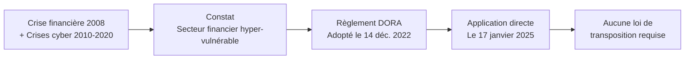
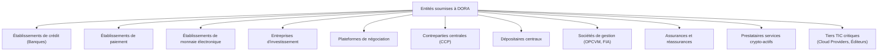
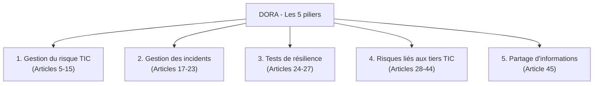
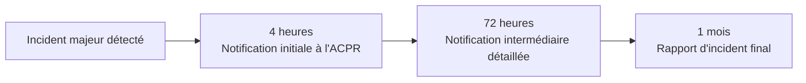
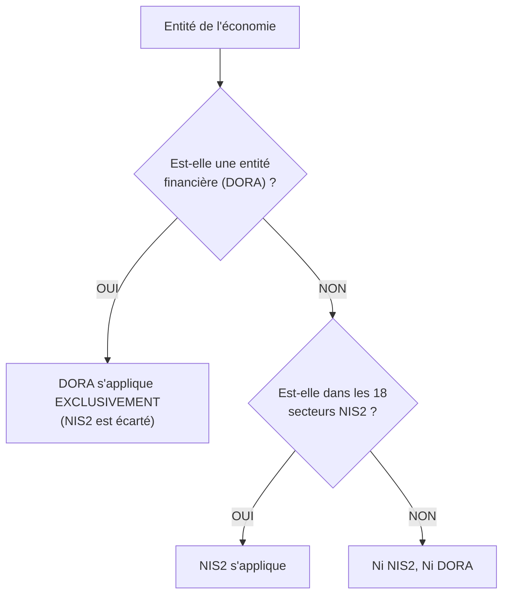
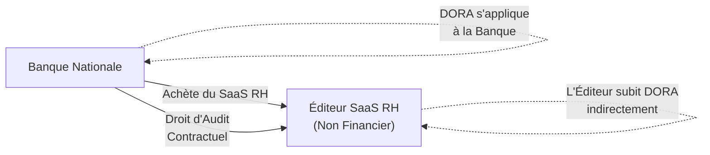
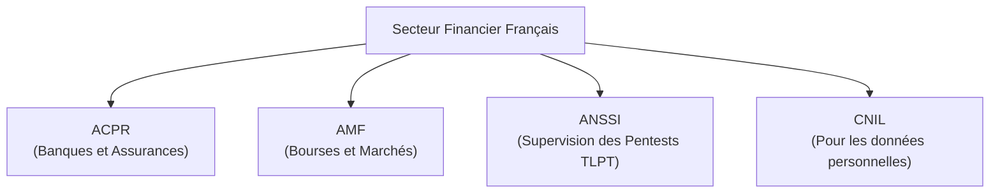

# DORA pour le secteur financier

!!! note "**Livrables :** _Cartographie des entités DORA, fiche d'articulation NIS2_"
!!! note "**Auto-explication :** _8 minutes_"

 

---

 

!!! quote "L'analogie de la centrale nucléaire et du réseau électrique"

    Le réseau électrique européen suit des règles générales de sécurité. Mais pour les centrales nucléaires, qui présentent un risque exceptionnel et une criticité systémique, on impose des règles supplémentaires plus strictes : Autorité de Sûreté Nucléaire dédiée, audits plus fréquents, obligations de continuité spécifiques, transparence renforcée. Le secteur financier européen est exactement dans cette situation. Il fait partie du cadre cybersécurité général (NIS2), mais son rôle systémique dans l'économie justifie un cadre spécial et prévalent : DORA. Pour vous, analyste forensic, comprendre DORA est essentiel si vous visez le marché bancaire et assurantiel, qui représente l'un des plus exigeants (et rémunérateurs) en France. C'est aussi un cadre qui modifie les obligations de vos clients quand ils sont eux-mêmes des prestataires de banques.

## Objectifs pédagogiques

!!! tip "À la fin de ce chapitre, vous serez capable de :"

    - Identifier le périmètre d'application de DORA (entités financières et tiers TIC).
    - Citer les 5 piliers structurants du règlement.
    - Distinguer DORA de NIS2 et savoir lequel s'applique en cas de chevauchement.
    - Identifier les autorités de tutelle françaises (ACPR, AMF).
    - Anticiper les opportunités forensic ouvertes par DORA.

 

---

 

## Contexte et architecture

### Naissance de DORA

Le **Digital Operational Resilience Act**, ou règlement UE 2022/2554, a été adopté le **14 décembre 2022** et est applicable depuis le **17 janvier 2025**. 

!!! danger "Directive vs Règlement"
    Contrairement à NIS2 qui est une "Directive" (nécessitant une loi de transposition nationale comme la "Loi Résilience" pour être applicable), DORA est un **règlement**. Il est **directement applicable** dans tous les États membres sans aucune transposition.

### Pourquoi un règlement spécifique à la finance ?

Trois caractéristiques uniques du secteur financier ont motivé ce cadre chirurgical :

| Caractéristique | Conséquence Sécuritaire |
|---|---|
| Interconnexion systémique | La chute d'une banque peut entraîner un effet domino mondial |
| Dépendance totale aux TIC | L'argent n'est plus physique : transactions, marchés, paiements sont purement numériques |
| Concentration des fournisseurs | Quelques Cloud Providers (AWS, Azure, GCP) servent toute l'industrie simultanément |

DORA répond à ces spécificités par un cadre **beaucoup plus prescriptif et contraignant** que NIS2.

### Périmètre d'application

DORA s'applique à environ **22 000 entités financières** dans l'Union européenne, **mais aussi à leurs prestataires TIC critiques**.

### Le statut de Prestataire TIC critique

DORA crée un statut révolutionnaire : **Prestataire TIC critique pour le secteur financier**. Ces prestataires (Cloud, hébergeurs, éditeurs SaaS) qui servent un grand nombre d'entités financières tombent sous la supervision **directe** des autorités européennes (EBA, ESMA, EIOPA).

> Exemples typiques de prestataires TIC critiques :

| Prestataire | Pourquoi est-il critique ? |
|---|---|
| AWS, Microsoft Azure, Google Cloud | Hébergent l'infrastructure des banques |
| Salesforce | CRM standard du secteur assurantiel |
| Éditeurs de Core Banking Systems | Moteurs centraux de l'activité bancaire |
| Réseau SWIFT | Monopole de fait sur la messagerie interbancaire |
| Bloomberg, Refinitiv | Fournisseurs de données de marché en temps réel |

 

---

 

## Les 5 piliers de DORA

DORA ne se contente pas de principes vagues, il est structuré autour de **5 piliers** couvrant l'intégralité du cycle de gestion du risque cyber.

### Pilier 1 - Gestion du risque TIC

Impose un cadre intégré de gouvernance du risque cyber **au niveau du conseil d'administration**.

| Obligation | Précision DORA |
|---|---|
| Cadre de gouvernance | Le CA (Conseil d'Administration) est civilement responsable |
| Politique de risque TIC | Document obligatoirement signé et révisé |
| Identification des actifs | Cartographie systématique des actifs critiques |
| Stratégie de continuité | PCA, PRA et exercices stricts |
| Rétroaction (Post-mortem) | Leçons tirées de chaque incident de sécurité |

### Pilier 2 - Gestion des incidents (La contrainte des 4 heures)

C'est là que le Forensic transpire : DORA impose un cadre de notification **beaucoup plus strict que le RGPD ou NIS2**.

> Comparatif des délais de notification :

| Étape de l'Alerte | Exigence DORA | Exigence NIS2 | Exigence RGPD |
|---|---|---|---|
| Notification Initiale | **4 heures** (Incidents majeurs) | 24 heures | - |
| Notification Détaillée | 72 heures | 72 heures | 72 heures |

!!! danger "Urgence Forensic"
    Vous avez 4 heures pour qu'une banque transmette à l'ACPR sa notification initiale. Votre diagnostic (Ransomware vs Panne matérielle simple) doit être quasi instantané.

### Pilier 3 - Tests de résilience (Le TLPT)

Impose des **tests réguliers** obligatoires, dont la fréquence varie selon la criticité de l'entité.

| Type de test imposé | Fréquence | Entités concernées |
|---|---|---|
| Tests de vulnérabilité et Pentests | Au moins annuels | Toutes |
| Exercices de continuité d'activité (PCA) | Annuels | Toutes |
| **TLPT** (Threat-Led Penetration Testing) | Tous les 3 ans | Entités systémiques et significatives |

!!! abstract "Qu'est-ce que le TLPT ?"
    Le TLPT (Test de Pénétration Fondé sur la Menace) est une simulation d'attaque grandeur nature (Red Teaming très avancé), pilotée par la Threat Intel, sur les systèmes de production, et supervisée par l'autorité de l'État (la Banque de France/ANSSI). C'est le graal du pentest.

### Pilier 4 - Gestion des risques liés aux tiers TIC

C'est un chapitre majeur qui révolutionne la sous-traitance. Les banques ne peuvent plus se contenter d'acheter un service Cloud, elles doivent l'auditer.

| Obligation envers le sous-traitant | Contenu pratique |
|---|---|
| Inventaire | Registre complet remis aux autorités |
| Contrats types | Insertion de clauses "DORA" obligatoires |
| **Audits sur place** | La banque a le droit d'envoyer des auditeurs (vous) physiquement chez le sous-traitant Cloud |
| Stratégies de sortie | Preuve qu'on peut quitter AWS pour Azure en cas de crise (Réversibilité) |

### Pilier 5 - Partage d'information

Encourage la création de réseaux de confiance (comme le FS-ISAC) pour le partage sécurisé d'IoC (Indicateurs de Compromission) et de tactiques d'attaquants entre concurrents financiers.

 

---

 

## Articulation DORA et NIS2

### Le principe de Lex Specialis

DORA agit comme **Lex Specialis** par rapport à NIS2 (qui est Lex Generalis). La règle de droit est simple : **Si une entité est couverte par DORA, alors NIS2 ne s'applique pas.**

> Tableau de synthèse des différences :

| Sujet de friction | La doctrine DORA (Secteur Financier) | La doctrine NIS2 (Secteur Général) |
|---|---|---|
| Base juridique | Règlement (Directement applicable) | Directive (Loi Résilience requise) |
| Délai de déclaration | **4 Heures** | 24 Heures |
| Tiers Informatiques | Les "Grands" Cloud Providers sont supervisés directement | Ils subissent un effet cascade contractuel |
| Red Teaming | Le TLPT est obligatoire | Le Pentest régulier suffit |
| Autorité de tutelle | ACPR & AMF | L'ANSSI |

### Cas complexe : Le Sous-traitant IT d'une Banque

Dans ce cas, l'éditeur de logiciel RH n'est pas une banque. Il est assujetti à NIS2. Mais parce qu'il travaille pour une banque, cette dernière va lui imposer les audits de sécurité drastiques dictés par DORA (Pilier 4).

 

---

 

## Les Autorités de tutelle en France

L'écosystème financier français possède ses propres "gendarmes".

### Le rôle de l'ACPR

L'**Autorité de Contrôle Prudentiel et de Résolution** (adossée à la Banque de France) est le gendarme des banques et assurances. C'est elle qui :
- Reçoit les fameuses notifications à 4 heures.
- Envoie ses inspecteurs auditer les systèmes d'information bancaires.
- Prononce de très lourdes sanctions (retrait d'agrément, amendes massives).

 

---

 

## Impact pour le marché Forensic

### Une manne financière

Le secteur bancaire/assurance en France représente des budgets cybersécurité qui écrasent le reste du marché. Les très grandes banques françaises dépensent entre **500 millions et 1 Milliard d'euros** par an en IT/Cyber.

### L'explosion de prestations spécifiques

| Type d'Expertise | Opportunité Commerciale DORA |
|---|---|
| Pentest avancé | La demande de Red Teaming explose pour simuler les TLPT. |
| Audits de Sous-traitance | Les banques vont mandater des cabinets pour aller auditer physiquement les Datacenters de leurs prestataires. |
| Réponse à Incident (DFIR) | La garantie d'une SLA d'intervention extrêmement courte pour respecter la fenêtre de 4 heures imposée par DORA. |

!!! info "La barrière à l'entrée"
    Travailler pour des entités DORA implique souvent pour vous (le cabinet Forensic) d'être vous-même certifié (ISO 27001, PASSI par l'ANSSI, ou PRIS). La confidentialité et l'astreinte 24/7 sont non-négociables.

 

---

 

## Pièges et bonnes pratiques

!!! failure "Piège 1 - Oublier les petites structures"
    DORA ne vise pas que la BNP ou la Société Générale. Les courtiers en assurance, les petites FinTechs de paiement, et les sociétés de gestion patrimoniales sont également assujettis. 

!!! failure "Piège 2 - Négliger la rapidité du diagnostic initial"
    En gestion de crise DORA, si vous mettez 6 heures à fournir une image disque et un premier verdict (Ransomware avéré ou non), votre client est déjà hors-la-loi vis-à-vis de l'ACPR (Délai de 4 heures dépassé).

!!! tip "1. Formatez vos rapports pour l'ACPR"
    Un rapport d'incident forensic destiné à une banque n'est pas lu que par le RSSI. Il sera transmis quasi-intégralement à l'ACPR. La forme, la rigueur, et l'explication des mesures de remédiation doivent être irréprochables juridiquement.

!!! tip "2. Devenez un auditeur 'Tiers TIC'"
    Une des plus belles opportunités est de se spécialiser dans l'audit des sous-traitants pour le compte des banques. C'est un marché récurrent (il faut ré-auditer régulièrement) et très bien budgété.

 

---

 

## Manipulation pratique - Exercices

### Exercice 1 - Qualification Juridique

> À quel régime (DORA ou NIS2) sont soumis les acteurs suivants ?

!!! quote "Solution"

    | Entité | Cadre Juridique | Justification |
    |---|---|---|
    | La mutuelle santé d'entreprise (300 salariés) | **DORA** | C'est une assurance. |
    | L'hôpital public régional (2000 salariés) | **NIS2** | C'est le secteur de la Santé. |
    | La startup de cryptomonnaies "CoinTrust" | **DORA** | Prestataire de services en crypto-actifs. |
    | Le constructeur automobile Renault | **NIS2** | Secteur Industrie/Fabrication. |
    | L'hébergeur français Scaleway | **NIS2 Direct** + **DORA Indirect** | S'il héberge des banques, il subira des audits DORA imposés par ses contrats bancaires. |

 

### Exercice 2 - La crise DORA en temps réel

Une plateforme de trading en ligne subit une attaque par déni de service distribué (DDoS) massive coupant l'accès de tous ses clients le Jeudi 10 juin.
**14h00 :** Le système de supervision (NOC) déclenche l'alerte de coupure de service.

> Établissez le calendrier maximal légal des notifications DORA.

!!! quote "Solution"

    | Échéance DORA (Deadline légale) | Action Réglementaire |
    |---|---|
    | Jeudi 10 juin - **18h00** | Envoi formel de la **Notification Initiale** à l'AMF (Il s'agit d'une plateforme boursière, non de l'ACPR). (Max 4 heures) |
    | Dimanche 13 juin - **14h00** | Envoi du **Rapport Intermédiaire** listant les Indicateurs de Compromission (IoC) et l'évolution de la crise. (Max 72 heures) |
    | Samedi 10 Juillet - **14h00** | Dépôt du **Rapport Forensic Final** détaillant l'attaque, les failles corrigées et le PCA appliqué. (Max 1 mois) |

 

---

 

## Auto-évaluation

!!! question "Testez vos connaissances"
    1. Que signifie l'acronyme DORA et de quel type de texte européen s'agit-il ?
    2. Quels sont les deux critères de l'économie financière ayant justifié un texte plus dur que NIS2 ?
    3. Quel nouveau statut DORA attribue-t-il aux grands Cloud Providers comme Microsoft ou AWS ?
    4. Citez les 3 jalons horaires stricts de notification d'incident sous DORA.
    5. Qu'est-ce qu'un test "TLPT" ?
    6. Une société d'investissement en bourse doit-elle appliquer le règlement NIS2 ?
    7. Quelle est l'autorité administrative française chargée de sanctionner les banques ?

> _Si le principe de "Lex Specialis" ou le délai des "4 heures" vous échappent, revoyez le tableau comparatif DORA/NIS2 : c'est la connaissance minimale requise pour aborder un RSSI bancaire._

 

---

 

## Synthèse mémo

!!! success "À retenir absolument"
    
    **DORA - Le Bouclier Financier Européen (2025)**
    
    **Le Concept (Lex Specialis) :**
    DORA est un **Règlement d'application directe** qui prime et remplace NIS2 pour l'intégralité du secteur financier (Banques, Assurances, Bourses, Crypto).
    
    **Les Tiers TIC Critiques :**
    La révolution de DORA est de soumettre les géants du Cloud (Prestataires TIC) et les éditeurs logiciels à des audits stricts imposés et réalisés par les banques elles-mêmes.
    
    **La Temporalité (Gestion des Incidents) :**
    Le cadre le plus brutal d'Europe :
    - **4 Heures** : Notification Initiale à l'ACPR.
    - **72 Heures** : Rapport Intermédiaire.
    - **1 Mois** : Rapport Forensic Final.
    
    **Le marché Forensic :**
    C'est le secteur le plus doté financièrement. DORA engendre un besoin massif d'auditeurs de la "Supply Chain IT" (pour aller contrôler les sous-traitants) et d'équipes DFIR (Digital Forensics and Incident Response) capables de diagnostiquer une attaque réseau en moins de 4 heures.

 

---

 

## Conclusion

!!! quote "Ce qu'il faut retenir"
    DORA entérine le fait que les banques ne sont plus de simples entreprises détenant de la valeur, mais de vastes infrastructures informatiques d'importance vitale. Un incident cyber dans ce secteur n'est plus vu comme un simple problème de confidentialité, mais comme un risque de faillite systémique. En tant qu'analyste forensic, si vous intervenez dans ce milieu, l'amateurisme, la lenteur et l'opacité sont proscrits. Les budgets de vos clients sont illimités, mais leurs attentes – et la surveillance de l'ACPR – le sont tout autant.

> [Chapitre suivant : 1.10 Cadre du pentest légal - Mandat, périmètre, NDA →](01-10-cadre-pentest-legal.md)
>
> [Retour à l'index →](./index.md)

 
