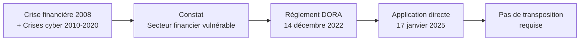
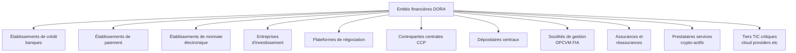
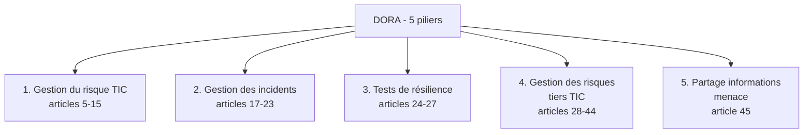
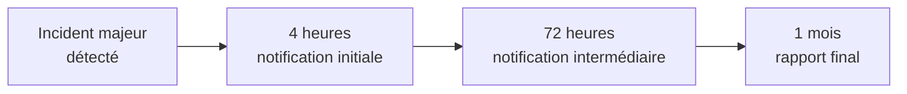
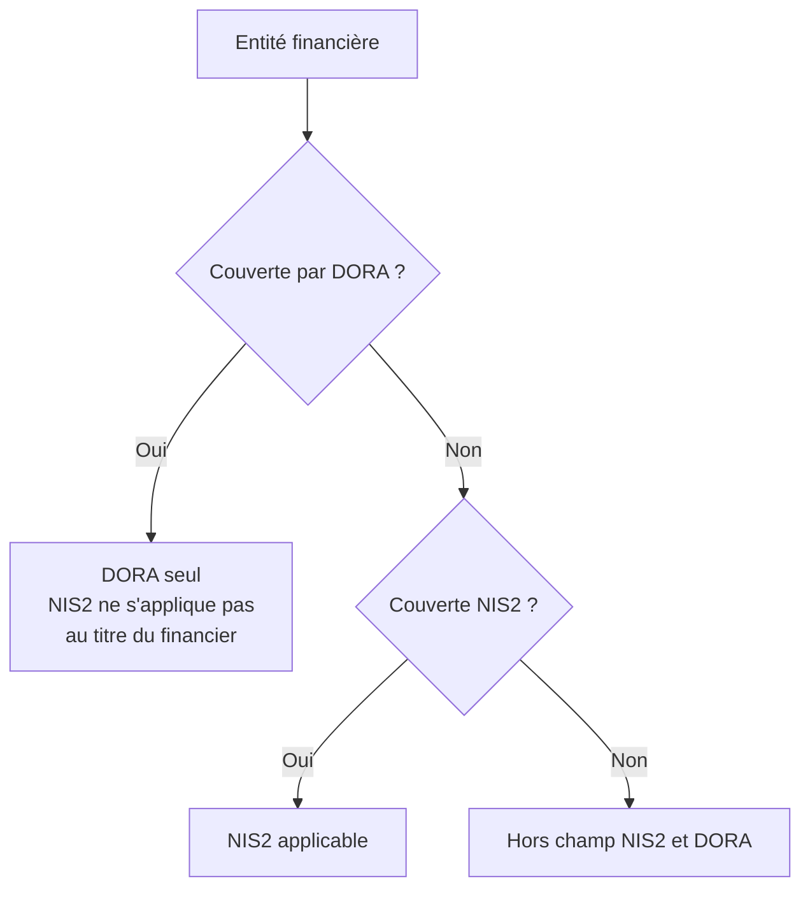
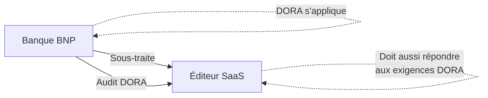
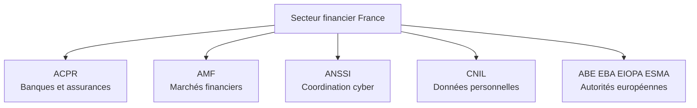

# 1.9 DORA pour le secteur financier

!!! quote "L'analogie de la centrale nucléaire et du réseau électrique"

    Le réseau électrique européen suit des règles générales de sécurité. Mais pour les centrales nucléaires, qui présentent un risque exceptionnel et une criticité systémique, on impose des règles supplémentaires plus strictes : Autorité de Sûreté Nucléaire dédiée, audits plus fréquents, obligations de continuité spécifiques, transparence renforcée. Le secteur financier européen est exactement dans cette situation. Il fait partie du cadre cybersécurité général (NIS2), mais son rôle systémique dans l'économie justifie un cadre spécial : DORA. Pour vous, analyste forensic, comprendre DORA est essentiel si vous visez le marché bancaire et assurantiel, qui représente l'un des plus rémunérateurs en France. C'est aussi un cadre qui modifie les obligations de vos clients quand ils sont eux-mêmes des prestataires de banques.

## Métadonnées du chapitre

| Champ | Valeur |
|---|---|
| Durée estimée | 1 heure |
| Niveau | Standard |
| Prérequis | Chapitres 1.1 à 1.8 |
| Livrables | Cartographie des entités DORA, fiche articulation NIS2 |
| Auto-explication | 8 minutes |

## Objectifs pédagogiques

À la fin de ce chapitre, vous serez capable de :

- Identifier le périmètre d'application de DORA (entités financières et tiers TIC).
- Citer les 5 piliers structurants du règlement.
- Distinguer DORA de NIS2 et savoir lequel s'applique en cas de chevauchement.
- Identifier les autorités de tutelle françaises (ACPR, AMF).
- Anticiper les opportunités forensic ouvertes par DORA.

---

## 1. Contexte et architecture

### 1.1 Naissance de DORA

Le **Digital Operational Resilience Act**, ou règlement UE 2022/2554, a été adopté le **14 décembre 2022** et est applicable depuis le **17 janvier 2025**. Contrairement à NIS2 qui est une directive (transposition nécessaire), DORA est un **règlement** : directement applicable sans transposition.



### 1.2 Pourquoi un règlement spécifique au financier

Trois caractéristiques du secteur financier ont motivé un cadre dédié :

| Caractéristique | Conséquence |
|---|---|
| Interconnexion systémique | Une banque qui tombe peut entraîner les autres |
| Dépendance massive aux TIC | Tout est numérique : transactions, marchés, paiements |
| Concentration des fournisseurs | Quelques cloud providers (AWS, Azure, GCP) servent toute l'industrie |

DORA répond à ces spécificités par un cadre **plus prescriptif** que NIS2.

### 1.3 Périmètre d'application

DORA s'applique à **environ 22 000 entités financières** dans l'Union européenne, plus à leurs **prestataires TIC critiques**.



### 1.4 Cas particulier des prestataires TIC critiques

DORA crée un statut spécifique : **prestataire TIC critique pour le secteur financier**. Ces prestataires (cloud, hébergeurs, éditeurs SaaS) servent un grand nombre d'entités financières et sont **directement supervisés** par les autorités européennes.

| Prestataire TIC critique | Pourquoi |
|---|---|
| AWS, Microsoft Azure, Google Cloud | Cloud massivement utilisé par banques |
| Salesforce | CRM standard du secteur |
| Editeurs core banking systems | Systèmes critiques |
| Réseaux SWIFT | Messagerie interbancaire |
| Bloomberg, Refinitiv | Données de marché |

---

## 2. Les 5 piliers de DORA

DORA est structuré autour de **5 piliers** qui couvrent l'intégralité du cycle de gestion du risque TIC.



### 2.1 Pilier 1 - Gestion du risque TIC

Articles 5 à 15. Impose un **cadre intégré** de gouvernance du risque cyber au niveau du conseil d'administration.

| Obligation | Contenu |
|---|---|
| Cadre de gouvernance | CA et direction responsables |
| Politique de gestion du risque TIC | Document signé, mis à jour |
| Identification des actifs critiques | Cartographie systématique |
| Mesures de protection | Comparable article 32 RGPD |
| Stratégie de continuité | PCA, PRA, exercices |
| Rétroaction et apprentissage | Post-mortem systématiques |

### 2.2 Pilier 2 - Gestion des incidents

Articles 17 à 23. Cadre **plus strict** que NIS2 sur les notifications.

| Élément | DORA | NIS2 |
|---|---|---|
| Détection | Procédures formalisées | Idem |
| Classification | Critères précis | Critères variables |
| Notification initiale | 4 heures (incidents majeurs) | 24 heures |
| Notification intermédiaire | 72 heures | 72 heures |
| Rapport final | 1 mois | 1 mois |



DORA est **plus exigeant** sur le délai de notification initial (4h vs 24h NIS2).

### 2.3 Pilier 3 - Tests de résilience

Articles 24 à 27. Impose des **tests réguliers** dont la fréquence varie selon la taille.

| Type de test | Fréquence | Entités concernées |
|---|---|---|
| Tests de pénétration | Au moins une fois par an | Toutes |
| TLPT (Threat-Led Penetration Testing) | Tous les 3 ans | Entités significatives |
| Exercices de continuité | Annuels | Toutes |
| Tests de basculement | Annuels | Toutes |

Le **TLPT** est une innovation majeure. Test piloté par la menace, réalisé par des prestataires qualifiés (en France, supervision ANSSI). Mimétique des attaques réelles.

### 2.4 Pilier 4 - Gestion des risques tiers TIC

Articles 28 à 44. C'est un **chapitre majeur** qui révolutionne la sous-traitance dans le secteur financier.

| Obligation | Contenu |
|---|---|
| Stratégie tiers TIC | Politique formalisée |
| Inventaire des prestataires | Registre complet |
| Concentration et substitution | Risque de concentration géré |
| Contrats types | Clauses obligatoires DORA |
| Audits sur place | Droit d'audit chez le prestataire |
| Stratégies de sortie | Plan en cas de défaillance |

Pour vous, **prestataire forensic**, vos contrats avec des clients financiers doivent inclure ces clauses. C'est une opportunité (cadre clair) et une contrainte (obligations supplémentaires).

### 2.5 Pilier 5 - Partage d'information

Article 45. Encourage le partage d'**informations sur les menaces** entre entités financières via des dispositifs sécurisés (FS-ISAC, plateformes nationales).

---

## 3. Articulation DORA et NIS2

### 3.1 Principe de lex specialis

DORA est **lex specialis** par rapport à NIS2. Cela signifie : si une entité est couverte par DORA, **DORA s'applique seul**, NIS2 ne s'applique pas.



### 3.2 Tableau comparatif

| Aspect | DORA | NIS2 |
|---|---|---|
| Type d'acte | Règlement | Directive |
| Application | Directe | Transposition nécessaire |
| Périmètre | Secteur financier | 18 secteurs |
| Notification initiale | 4 heures | 24 heures |
| Tiers critiques | Supervisés directement | Pas de régime spécifique |
| TLPT | Obligatoire entités significatives | Pas obligatoire |
| Sanctions | Variables États membres | Plafonds harmonisés |
| Autorité France | ACPR + AMF | ANSSI |

### 3.3 Cas pratique - Banque sous-traitant éditeur SaaS



L'éditeur SaaS qui sert la banque tombe sous **NIS2 directement** (s'il dépasse les seuils) **et** doit répondre aux exigences DORA via le contrat avec la banque (effet de cascade).

---

## 4. Autorités de tutelle en France

### 4.1 Cartographie



### 4.2 ACPR

L'**Autorité de Contrôle Prudentiel et de Résolution** est l'autorité française pour les banques et assurances. Elle :

- Supervise l'application de DORA en France
- Reçoit les notifications d'incidents DORA
- Conduit les contrôles
- Sanctionne en cas de manquement

### 4.3 AMF

L'**Autorité des Marchés Financiers** supervise les acteurs des marchés (sociétés de gestion, plateformes de négociation, prestataires crypto). Compétences DORA pour ces acteurs.

### 4.4 ANSSI - Coordination

L'ANSSI joue un rôle de **coordination cyber** transversal, et supervise spécifiquement les TLPT.

---

## 5. Impact pour le forensic

### 5.1 Marché ouvert

Le secteur financier français représente plusieurs milliers d'entités, dont environ 800 acteurs majeurs entrant dans DORA. Les budgets cyber sont **structurellement plus élevés** que dans les autres secteurs.

| Catégorie | Budget cyber annuel typique |
|---|---|
| Grande banque (BNP, SG, CA) | 500 M€ - 1 Md€ |
| Banque mutualiste régionale | 50-150 M€ |
| Compagnie d'assurance majeure | 100-300 M€ |
| FinTech | Variable selon taille |

### 5.2 Prestations forensic spécifiques DORA

| Prestation | Demande |
|---|---|
| Audit conformité DORA | Très demandé 2025-2027 |
| Réalisation TLPT | Marché de niche, qualifications requises |
| Forensic post-incident bancaire | Demande forte, urgences fréquentes |
| Investigation fraude financière | Croisement forensic + finance |
| Audit de sous-traitance TIC | Croissant avec exigences DORA |

### 5.3 Contraintes spécifiques

Travailler pour le secteur financier impose des contraintes supplémentaires :

| Contrainte | Implication |
|---|---|
| Habilitation préalable | Vérifications de probité parfois requises |
| Confidentialité renforcée | Données financières très sensibles |
| Disponibilité 24/7 | Astreinte permanente possible |
| Délais courts | 4h notification initiale impose réactivité |
| Audit du prestataire | Vous serez vous-même audité par votre client |

### 5.4 Qualifications utiles

| Qualification | Pertinence DORA |
|---|---|
| PASSI (Prestataire d'Audit de la Sécurité des SI) | Très utile, qualification ANSSI |
| TLPT qualifié | Nécessaire pour TLPT |
| ISO 27001 lead auditor | Apprécié |
| CISA, CISM | Apprécié dans le bancaire |
| EBA opérationnel | Niveau européen |

---

## 6. Pièges et bonnes pratiques

### Piège 1 - Penser que DORA ne concerne que les grandes banques

DORA s'applique aussi aux **petites entités** (FinTech, courtiers, sociétés de gestion modestes). Le seuil n'est pas la taille mais le statut réglementaire.

### Piège 2 - Sous-estimer la rigueur du délai de 4h

Pour un incident majeur, les **4 heures** sont implacables. Préparer en amont la procédure et les modèles de notification est indispensable.

### Piège 3 - Croire que NIS2 et DORA s'appliquent en même temps

Si DORA s'applique, NIS2 ne s'applique pas pour le même périmètre. Vérifiez systématiquement le statut réglementaire de votre client.

### Bonne pratique 1 - Étudier le ReCyF même pour DORA

Bien que conçu pour NIS2, le ReCyF de l'ANSSI est un excellent référentiel applicable aussi en partie pour DORA. Sa maîtrise sert sur les deux cadres.

### Bonne pratique 2 - Préparer les modèles de notification 4h

Pour des clients financiers, ayez un **modèle de notification ACPR à 4h** prêt à dégainer. C'est un différenciateur commercial fort.

### Bonne pratique 3 - Suivre l'EBA et l'AMF

L'**Autorité Bancaire Européenne** (EBA) publie régulièrement des standards techniques (RTS, ITS) qui précisent DORA. Veille indispensable.

---

## 7. Manipulation pratique

### Exercice 7.1 - Identification

| Entité | Couverture |
|---|---|
| BNP Paribas | DORA |
| Une mutuelle santé de 200 salariés | DORA (assurance) |
| Une FinTech de paiement de 20 salariés | DORA (établissement de paiement) |
| Une PME industrielle de 100 salariés | NIS2 si secteur listé |
| Un éditeur de logiciels bancaires | NIS2 + DORA via cascade contractuelle |
| Un cabinet comptable de 50 salariés | Hors DORA, hors NIS2 sauf cas |

### Exercice 7.2 - Procédure DORA

Une banque cliente vous appelle à 14h pour un incident majeur. Construisez la timeline.

| Temps | Action |
|---|---|
| 14h00 | Réception alerte client |
| 14h00 - 14h30 | Pré-qualification téléphonique |
| 14h30 - 15h00 | Mobilisation équipe, kit acquisition |
| 15h00 - 17h00 | Premières acquisitions sur site |
| 17h00 - 18h00 | Premières conclusions, alerter le client si majeur |
| 18h00 | Échéance ACPR notification initiale (si découverte 14h) |

Le délai de 4h est **très contraint**. Votre rapidité de pré-qualification est critique.

---

## 8. Auto-évaluation

| # | Question | Réponse attendue |
|---|---|---|
| 1 | Que signifie DORA ? | Digital Operational Resilience Act |
| 2 | Date d'application ? | 17 janvier 2025 |
| 3 | Type d'acte ? | Règlement UE 2022/2554, directement applicable |
| 4 | Combien de piliers ? | 5 |
| 5 | Délai de notification initiale ? | 4 heures pour incidents majeurs |
| 6 | Qu'est-ce qu'un TLPT ? | Threat-Led Penetration Testing |
| 7 | Articulation DORA / NIS2 ? | DORA est lex specialis, prime sur NIS2 |
| 8 | Autorité France ? | ACPR pour banques/assurances, AMF pour marchés |

---

## 9. Synthèse mémo

```text
DORA - Digital Operational Resilience Act

Cadre :
  Règlement UE 2022/2554 du 14 décembre 2022
  Application directe depuis le 17 janvier 2025

Périmètre :
  ~22 000 entités financières UE
  + tiers TIC critiques (cloud, etc.)

5 piliers :
  1. Gestion du risque TIC
  2. Gestion des incidents (4h - 72h - 1 mois)
  3. Tests de résilience (TLPT inclus)
  4. Gestion des risques tiers
  5. Partage d'information

Articulation :
  DORA = lex specialis
  NIS2 ne s'applique pas si DORA

Autorités France :
  ACPR (banques, assurances)
  AMF (marchés)
  ANSSI (coordination)

Marché OmnyVia :
  Budget cyber élevé
  Délais très courts
  Qualifications recommandées (PASSI, TLPT)
```

---

## 10. Pour aller plus loin

| Ressource | Type |
|---|---|
| Règlement UE 2022/2554 EUR-Lex | Texte original |
| ACPR - DORA | Autorité française |
| EBA - DORA technical standards | Autorité européenne |
| AMF - DORA marchés | Autorité marchés |
| FS-ISAC | Partage menaces secteur financier |

---

## 11. Auto-explication

Pour valider ce chapitre, enregistrez une vidéo de 8 minutes où vous expliquez :

1. Pourquoi DORA pour le financier (1 minute)
2. Les 5 piliers (3 minutes)
3. Le TLPT (1 minute)
4. Articulation DORA / NIS2 (1 minute)
5. Autorités françaises et marché OmnyVia (2 minutes)

---

**Chapitre précédent** : [1.8 RGPD - Focus articles 32, 33, 34](01-8-rgpd-articles-32-33-34.md)

**Chapitre suivant** : [1.10 Cadre du pentest légal - Mandat, périmètre, NDA](01-10-cadre-pentest-legal.md)
