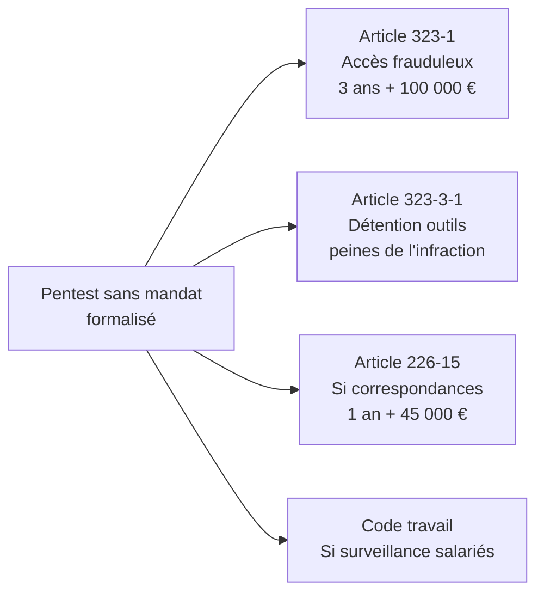
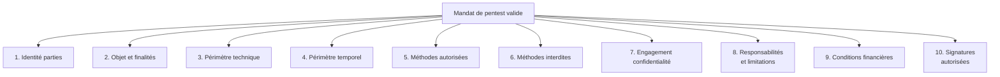
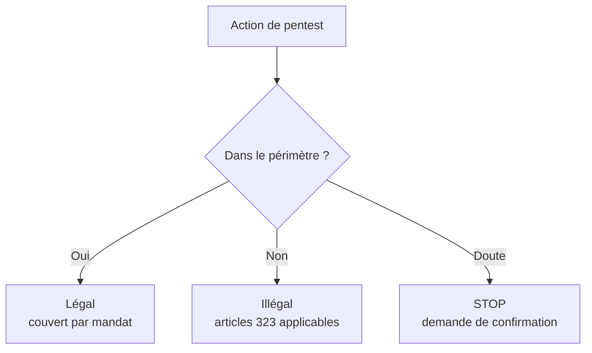
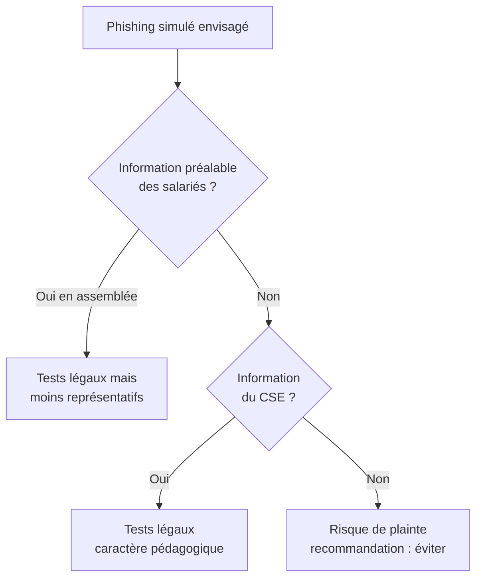
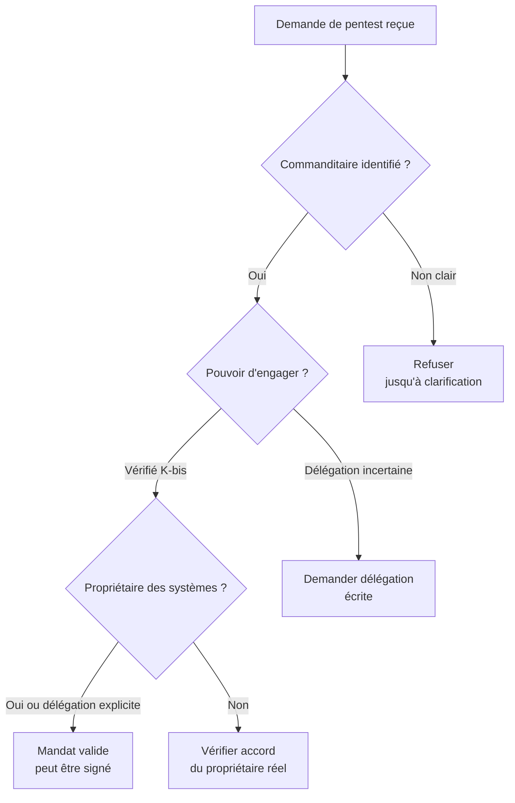
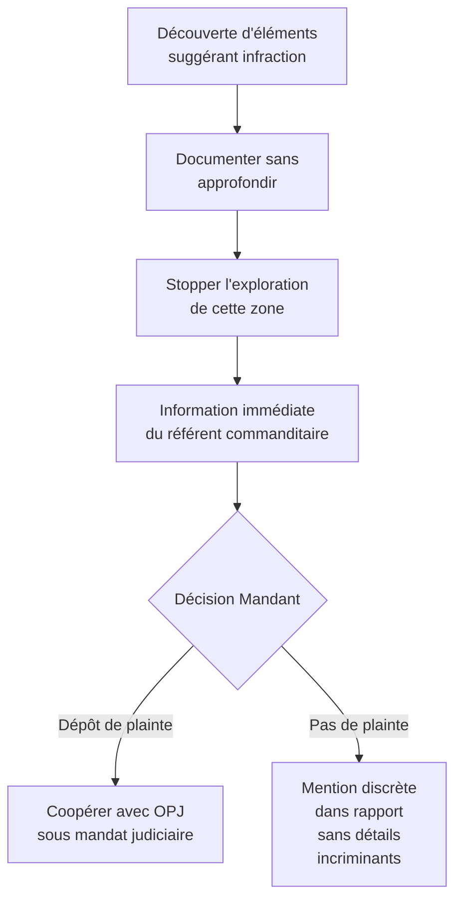

# 1.10 Cadre du pentest légal - Mandat, périmètre, NDA

!!! quote "L'analogie du serrurier-conseil"

    Quand un serrurier ouvre la porte d'une maison, son geste technique est rigoureusement identique que celui qui le fait pour aider un propriétaire enfermé dehors ou que celui qui le fait pour cambrioler. La différence absolue tient au cadre. Mandat verbal du propriétaire, témoin présent, facture émise, acte commercial. Sans ce cadre, le serrurier devient cambrioleur. Avec ce cadre, il est commerçant respectable. Le pentest et le forensic offensif obéissent à la même logique. Vos compétences techniques, vos outils, vos gestes seront identiques que vous exerciez légalement ou que vous tombiez dans l'illégalité. La différence absolue tient au cadre. Mandat écrit, périmètre défini, NDA signé, autorisation hiérarchique du commanditaire vérifiée. Ce chapitre vous apprend à construire ce cadre comme un professionnel, parce que sans ce cadre, vous n'êtes pas un consultant, vous êtes un attaquant.

## Métadonnées du chapitre

| Champ | Valeur |
|---|---|
| Durée estimée | 3 heures |
| Niveau | Exhaustif |
| Prérequis | Chapitres 1.1 à 1.9 |
| Livrables | Modèle de mandat de pentest, modèle de NDA, checklist de qualification |
| Auto-explication | 15 minutes |

## Objectifs pédagogiques

À la fin de ce chapitre, vous serez capable de :

- Identifier les composants obligatoires d'un mandat de pentest valide.
- Définir un périmètre rigoureux excluant tout risque de débordement.
- Rédiger un accord de confidentialité (NDA) protégeant les deux parties.
- Vérifier la légitimité du commanditaire (qui peut mandater quoi).
- Qualifier les responsabilités en cas d'incident pendant la prestation.
- Souscrire et utiliser une assurance responsabilité civile professionnelle adaptée.
- Gérer une situation de débordement de périmètre.

---

## 1. Pourquoi un cadre formalisé est indispensable

### 1.1 Le risque pénal personnel

Sans mandat formalisé, les articles 323-1 à 323-3-1 du Code pénal s'appliquent à votre activité. Vous êtes un attaquant comme un autre, juridiquement.



### 1.2 Pourquoi le cadre verbal ne suffit pas

Un mandat verbal "Allez-y, je vous autorise" est juridiquement **insuffisant**. Trois raisons.

| Raison | Conséquence |
|---|---|
| Charge de la preuve | Sans écrit, comment prouvez-vous l'autorisation ? |
| Périmètre flou | "Allez-y" ne précise rien : tout système ? toute donnée ? |
| Légitimité du commanditaire | Le commanditaire avait-il bien le droit d'autoriser ? |

### 1.3 Trois cas où votre cadre devient essentiel

**Cas 1 - Plainte du salarié**. Un salarié dont vous avez analysé le poste porte plainte. Sans mandat précisant le périmètre, vous êtes en cause sous 226-15 et 323-1.

**Cas 2 - Audit ANSSI ou CNIL**. Une autorité audite votre activité. Elle exige les preuves du cadre légal de chacune de vos missions. Pas de preuve = sanction.

**Cas 3 - Incident pendant le pentest**. Vous provoquez accidentellement un incident (crash de service, exfiltration involontaire). Sans contrat précisant les responsabilités, votre RC pro ne joue pas et votre patrimoine personnel est engagé.

---

## 2. Anatomie d'un mandat de pentest valide

### 2.1 Composants obligatoires

Un mandat de pentest légalement opposable doit comporter **dix éléments** au minimum.



### 2.2 Identité des parties (élément 1)

Doit identifier **précisément** :

| Partie | Informations |
|---|---|
| Le mandant | Raison sociale, SIRET, siège, représentant légal |
| Le mandataire (vous) | Raison sociale, SIRET, siège, représentant |

**Pièges à éviter** :

- Mandat signé par une personne **non habilitée** à engager l'entreprise
- Mandat où le mandant n'est pas **propriétaire** des systèmes ciblés (ex : prestataire IT qui n'a pas l'autorité du client final)

### 2.3 Objet et finalités (élément 2)

Doit décrire **précisément** ce que vous allez faire et **pourquoi**.

```text
Modèle :
"Le présent mandat a pour objet la réalisation d'un test d'intrusion
de type [boîte noire / grise / blanche] visant à évaluer la sécurité
des systèmes d'information du Mandant, dans le cadre d'une démarche
de mise en conformité [NIS2 / DORA / ISO 27001 / RGPD article 32]."
```

### 2.4 Périmètre technique (élément 3)

C'est l'**élément le plus critique**. Doit lister **explicitement** :

| Catégorie | Exemple |
|---|---|
| Adresses IP autorisées | 192.168.50.0/24, 10.10.0.0/16 |
| Domaines autorisés | artech.fr, *.artech.fr, api.artech.fr |
| Applications autorisées | Application X, API Y, intranet Z |
| Systèmes interdits | Serveurs partenaires, IP hors périmètre |
| Comptes test fournis | Comptes dédiés au pentest, pas comptes utilisateurs |

```text
Modèle de clause périmètre :

PÉRIMÈTRE AUTORISÉ
Le Prestataire est expressément autorisé à effectuer des tests sur :
- Les adresses IP suivantes : [LISTE EXHAUSTIVE]
- Les domaines suivants : [LISTE EXHAUSTIVE]
- L'application accessible à l'URL [URL PRÉCISE]

PÉRIMÈTRE EXCLU
Sont expressément exclus du périmètre, et ne doivent en aucun cas
faire l'objet de tests :
- Les systèmes hébergés chez les partenaires/sous-traitants du Mandant
- Les systèmes mobiles personnels (BYOD)
- Les systèmes hors de la liste explicite ci-dessus
- Les systèmes de production lors des heures ouvrées (10h-18h)

En cas de doute sur l'inclusion d'un système, le Prestataire s'engage
à interrompre immédiatement et à demander confirmation écrite avant
toute action.
```

### 2.5 Périmètre temporel (élément 4)

Définit **quand** vous pouvez agir.

| Élément | Précision |
|---|---|
| Date de début | DD/MM/YYYY HH:MM, fuseau horaire |
| Date de fin | DD/MM/YYYY HH:MM, fuseau horaire |
| Plages horaires autorisées | Ex : 22h-06h en semaine, week-end complet |
| Plages interdites | Ex : heures de production critiques |

**Cas particulier** : pour un pentest réaliste de type Red Team, certains tests doivent simuler des attaques réelles. Dans ce cas, le mandat peut autoriser des tests à toute heure mais dans une **fenêtre globale** précise.

### 2.6 Méthodes autorisées (élément 5)

Liste les techniques que le Prestataire peut employer.

| Catégorie | Exemples |
|---|---|
| Reconnaissance | OSINT, scan de ports, énumération |
| Exploitation | Exploitation de vulnérabilités, brute force |
| Post-exploitation | Escalade de privilèges, persistance simulée |
| Ingénierie sociale | Phishing limité avec liste de cibles validée |
| Tests physiques | Si autorisé explicitement |

### 2.7 Méthodes interdites (élément 6)

Tout aussi importante que la liste des méthodes autorisées. Liste classique :

| Méthode interdite | Raison |
|---|---|
| Déni de service réel | Risque opérationnel |
| Attaque sur production active | Risque business |
| Modification de données réelles | Risque intégrité |
| Suppression de logs | Empêche la détection légitime |
| Persistance permanente | Risque résiduel |
| Exfiltration de données réelles | Risque RGPD |
| Pivoting hors périmètre | Risque débordement |
| Phishing sans liste validée | Risque tiers |

### 2.8 Engagement de confidentialité (élément 7)

Renvoie au NDA (voir section 4) ou intègre les clauses directement.

### 2.9 Responsabilités et limitations (élément 8)

Définit qui est responsable de quoi en cas d'incident.

```text
Modèle de clause responsabilité :

RESPONSABILITÉS

8.1 Du Prestataire
Le Prestataire est responsable :
- De la conformité des outils utilisés au cadre du présent mandat ;
- De la non-divulgation des informations recueillies ;
- Du respect strict du périmètre défini.

8.2 Du Mandant
Le Mandant est responsable :
- De la disposition effective des systèmes inclus dans le périmètre ;
- De la mise à disposition des accès et comptes test convenus ;
- De l'information préalable des équipes opérationnelles concernées.

8.3 Limitation de responsabilité
La responsabilité du Prestataire est plafonnée à [montant], correspondant
à [X fois] le montant du présent contrat. Cette limitation ne s'applique
pas en cas de faute lourde ou intentionnelle.

8.4 Cas d'incident
En cas d'incident causé par le Prestataire pendant la mission, ce dernier
s'engage à :
- Interrompre immédiatement les tests ;
- Notifier le Mandant sans délai (référent désigné) ;
- Coopérer pleinement à la remise en état ;
- Documenter précisément l'incident.
```

### 2.10 Conditions financières (élément 9)

| Élément | Précision |
|---|---|
| Montant total | HT et TTC |
| Modalités de paiement | Acompte, échéances |
| Frais annexes | Déplacement, matériel spécifique |

### 2.11 Signatures autorisées (élément 10)

C'est un point souvent négligé mais juridiquement essentiel. Vérifiez que la personne qui signe a bien le **pouvoir d'engager** l'entreprise.

| Signataire | Pouvoir requis |
|---|---|
| Président / DG | Pouvoir général |
| Directeur de service | Délégation de pouvoir écrite |
| RSSI | Délégation spécifique cyber |
| DSI | Délégation IT |
| Sous-traitant IT | **Insuffisant** sauf délégation explicite du client final |

---

## 3. Le périmètre - Pierre angulaire de votre protection

### 3.1 Pourquoi le périmètre est si important

Le périmètre est ce qui **sépare le légal de l'illégal**. Toute action **dans le périmètre** est couverte par le mandat. Toute action **hors périmètre** vous expose pleinement à la loi pénale.



### 3.2 La règle d'or : explicite > implicite

Tout doit être **explicitement** listé. Une formulation comme "tous les systèmes de l'entreprise" est **dangereuse** :

- Couvre-t-elle les systèmes hébergés chez un cloud provider ?
- Inclut-elle les systèmes des sous-traitants ?
- Englobe-t-elle les BYOD des salariés ?

### 3.3 Cas particulier des sous-traitants

Si une partie du SI est hébergée chez un tiers (cloud, hébergeur), le mandat doit explicitement :

- Soit **inclure** ces systèmes avec accord écrit du tiers
- Soit **exclure** ces systèmes du périmètre

### 3.4 Cas particulier de l'ingénierie sociale

Le phishing simulé est délicat. Il implique des **personnes physiques** (les salariés cibles) qui n'ont pas signé le mandat.



**Bonnes pratiques** :

- Information du CSE en amont
- Liste de cibles validée par RH et direction
- Pas de pression psychologique excessive
- Restitution pédagogique aux salariés piégés
- Pas de retombée RH négative pour les piégés

### 3.5 Cas du périmètre non strict

Pour les Red Teams, on cherche du réalisme. Le périmètre peut être plus large mais doit rester contrôlé. Modèle :

```text
PÉRIMÈTRE ÉLARGI - RED TEAM

Le Mandant autorise expressément le Prestataire à mener des tests sur :
- Toutes les surfaces d'attaque externes du domaine artech.fr
- Tous les systèmes internes accessibles depuis ces surfaces

Sont **exclus** explicitement :
- Tout système hébergé hors France/UE
- Toute donnée personnelle d'employé non-anonymisée
- Toute action irréversible sur les systèmes de production

Le Prestataire s'engage à :
- Tenir un journal d'actions horodaté ;
- Disposer en permanence d'un référent joignable côté Mandant ;
- Cesser toute action en cas de détection par les équipes blue team.
```

---

## 4. Le NDA - Accord de confidentialité

### 4.1 Pourquoi un NDA distinct du mandat

Le **Non-Disclosure Agreement** peut être :

- **Inclus** dans le mandat (clause spécifique)
- **Distinct** du mandat (document séparé)

Avantages du NDA distinct :

| Avantage | Précision |
|---|---|
| Survit au mandat | Confidentialité après fin de mission |
| Échangeable en amont | Permet discussions avant signature mandat |
| Réutilisable | Cadre standard pour différents clients |
| Plus contraignant | Mention spécifique des sanctions |

### 4.2 Composants d'un NDA solide

| Composant | Contenu |
|---|---|
| Identification parties | Comme mandat |
| Définition information confidentielle | Très large, inclusion explicite |
| Obligation de non-divulgation | Tiers, salariés, sous-traitants |
| Obligation de non-utilisation | Au-delà de la mission |
| Durée | 5 à 10 ans typiquement |
| Sanctions | Pénalités forfaitaires + dommages-intérêts |
| Restitution / destruction | Documents, données, accès |
| Loi applicable | Droit français, juridiction Paris |

### 4.3 Modèle de NDA

```text
ACCORD DE CONFIDENTIALITÉ - NDA
================================

Entre :
[OmnyVia], représentée par Alain GUILLON, ci-après "le Prestataire"

Et :
[ARTECH SAS], représentée par [Nom], ci-après "le Mandant"

Article 1 - Objet
Le présent accord a pour objet de protéger les Informations Confidentielles
échangées entre les Parties dans le cadre de la mission décrite dans le
mandat de pentest référencé [REF] du DD/MM/AAAA.

Article 2 - Définition des Informations Confidentielles
Sont considérées comme confidentielles toutes informations, sous quelque
forme que ce soit (orale, écrite, numérique, visuelle), échangées entre
les Parties, incluant notamment et sans limitation :

a) Informations techniques : architecture SI, configurations, code source,
   identifiants, vulnérabilités découvertes, logs, captures, données ;

b) Informations commerciales : clients, contrats, tarifs, marges, stratégie ;

c) Informations RH : organigramme, contrats, données de paie ;

d) Informations stratégiques : projets, partenariats, brevets, savoir-faire.

Article 3 - Engagements du Prestataire
Le Prestataire s'engage à :

3.1 Ne pas divulguer les Informations Confidentielles à des tiers, sauf :
    - À ses propres salariés strictement nécessaires à la mission, soumis
      à un engagement de confidentialité au moins équivalent ;
    - Sur réquisition judiciaire après notification préalable du Mandant
      lorsque cela est légalement possible.

3.2 Ne pas utiliser les Informations Confidentielles à d'autres fins que
    l'exécution du mandat.

3.3 Mettre en œuvre des mesures de sécurité appropriées (chiffrement,
    accès restreint) pour protéger les Informations Confidentielles dans
    ses propres systèmes.

3.4 Restituer ou détruire toutes les Informations Confidentielles à la
    fin de la mission, à l'option du Mandant, dans un délai de 30 jours.

Article 4 - Durée
Les obligations de confidentialité du présent accord s'appliquent pendant
toute la durée de la mission et pendant 7 ans après son terme, indépendamment
de la cause de cessation de la mission.

Article 5 - Sanctions
En cas de violation du présent accord, le Prestataire s'expose :

5.1 À une pénalité forfaitaire de 100 000 € par violation constatée,
    indépendamment des dommages-intérêts complémentaires.

5.2 À l'engagement de sa responsabilité civile et pénale.

5.3 À la rupture immédiate du mandat sans préavis ni indemnité.

Article 6 - Loi applicable et juridiction
Le présent accord est soumis au droit français. Tout litige relève de la
compétence exclusive du Tribunal de Commerce de Paris.

Article 7 - Dispositions diverses
7.1 Le présent accord constitue l'intégralité de l'accord entre les Parties
    sur la confidentialité et annule tout accord antérieur de même nature.

7.2 Toute modification du présent accord doit faire l'objet d'un avenant
    écrit signé par les deux Parties.

Fait en deux exemplaires originaux, le DD/MM/AAAA

Pour le Prestataire                  Pour le Mandant
Alain GUILLON                        [Nom]
[Signature]                          [Signature]
```

### 4.4 Pièges sur les NDA

**Piège 1 - NDA unilatéral**. Vérifiez que les obligations de confidentialité s'appliquent **aux deux parties**. Vous échangez aussi des informations confidentielles (méthodologies, outils internes).

**Piège 2 - Durée trop courte**. Une durée de 1 ou 2 ans est insuffisante pour des informations sensibles. **5 à 10 ans** est la norme professionnelle.

**Piège 3 - Sanctions illusoires**. Une pénalité forfaitaire de 1 000 € n'a aucun effet dissuasif. **Préférez 50 000 à 200 000 €** selon le secteur.

**Piège 4 - Clause de loi étrangère**. Si votre client est étranger, ne signez pas un NDA soumis au droit californien ou anglais sans conseil juridique.

---

## 5. La vérification du commanditaire

### 5.1 Question fondamentale

**Qui peut légitimement vous mandater pour pentester un système ?**

Réponse simple : **uniquement le propriétaire ou son représentant dûment habilité**.

### 5.2 Cas typiques de problème

| Cas | Problème |
|---|---|
| Un sysadmin vous mandate sans direction | Pas habilité à engager l'entreprise |
| Un prestataire IT externe vous mandate | Pas propriétaire, devra produire son propre mandat |
| Un dirigeant vous mandate sur des systèmes en SaaS | Le SaaS appartient au tiers, pas au client |
| Un dirigeant vous mandate sur la "messagerie de l'entreprise" | Si Gmail Workspace, mandat insuffisant face à Google |
| Un dirigeant vous mandate sur les BYOD des salariés | Les salariés sont propriétaires de leur matériel |

### 5.3 Procédure de vérification



### 5.4 Documents à exiger

| Document | Pourquoi |
|---|---|
| K-bis du Mandant | Vérification de l'existence légale et du représentant légal |
| Statuts de la société | Pouvoirs des dirigeants |
| Délégation de pouvoir | Si non signé par DG ou Président |
| Justificatif propriété systèmes | Si systèmes hébergés tiers |
| Pièce d'identité du signataire | Authentification |

---

## 6. Assurance Responsabilité Civile Professionnelle

### 6.1 Pourquoi une RC pro spécifique cyber

Une RC pro classique **ne couvre pas** les activités cyber offensives. Vous devez souscrire une **police spécifique** mentionnant explicitement :

- Tests d'intrusion
- Audits de sécurité
- Forensic et investigation numérique
- Ingénierie sociale contrôlée

### 6.2 Garanties à exiger

| Garantie | Plafond minimum recommandé |
|---|---|
| Dommages matériels causés au client | 500 000 € |
| Dommages immatériels (perte d'exploitation) | 1 000 000 € |
| Atteinte aux données | 500 000 € |
| Frais de défense en cas de plainte | 100 000 € |
| Cybercrise (rançongiciel pendant mission) | 250 000 € |

### 6.3 Assureurs spécialisés en France

Sans recommander un acteur spécifique, plusieurs assureurs proposent des polices RC pro cyber adaptées :

- AIG Cyber Edge
- Hiscox CyberClear
- Beazley Cyber & Tech
- AXA Cyber Risk
- Generali Cyber

Tarifs indicatifs : **800 à 3 000 €/an** pour un consultant indépendant, selon plafonds et antécédents.

### 6.4 Vérifier l'effectivité

Avant chaque mission, vérifiez :

| Point | Action |
|---|---|
| Police en cours de validité | Date d'échéance |
| Activité couverte | Lecture précise des exclusions |
| Plafond suffisant | Comparer au risque de la mission |
| Géographie couverte | France, UE, monde |

---

## 7. Gestion des situations exceptionnelles

### 7.1 Découverte d'une faille critique

Pendant la mission, vous découvrez une faille permettant un accès massif à des données sensibles. Que faire ?

| Étape | Action |
|---|---|
| 1 | **Stop** : ne pas exploiter au-delà de la preuve de concept |
| 2 | Notifier immédiatement le référent désigné côté Mandant |
| 3 | Documenter précisément la faille (sans exfiltration) |
| 4 | Coordonner avec le Mandant la suite (correctif, communication) |
| 5 | Inclure dans le rapport final avec criticité maximale |

### 7.2 Découverte d'une infraction

Vous découvrez pendant le pentest des éléments suggérant une **infraction commise par un salarié** (détournement, espionnage industriel). Que faire ?

C'est une situation juridiquement complexe. Procédure recommandée :



**Risque à éviter** : approfondir l'investigation de l'infraction sans cadre judiciaire vous expose sous 226-15 et 323-1.

### 7.3 Débordement accidentel

Vous avez accidentellement attaqué un système hors périmètre (faute de scoping, IP mal lue, etc.).

| Étape | Action |
|---|---|
| 1 | Stop immédiat |
| 2 | Notification écrite au Mandant **et** au propriétaire du système touché |
| 3 | Documentation factuelle de l'incident |
| 4 | Coopération à la remise en état |
| 5 | Notification à votre assureur RC pro |
| 6 | Suspension de la mission jusqu'à clarification |

La transparence rapide limite les conséquences. La dissimulation aggrave gravement.

### 7.4 Demande de poursuite hors mandat

Le Mandant vous demande pendant la mission "puisque vous y êtes, regardez aussi le poste de [autre salarié]".

**Réponse type** : "Cette demande sort du périmètre du mandat actuel. Je peux la traiter si vous me transmettez un avenant écrit signé par [niveau hiérarchique requis]."

**Ne cédez jamais à la pression orale**. L'avenant écrit prend 30 minutes à signer. Sans avenant, vous êtes hors cadre.

---

## 8. Cas particulier - Travailler pour soi

Si OmnyVia veut tester sa propre infrastructure (vos serveurs, vos sites), **vous êtes votre propre Mandant**.

| Action | Recommandation |
|---|---|
| Documenter l'autorisation | Procès-verbal d'auto-mandat |
| Périmètre clair | Comme pour un client externe |
| Calendrier | Comme pour un client externe |
| Conservation traces | Pour antécédents |

C'est un exercice utile : pratiquer sur soi-même est légal, formateur et sans risque pénal tant que c'est documenté.

---

## 9. Pièges et bonnes pratiques

### Piège 1 - Mandat "global" annuel

Certains clients proposent un mandat annuel "couvrant tous les pentests de l'année". **Refusez**. Chaque mission doit avoir son propre mandat avec périmètre temporel et technique précis.

### Piège 2 - Mandat oral confirmé "par email"

Un email simple ne vaut pas mandat. Exigez un **document signé** sur papier ou avec signature électronique qualifiée.

### Piège 3 - Mandat signé par le bon contact mais mauvais titulaire

Vérifiez le **K-bis**. Le DSI peut signer si délégation explicite. Sans délégation, seul le DG peut.

### Bonne pratique 1 - Templates rigoureux

Maintenez à jour des templates de mandat et NDA. Modifiez-les pour chaque mission, ne réutilisez jamais sans relecture.

### Bonne pratique 2 - Conservation 10 ans

Conservez tous vos mandats et NDA pendant **10 ans minimum** dans un coffre-fort numérique. La prescription pénale en cybercriminalité est de 6 ans, plus le temps d'enquête.

### Bonne pratique 3 - Avenant facile

Préparez un modèle d'avenant simple. Quand un client veut élargir le périmètre, vous le sortez immédiatement. Cela rassure le client et vous protège.

---

## 10. Manipulation pratique

### Exercice 10.1 - Auditer un mandat

On vous présente le mandat suivant :

> *"Je, soussigné M. Dupont, autorise la société OmnyVia à effectuer un test de sécurité sur les systèmes de notre entreprise pendant le mois de mars. Cordialement."*

Listez **toutes les insuffisances** :

| Insuffisance | Gravité |
|---|---|
| Identification incomplète des parties (raison sociale, SIRET) | Critique |
| Pouvoir du signataire non vérifiable | Critique |
| Périmètre technique non défini | Critique |
| Périmètre temporel imprécis (quel mois ? Quelles heures ?) | Élevée |
| Méthodes autorisées non listées | Élevée |
| Méthodes interdites non listées | Élevée |
| Confidentialité absente | Élevée |
| Responsabilités non définies | Élevée |
| Conditions financières absentes | Modérée |
| Aucune clause d'avenant | Modérée |

Ce "mandat" est **inopposable** et vous expose pleinement aux articles 323.

### Exercice 10.2 - Construction de mandat

Construisez le mandat type pour une mission ARTECH (ressources fournies dans le scénario fil rouge).

```text
MANDAT DE TEST D'INTRUSION - REF MND-2026-001
=================================================

ENTRE LES SOUSSIGNÉS

ARTECH SAS, société par actions simplifiée au capital de 250 000 €, dont
le siège social est situé [adresse Lyon], immatriculée au RCS de Lyon
sous le numéro [SIRET], représentée par Mme Hélène LEFEBVRE, agissant en
qualité de Directrice Générale, dûment habilitée aux fins des présentes,

Ci-après dénommée "le Mandant", d'une part,

ET

OMNYVIA, [forme juridique] au capital de [montant], dont le siège est
situé [adresse], immatriculée au RCS de [ville] sous le numéro [SIRET],
représentée par M. Alain GUILLON, agissant en qualité de [fonction],

Ci-après dénommée "le Prestataire", d'autre part,

Il a été convenu ce qui suit :

ARTICLE 1 - OBJET
Le Mandant confie au Prestataire, qui accepte, la réalisation d'un test
d'intrusion de type boîte grise visant à évaluer la sécurité du système
d'information du Mandant dans le cadre de sa démarche de mise en
conformité avec le Règlement (UE) 2022/2555 (NIS2) et le RGPD article 32.

ARTICLE 2 - PÉRIMÈTRE TECHNIQUE
2.1 Inclus dans le périmètre :
- Réseau Wi-Fi ARTECH-WIFI (BSSID XX:XX:XX:XX:XX:XX)
- Réseau interne 192.168.50.0/24
- Serveur Linux 192.168.50.10 (services SSH, Samba, intranet)
- Postes utilisateurs Windows 11 (deux postes test fournis)
- Application interne accessible sur https://intranet.artech.local

2.2 Exclus du périmètre :
- Tous systèmes non listés en 2.1
- Systèmes hébergés chez des tiers (cloud, SaaS)
- Téléphones mobiles personnels et BYOD
- Systèmes des partenaires commerciaux

ARTICLE 3 - PÉRIMÈTRE TEMPOREL
La mission s'exécute du 15/06/2026 09:00 au 26/06/2026 18:00 (heure de
Paris). Les tests à fort impact seront réalisés en dehors des heures
ouvrées (18h-09h en semaine, week-end complet).

ARTICLE 4 - MÉTHODES AUTORISÉES
Reconnaissance OSINT, scan de ports et services, énumération, exploitation
de vulnérabilités, brute force avec dictionnaires, ingénierie sociale
limitée à une simulation phishing avec liste de cibles validée par le DG.

ARTICLE 5 - MÉTHODES INTERDITES
Déni de service réel, suppression de données, suppression de logs,
modification de configurations critiques, exfiltration de données réelles
non strictement nécessaires à la preuve de concept, persistance permanente.

ARTICLE 6 - CONFIDENTIALITÉ
Les obligations de confidentialité sont régies par le NDA distinct référencé
NDA-2026-001 signé entre les Parties le DD/MM/2026.

ARTICLE 7 - LIVRABLES
Le Prestataire fournit au Mandant un rapport détaillé incluant :
- Synthèse exécutive (5 pages)
- Méthodologie employée
- Vulnérabilités identifiées avec criticité (CVSS 4.0)
- Captures et preuves
- Recommandations correctives priorisées
- Glossaire pour non-techniques

ARTICLE 8 - RESPONSABILITÉS
[Clauses standards]

ARTICLE 9 - CONDITIONS FINANCIÈRES
Montant total HT : 25 000 €. TVA 20% : 5 000 €. Total TTC : 30 000 €.
Modalités : 30% à signature, 70% à livraison du rapport final.

ARTICLE 10 - SIGNATURES
Fait en deux exemplaires originaux, le DD/MM/2026

Pour le Mandant                       Pour le Prestataire
Hélène LEFEBVRE                       Alain GUILLON
Directrice Générale                   [Fonction]
[Signature + cachet]                  [Signature + cachet]
```

### Exercice 10.3 - Réactions à des situations

| Situation | Réponse correcte |
|---|---|
| Le DSI vous mandate verbalement pendant un déjeuner pour pentester un nouveau service | Demander un mandat écrit en bonne et due forme |
| Un client veut un mandat couvrant "toutes les filiales du groupe" | Refuser, exiger un mandat par filiale (chacune est une entité juridique distincte) |
| Pendant le pentest, vous trouvez une preuve de fraude interne | Documenter sans approfondir, notifier le commanditaire, suivre sa décision |
| Le client demande oralement d'élargir le périmètre | Préparer un avenant et le faire signer avant toute action |
| Vous causez accidentellement un crash | Stop, notifier, documenter, coopérer à la remise en état, prévenir l'assureur |

---

## 11. Auto-évaluation

| # | Question | Réponse attendue |
|---|---|---|
| 1 | Pourquoi un mandat écrit est-il indispensable ? | Sans écrit, articles 323 applicables, charge de la preuve |
| 2 | Combien d'éléments minimum dans un mandat valide ? | 10 |
| 3 | Qui peut légitimement vous mandater ? | Le propriétaire ou son représentant dûment habilité |
| 4 | Durée recommandée d'un NDA ? | 5 à 10 ans après fin de mission |
| 5 | Plafond RC pro recommandé ? | 1 M€ minimum pour dommages immatériels |
| 6 | Que faire en cas de débordement accidentel ? | Stop, notification, documentation, RC pro |
| 7 | Quel risque pour le pentester sans mandat ? | Articles 323, jusqu'à 5 ans + 150 000 € |
| 8 | Pourquoi le mandat doit lister méthodes interdites ? | Limiter le périmètre, éviter responsabilité disproportionnée |

---

## 12. Synthèse mémo

```text
CADRE DU PENTEST LÉGAL

OBLIGATOIRE :
1. Mandat écrit signé
2. NDA distinct ou intégré
3. RC pro cyber adaptée
4. Vérification commanditaire (K-bis)

MANDAT - 10 éléments :
1. Identité parties
2. Objet et finalités
3. Périmètre technique (explicite)
4. Périmètre temporel
5. Méthodes autorisées
6. Méthodes interdites
7. Confidentialité (renvoi NDA)
8. Responsabilités
9. Conditions financières
10. Signatures autorisées

PIÈGES :
- Mandat oral
- "Tous les systèmes"
- Signataire non habilité
- Pas de méthodes interdites
- Durée NDA trop courte

EN CAS D'INCIDENT :
Stop → Notifier → Documenter → Coopérer → Assureur

VOTRE PROTECTION = LE CADRE
```

---

## 13. Pour aller plus loin

| Ressource | Type |
|---|---|
| Guide ANSSI - Méthodologie audits sécurité | Référentiel officiel |
| Référentiel PASSI | Qualification ANSSI |
| Modèles AFCDP - DPO | Modèles juridiques |
| Cabinet Lexing - Veille pentest | Suivi juridique |
| OWASP Pentest Guide | Méthodologie technique |

---

## 14. Auto-explication

Pour valider ce chapitre, enregistrez une vidéo de 15 minutes où vous expliquez :

1. Pourquoi le cadre formalisé est vital (1 minute)
2. Les 10 éléments du mandat (3 minutes)
3. L'importance du périmètre explicite (2 minutes)
4. Le NDA et ses spécificités (2 minutes)
5. La vérification du commanditaire (2 minutes)
6. La RC pro adaptée (1 minute)
7. La gestion des incidents pendant la mission (2 minutes)
8. Synthèse pratique (2 minutes)

---

**Chapitre précédent** : [1.9 DORA pour le secteur financier](01-9-dora.md)

**Chapitre suivant** : [1.11 Étude affaire Bluetouff (2013-2015)](01-11-affaire-bluetouff.md)
