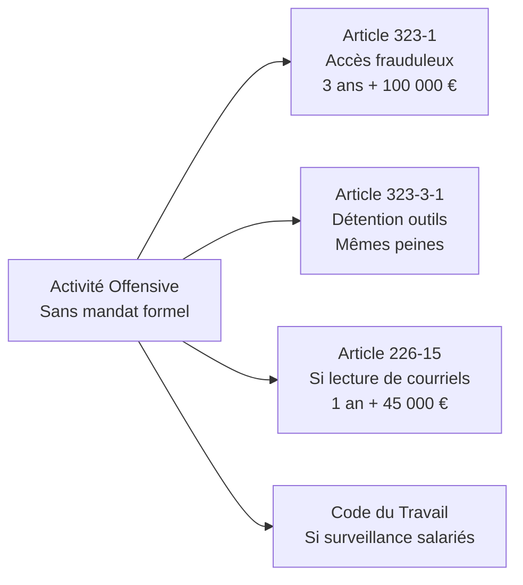
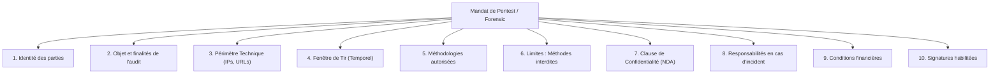
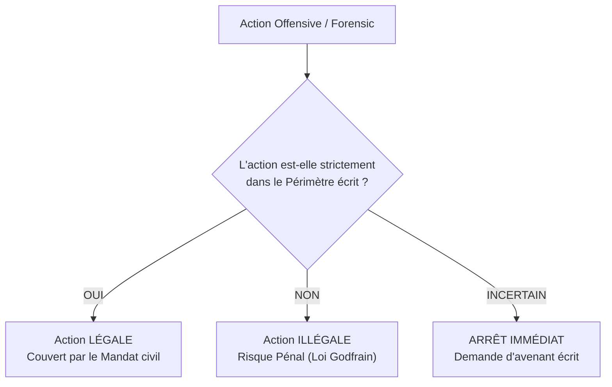
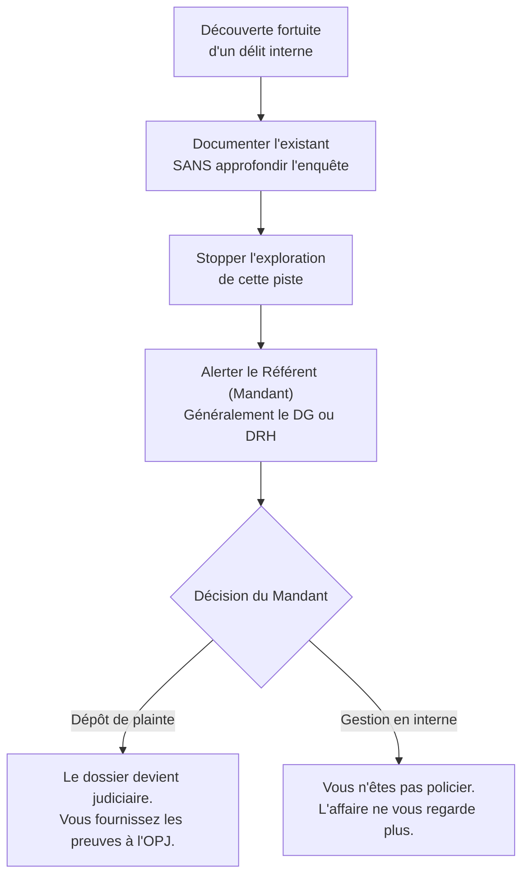

# Cadre du pentest légal - Mandat, périmètre, NDA

!!! note "**Livrables :** _Modèle de mandat de pentest, modèle de NDA, checklist de qualification_"
!!! note "**Auto-explication :** _15 minutes_"

 

---

 

!!! quote "L'analogie du serrurier-conseil"

    Quand un serrurier ouvre la porte d'une maison, son geste technique est rigoureusement identique que celui qui le fait pour aider un propriétaire enfermé dehors ou que celui qui le fait pour cambrioler. La différence absolue tient au cadre. Mandat verbal du propriétaire, témoin présent, facture émise, acte commercial. Sans ce cadre, le serrurier devient cambrioleur. Avec ce cadre, il est commerçant respectable. Le pentest et le forensic offensif obéissent à la même logique. Vos compétences techniques, vos outils, vos gestes seront identiques que vous exerciez légalement ou que vous tombiez dans l'illégalité. La différence absolue tient au cadre. Mandat écrit, périmètre défini, NDA signé, autorisation hiérarchique du commanditaire vérifiée. Ce chapitre vous apprend à construire ce cadre comme un professionnel, parce que sans ce cadre, vous n'êtes pas un consultant, vous êtes un attaquant.

## Objectifs pédagogiques

!!! tip "À la fin de ce chapitre, vous serez capable de :"

    - Identifier les composants obligatoires d'un mandat de pentest valide.
    - Définir un périmètre rigoureux excluant tout risque de débordement.
    - Rédiger un accord de confidentialité (NDA) protégeant les deux parties.
    - Vérifier la légitimité du commanditaire (qui peut mandater quoi).
    - Qualifier les responsabilités en cas d'incident pendant la prestation.
    - Souscrire et utiliser une assurance responsabilité civile professionnelle adaptée.
    - Gérer une situation de débordement de périmètre ou la découverte d'une fraude interne.

 

---

 

## Pourquoi un cadre formalisé est indispensable

### Le risque pénal personnel

Sans mandat formalisé, les articles 323-1 à 323-3-1 du Code pénal (Loi Godfrain) s'appliquent brutalement à votre activité. Vous êtes, juridiquement, un attaquant.

### L'illusion du cadre verbal

Un mandat verbal ("Allez-y, testez ce que vous voulez") est juridiquement **insuffisant et dangereux**. 

| Raison juridique | Conséquence pratique |
|---|---|
| Charge de la preuve | Sans écrit, en cas de litige, c'est parole contre parole. |
| Périmètre flou | "Testez tout" ne précise rien : inclut-on le Cloud ? Le SaaS externe ? |
| Légitimité | Le sysadmin qui vous donne un accord oral a-t-il le pouvoir légal d'engager son entreprise ? Rarement. |

### Trois cas où le cadre sauve votre carrière

- **Cas 1 - Plainte d'un salarié**. Vous analysez un poste infecté (Forensic) et tombez sur des données personnelles syndicales. Sans mandat de la Direction, vous violez le secret des correspondances.
- **Cas 2 - Audit ANSSI ou CNIL**. Une autorité étatique audite vos dossiers. Pas de preuve écrite d'autorisation préalable = Exercice illégal ou faille RGPD (vous agissez comme un tiers non autorisé).
- **Cas 3 - Incident opérationnel majeur**. Vous lancez un scan intensif qui crashe le serveur de production (Déni de service accidentel). Sans contrat fixant les limites de responsabilité, votre assurance RC Pro refusera de couvrir les pertes d'exploitation du client.

 

---

 

## Anatomie d'un mandat de pentest valide

### Composants obligatoires

Un mandat de pentest légalement opposable et protecteur doit comporter **dix éléments incontournables**.

### Le Périmètre technique (Élément critique)

C'est ce qui vous protège de l'article 323-1. Tout doit être **explicite**.

| Catégorie de périmètre | Format attendu dans le mandat |
|---|---|
| Adresses IP cibles | `192.168.50.0/24`, ou liste précise `10.10.10.15 à .20` |
| Domaines | `artech.fr`, `*.artech.fr`, `api.artech.fr` |
| Exclusions formelles | "Les serveurs hébergés chez OVH sont exclus du périmètre de test." |
| Comptes fournis | "La liste des 3 comptes de test (Basse/Moyenne/Haute priv) est annexée." |

!!! tip "La Règle d'Or de la rédaction"
    Ne jamais écrire : "Tester l'infrastructure réseau".
    Écrire : "Tester exclusivement les sous-réseaux listés en Annexe A."

### Les Méthodes Interdites (Élément 6)

Lister ce que vous avez le droit de faire est bien. Lister **ce que vous vous interdisez de faire** rassure le client et limite votre responsabilité.

| Ce que vous interdisez contractuellement | Pourquoi ? |
|---|---|
| Attaque en Déni de Service (DDoS) | Protège la disponibilité (Risque business) |
| Modification ou effacement de données réelles | Protège l'intégrité de la BDD de production |
| Effacement des logs de sécurité | Permet au Blue Team/SOC du client de continuer à travailler normalement |
| Exfiltration de vraies données personnelles (RGPD) | Protège de l'incident RGPD. Une "Preuve de Concept" (lecture d'une ligne) suffit à prouver la faille. |

### Les Signatures Autorisées (Élément 10)

Vérifiez toujours que la personne en face a le **pouvoir d'engager la société**.

| Fonction du signataire | Pouvoir légal d'autoriser un Pentest ? |
|---|---|
| Président / Directeur Général (DG) | **Oui** (Pouvoir général) |
| Directeur des Systèmes d'Information (DSI) | **Oui**, s'il possède une délégation de pouvoir officielle |
| Responsable Sécurité (RSSI) | **Oui**, si délégation écrite sur le périmètre Cyber |
| Administrateur Système / Lead Tech | **Non**. Son accord verbal ou écrit ne vaut juridiquement rien. |

 

---

 

## Le Périmètre : La ligne de démarcation

Le périmètre est ce qui **sépare le légal de l'illégal**.

### Le cas complexe : Le Cloud et les Sous-traitants

Si une partie du système d'information du client est hébergée chez un tiers (AWS, Scaleway, un éditeur SaaS métier), le client ne possède pas les infrastructures physiques.
Le mandat doit alors **absolument statuer** :
- Soit **exclure** formellement l'infrastructure Cloud du test.
- Soit l'**inclure**, mais vous devez exiger que le client fournisse l'accord écrit (ou les conditions générales autorisant le pentest) de son hébergeur Cloud.

### Ingénierie Sociale (Phishing simulé)

Attaquer les employés (Phishing, Vishing) implique des personnes physiques. Cela frôle le droit du travail.

!!! abstract "Cadre d'un Phishing légal"
    Pour être légal et éthique, une campagne de phishing doit être précédée d'une information du **CSE** (Comité Social et Économique). La liste des adresses ciblées doit être validée par les RH. La restitution doit toujours être pédagogique (formation) et ne jamais, en aucun cas, servir de motif de sanction RH contre un salarié qui aurait cliqué.

 

---

 

## L'Accord de Confidentialité (NDA)

### Pourquoi séparer le NDA du Mandat ?

Le **Non-Disclosure Agreement** (NDA) est souvent signé bien **avant** le mandat. Pourquoi ? Parce que pour rédiger un devis et un périmètre de pentest, le client doit déjà vous montrer son architecture (qui est secrète).

| Avantages du NDA distinct | Raison |
|---|---|
| Survit au contrat de mission | Il continue de vous engager 5 à 10 ans après la fin du pentest. |
| Protège la phase d'avant-vente | Permet au prospect de se confier sans crainte. |
| Engagement bilatéral | Il protège le client, mais il protège aussi vos méthodologies de travail privées. |

### Les Pièges fréquents sur les NDA

!!! danger "Les clauses abusives ou inutiles"
    - **Durée trop courte :** Un NDA de 1 an ne protège rien. Exigez 5 à 10 ans minimum.
    - **Sanctions floues :** Un NDA sans pénalité forfaitaire n'est pas dissuasif. (Indiquer : *"Pénalité de 50 000€ par manquement"*).
    - **Loi applicable étrangère :** Si une multinationale vous fait signer un NDA soumis à la "Juridiction de l'État du Delaware", fuyez ou mandatez un avocat international. Exigez la loi française.

 

---

 

## Assurance RC Pro (Responsabilité Civile Professionnelle)

Une RC Pro classique (pour consultant IT basique) **ne couvrira jamais un incident lié à un piratage éthique**. Vous devez souscrire une RC Pro **spécifique Cyber**.

> Exigences minimales pour un indépendant ou petit cabinet :

| Type de Garantie requise | Plafond recommandé | Explication du risque |
|---|---|---|
| Dommages matériels causés | 500 000 € | Vous "brisez" un serveur industriel (SCADA). |
| Dommages immatériels (Perte d'exploitation) | 1 000 000 € | Vous crashez le site e-commerce du client pendant le Black Friday. |
| Frais de défense juridique | 100 000 € | Frais d'avocats si le client (ou un tiers) vous poursuit. |

 

---

 

## Gestion des crises et situations exceptionnelles

### Scénario 1 : La découverte d'une infraction interne

Pendant un pentest ou une analyse forensic, vous tombez sur un dossier partagé contenant des preuves évidentes qu'un **directeur détourne des fonds** ou télécharge des contenus pédopornographiques.

!!! failure "Le risque d'excès de zèle"
    Si vous continuez à fouiller la boîte mail du directeur fraudeur sans l'accord des RH/DG, vous commettez vous-même un délit (atteinte au secret des correspondances).

### Scénario 2 : Le débordement accidentel

Vous avez lancé un scan automatisé sur `192.168.10.0/24` au lieu de `192.168.100.0/24`. Vous venez d'attaquer la production non autorisée.

1. **Arrêt d'urgence immédiat** (Kill switch).
2. **Notification écrite** au référent client (Transparence totale).
3. **Coopération immédiate** pour vérifier si vos requêtes ont causé un dommage de disponibilité.
4. (Si dommage) Déclaration à votre RC Pro dans les 48 heures.

*Le mensonge ou la tentative d'effacement de vos traces réseau transformera une simple erreur civile en faute professionnelle lourde.*

### Scénario 3 : L'avenant de couloir

Le client vous dit à la machine à café : *"Vu que vous avez accès, jetez un œil sur le serveur de la comptabilité pour voir s'il est robuste"*.

!!! tip "La réponse professionnelle"
    "C'est une excellente idée. En revanche, il n'est pas dans le périmètre signé hier. Je vous prépare un avenant d'une page, on le signe électroniquement ce midi, et j'attaque la compta cet après-midi."

 

---

 

## Manipulation pratique - Exercices

### Exercice 1 - Analyse critique d'un Mandat

> Lors de votre premier jour, le client vous tend ce papier griffonné et signé :
> *"Je, soussigné M. Dupont (Directeur), autorise OmnyVia à auditer la sécurité du réseau de l'entreprise durant le mois de mars."*

!!! quote "Solution (Les failles juridiques)"

    Ce papier est un ticket direct pour le tribunal correctionnel.
    1. **Aucun périmètre précis :** "Le réseau de l'entreprise" n'a aucune valeur juridique face à l'étendue réelle d'un SI (Cloud, SaaS, Sous-traitants).
    2. **Pas de fenêtre temporelle claire :** "Durant le mois de mars", mais à quelle heure ? Peut-on couper la production un lundi à 10h ?
    3. **Aucune exclusion :** Rien n'interdit les attaques destructrices de type déni de service (DDoS).
    4. **Absence de conditions financières et responsabilité :** Qui paie quoi si le serveur grille ?
    5. **Identités incomplètes :** Ni le nom de l'entreprise, ni son SIRET ne figurent. M. Dupont agit-il pour l'entreprise ou en son nom propre ?

 

### Exercice 2 - Rédaction de la Clause Périmètre

Le client, une PME, possède un site e-commerce (IP `82.65.10.12`), un intranet (`192.168.1.0/24`) et utilise Office 365. Il souhaite tester le site et l'intranet, de nuit. Rédigez le "Périmètre" du mandat.

!!! quote "Solution"

    **ARTICLE 3 - PÉRIMÈTRE TECHNIQUE ET TEMPOREL**
    
    *3.1 Inclus dans le périmètre autorisé :*
    - Le site web public hébergé sur l'adresse IP `82.65.10.12` (Domaine: boutique.pme.fr)
    - Le réseau local interne correspondant strictement à la plage `192.168.1.0/24`
    
    *3.2 Exclus expressément du périmètre :*
    - Les services Cloud Microsoft Office 365 (Messagerie, SharePoint).
    - Tout système tiers, hébergeur externe (hors IP susmentionnée), ou partenaire connecté.
    - Tout terminal mobile ou ordinateur personnel (BYOD) appartenant aux collaborateurs.
    
    *3.3 Fenêtre d'intervention :*
    L'intégralité des tests actifs sera menée exclusivement en heures non-ouvrées : de 20h00 à 06h00 (Heure de Paris), entre le 10 Mars et le 14 Mars inclus.

 

---

 

## Auto-évaluation

!!! question "Testez vos connaissances (sans relire)"
    1. Un Directeur des Systèmes d'Information (DSI) sans délégation écrite a-t-il le droit de signer seul un mandat de Pentest ?
    2. Combien d'éléments clés constituent un mandat d'audit de sécurité inattaquable ?
    3. Quelle est la durée de validité minimale recommandée pour les clauses d'un NDA ?
    4. Citez deux méthodes offensives qu'il est courant (et sain) d'interdire contractuellement dans un mandat classique.
    5. En plein audit de sécurité d'un serveur RH, vous découvrez qu'un employé télécharge des contenus illicites majeurs (ex: terrorisme). Que faites-vous en premier ?
    6. Votre RC Pro "Consultant Informatique classique" vous couvrira-t-elle si vous effacez par erreur la BDD d'un client lors d'un pentest ?

> _Si un doute persiste sur la responsabilité pénale, relisez l'analogie du serrurier : votre seul bouclier est l'accord préalable, éclairé et délimité du propriétaire._

 

---

 

## Synthèse mémo

!!! success "À retenir absolument"
    
    **Le triptyque de survie du Pentester / Analyste Forensic**
    
    **1. Le Mandat de Test (La Loi) :**
    - Doit être signé par une personne détenant le **pouvoir juridique** de l'entreprise (DG ou délégation explicite).
    - Exige un **périmètre chirurgical** (IPs, URLs, Horaires).
    - Fixe clairement ce qui est permis (Exploitation) et ce qui est interdit (Déni de service, altération de la prod).
    
    **2. Le NDA (Le Secret) :**
    - Un contrat souvent séparé, qui survit à la mission (5 à 10 ans).
    - Protège les secrets du client, mais aussi vos méthodologies et rapports de test.
    - Doit inclure des pénalités dissuasives (Dizaines de milliers d'euros).
    
    **3. La RC Pro Cyber (Le Filet de sécurité) :**
    - Une assurance spécialisée. Indispensable pour couvrir les dommages immatériels collatéraux (Ex: 1h de panne d'un e-commerce suite à un scan).
    
    **L'Axiome fondamental :**
    **"Toute action offensive sortant du périmètre stricto sensu du mandat bascule automatiquement sous le coup de l'Article 323-1 du Code Pénal."**

 

---

 

## Pour aller plus loin

| Ressource | Type | Description |
|---|---|---|
| Guide Méthodologie d'Audit ANSSI | Référentiel étatique | La norme française encadrant les audits de sécurité (PASSI) |
| Jurisprudences "White Hat" | Articles juridiques | Comprendre comment les tribunaux jugent les débordements de pentests |
| Modèles de contrats (Lexing, AFCDP) | Veille Juridique | Modèles récents intégrant les exigences DORA et NIS2 |

 

---

 

## Auto-explication

!!! tip "Défi pédagogique (Technique Feynman)"
    Prenez 15 minutes pour expliquer à voix haute et sans notes, comme si vous étiez face à un client réticent à l'idée de signer des documents complexes :
    
    1. Pourquoi le mandat n'est pas "juste de l'administratif" mais le seul bouclier évitant la prison (3 min).
    2. La liste des 10 clauses non négociables que vous exigez dans le contrat (4 min).
    3. Pourquoi l'accord de la DSI sur un périmètre Cloud peut parfois être insuffisant (3 min).
    4. Comment se déroule un Phishing légal sans froisser les syndicats (CSE) (3 min).
    5. Le protocole exact que vous appliquez si vous faites "crasher" son serveur par erreur (2 min).

 

---

 

## Conclusion

!!! quote "Ce qu'il faut retenir"
    La compétence technique sans maîtrise du cadre légal s'appelle de la piraterie. Le marché du pentest et du forensic s'est massivement institutionnalisé. Vos futurs clients, soumis à NIS2 ou DORA, sont audités en permanence. S'ils confient les clés de leur système d'information, ils exigent en retour un cadre contractuel impénétrable. Construire des mandats solides, exiger des NDA, savoir refuser des demandes "orales de couloir", ce n'est pas faire preuve de rigidité : c'est l'essence même du professionnalisme qui justifie vos futurs honoraires.

> [Chapitre suivant : 1.11 Étude affaire Bluetouff (2013-2015) →](01-11-affaire-bluetouff.md)
>
> [Retour à l'index →](./index.md)

 
