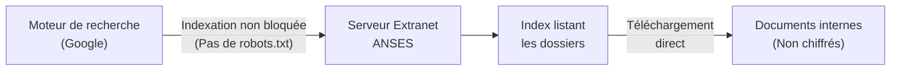
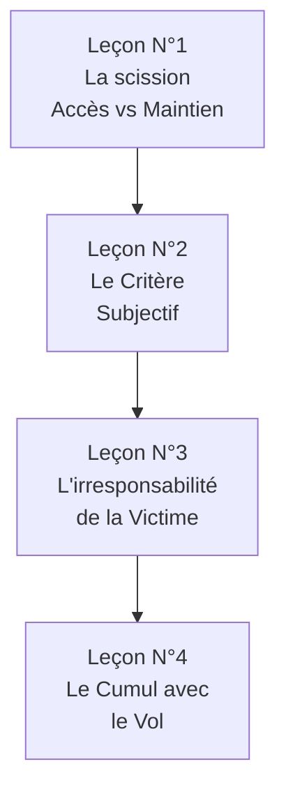

# Étude de l'affaire Bluetouff (2013-2015)

!!! note "**Livrables :** _Fiche d'arrêt de la Cour de Cassation, Schéma d'application Forensic_"
!!! note "**Auto-explication :** _10 minutes_"

 

---

 

!!! quote "L'analogie de la porte ouverte"

    Si vous trouvez une porte de maison grande ouverte dans la rue et que vous entrez par curiosité, êtes-vous coupable de violation de domicile ? Le bon sens dicte que oui, dès l'instant où vous comprenez que vous n'êtes pas chez vous. La jurisprudence française a appliqué exactement ce raisonnement à l'informatique avec l'affaire Bluetouff. La porte du serveur de l'ANSES était techniquement ouverte, accessible via une simple recherche Google. Le journaliste est entré sans difficulté technique. Mais la Cour de cassation a jugé que dès lors qu'il avait compris la nature privée des données, son maintien constituait une infraction pénale majeure. Ce raisonnement structure aujourd'hui toute la pratique du "Grey-Hat" et du Forensic en France.

## Objectifs pédagogiques

!!! tip "À la fin de ce chapitre, vous serez capable de :"

    - Restituer les faits de l'affaire Bluetouff dans leur déroulé chronologique.
    - Identifier les questions juridiques posées à la Cour de cassation.
    - Citer les apports doctrinaux principaux de l'arrêt du 20 mai 2015.
    - Appliquer ce raisonnement jurisprudentiel à vos propres missions d'investigation ou de pentest.

 

---

 

## Le contexte et les faits (2012)

### Présentation des protagonistes

- **Olivier Laurelli (Bluetouff)** : Journaliste, consultant en cybersécurité et co-fondateur du site d'investigation "Reflets.info".
- **L'ANSES** : Agence nationale chargée d'évaluer les risques sanitaires et environnementaux. En 2012, l'agence utilise un extranet défaillant pour partager des documents avec ses partenaires.

### La faille technique (L'indexation ouverte)

L'extranet de l'ANSES souffrait d'une erreur de configuration grossière.

> Comparatif entre la Théorie et la Réalité :

| Mécanisme | Théorie (Attendu par l'ANSES) | Réalité technique (2012) |
|---|---|---|
| Mots de passe | Requis pour se connecter | Contournés car Google a indexé les URLs situées *derrière* le portail d'authentification |
| Protection des répertoires | Interdiction de lister les fichiers (`Directory Listing` désactivé) | `Directory Listing` actif |
| Fichier `robots.txt` | Censure des moteurs de recherche | Absent ou inefficace |

**Conclusion technique :** L'accès était trivial. Bluetouff n'a exploité aucune faille complexe (pas d'injection SQL, pas de brute-force).

### La chronologie de l'infraction

| Période | Événement |
|---|---|
| Août 2012 | Bluetouff tape une requête Google pointue et atterrit sur des répertoires de l'ANSES. |
| Août 2012 | Il lance un script (`wget`) et télécharge **8 000 fichiers** (comptes-rendus, mémos). |
| Août 2012 | Publication d'un article d'investigation sur Reflets.info basé sur ces fuites. |
| Septembre 2012 | L'ANSES dépose plainte pour accès frauduleux et vol de données. |

Bluetouff base sa défense sur 3 axes : 
1. **L'indexation publique :** Si Google l'a vu, c'est que c'est public.
2. **Pas d'effraction :** Il n'a craqué aucun mot de passe.
3. **Le but d'information :** Il a agi en tant que journaliste d'investigation.

 

---

 

## Le parcours judiciaire et l'Arrêt final

Cette affaire a secoué le milieu juridique car elle a connu des retournements spectaculaires selon le juge saisi.

### 1. Tribunal correctionnel (Créteil, Avril 2013) : La Relaxe

Le tribunal juge que Bluetouff est innocent.
**Motif :** Il n'y a pas eu de "franchissement" d'une mesure de sécurité. L'ANSES avait mal configuré son site, les données étaient en libre-service. Le juge applique ici la jurisprudence ancienne "Kitetoa" (qui disait : sans barrière, pas d'effraction).

### 2. Cour d'Appel (Paris, Février 2014) : La Condamnation

La Cour d'appel casse le jugement et le condamne à **3 000 € d'amende**.
**Motif :** Même si la porte était ouverte, la page d'accueil de l'extranet indiquait "Espace Réservé". Bluetouff a donc *nécessairement compris* qu'il n'avait rien à faire là, et s'est pourtant maintenu pour télécharger 8 000 fichiers.

### 3. Cour de Cassation (20 mai 2015) : La consécration de la culpabilité

La Cour suprême française (Arrêt n°14-81.336) confirme définitivement la condamnation. Ce texte devient la jurisprudence de référence.

!!! danger "L'apport doctrinal de l'Arrêt Bluetouff (2015)"
    La Cour a tranché un point fondamental de l'Article 323-1 du Code pénal :
    *"Le maintien irrégulier dans un système de traitement automatisé de données est caractérisé dès lors que l'auteur des faits, **ayant accédé de façon licite ou fortuite au système, s'y maintient en toute connaissance de cause** de l'irrégularité de sa présence."*

 

---

 

## Les 4 leçons juridiques de l'Arrêt Bluetouff

C'est ici que la jurisprudence a changé le métier de pentester et d'analyste.

### Leçon 1 : L'Accès fortuite ≠ Le Maintien frauduleux

Avant 2015, on pensait que si l'accès était "légal" (via Google), alors ce qu'on y faisait après l'était aussi. Faux. L'arrêt Bluetouff scinde l'action :
1. Tomber par hasard sur l'URL de l'ANSES n'est pas un délit (Accès fortuit).
2. **Rester** et télécharger les fichiers est un délit (Maintien frauduleux).

### Leçon 2 : Le critère subjectif (L'intention)

La Loi ne juge plus la "barrière technique", elle juge **votre intention**. 

| Indices prouvant l'intention frauduleuse (L'esprit Bluetouff) |
|---|
| Présence d'un "Robots.txt" (Même s'il est techniquement mal codé, il prouve que l'admin voulait cacher le site). |
| Présence d'une mention "Private" ou "Extranet" sur la page. |
| Le volume : Télécharger 8 000 fichiers prouve une action délibérée de pillage, pas une erreur de clic. |
| L'URL : `http://anses.fr/admin/private/docs` ne laisse aucun doute sur la nature privée du lieu. |

### Leçon 3 : La victime incompétente reste une victime

L'ANSES était catastrophique en sécurité IT. Mais la Cour affirme que **la négligence de la victime n'autorise pas le pillage**. Que la porte soit ouverte ne justifie pas qu'on entre voler la télévision.

### Leçon 4 : Le vol immatériel

Bluetouff n'a pas seulement été condamné pour "maintien frauduleux" (Art 323-1), mais aussi pour **"Vol"** (Art 311-1). La Cour confirme que copier des données numériques ("Vol immatériel") constitue juridiquement un vol, même si le propriétaire d'origine possède toujours ses données.

 

---

 

## Conséquences pratiques pour le Forensic et le Pentest

La jurisprudence Bluetouff s'applique tous les jours lors de vos missions OSINT ou lors de la découverte de failles.

!!! tip "La Règle d'or post-Bluetouff : S'arrêter et reculer"
    Si, au cours d'un mandat limité, vous tombez fortuitement sur une base de données béante (un bucket S3 ouvert, une API non sécurisée) qui n'est pas dans votre périmètre, **la simple consultation de la structure de la base vous rend juridiquement coupable**.

### Application concrète de la règle

> Comment réagir face à un Bucket S3 béant trouvé lors d'un audit de surface ?

| Action de l'Analyste | Statut Juridique post-Bluetouff |
|---|---|
| L'analyste clique sur l'URL par hasard et voit le listing des fichiers. | **Toléré.** (C'est l'accès fortuit non intentionnel). |
| L'analyste télécharge un fichier `.pdf` pour prouver à son client que c'est lisible. | **Ligne Rouge (Gris).** La preuve de concept (PoC) montre qu'il s'est "maintenu" après avoir compris que c'était privé. |
| L'analyste lance un script `wget` et aspire 500Mo du bucket S3. | **Délit Pénal.** Maintien frauduleux et Vol de données parfaitement caractérisés. |

### La Loi pour une République Numérique (2016)

Suite au tollé provoqué par la condamnation de Bluetouff chez les hackers éthiques ("White-hats"), la France a voté l'Article 47 de la Loi pour une République Numérique (LRN).

!!! abstract "Le signalement de bonne foi"
    L'article L2321-4 du Code de la Défense permet désormais à un "hacker de bonne foi" qui découvre fortuitement une faille de la signaler sans risquer de poursuites, **à condition de le signaler exclusivement à l'ANSSI** (Agence nationale de la sécurité des systèmes d'information) et de ne **jamais divulguer publiquement** les données.

 

---

 

## Manipulation pratique - Exercices

### Exercice 1 - Analyse de cas pratiques

> Jugez les situations suivantes selon la jurisprudence Bluetouff :

!!! quote "Solution et Qualification Juridique"

    | Cas Pratique | Verdict | Motif |
    |---|---|---|
    | Un chercheur trouve un dashboard Kubernetes d'une PME via Shodan. Il clique pour voir si c'est la prod, et referme. | **Coupable (en théorie)** | "Maintien frauduleux". Il a compris que c'était privé et a quand même cherché à confirmer. |
    | Un journaliste découvre une faille, extrait les mots de passe des élus de la mairie et publie l'article pour "alerter". | **Coupable** | "Vol de données". La noblesse de l'intention (Alerte) n'efface pas l'infraction. |
    | Un pentester trouve une faille, prend un seul screenshot flouté, n'extrait aucune base, et contacte le CERT/ANSSI. | **Innocent (Protégé)** | Il rentre dans le cadre de "Bonne foi" de la loi pour une République Numérique (2016). |

 

### Exercice 2 - Rédiger la Fiche d'Arrêt de la Cour de Cassation

Rédigez la fiche d'arrêt standard demandée en école de droit.

!!! quote "Fiche d'Arrêt type Bluetouff"

    **Fiche d'arrêt : Cass. crim., 20 mai 2015, n°14-81.336**
    
    **1. Les Faits :** Un journaliste (O. Laurelli) découvre via un moteur de recherche que des documents confidentiels de l'ANSES sont accessibles sans mot de passe suite à une erreur de configuration. Il télécharge 8 000 fichiers et publie un article.
    
    **2. La Procédure :** L'ANSES porte plainte. Le journaliste est relaxé en première instance (Créteil, 2013) au motif qu'aucune barrière technique n'a été franchie. La Cour d'Appel (Paris, 2014) le condamne, jugeant qu'il ne pouvait ignorer le caractère restreint de l'espace. Le prévenu se pourvoit en cassation.
    
    **3. La Question de Droit (Problème juridique) :** Le simple maintien dans un espace numérique non protégé techniquement, mais dont la nature confidentielle est évidente pour l'utilisateur, constitue-t-il le délit de maintien frauduleux dans un STAD ?
    
    **4. La Solution (Dispositif) :** La Cour de Cassation répond **OUI**. Elle rejette le pourvoi et confirme la condamnation. La conscience de se trouver irrégulièrement dans un système suffit à caractériser le délit, indépendamment de l'absence de mesures de sécurité informatiques bloquantes.

 

---

 

## Synthèse mémo

!!! success "À retenir absolument"
    
    **Jurisprudence Bluetouff (Cass. crim. 2015)**
    
    **1. La fin de l'impunité technique** : Ce n'est pas parce que c'est techniquement "ouvert" ou indexé sur Google que c'est légal de l'utiliser.
    
    **2. La dissociation temporelle** : L'accès par hasard (licite) se transforme instantanément en Maintien Frauduleux (Article 323-1) à la seconde où l'utilisateur comprend qu'il est sur un espace privé et qu'il y reste.
    
    **3. L'irresponsabilité de la victime** : Le fait que l'admin système de l'ANSES ait fait un travail incompétent ne donne pas le droit d'aspirer ses données. 
    
    **4. Le Vol immatériel** : Aspirer des données ("wget") est un vol au sens du Code pénal, même si la victime conserve les données originales sur son serveur.
    
    **Application pratique (La fuite en avant) :**
    Si au cours d'une veille vous découvrez une ressource exposée : **Ne touchez à rien. Ne testez pas "pour voir". Quittez la page. Notifiez le CERT-FR (ANSSI).**

 

---

 

## Conclusion

!!! quote "Ce qu'il faut retenir"
    L'affaire Bluetouff a marqué un coup d'arrêt brutal pour la communauté Hacker en France. Elle a mis fin au romantisme du "White-Hat justicier" qui scannait l'internet français pour y dénoncer les failles. La Cour de Cassation a rappelé une règle millénaire : fouiller le tiroir ouvert du voisin reste un délit. Pour vous, l'enseignement est simple. Il n'existe pas de "Pentest sauvage autorisé". Sans un mandat formel préalablement signé, toute démarche curieuse se heurtera à cette jurisprudence implacable.

> [Chapitre suivant : 1.12 Étude affaire Kitetoa (2002) →](01-12-affaire-kitetoa.md)
>
> [Retour à l'index →](./index.md)

 
