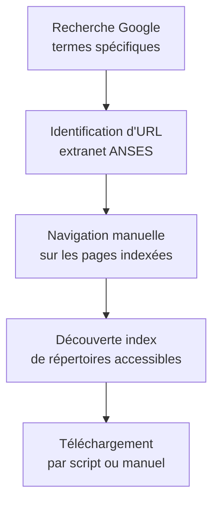
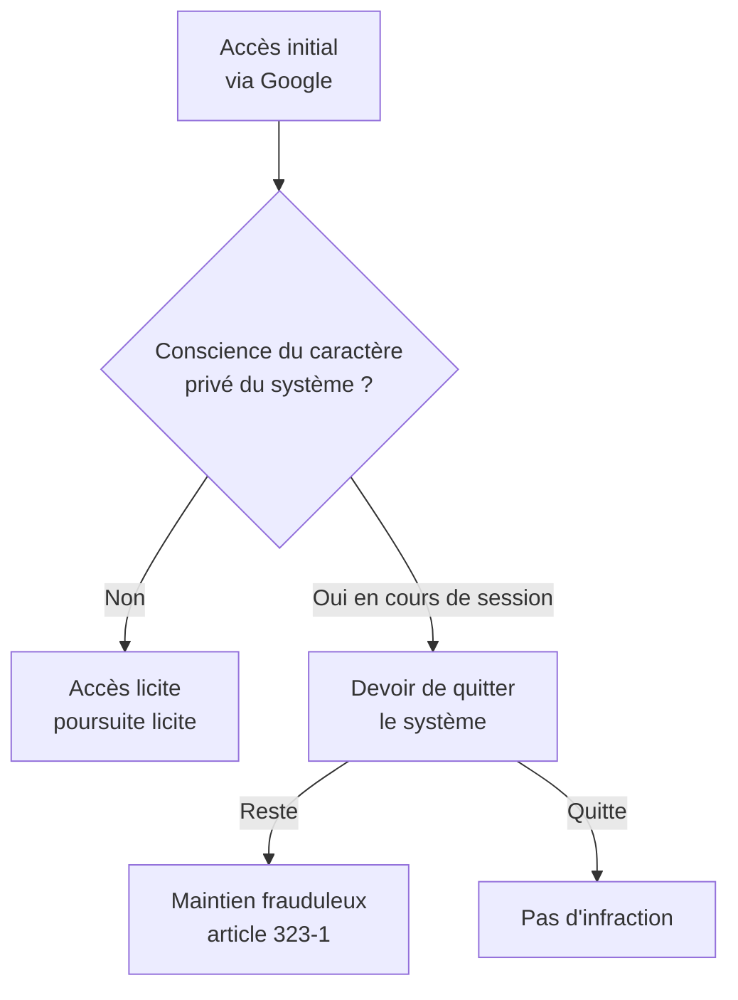
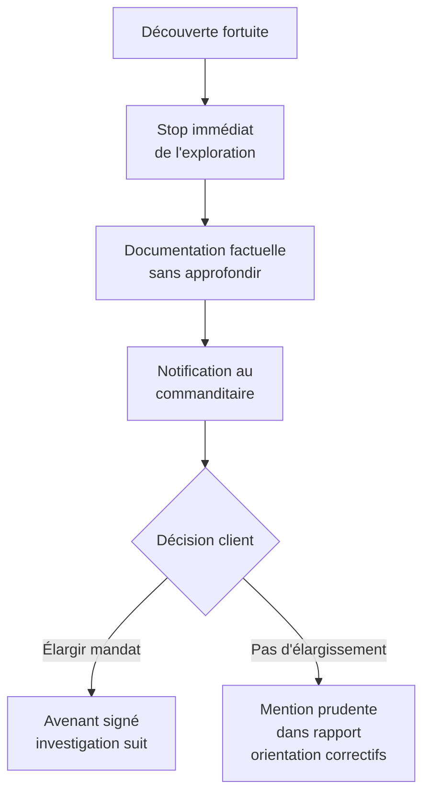

# 1.11 Étude de l'affaire Bluetouff (2013-2015)

!!! quote "L'analogie de la porte ouverte"

    Si vous trouvez une porte ouverte dans la rue et que vous entrez par curiosité, êtes-vous coupable de violation de domicile ? Le bon sens dit oui dès le moment où vous comprenez que vous n'êtes pas chez vous. La jurisprudence française a appliqué exactement ce raisonnement à l'informatique avec l'affaire Bluetouff. La porte du serveur de l'ANSES était ouverte, accessible via Google. L'utilisateur est entré sans difficulté technique. Mais la Cour de cassation a jugé que dès lors qu'il avait compris la nature privée des données, son maintien constituait une infraction. Ce raisonnement structure aujourd'hui toute la pratique du grey-hat français. Pour vous, analyste forensic, comprendre Bluetouff est essentiel : c'est l'arrêt qui dit où passe la ligne entre découverte fortuite et infraction caractérisée.

## Métadonnées du chapitre

| Champ | Valeur |
|---|---|
| Durée estimée | 2 heures |
| Niveau | Standard |
| Prérequis | Chapitres 1.1 à 1.10 |
| Livrables | Fiche d'arrêt, schéma de la procédure |
| Auto-explication | 10 minutes |

## Objectifs pédagogiques

À la fin de ce chapitre, vous serez capable de :

- Restituer les faits de l'affaire Bluetouff dans leur déroulé chronologique.
- Identifier les questions juridiques posées à la Cour de cassation.
- Citer les apports doctrinaux principaux de l'arrêt du 20 mai 2015.
- Appliquer le raisonnement jurisprudentiel à des cas pratiques modernes.
- Tirer les leçons opérationnelles pour votre propre pratique.

---

## 1. Contexte général de l'affaire

### 1.1 Présentation des protagonistes

**Olivier Laurelli**, alias **Bluetouff**, est journaliste, consultant en sécurité informatique et co-fondateur de la plateforme Reflets.info. Il a une longue expérience dans la diffusion d'informations d'intérêt public et a participé à plusieurs investigations notables.

**L'ANSES** (Agence nationale de sécurité sanitaire de l'alimentation, de l'environnement et du travail) est un établissement public chargé d'évaluer les risques sanitaires. En 2012, l'agence dispose d'un extranet pour partager des documents de travail avec ses partenaires.

### 1.2 La situation technique

L'extranet de l'ANSES en 2012 présentait une **configuration défaillante** :

```mermaid
flowchart LR
    A[Internet] -->|Recherche Google<br>"ANSES" + termes techniques| B[Indexation Google<br>de pages extranet]
    B --> C[Page index publique<br>listant documents]
    C --> D[Téléchargement libre<br>sans authentification]
```

| Élément | État réel ANSES 2012 |
|---|---|
| Extranet protégé par identifiant | Théoriquement oui |
| Page d'index protégée | Non, accessible publiquement |
| Documents accessibles via URL directe | Oui |
| Mention "espace privé" | Présente sur la page de connexion |
| robots.txt empêchant indexation | Insuffisant ou absent |

L'**erreur de configuration** rendait les documents accessibles via Google sans franchir aucun mécanisme d'authentification.

---

## 2. Les faits

### 2.1 Chronologie

| Date | Événement |
|---|---|
| Août 2012 | Bluetouff effectue des recherches Google sur des sujets sanitaires |
| Août 2012 | Il découvre, parmi les résultats, des liens vers des documents de l'ANSES apparemment internes |
| Août 2012 | Il télécharge environ 8 000 fichiers (rapports techniques, comptes-rendus de réunions) |
| Août 2012 | Il publie un article sur Reflets.info utilisant ces documents |
| Septembre 2012 | L'ANSES dépose plainte |
| 23 avril 2013 | Tribunal correctionnel de Créteil : **relaxe** |
| 5 février 2014 | Cour d'appel de Paris : **condamnation** (3 000 € d'amende) |
| **20 mai 2015** | **Cour de cassation : rejette le pourvoi, confirme la condamnation** |

### 2.2 Mode opératoire technique

Bluetouff a utilisé des techniques **techniquement triviales** :



**Aucune technique offensive avancée** n'a été utilisée. Pas d'exploitation de vulnérabilité, pas de contournement de protection, pas d'élévation de privilèges. Simplement de la navigation sur des URL accessibles.

### 2.3 La défense de Bluetouff

Bluetouff a invoqué **trois arguments principaux** :

1. **Absence de franchissement de protection** : aucun mécanisme d'authentification n'a été contourné
2. **Indexation publique** : Google ayant indexé les pages, elles étaient considérées comme publiques
3. **Intention journalistique** : la finalité d'investigation justifie l'accès

---

## 3. Les décisions successives

### 3.1 Première instance - Tribunal correctionnel de Créteil (23 avril 2013)

**Décision : relaxe**.

Le tribunal a retenu que :

- Les pages étaient effectivement indexées par Google
- Aucun système de sécurité n'avait été contourné
- Le caractère "fermé" du système n'était pas démontré techniquement
- La mention de connexion sur la page d'accueil ne suffisait pas à caractériser un système protégé

**Apport** : la jurisprudence Kitetoa (chapitre 1.12) a été appliquée. Sans dispositif de sécurité effectif, pas d'accès frauduleux.

### 3.2 Cour d'appel de Paris (5 février 2014)

**Décision : condamnation à 3 000 € d'amende pour maintien frauduleux et vol**.

La Cour d'appel a au contraire retenu que :

- La page d'accueil mentionnait explicitement le caractère réservé
- Bluetouff avait constaté la présence d'identifiants/mots de passe lors de tentatives initiales
- Il s'était maintenu dans le système après avoir compris son caractère privé
- Le téléchargement massif caractérisait une volonté délibérée

**Apport** : la connaissance subjective du caractère privé du système prévaut sur l'absence de protection technique effective.

### 3.3 Cour de cassation (20 mai 2015)

**Décision : rejet du pourvoi, confirmation de la condamnation**.

La chambre criminelle de la Cour de cassation, dans son arrêt n°14-81.336, a confirmé la position de la Cour d'appel.

**Motif décisif** :

```text
La Cour de cassation a estimé que Bluetouff "ne pouvait ignorer le
caractère restreint" du système, notamment du fait :
- Des avertissements présents sur certaines pages
- Des identifiants nécessaires pour certaines parties
- Du caractère manifestement professionnel et interne des documents

Dès lors, son maintien et le téléchargement massif constituent un
maintien frauduleux et un vol de données au sens des articles 323-1
et 311-1 du Code pénal.
```

---

## 4. Apports doctrinaux de l'arrêt

### 4.1 Apport 1 - Distinction accès et maintien

L'arrêt clarifie que **l'accès initial peut être licite** mais le **maintien devenir frauduleux** une fois la nature privée comprise.



C'est une **innovation jurisprudentielle majeure**. Avant Bluetouff, la doctrine considérait souvent que l'accès initial seul comptait.

### 4.2 Apport 2 - Critère subjectif de connaissance

La Cour de cassation établit que la **connaissance subjective** de l'auteur prévaut sur la **réalité technique** du dispositif de sécurité.

| Élément déclenchant la connaissance | Effet |
|---|---|
| Mention "accès réservé" sur une page | Caractérise la conscience du privé |
| Présence d'un formulaire de connexion ailleurs | Caractérise la conscience du privé |
| Caractère professionnel des documents | Indice |
| Avertissement légal en pied de page | Indice |
| robots.txt même non efficace | Indice (présence d'une volonté de ne pas indexer) |

### 4.3 Apport 3 - Affirmation indépendante du faille technique

L'arrêt affirme que **la faille technique du système ne dédouane pas** l'auteur. Le fait que Google indexe ne signifie pas que le contenu est public.

C'est un point crucial pour les chercheurs en sécurité : **trouver une faille n'autorise pas à l'exploiter**.

### 4.4 Apport 4 - Cumul accès frauduleux et vol

La Cour confirme le cumul de qualifications. Bluetouff a été condamné pour :

- **Maintien frauduleux** (article 323-1 al.1)
- **Vol** (article 311-1 du Code pénal, applicable aux données)

C'est une rupture avec la jurisprudence Bourquin de 1985 (chapitre 1.2) qui refusait de qualifier de vol l'appropriation de données. L'arrêt Bluetouff réintègre le vol dans l'arsenal applicable.

---

## 5. Critiques et débats

### 5.1 Critiques de la décision

L'arrêt Bluetouff a fait l'objet de **vives critiques** dans la communauté de la cybersécurité et du journalisme.

| Critique | Argument |
|---|---|
| Asymétrie | L'ANSES n'est pas sanctionnée pour défaut de sécurité, seul le découvreur est puni |
| Effet refroidissant | Décourage la recherche en sécurité légitime |
| Contradiction avec Kitetoa | Renverse partiellement la jurisprudence antérieure |
| Critère subjectif | Difficile à objectiver, source d'insécurité juridique |
| Disproportion | Sanction lourde pour un fait technique trivial |

### 5.2 Argument de la défense moderne

Plusieurs juristes et chercheurs ont proposé des **garde-fous** post-Bluetouff :

| Proposition | Statut |
|---|---|
| Création d'un statut de chercheur en sécurité | Partiellement satisfait par article 47 LRN |
| Protection accrue lanceurs d'alerte | Loi Sapin 2 (2016), Loi 2022 |
| Cadre du bug bounty | Pratique commerciale, pas légalisée |
| Divulgation responsable | Recommandations ANSSI |

### 5.3 La Loi pour une République numérique (2016)

L'**article 47 de la Loi pour une République numérique du 7 octobre 2016** a tenté de créer un cadre protecteur pour les chercheurs en sécurité. Il modifie l'article L2321-4 du Code de la défense pour permettre la signalement de bonne foi de vulnérabilités à l'ANSSI sans craindre de poursuites.

**Conditions** :
- Bonne foi
- Signalement à l'ANSSI
- Personne morale concernée informée
- Pas d'exploitation au-delà du nécessaire

**Limites** : ce cadre protège uniquement la **transmission** à l'ANSSI, pas la **découverte** elle-même. Bluetouff aurait pu signaler à l'ANSSI sans télécharger 8 000 fichiers.

---

## 6. Application au forensic moderne

### 6.1 Leçons opérationnelles

| Leçon | Application pratique |
|---|---|
| L'accessibilité technique ne légitime pas | Toujours vérifier le mandat avant d'accéder |
| La conscience du privé crée l'infraction | En cas de doute, sortir et demander |
| Le maintien après prise de conscience est aggravant | Ne pas approfondir au-delà de la preuve |
| Le téléchargement massif aggrave | Limiter à l'échantillonnage minimal |
| robots.txt fait office de signal | Le respecter même non opposable techniquement |

### 6.2 Cas pratiques modernes

**Cas 1 - Découverte d'un bucket S3 ouvert**.

Pendant une mission OSINT, vous découvrez un bucket S3 d'un client public mal configuré contenant des données sensibles.

| Action | Légalité |
|---|---|
| Constater l'existence du bucket | Légal (URL publique) |
| Vérifier la nature des fichiers (1-2 échantillons) | Borderline, dépend du mandat |
| Télécharger l'intégralité | Illégal, application Bluetouff |
| Signaler immédiatement au client | Légal et recommandé |

**Cas 2 - Indexation Google d'un intranet**.

Vous découvrez via Google des documents internes d'un client.

| Action | Recommandation |
|---|---|
| Constater l'indexation | Documenter dans le rapport |
| Quelques captures pour preuve | Légal si dans le mandat |
| Télécharger pour analyse | À éviter, signaler plutôt |
| Signaler au client | Indispensable |

**Cas 3 - Application sans authentification**.

Vous trouvez une API exposée d'un client sans authentification.

| Action | Recommandation |
|---|---|
| Constater l'absence d'auth | Documenter |
| Vérifier qu'on accède à des données réelles | Une seule requête, pas plus |
| Énumérer toutes les données | Illégal hors mandat explicite |
| Signaler en urgence | Indispensable |

### 6.3 Procédure de découverte fortuite hors mandat

Si pendant une mission vous découvrez **par hasard** une faille hors périmètre (par exemple, vulnérabilité d'un autre système du même client), suivez cette procédure :



---

## 7. Pièges et bonnes pratiques

### Piège 1 - Justifier par la finalité journalistique

Bluetouff a perdu malgré sa qualité de journaliste. La finalité ne justifie pas l'infraction. Le journaliste doit aussi respecter le cadre légal.

### Piège 2 - Considérer Google comme garant de publicité

Une indexation Google ne fait pas d'un document un document public. Le statut juridique préexiste à l'indexation.

### Piège 3 - Confondre faille technique et autorisation

Trouver un trou de sécurité ne donne pas le droit de l'exploiter, même partiellement, sans cadre.

### Bonne pratique 1 - Le minimum suffisant

Pour démontrer une faille, **un seul exemple** suffit. Pas besoin de 8 000 fichiers. Application stricte de la proportionnalité.

### Bonne pratique 2 - Le réflexe ANSSI

En cas de découverte fortuite, signalez à l'ANSSI via la plateforme dédiée. Cela vous protège et fait avancer la sécurité collective.

### Bonne pratique 3 - Le rapport prudent

Dans vos rapports, mentionnez les découvertes hors mandat avec **prudence rédactionnelle** :

```text
Au cours de la mission, l'attention du Prestataire a été portée sur
[élément X] qui semble présenter [vulnérabilité Y]. Cette observation
n'a fait l'objet d'aucune investigation approfondie, étant hors du
périmètre du mandat. Le Prestataire recommande au Mandant d'auditer
spécifiquement cette zone.
```

---

## 8. Manipulation pratique

### Exercice 8.1 - Fiche d'arrêt

Rédigez la fiche d'arrêt complète de Cass. crim. 20 mai 2015 n°14-81.336.

```text
FICHE D'ARRÊT
==============

Référence : Cass. crim., 20 mai 2015, pourvoi n°14-81.336
Affaire : Bluetouff (Olivier Laurelli)
Sources : Légifrance, Doctrine.fr

I. Faits
[Résumer en 3-5 phrases]
Olivier Laurelli, journaliste, a accédé via Google à des documents
de l'ANSES présents sur un extranet mal configuré. Il a téléchargé
environ 8 000 fichiers et publié un article les exploitant. L'ANSES
a déposé plainte. La Cour d'appel a condamné. Bluetouff s'est pourvu
en cassation.

II. Procédure
[Lister les étapes]
1. Plainte de l'ANSES, septembre 2012
2. Tribunal correctionnel de Créteil : relaxe (23/04/2013)
3. Cour d'appel de Paris : condamnation (05/02/2014)
4. Cour de cassation : rejet du pourvoi (20/05/2015)

III. Question juridique
La connaissance par l'auteur du caractère privé d'un STAD,
indépendamment de l'effectivité technique du dispositif de sécurité,
suffit-elle à caractériser un maintien frauduleux ?

IV. Solution de la Cour
La Cour de cassation répond par l'affirmative. Le maintien après
prise de conscience du caractère privé constitue le maintien
frauduleux au sens de l'article 323-1 du Code pénal.

V. Apports
1. Distinction accès vs maintien
2. Critère subjectif de connaissance
3. Indépendance vis-à-vis de la faille technique
4. Cumul possible avec le vol
```

### Exercice 8.2 - Application à des cas

Pour chaque situation, qualifiez juridiquement avec application de Bluetouff.

| Cas | Qualification | Justification |
|---|---|---|
| Vous découvrez une page d'admin sans mot de passe d'un client, vous regardez 30 secondes et quittez | Pas d'infraction si découverte fortuite et départ rapide | Pas de maintien |
| Idem mais vous explorez les fonctionnalités pendant 1h | Maintien frauduleux | Conscience du privé + maintien |
| Idem mais avec un mandat explicitement large | Légal | Couvert par mandat |
| Vous trouvez une API d'un client publique, vous testez 50 requêtes pour mesurer l'ampleur | Maintien frauduleux | Application Bluetouff |
| Vous trouvez le même problème sur un site tiers, vous signalez à l'ANSSI | Légal sous LRN article 47 | Bonne foi + signalement |

---

## 9. Auto-évaluation

| # | Question | Réponse attendue |
|---|---|---|
| 1 | Date de l'arrêt fondateur ? | 20 mai 2015 |
| 2 | Pourvoi ? | n°14-81.336 |
| 3 | Décision ? | Rejet du pourvoi, confirmation condamnation |
| 4 | Apport principal ? | Maintien frauduleux après prise de conscience |
| 5 | Quelle organisation victime ? | ANSES |
| 6 | Combien de documents téléchargés ? | Environ 8 000 |
| 7 | Premier juge ayant relaxé ? | Tribunal correctionnel de Créteil |
| 8 | Loi protégeant le signalement à l'ANSSI ? | Loi pour une République numérique 2016, art. 47 |

---

## 10. Synthèse mémo

```text
AFFAIRE BLUETOUFF - JURISPRUDENCE FONDATRICE

Référence : Cass. crim., 20 mai 2015, n°14-81.336
Auteur : Olivier Laurelli (Bluetouff)
Victime : ANSES

Faits :
  Accès via Google à un extranet mal configuré
  Téléchargement de ~8 000 documents
  Publication article journalistique

Décision :
  Confirmation condamnation à 3 000 € d'amende
  Pour maintien frauduleux + vol

Apports clés :
  1. Distinction accès / maintien
  2. Critère subjectif de connaissance prévaut sur faille technique
  3. La conscience du privé crée l'infraction
  4. Cumul vol et maintien frauduleux

Pour vous, analyste :
  Mandat explicite obligatoire
  Le minimum suffit pour démontrer
  Stop dès qu'on comprend l'aspect privé
  Signalement ANSSI possible (LRN art. 47)
```

---

## 11. Pour aller plus loin

| Ressource | Type |
|---|---|
| Légifrance - Cass. crim. 14-81.336 | Arrêt original |
| Articles Reflets.info - Bluetouff | Position auteur |
| Commentaires CLUSIF | Analyse professionnelle |
| Décision tribunal correctionnel Créteil | Premier degré |
| Décision CA Paris 5 février 2014 | Appel |

---

## 12. Auto-explication

Pour valider ce chapitre, enregistrez une vidéo de 10 minutes où vous expliquez :

1. Les faits de l'affaire (2 minutes)
2. Le déroulement procédural (2 minutes)
3. La décision et son fondement (2 minutes)
4. Les 4 apports doctrinaux (2 minutes)
5. Les leçons pour votre pratique (2 minutes)

---

**Chapitre précédent** : [1.10 Cadre du pentest légal](01-10-cadre-pentest-legal.md)

**Chapitre suivant** : [1.12 Étude affaire Kitetoa (2002)](01-12-affaire-kitetoa.md)
