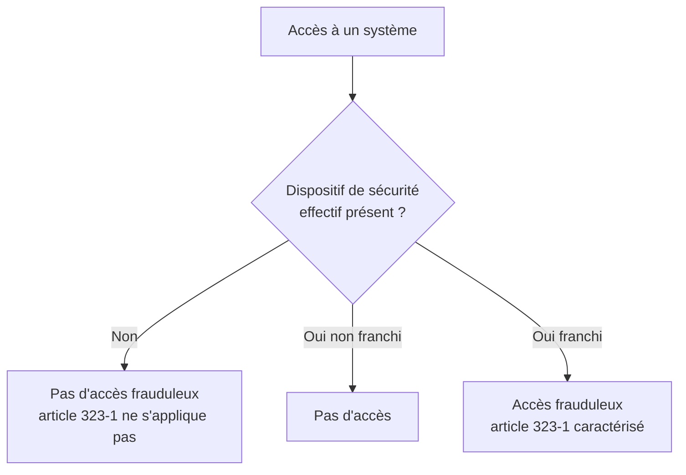
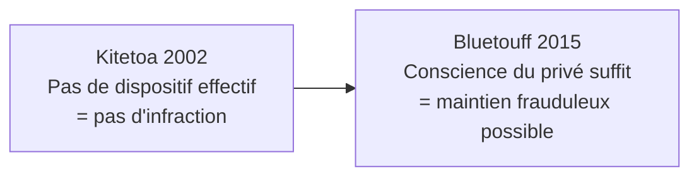
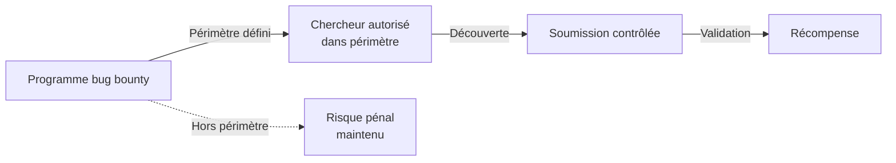

# 1.12 Étude de l'affaire Kitetoa (2002)

!!! quote "L'analogie de la maison sans porte"

    Si une maison n'a pas de porte ni de mur, est-ce une violation de domicile que d'y entrer ? La question peut sembler absurde, mais elle a une réponse juridique : non. Une habitation suppose une délimitation physique manifeste. Sans porte, sans clôture, sans mur, le passage n'est pas une intrusion. La jurisprudence Kitetoa de 2002 a posé exactement ce raisonnement pour l'informatique. Sans dispositif de sécurité effectif, pas d'intrusion frauduleuse au sens du Code pénal. Cette décision a structuré pendant treize ans la pratique française du grey-hat, jusqu'à ce que l'arrêt Bluetouff de 2015 vienne en limiter la portée. Comprendre ces deux arrêts ensemble, c'est comprendre où passe aujourd'hui la frontière du légal en France.

## Métadonnées du chapitre

| Champ | Valeur |
|---|---|
| Durée estimée | 2 heures |
| Niveau | Standard |
| Prérequis | Chapitres 1.1 à 1.11 |
| Livrables | Fiche d'arrêt comparative Kitetoa / Bluetouff |
| Auto-explication | 10 minutes |

## Objectifs pédagogiques

À la fin de ce chapitre, vous serez capable de :

- Restituer les faits de l'affaire Kitetoa.
- Citer la position de la Cour d'appel de Paris du 30 octobre 2002.
- Identifier l'apport doctrinal du dispositif de sécurité effectif.
- Articuler Kitetoa et Bluetouff dans leur évolution.
- Appliquer le raisonnement aux pratiques modernes du grey-hat.

---

## 1. Contexte et protagonistes

### 1.1 Antoine Champagne et Kitetoa

**Antoine Champagne**, sous le pseudonyme **Kitetoa**, animait dans les années 2000 le site Kitetoa.com, dédié à dénoncer les failles de sécurité des sites Web français. Sa philosophie : alerter les entreprises sur leurs vulnérabilités pour pousser à l'amélioration de la sécurité.

### 1.2 Le contexte technique 2000-2002

Au tournant des années 2000, beaucoup de sites Web français présentaient des configurations défaillantes :

| Vulnérabilité fréquente | Exemple |
|---|---|
| Bases de données accessibles sans auth | Base utilisateurs téléchargeable |
| Indexation de répertoires activée | Listing complet des fichiers |
| Pages d'admin sans protection | Backoffices accessibles directement |
| Mots de passe par défaut | admin/admin sur de nombreux CMS |

### 1.3 La société Tati

**Tati** était une enseigne de grande distribution textile française, alors en pleine croissance. En 2000, elle exploitait un site Web commercial.

---

## 2. Les faits

### 2.1 Chronologie

| Date | Événement |
|---|---|
| 2000 | Kitetoa découvre des vulnérabilités sur le site de Tati |
| 2000 | Il publie un article décrivant les failles |
| 2000 | Tati dépose plainte pour accès frauduleux |
| 2002 | Tribunal de grande instance : condamnation |
| 30 octobre 2002 | **Cour d'appel de Paris : relaxe** |

### 2.2 Mode opératoire

Kitetoa a constaté que le site de Tati présentait :

- Des **répertoires accessibles** sans authentification
- Des **fichiers de configuration** lisibles
- Des **données clients** potentiellement exposées

Il a documenté ces failles **sans exploiter massivement les données**, dans une démarche journalistique d'alerte.

### 2.3 Le débat juridique

| Question | Argument Kitetoa | Argument Tati |
|---|---|---|
| Y a-t-il eu accès frauduleux ? | Non, pas de protection à franchir | Oui, accès non autorisé |
| Le système était-il "protégé" ? | Non, accessible publiquement | Oui, par sa nature professionnelle |
| L'intention était-elle frauduleuse ? | Non, démarche de sensibilisation | Oui, publication des failles |

---

## 3. La décision de la Cour d'appel de Paris (30 octobre 2002)

### 3.1 Décision

La Cour d'appel **relaxe** Kitetoa au motif que **le système n'était pas effectivement protégé**.

### 3.2 Motif décisif

La Cour énonce un principe nouveau pour l'époque : **l'accès frauduleux suppose le franchissement d'une protection effective**.

```text
"Il ne saurait être reproché à un internaute d'accéder ou de se maintenir
dans les parties des sites qui peuvent être atteintes par la simple
utilisation d'un logiciel grand public de navigation, ces parties n'étant
pas protégées par le maître du système ou son prestataire de services
contre l'utilisation d'une telle simple navigation."
```

### 3.3 Apport doctrinal

L'arrêt pose le principe du **dispositif de sécurité effectif** :



| Critère | Précision |
|---|---|
| Dispositif effectif | Authentification, chiffrement, contrôle d'accès |
| Dispositif insuffisant | Robots.txt seul, mention "réservé" sans technique |
| Charge de la preuve | Au plaignant de démontrer l'effectivité |

---

## 4. Articulation avec Bluetouff

### 4.1 Évolution jurisprudentielle



L'arrêt Bluetouff n'a **pas annulé** l'arrêt Kitetoa, mais l'a **nuancé**. Le critère du dispositif effectif reste valable, mais s'enrichit du critère subjectif de la connaissance.

### 4.2 Tableau comparatif

| Critère | Kitetoa 2002 | Bluetouff 2015 |
|---|---|---|
| Décision | Relaxe | Condamnation |
| Critère central | Dispositif effectif | Conscience du privé |
| Volume téléchargé | Limité, démonstratif | Massif (8 000 fichiers) |
| Intention | Alerte sécurité | Investigation journalistique |
| Apport principal | Critère objectif | Critère subjectif |

### 4.3 Synthèse pratique post-2015

En 2026, l'application combinée des deux arrêts donne :

| Situation | Issue probable |
|---|---|
| Pas de protection ET pas de conscience du privé | Légal (Kitetoa s'applique) |
| Pas de protection MAIS conscience du privé | Maintien frauduleux (Bluetouff prévaut) |
| Protection contournée | Accès frauduleux clair |
| Protection contournée + maintien volontaire | Aggravation |

---

## 5. Application moderne

### 5.1 Cas du bug bounty

Les plateformes de bug bounty (HackerOne, YesWeHack, Intigriti) ont émergé partiellement en réponse à l'insécurité juridique post-Bluetouff. Elles offrent un **cadre contractuel explicite** qui résout l'ambiguïté.



### 5.2 Cas de la divulgation responsable

Hors plateforme bug bounty, la **divulgation responsable** reste une zone grise. Recommandations :

1. Documenter la découverte sans approfondir
2. Notifier l'éditeur ou propriétaire
3. Accorder un délai raisonnable de correction (90 jours typiquement)
4. Si pas de réponse, signaler à l'ANSSI
5. Publier seulement après correction et accord

### 5.3 Cas pratiques modernes

| Cas | Issue Kitetoa+Bluetouff |
|---|---|
| Découverte d'un bucket S3 ouvert d'une PME, signalement immédiat sans téléchargement | Légal |
| Idem mais avec téléchargement de 100 fichiers pour "preuve" | Maintien frauduleux |
| Site vitrine sans authentification, lecture des pages publiques | Légal |
| Même site, exploitation d'un paramètre URL pour accéder à autres comptes | Accès frauduleux |
| API publique non documentée trouvée par fuzzing | Borderline, dépend de la conscience |

---

## 6. Pièges et bonnes pratiques

### Piège 1 - Croire que Kitetoa autorise tout

Kitetoa a posé le critère du dispositif effectif **en 2002**, dans un contexte où de nombreux systèmes étaient mal configurés. Aujourd'hui, l'arrêt sert dans les cas extrêmes (système totalement public). Pour la plupart des cas, Bluetouff prévaut.

### Piège 2 - Confondre absence de protection et autorisation

Une absence de protection ne signifie pas une autorisation. Le propriétaire conserve son droit de propriété sur les données.

### Piège 3 - Penser que le journalisme protège

Bluetouff était journaliste. Cela ne l'a pas protégé. La fonction journalistique n'écarte pas le droit pénal.

### Bonne pratique 1 - Limiter au minimum suffisant

Si vous découvrez une faille, démontrez-la avec **un seul exemple**. Pas de téléchargement massif, pas d'exploration approfondie.

### Bonne pratique 2 - Privilégier le bug bounty

Quand vous avez un doute, vérifiez si l'organisation a un programme de bug bounty. Cela offre un cadre contractuel sécurisant.

### Bonne pratique 3 - Documenter sans exploiter

La documentation technique de la faille (capture d'URL, schéma de la vulnérabilité) suffit. L'exploitation n'est jamais nécessaire pour la démonstration.

---

## 7. Manipulation pratique

### Exercice 7.1 - Application combinée

Pour chaque cas, déterminez l'issue selon Kitetoa et selon Bluetouff.

| Cas | Issue Kitetoa | Issue Bluetouff |
|---|---|---|
| Site sans protection, accès et consultation rapide | Légal | Légal si pas conscience |
| Site avec mention "accès réservé" sans authentification, visite | Légal (objet seul) | Maintien frauduleux |
| Bucket S3 ouvert avec données nominatives | Borderline | Maintien probable si exploration |
| API publique sans doc, énumération de paramètres | Borderline | Maintien si conscience du non-public |

### Exercice 7.2 - Fiche d'arrêt

```text
FICHE D'ARRÊT - KITETOA
========================
Référence : CA Paris, 12e ch., 30 octobre 2002
Auteur : Antoine Champagne (Kitetoa)
Victime : Société Tati

I. Faits
Kitetoa a découvert et publié des vulnérabilités du site de Tati.
Pas de protection technique effective sur les zones consultées.

II. Procédure
TGI : condamnation
CA Paris (30/10/2002) : relaxe

III. Question juridique
L'absence de dispositif de sécurité effectif fait-elle obstacle
à la qualification d'accès frauduleux ?

IV. Solution
Oui. Sans dispositif effectif, pas d'accès frauduleux.

V. Apport
Création du critère du dispositif de sécurité effectif.
Critère objectif protégeant les chercheurs en sécurité.

VI. Évolution
Nuancé par Cass. crim. 20 mai 2015 (Bluetouff) :
ajout du critère subjectif de la conscience du privé.
```

---

## 8. Auto-évaluation

| # | Question | Réponse attendue |
|---|---|---|
| 1 | Date de l'arrêt Kitetoa ? | 30 octobre 2002 |
| 2 | Juridiction ? | Cour d'appel de Paris, 12e chambre |
| 3 | Décision ? | Relaxe |
| 4 | Apport principal ? | Critère du dispositif de sécurité effectif |
| 5 | Quelle entreprise victime ? | Tati |
| 6 | Quel pseudonyme ? | Kitetoa (Antoine Champagne) |
| 7 | Articulation avec Bluetouff ? | Bluetouff nuance Kitetoa par critère subjectif |
| 8 | Aujourd'hui, lequel prime en pratique ? | Bluetouff dans la majorité des cas |

---

## 9. Synthèse mémo

```text
AFFAIRE KITETOA - 30 OCTOBRE 2002

Référence : CA Paris, 12e ch., 30 octobre 2002
Auteur : Kitetoa (Antoine Champagne)
Victime : Tati

Décision : Relaxe

Apport :
  Critère du dispositif de sécurité effectif
  Sans protection technique, pas d'accès frauduleux

Aujourd'hui :
  Article toujours valable mais nuancé par Bluetouff 2015
  Conscience du privé peut suffire à caractériser maintien frauduleux

Application :
  Cas extrêmes (système totalement public) = Kitetoa
  Cas mixtes (faille technique + signaux de privé) = Bluetouff
```

---

## 10. Auto-explication

Pour valider ce chapitre, enregistrez une vidéo de 10 minutes où vous expliquez :

1. Les faits Kitetoa (2 minutes)
2. La décision et son fondement (2 minutes)
3. L'apport du dispositif effectif (2 minutes)
4. L'articulation avec Bluetouff (2 minutes)
5. L'application moderne (2 minutes)

---

**Chapitre précédent** : [1.11 Étude affaire Bluetouff](01-11-affaire-bluetouff.md)

**Chapitre suivant** : [1.13 Affaires récentes 2020-2025](01-13-affaires-recentes.md)
