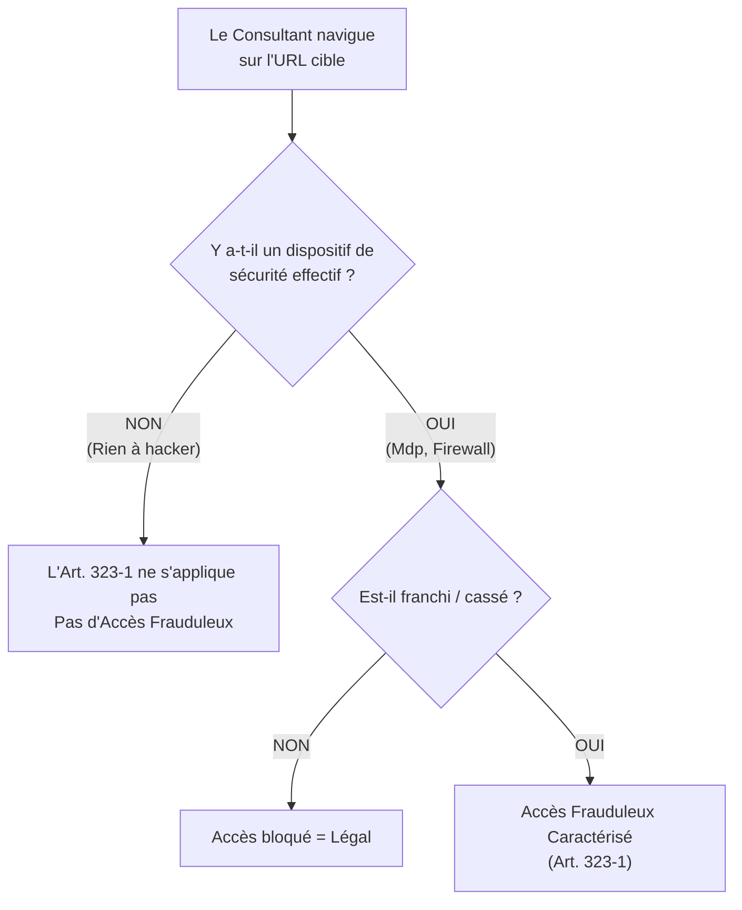
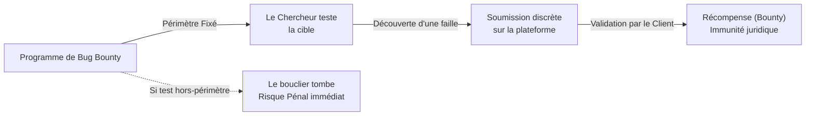

# Étude de l'affaire Kitetoa (2002)

!!! note "**Livrables :** _Fiche d'arrêt comparative Kitetoa / Bluetouff_"
!!! note "**Auto-explication :** _10 minutes_"

 

---

 

!!! quote "L'analogie de la maison sans porte"

    Si une maison n'a ni porte, ni mur, ni clôture, est-ce une "violation de domicile" que d'y entrer et d'en traverser le salon ? Le bon sens juridique répond : non. Une habitation suppose une délimitation physique manifeste. Sans aucune barrière, le passage n'est pas une intrusion. La jurisprudence Kitetoa de 2002 a posé très exactement ce raisonnement pour l'informatique naissante. Sans dispositif de sécurité effectif, il n'y a pas d'intrusion frauduleuse au sens du Code pénal. Cette décision a structuré pendant 13 ans la pratique française du grey-hat (hackers éthiques), jusqu'à ce que l'arrêt Bluetouff de 2015 vienne sérieusement en limiter la portée. Comprendre ces deux arrêts *ensemble*, c'est comprendre comment les juges tracent la frontière entre la curiosité technique et la cybercriminalité.

## Objectifs pédagogiques

!!! tip "À la fin de ce chapitre, vous serez capable de :"

    - Restituer les faits de l'affaire Kitetoa (Contre Tati).
    - Citer la position de la Cour d'appel de Paris du 30 octobre 2002.
    - Identifier l'apport doctrinal absolu : le "Dispositif de sécurité effectif".
    - Articuler les arrêts Kitetoa et Bluetouff pour comprendre l'évolution du droit.
    - Appliquer ce raisonnement aux pratiques modernes du Bug Bounty et de la divulgation responsable.

 

---

 

## Le contexte et les faits (An 2000)

### Antoine Champagne alias "Kitetoa"

Au début des années 2000, le web commercial français est naissant et catastrophiquement sécurisé. Antoine Champagne, sous le pseudonyme **Kitetoa**, anime le site "Kitetoa.com", dédié à dénoncer publiquement les failles de sécurité des grands sites français. Sa philosophie d'alors : l'électrochoc public pour forcer les entreprises à sécuriser les données de leurs clients.

### Le cas Tati (L'enseigne au vichy rose)

L'enseigne de distribution textile Tati exploite en 2000 un site web e-commerce présentant des défaillances massives :

| Vulnérabilité exposée par Tati | Risque technique associé |
|---|---|
| Bases de données sans mot de passe | Téléchargement brut des tables clients. |
| Indexation des répertoires (`Directory Listing`) | Possibilité de lister l'intégralité de l'arborescence du serveur depuis le navigateur. |
| Fichiers de configuration lisibles | Fuite des identifiants système. |

### La Chronologie

| Année | Événement juridique |
|---|---|
| 2000 | Kitetoa découvre et documente les failles béantes du site de Tati. |
| 2000 | Publication d'un article retentissant exposant les vulnérabilités. |
| 2000 | Tati dépose plainte au pénal pour accès frauduleux (Article 323-1). |
| 2002 | Tribunal de Grande Instance (TGI) : Condamnation de Kitetoa. |
| **30 oct. 2002** | **Cour d'appel de Paris : Relaxe générale (Acquittement).** |

 

---

 

## La décision fondatrice de la Cour d'Appel (2002)

La Cour d'appel de Paris **relaxe** (déclare innocent) Antoine Champagne.

### Le motif décisif : La notion de "Dispositif Effectif"

La Cour a posé le principe selon lequel **l'accès frauduleux (Loi Godfrain) suppose impérativement le franchissement, le piratage ou le contournement d'une protection *effective***.

!!! quote "L'Attendu de la Cour d'Appel de Paris (30 octobre 2002)"
    *"Il ne saurait être reproché à un internaute d'accéder ou de se maintenir dans les parties des sites qui peuvent être atteintes par la **simple utilisation d'un logiciel grand public de navigation**, ces parties **n'étant pas protégées** par le maître du système ou son prestataire de services contre l'utilisation d'une telle simple navigation."*

> Évaluation d'un "Dispositif Effectif" selon la jurisprudence :

| Mécanisme technique | Est-ce considéré comme un "Dispositif Effectif" ? |
|---|---|
| Authentification (Login/Mot de passe) | **Oui** (Même si le mdp est "1234", le franchir est un délit). |
| Chiffrement / VPN | **Oui**. |
| Fichier `robots.txt` bloquant Google | **Non**. (Ce n'est qu'une demande de politesse aux moteurs, pas un rempart technique). |
| Dossier non lié (Caché sans lien cliquable) | **Non**. (La simple obscurité de l'URL n'est pas une sécurité). |

 

---

 

## Le choc des Titans : Kitetoa (2002) vs Bluetouff (2015)

L'arrêt Bluetouff (2015) n'a **pas annulé** l'arrêt Kitetoa (2002), mais il l'a profondément **nuancé**. Le critère purement "technique et objectif" de Kitetoa a été complété par un critère "psychologique et subjectif" par Bluetouff.

### Tableau d'affrontement Jurisprudentiel

| Thème | Le bouclier Kitetoa (2002) | Le glaive Bluetouff (2015) |
|---|---|---|
| Le concept central | **Le Dispositif technique.** (S'il n'y a pas de serrure, ce n'est pas une effraction). | **L'Intention (La Conscience).** (Même sans serrure, si vous lisez le panneau "Propriété Privée", vous êtes en tort). |
| La décision | Relaxe (Acquittement). | Condamnation (Maintien frauduleux). |
| L'impact sur le hacker | Donne un feu vert à la recherche passive sur le web ouvert. | Force le hacker à reculer au moindre doute sur la nature privée des données. |
| Résumé de l'époque | L'insécurité des sites prime. | La protection de la donnée prime. |

### La matrice de décision 2026

Si vous intervenez aujourd'hui hors-mandat, voici comment les juges combineront ces deux jurisprudences :

| Cas d'usage technique | Application Jurisprudentielle | Résultat Légal |
|---|---|---|
| Zéro protection technique ET aucune indication que c'est privé (ex: site vitrine mal codé) | Kitetoa s'applique pleinement. | **LÉGAL** |
| Zéro protection technique MAIS mention "Espace Collaborateurs", ou documents RH nominatifs. | Bluetouff écrase Kitetoa. | **MAINTIEN FRAUDULEUX** |
| Protection contournée ou forcée. | La Loi pure (Loi Godfrain). | **ACCÈS FRAUDULEUX** |

 

---

 

## Application moderne au Grey-Hat

### Le Bug Bounty (Le sauveur)

La zone grise créée par la confrontation Kitetoa/Bluetouff a poussé le marché à inventer le **Bug Bounty** (HackerOne, YesWeHack). Le principe est de fournir en amont un "Safe Harbor" (un mandat permanent délimité) qui garantit que l'entreprise ne portera pas plainte si le hacker découvre une faille, évitant ainsi le couperet Bluetouff.

### Le protocole d'urgence (Divulgation Responsable)

Si vous n'êtes ni sous mandat, ni sur un programme de Bug Bounty, et que vous découvrez par hasard un Bucket S3 béant :

!!! tip "Les 3 étapes de la Divulgation Responsable"
    1. **Documenter sans creuser** : Faites une capture d'écran de la racine. N'ouvrez aucun fichier nominatif. N'aspirez rien (`wget` interdit).
    2. **Alerter le CERT-FR** : Ne contactez pas directement l'entreprise au risque de subir une plainte "panique". Envoyez votre trouvaille à l'ANSSI.
    3. **Le silence** : N'en parlez pas sur Twitter/X. La LRN (Loi République Numérique) vous protège de poursuites uniquement si vous agissez "de bonne foi et sans intention de nuire", ce qui exclut l'humiliation publique.

 

---

 

## Pièges et bonnes pratiques

!!! failure "Piège 1 - Se croire en 2002"
    Beaucoup de jeunes passionnés pensent encore que *"S'il n'y a pas de mot de passe, c'est légal"*. C'est faux depuis 2015 (Bluetouff). L'absence de sécurité de la victime n'est plus une excuse absolutoire.

!!! failure "Piège 2 - L'Intention Journalistique ou "Alerte""
    Faire du "Name and Shame" (afficher publiquement la faille d'une entreprise pour "l'aider à réagir") n'est pas couvert par la loi, et sera vu par un juge comme un acte de malveillance caractérisé ou du chantage.

!!! tip "1. Appliquez le principe de parcimonie"
    Une seule preuve (PoC) suffit. Si vous voyez 1 million de cartes bancaires exposées, la capture d'écran du premier enregistrement masqué prouve la faille. Télécharger les 999 999 autres transforme votre découverte en pillage.

!!! tip "2. Utilisez les plateformes étatiques"
    En cas de découverte majeure hors mandat, l'ANSSI est votre bouclier légal. Ils ont l'habitude de contacter les entreprises vulnérables ("CVD" - Coordinated Vulnerability Disclosure).

 

---

 

## Manipulation pratique - Exercices

### Exercice 1 - Analyse de cas pratiques

> Qualifiez l'issue juridique des scénarios suivants en appliquant la combinaison Kitetoa + Bluetouff :

!!! quote "Solution et Qualification Juridique"

    | Scénario de découverte fortuite | Verdict Juridique | Motif |
    |---|---|---|
    | Vous trouvez une base de données MongoDB ouverte sans mot de passe. Vous téléchargez 100 000 dossiers médicaux pour les montrer au directeur de l'hôpital. | **Délit Pénal** (Maintien + Vol) | Bluetouff s'applique. La conscience de la nature privée (médicale) devait entraîner un arrêt immédiat. Le volume aggrave le cas. |
    | Vous constatez qu'une URL d'un site de mairie liste les dossiers des administrés. Vous fermez l'onglet et envoyez un mail au DPO de la mairie. | **Légal & Recommandé** | La découverte (Kitetoa) n'a pas été suivie d'un maintien volontaire (Bluetouff évité). |
    | Vous découvrez une API non documentée mais publique sur un site e-commerce qui permet d'extraire les commandes. Vous fuzzez l'API toute la nuit. | **Délit Pénal** | Action active, conscience que ce n'est pas une fonctionnalité publique. Bluetouff s'applique. |

 

### Exercice 2 - Fiche d'arrêt Kitetoa

!!! quote "Fiche d'Arrêt type Kitetoa"

    **Fiche d'arrêt : CA Paris, 12e ch., 30 octobre 2002 (Affaire Tati)**
    
    **1. Les Faits :** Un internaute (Kitetoa) découvre par l'utilisation d'un simple navigateur des failles béantes (répertoires non protégés, données sensibles exposées) sur le site e-commerce de l'enseigne Tati. Il publie un article pour dénoncer cette insécurité.
    
    **2. La Procédure :** Tati dépose plainte. Le TGI condamne l'auteur. Celui-ci interjette appel devant la Cour d'Appel de Paris.
    
    **3. La Question de Droit :** L'absence totale de barrière de sécurité informatique empêche-t-elle de qualifier pénalement l'infraction "d'accès frauduleux à un STAD" ?
    
    **4. La Solution :** La Cour répond **OUI** et prononce la relaxe. Elle institue le critère du "dispositif de sécurité effectif". Si le maître du système n'a mis en place aucune protection contre une simple navigation grand public, il ne peut y avoir juridiquement d'intrusion ou d'accès frauduleux.

 

---

 

## Auto-évaluation

!!! question "Testez vos connaissances"
    1. En quelle année la Cour d'appel de Paris a-t-elle rendu l'arrêt Kitetoa ?
    2. Quelle grande enseigne de distribution était visée par les tests de Kitetoa ?
    3. Quel "concept de sécurité" la Cour a-t-elle érigé comme condition obligatoire pour qualifier un accès frauduleux en 2002 ?
    4. Vrai ou Faux : Un fichier `robots.txt` est considéré par les juges comme un dispositif de sécurité effectif.
    5. Quel arrêt majeur survenu 13 ans plus tard est venu restreindre massivement la liberté offerte par l'arrêt Kitetoa ?
    6. Quelle démarche devez-vous adopter aujourd'hui si vous trouvez une faille sur une entreprise qui ne possède pas de programme "Bug Bounty" ?

 

---

 

## Synthèse mémo

!!! success "À retenir absolument"
    
    **Jurisprudence Kitetoa (CA Paris 2002)**
    
    **Le Concept Fondateur :**
    La création du principe de **"Dispositif de sécurité effectif"**. 
    En droit pénal, pour qu'il y ait intrusion (Accès frauduleux), il faut qu'il y ait eu une véritable barrière informatique à franchir (Mot de passe, Firewall). Une absence de sécurité empêche l'infraction *d'accès*.
    
    **La Nuance Actuelle (Kitetoa + Bluetouff) :**
    Si Kitetoa vous sauve de l'accusation "*d'accès* frauduleux" quand la porte est ouverte, Bluetouff vous condamnera pour "*maintien* frauduleux" si vous décidez d'y rester après avoir compris que ce n'était pas chez vous.
    
    **La bonne posture Forensic :**
    - Ne jamais forcer (Kitetoa).
    - Ne jamais fouiller dans ce qui est manifestement privé même si c'est ouvert (Bluetouff).
    - Privilégier les plateformes formelles (Bug Bounty) ou l'ANSSI.

 

---

 

## Conclusion

!!! quote "Ce qu'il faut retenir"
    L'affaire Kitetoa est le vestige juridique d'une époque romantique d'Internet, où le hacker justicier pouvait librement explorer un far-west numérique mal codé et réprimander les entreprises incompétentes sans craindre la prison. Aujourd'hui, cet arrêt est une pièce d'histoire juridique indispensable, car il constitue le premier plateau de la balance. S'il protège toujours contre des accusations délirantes d'entreprises qui exposent publiquement leurs données par erreur, il ne donne plus aucun chèque en blanc pour l'exploration profonde. Le droit a mûri avec la technologie : la serrure n'est plus le seul critère, le respect de l'espace d'autrui prime.

> [Chapitre suivant : 1.13 Affaires récentes 2020-2025 →](01-13-affaires-recentes.md)
>
> [Retour à l'index →](./index.md)

 
