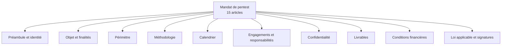

# 1.14 Construction d'un modèle de mandat de pentest

!!! quote "L'analogie du chef qui prépare ses mises en place"

    Avant le service du soir, un chef ne commence pas à éplucher ses légumes ou à préparer ses sauces. Tout doit être prêt à l'avance, dans des bacs étiquetés, dans un ordre qui permet l'exécution rapide quand le coup de feu arrive. C'est ce qu'on appelle la mise en place. Vos templates contractuels sont votre mise en place. Quand un client vous appelle un vendredi à 17h pour une mission urgente, vous ne devez pas commencer à rédiger un mandat à partir d'une page blanche. Vous devez avoir un template prêt, validé juridiquement, qu'il suffit d'adapter en 30 minutes. Ce chapitre vous donne ce template et vous explique chaque clause pour que vous sachiez l'adapter intelligemment.

## Métadonnées du chapitre

| Champ | Valeur |
|---|---|
| Durée estimée | 4 heures |
| Niveau | Pratique |
| Prérequis | Chapitres 1.1 à 1.13 |
| Livrables | Template mandat personnel finalisé |
| Auto-explication | 12 minutes |

## Objectifs pédagogiques

À la fin de ce chapitre, vous serez capable de :

- Disposer d'un modèle de mandat de pentest complet et utilisable.
- Comprendre la fonction de chaque clause.
- Adapter rapidement le modèle à différents types de missions.
- Identifier les clauses optionnelles et les clauses indispensables.
- Négocier les clauses avec un client averti.

---

## 1. Structure du mandat type

Un mandat de pentest professionnel s'articule en **15 articles** :



---

## 2. Le template complet commenté

Le template suivant est **prêt à l'emploi**. Adaptez les éléments entre crochets.

```text
================================================================
MANDAT DE TEST D'INTRUSION
Référence : MND-[ANNÉE]-[NUMÉRO]
================================================================

ENTRE LES SOUSSIGNÉS

[RAISON SOCIALE DU MANDANT], [forme juridique] au capital de [montant] €,
dont le siège social est situé [adresse complète], immatriculée au RCS
de [ville] sous le numéro [SIRET], représentée par [civilité, nom,
prénom], agissant en qualité de [fonction], dûment habilité aux fins
des présentes,

Ci-après dénommée "le Mandant", d'une part,

ET

OMNYVIA, [forme juridique] au capital de [montant] €, dont le siège
social est situé [adresse], immatriculée au RCS de [ville] sous le
numéro [SIRET], représentée par M. Alain GUILLON, agissant en qualité
de [fonction],

Ci-après dénommée "le Prestataire", d'autre part,

PRÉAMBULE

[1-2 paragraphes décrivant le contexte de la mission, la démarche
sécurité du Mandant, la motivation du recours au pentest. Exemple :]

Le Mandant exerce une activité de [secteur] et exploite un système
d'information dont la sécurité constitue un enjeu critique. Dans le
cadre de sa démarche de mise en conformité avec [référentiels
applicables : NIS2, RGPD article 32, ISO 27001, DORA selon le cas]
et de son programme de gestion des risques, le Mandant souhaite
faire évaluer la résistance de son système d'information à des
attaques ciblées par un Prestataire spécialisé.

Le Prestataire dispose des compétences, qualifications et moyens
nécessaires pour mener à bien la mission.

C'est dans ce cadre qu'il a été convenu ce qui suit.

================================================================
ARTICLE 1 - OBJET
================================================================

Le Mandant confie au Prestataire, qui accepte, la réalisation d'un
test d'intrusion de type [boîte noire / boîte grise / boîte blanche]
visant à évaluer la sécurité du système d'information du Mandant
selon les modalités définies au présent mandat.

[COMMENTAIRE : Distinguer clairement le type :
- Boîte noire : aucune information préalable, simulation attaquant externe
- Boîte grise : informations partielles (compte utilisateur fourni)
- Boîte blanche : accès complet, audit en profondeur]

================================================================
ARTICLE 2 - FINALITÉS
================================================================

La mission a pour finalités :

2.1 Identifier les vulnérabilités exploitables des systèmes ciblés ;

2.2 Évaluer leur criticité selon le référentiel CVSS 4.0 ;

2.3 Démontrer leur exploitabilité par des preuves de concept ;

2.4 Recommander des correctifs priorisés selon leur impact ;

2.5 Contribuer à la démarche de conformité [NIS2 / RGPD / etc.] du
    Mandant.

[COMMENTAIRE : Cette section permet de justifier le motif légitime
au sens de l'article 323-3-1 du Code pénal. Elle doit être précise.]

================================================================
ARTICLE 3 - PÉRIMÈTRE TECHNIQUE
================================================================

3.1 Périmètre inclus

Le Prestataire est expressément autorisé à effectuer des tests sur
les éléments suivants :

[LISTE EXHAUSTIVE - exemples :]
- Adresses IP : [LISTE COMPLÈTE]
- Plages réseau : [CIDR]
- Domaines : [LISTE], y compris sous-domaines [oui / non]
- Applications web : [LISTE avec URL]
- API : [LISTE avec endpoints]
- Réseaux Wi-Fi : [SSID, BSSID]
- Postes utilisateurs : [LISTE avec hostname ou IP]
- Serveurs : [LISTE avec rôle]

3.2 Périmètre exclu

Sont expressément exclus du périmètre, et ne doivent en aucun cas
faire l'objet de tests :

- Tous systèmes non listés au 3.1 ;
- Systèmes hébergés chez des tiers (cloud, SaaS, partenaires) sauf
  accord écrit du tiers concerné préalable ;
- Téléphones mobiles personnels et matériel BYOD des collaborateurs ;
- Systèmes des partenaires commerciaux du Mandant ;
- Systèmes appartenant à des tiers identifiables sur les plages
  réseau partagées ;
- [Tout autre élément à exclure expressément].

3.3 Cas de doute

En cas de doute sur l'inclusion d'un système dans le périmètre, le
Prestataire s'engage à interrompre immédiatement toute action et à
solliciter par écrit confirmation auprès du référent désigné en
article 6 avant de poursuivre.

[COMMENTAIRE CRITIQUE : Cette clause est votre PROTECTION PRINCIPALE.
Soyez exhaustif et explicite. Préférez deux pages d'énumération à
une formulation générale ambiguë.]

================================================================
ARTICLE 4 - PÉRIMÈTRE TEMPOREL
================================================================

4.1 Durée de la mission

La mission s'exécute du [DD/MM/YYYY HH:MM] au [DD/MM/YYYY HH:MM]
(heure de Paris).

4.2 Plages horaires autorisées

Les tests pouvant impacter les performances des systèmes en production
sont autorisés exclusivement durant les plages suivantes :

- En semaine : de [HH:MM] à [HH:MM] (heure de Paris) ;
- Week-end : sans restriction.

[COMMENTAIRE : Adaptez selon le métier du client. Une banque exige
souvent des nuits/week-end uniquement, un éditeur SaaS peut être
plus flexible.]

4.3 Suspensions et reprises

Le Mandant peut demander à tout moment la suspension de la mission
par notification écrite au Prestataire, sous réserve d'un préavis
raisonnable. Les modalités financières d'une suspension sont fixées
à l'article 12.

================================================================
ARTICLE 5 - MÉTHODES AUTORISÉES ET INTERDITES
================================================================

5.1 Méthodes autorisées

Le Prestataire est expressément autorisé à employer les méthodes
suivantes :

- Reconnaissance OSINT et active sur les périmètres définis ;
- Scan de ports et services ;
- Énumération des services et utilisateurs accessibles ;
- Exploitation de vulnérabilités identifiées ;
- Tests d'authentification et d'autorisation ;
- Brute force avec dictionnaires de mots de passe (limité à
  [N] tentatives par compte) ;
- Élévation de privilèges sur systèmes compromis ;
- Mouvement latéral dans le périmètre autorisé ;
- Test de persistance simulée (sans persistance permanente) ;
- [Si autorisé] Ingénierie sociale type phishing avec liste de
  cibles préalablement validée par écrit par [fonction du valideur].

5.2 Méthodes interdites

Sont absolument interdites :

- Tout déni de service réel sur des systèmes en production ;
- Toute modification, suppression ou altération de données ne pouvant
  être restaurée immédiatement ;
- Toute suppression de logs ou traces ;
- Toute installation de persistance permanente ;
- Toute exfiltration de données réelles au-delà du strict minimum
  nécessaire à la preuve de concept ;
- Toute action sur des données à caractère personnel sensibles
  (santé, biométrie, opinion politique ou syndicale) ;
- Toute communication des vulnérabilités identifiées à des tiers
  non autorisés.

================================================================
ARTICLE 6 - GOUVERNANCE
================================================================

6.1 Référents désignés

Le Mandant désigne comme référents pour la mission :

- Référent technique : [Nom, fonction, email, téléphone]
- Référent escalade : [Nom, fonction, email, téléphone]

Le Prestataire désigne comme référent :

- Chef de mission : Alain GUILLON [email, téléphone]

6.2 Communication

Toute communication relative à la mission s'effectue par email
sécurisé entre les référents désignés. Les échanges urgents (incident,
découverte critique) peuvent être réalisés par téléphone, suivis d'une
confirmation écrite dans un délai de 24 heures.

6.3 Réunion d'ouverture et de clôture

Une réunion d'ouverture sera tenue le [DATE] et une réunion de clôture
le [DATE], au format [présentiel / visio].

================================================================
ARTICLE 7 - CONFIDENTIALITÉ
================================================================

Les obligations de confidentialité applicables à la présente mission
sont définies dans l'accord de confidentialité distinct référencé
NDA-[ANNÉE]-[NUMÉRO] signé entre les Parties préalablement.

À défaut d'accord distinct, les Parties conviennent que les
informations échangées dans le cadre de la mission sont confidentielles
et ne peuvent être communiquées à des tiers, ni utilisées à d'autres
fins, pendant toute la durée de la mission et pendant 7 années après
son terme.

================================================================
ARTICLE 8 - ENGAGEMENTS DU PRESTATAIRE
================================================================

Le Prestataire s'engage à :

8.1 Respecter strictement le périmètre défini à l'article 3 ;

8.2 Employer exclusivement des outils et méthodes proportionnés et
    documentés ;

8.3 Tenir un journal d'actions horodaté permettant la traçabilité
    complète de la mission ;

8.4 Préserver les preuves recueillies selon les bonnes pratiques
    forensic ;

8.5 Notifier sans délai au Mandant toute découverte critique mettant
    en péril l'intégrité ou la disponibilité du système d'information ;

8.6 Coopérer pleinement en cas d'incident causé par les tests ;

8.7 Disposer d'une assurance responsabilité civile professionnelle
    couvrant l'activité de tests d'intrusion, dont une attestation
    sera fournie en annexe.

================================================================
ARTICLE 9 - ENGAGEMENTS DU MANDANT
================================================================

Le Mandant s'engage à :

9.1 Garantir au Prestataire la propriété ou les droits suffisants
    sur les systèmes inclus dans le périmètre ;

9.2 Mettre à disposition les accès, comptes test, et documentation
    nécessaires dans les délais convenus ;

9.3 Informer préalablement les équipes opérationnelles susceptibles
    d'être affectées (RSSI, équipe production, hébergeur) ;

9.4 Désigner un référent escalade joignable en permanence durant la
    mission ;

9.5 Régler les sommes dues selon l'échéancier de l'article 12.

================================================================
ARTICLE 10 - GESTION DES INCIDENTS
================================================================

10.1 Incident causé par le Prestataire

En cas d'incident accidentel causé par le Prestataire pendant la
mission, ce dernier s'engage à :

- Interrompre immédiatement les tests ;
- Notifier le Mandant sans délai ;
- Documenter précisément l'incident ;
- Coopérer pleinement à la remise en état ;
- Notifier son assureur RC professionnelle.

10.2 Incident découvert par le Prestataire

Si le Prestataire découvre pendant la mission un incident préexistant
non lié à ses tests (intrusion en cours, malware actif, fuite de
données), il en informe immédiatement le Mandant et stoppe ses tests
jusqu'à clarification.

================================================================
ARTICLE 11 - LIVRABLES
================================================================

11.1 Rapport intermédiaire

Un rapport intermédiaire est fourni à mi-mission, faisant état des
premières constatations.

11.2 Rapport final

Au terme de la mission, le Prestataire remet au Mandant un rapport
final comprenant :

- Synthèse exécutive (5 pages maximum) ;
- Méthodologie employée ;
- Liste des vulnérabilités identifiées avec criticité CVSS 4.0 ;
- Preuves d'exploitation (captures, scripts, logs) ;
- Recommandations correctives priorisées ;
- Plan d'action proposé avec délais ;
- Glossaire pour interlocuteurs non techniques ;
- Annexes (logs bruts, configurations).

11.3 Restitution

Une réunion de restitution orale est organisée dans les 15 jours
suivant la remise du rapport final.

11.4 Format

Les livrables sont remis sous format PDF signé numériquement, par
canal sécurisé convenu entre les Parties.

================================================================
ARTICLE 12 - CONDITIONS FINANCIÈRES
================================================================

12.1 Montant

Le montant total de la prestation s'élève à :
- Montant HT : [MONTANT] €
- TVA 20% : [MONTANT] €
- Montant TTC : [MONTANT] €

12.2 Modalités de paiement

- 30% à la signature du présent mandat
- 70% à la livraison du rapport final accepté

Les règlements s'effectuent par virement bancaire sur le compte du
Prestataire, dans un délai de 30 jours fin de mois suivant la facture.

12.3 Pénalités de retard

En cas de retard de paiement, des pénalités au taux de 3 fois le taux
légal sont applicables, ainsi qu'une indemnité forfaitaire de 40 €
pour frais de recouvrement (article D441-5 du Code de commerce).

================================================================
ARTICLE 13 - LIMITATION DE RESPONSABILITÉ
================================================================

13.1 Plafond

La responsabilité du Prestataire envers le Mandant au titre de la
présente mission est plafonnée à [MONTANT] € correspondant à [N]
fois le montant HT du présent mandat.

13.2 Exclusions

Cette limitation ne s'applique pas en cas de :
- Faute lourde ou intentionnelle du Prestataire ;
- Manquement à l'obligation de confidentialité ;
- Violation des engagements de l'article 8.

13.3 Force majeure

Aucune des Parties ne peut voir sa responsabilité engagée en cas de
force majeure au sens de l'article 1218 du Code civil.

================================================================
ARTICLE 14 - LOI APPLICABLE ET JURIDICTION
================================================================

14.1 Loi applicable

Le présent mandat est régi par le droit français.

14.2 Juridiction

À défaut de résolution amiable, tout litige relatif à l'interprétation
ou à l'exécution du présent mandat relève de la compétence exclusive
du Tribunal de commerce de [VILLE], y compris en cas de pluralité de
défendeurs ou d'appel en garantie.

14.3 Médiation préalable

Préalablement à toute saisine de la juridiction compétente, les Parties
s'engagent à tenter de résoudre leurs différends à l'amiable, par
recours à un médiateur indépendant, dans un délai maximum de 30 jours.

================================================================
ARTICLE 15 - DISPOSITIONS DIVERSES
================================================================

15.1 Intégralité de l'accord

Le présent mandat, ensemble avec ses annexes et le NDA référencé en
article 7, constitue l'intégralité de l'accord entre les Parties et
annule tout accord antérieur de même nature.

15.2 Avenants

Toute modification du présent mandat doit faire l'objet d'un avenant
écrit signé par les deux Parties.

15.3 Nullité partielle

Si une stipulation du présent mandat venait à être déclarée nulle ou
inapplicable, les autres stipulations resteraient pleinement en
vigueur.

15.4 Annexes

Sont annexées au présent mandat :

- Annexe 1 : Liste détaillée des systèmes inclus dans le périmètre
- Annexe 2 : Liste des comptes test fournis
- Annexe 3 : Plan de communication d'urgence
- Annexe 4 : Attestation d'assurance RC professionnelle du Prestataire
- Annexe 5 : Méthodologie standard du Prestataire

================================================================
SIGNATURES
================================================================

Fait en deux exemplaires originaux, à [VILLE], le [DD/MM/YYYY]

Pour le Mandant                       Pour le Prestataire
[NOM, PRÉNOM]                          Alain GUILLON
[FONCTION]                             [FONCTION]
[Signature + cachet]                   [Signature + cachet]
```

---

## 3. Adaptations selon les types de missions

### 3.1 Mission courte ou ponctuelle

Pour des missions courtes (1-3 jours), simplifiez :

- Suppression des articles avenant et médiation
- Périmètre temporel raccourci
- Modalités financières simplifiées (paiement unique)

### 3.2 Mission longue ou programme annuel

Pour des programmes annuels :

- Ajout d'une clause de **renouvellement tacite**
- Définition de **paliers** trimestriels
- Calcul à la **journée** pour mission élastique

### 3.3 Mission Red Team

Pour une approche Red Team réaliste :

- Périmètre élargi avec exclusions strictes
- Périmètre temporel ouvert
- Référent unique d'urgence joignable 24/7
- Procédure d'**arrêt immédiat** sur appel

### 3.4 Mission forensic post-incident

Pour du forensic en réponse à un incident :

- Article 1 : **investigation** au lieu de pentest
- Méthodes : **acquisition et analyse**, pas exploitation
- Périmètre : **systèmes touchés** uniquement
- Délais : urgents (24-72h)

---

## 4. Pièges fréquents

### Piège 1 - Périmètre flou

"Tous les systèmes du Mandant" est trop vague. Énumérez explicitement.

### Piège 2 - Signataire non habilité

Vérifiez le K-bis avant signature.

### Piège 3 - Pas d'annexe technique

L'annexe 1 (liste détaillée des systèmes) doit être aussi exhaustive que la clause générale.

### Piège 4 - Plafond de responsabilité absent

Sans plafond, votre responsabilité peut atteindre des montants disproportionnés.

### Piège 5 - Pas de clause de force majeure

En cas de blocage indépendant de votre volonté, vous restez engagé.

---

## 5. Conservation et archivage

| Document | Durée minimale |
|---|---|
| Mandat signé | 10 ans après fin mission |
| NDA signé | 10 ans après fin engagement |
| Rapport final | 10 ans |
| Logs et journaux | 5 ans (au moins) |
| Échanges email professionnels | 5 ans |

Stockage recommandé : **coffre-fort numérique chiffré**, redondance 3-2-1 (3 copies, 2 supports, 1 hors site).

---

## 6. Auto-évaluation

| # | Question | Réponse attendue |
|---|---|---|
| 1 | Combien d'articles dans le mandat type ? | 15 |
| 2 | Article qui définit le périmètre ? | Article 3 |
| 3 | Délai de paiement standard ? | 30 jours fin de mois |
| 4 | Article qui plafonne la responsabilité ? | Article 13 |
| 5 | Durée d'archivage du mandat ? | 10 ans minimum |
| 6 | Annexe la plus critique ? | Annexe 1 - Liste détaillée des systèmes |

---

## 7. Manipulation pratique

### Exercice 7.1 - Adapter le template

Adaptez le template ci-dessus pour une mission type sur ARTECH :

- Durée : 2 semaines
- Périmètre : LAN ARTECH 192.168.50.0/24 + serveur Linux 192.168.50.10 + 2 postes Windows
- Méthode : boîte grise (compte utilisateur fourni)
- Budget : 25 000 € HT

Produisez le document complet, signez-le, archivez-le. C'est votre **mandat type** que vous réutiliserez sur de futurs cas.

### Exercice 7.2 - Annexe 1 type

Construisez une annexe 1 type avec énumération exhaustive :

```text
ANNEXE 1 - LISTE DÉTAILLÉE DES SYSTÈMES INCLUS DANS LE PÉRIMÈTRE
==================================================================

1. INFRASTRUCTURES RÉSEAU

1.1 Réseau Wi-Fi
- SSID : ARTECH-WIFI
- BSSID : XX:XX:XX:XX:XX:XX
- Bande : 2,4 GHz / 5 GHz
- Sécurité actuelle : WPA2-PSK

1.2 LAN interne
- Plage : 192.168.50.0/24
- Routeur : 192.168.50.1 (TP-Link Archer C7 OpenWrt)
- DHCP : 192.168.50.100-200

2. SERVEURS

2.1 Serveur Linux
- Adresse : 192.168.50.10
- OS : Debian 12 stable
- Services : SSH (22/TCP), Samba (445/TCP), Apache (80, 443/TCP)
- Rôle : intranet, partage fichiers

3. POSTES UTILISATEURS

3.1 Poste 1 - Comptabilité
- Adresse IP attribuée : 192.168.50.150
- Hostname : ARTECH-COMPTA-01
- OS : Windows 11 Pro 24H2
- Compte test fourni : pentest_compta / [mdp]

3.2 Poste 2 - Stagiaire
- Adresse IP attribuée : 192.168.50.151
- Hostname : ARTECH-STAGE-01
- OS : Windows 11 Pro 24H2
- Compte test fourni : pentest_stage / [mdp]
```

---

## 8. Synthèse mémo

```text
MANDAT DE PENTEST - 15 ARTICLES

Articles critiques :
  1.  Objet
  3.  Périmètre technique (LE PLUS IMPORTANT)
  5.  Méthodes autorisées et interdites
  10. Gestion des incidents
  13. Limitation de responsabilité

À adapter par mission :
  Identification parties
  Périmètre et annexe 1
  Périmètre temporel
  Conditions financières

Pièges fréquents :
  Périmètre flou
  Signataire non habilité
  Annexe technique absente
  Pas de plafond responsabilité
  Pas de force majeure

Archivage : 10 ans minimum
```

---

## 9. Auto-explication

Pour valider ce chapitre, enregistrez une vidéo de 12 minutes :

1. Structure du mandat (2 minutes)
2. Articles critiques (3 minutes)
3. Adaptations par type de mission (2 minutes)
4. Pièges fréquents (2 minutes)
5. Démonstration d'adaptation rapide (3 minutes)

---

**Chapitre précédent** : [1.13 Affaires récentes 2020-2025](01-13-affaires-recentes.md)

**Chapitre suivant** : [1.15 Construction d'un modèle de NDA](01-15-modele-nda.md)
