# Construction d'un modèle de mandat de pentest

<div
  class="omny-meta"
  data-level="🔴 Exhaustif"
  data-version="Modèle 2026"
  data-time="4 heures">
</div>

!!! note "**Livrables :** _Template de mandat personnel finalisé_"
!!! note "**Auto-explication :** _12 minutes_"

<br>

---

<br>

!!! quote "L'analogie du chef qui prépare ses mises en place"

    Avant le service du soir, un chef cuisinier ne commence pas à éplucher ses légumes ou à préparer ses sauces à la demande. Tout doit être prêt à l'avance, dans des bacs étiquetés, dans un ordre qui permet l'exécution ultra-rapide quand le coup de feu arrive. C'est ce qu'on appelle "la mise en place". Vos templates contractuels sont votre mise en place. Quand un client vous appelle un vendredi à 17h pour une mission urgente (réponse à incident), vous ne devez pas commencer à rédiger un mandat à partir d'une page blanche. Vous devez avoir un template "blindé" juridiquement, qu'il suffit d'adapter en 30 minutes. Ce chapitre vous donne ce template et vous explique chaque clause.

## Objectifs pédagogiques

!!! tip "À la fin de ce chapitre, vous serez capable de :"

    - Disposer d'un modèle de mandat de pentest/forensic complet et opposable.
    - Comprendre la fonction protectrice de chaque clause.
    - Adapter rapidement le modèle à différents types de missions (Boîte Noire vs Incident).
    - Identifier les pièges de négociation contractuelle.

<br>

---

<br>

## Structure d'un Mandat Professionnel

Un mandat de pentest sérieux et juridiquement inattaquable s'articule autour de **15 articles distincts**.

```mermaid
flowchart TB
    A["MANDAT DE PENTEST<br>Les 15 Articles"]
    A --> B["1. Préambule et Objet"]
    A --> C["2. Finalités de l'Audit"]
    A --> D["3. Périmètre Technique"]
    A --> E["4. Fenêtre Temporelle"]
    A --> F["5. Méthodologie (Autorisée/Interdite)"]
    A --> G["6. Gouvernance et Contacts"]
    A --> H["7. Clause de Confidentialité"]
    A --> I["8. Engagements Prestataire"]
    A --> J["9. Engagements Client"]
    A --> K["10. Gestion des Incidents"]
    A --> L["11. Livrables et Restitution"]
    A --> M["12. Conditions Financières"]
    A --> N["13. Limitation de Responsabilité"]
    A --> O["14. Juridiction compétente"]
    A --> P["15. Signatures et Annexes"]
```



<br>

---

<br>

## Le Template Complet (Prêt à l'emploi)

> Le texte ci-dessous est un gabarit. Les `[CROCHETS]` indiquent les variables à remplir. Les commentaires pédagogiques sont intégrés entre les clauses pour justifier leur présence.

<br>

!!! abstract "En-tête et Identification des parties"

    ```text
    ================================================================
    MANDAT DE TEST D'INTRUSION / AUDIT DE SÉCURITÉ
    Référence : MND-[ANNÉE]-[NUMÉRO]
    ================================================================
    
    ENTRE LES SOUSSIGNÉS :
    
    [RAISON SOCIALE DU CLIENT], [Forme juridique ex: SAS] au capital de [Montant] €, 
    dont le siège social est situé [Adresse complète], immatriculée au RCS de [Ville] 
    sous le numéro [SIRET], représentée par [Civilité, Nom, Prénom], agissant en qualité 
    de [Fonction : DG, PDG], dûment habilité aux fins des présentes.
    Ci-après dénommée "le Mandant", d'une part,
    
    ET
    
    [VOTRE SOCIÉTÉ OMNYVIA], [Forme juridique] au capital de [Montant] €, 
    dont le siège social est situé [Adresse], immatriculée au RCS de [Ville] 
    sous le numéro [SIRET], représentée par [Votre Nom], agissant en qualité de [Fonction].
    Ci-après dénommée "le Prestataire", d'autre part.
    ```

!!! warning "L'importance de l'habilitation"
    Si le signataire côté "Mandant" n'est pas le Directeur Général ou le Président, vous devez exiger qu'il fournisse une **Délégation de Pouvoir** officielle l'autorisant à signer ce type de contrat. Sinon, le mandat est nul.

<br>

!!! abstract "Articles 1 et 2 - Contexte et Motif légitime"

    ```text
    PRÉAMBULE
    Le Mandant exploite un système d'information dont la sécurité constitue un enjeu critique. 
    Dans le cadre de sa démarche de mise en conformité avec [référentiels applicables : NIS2, RGPD, DORA] 
    et de son programme de gestion des risques, le Mandant souhaite faire évaluer la résistance 
    de son système d'information à des attaques ciblées par un Prestataire spécialisé.
    
    ARTICLE 1 - OBJET
    Le Mandant confie au Prestataire la réalisation d'un test d'intrusion de type 
    [Boîte noire / Boîte grise / Boîte blanche] visant à évaluer la sécurité de son 
    système d'information selon les modalités définies au présent mandat.
    
    ARTICLE 2 - FINALITÉS
    La mission a pour finalités :
    1. L'identification des vulnérabilités exploitables.
    2. L'évaluation de leur criticité (CVSS 4.0).
    3. La fourniture d'un plan de remédiation technique.
    ```

<br>

!!! abstract "Articles 3 et 4 - Le Bouclier Juridique (Périmètre)"

    ```text
    ARTICLE 3 - PÉRIMÈTRE TECHNIQUE
    
    3.1 Périmètre inclus et autorisé
    Le Prestataire est expressément autorisé à effectuer des tests sur les éléments listés 
    en Annexe 1, et notamment :
    - Adresses IP publiques : [10.10.10.10 à 10.10.10.20]
    - Domaines : [api.entreprise.com, *.entreprise.com]
    - Applications : [https://portail.entreprise.com]
    
    3.2 Périmètre exclu
    Sont expressément exclus du périmètre, et ne doivent en aucun cas faire l'objet de tests :
    - Les systèmes hébergés chez des tiers (Cloud, SaaS) sauf accord écrit de l'hébergeur.
    - Les systèmes mobiles personnels des collaborateurs (BYOD).
    - Les systèmes appartenant aux partenaires ou clients du Mandant.
    
    ARTICLE 4 - FENÊTRE TEMPORELLE
    La mission s'exécute du [DD/MM/YYYY HH:MM] au [DD/MM/YYYY HH:MM] (Heure de Paris).
    Les tests pouvant impacter la disponibilité de la production sont autorisés 
    exclusivement de nuit : de [22h00] à [05h00].
    ```

!!! danger "Tolérance Zéro"
    Le périmètre technique est la clause la plus importante de tout le contrat. Ce qui n'est pas explicitement inclus au point 3.1 relève de l'attaque criminelle (Loi Godfrain). Ne signez jamais une clause du type *"Toute l'infrastructure de l'entreprise"*.

<br>

!!! abstract "Article 5 - Les Règles d'engagement (RoE)"

    ```text
    ARTICLE 5 - MÉTHODES AUTORISÉES ET INTERDITES
    
    5.1 Méthodes autorisées
    Le Prestataire est autorisé à employer :
    - Le scan de ports et l'énumération des services.
    - L'exploitation active des vulnérabilités (Exploits).
    - Le brute-force hors production ou sur les comptes de test.
    - L'ingénierie sociale (Phishing) sur une liste de collaborateurs préalablement validée.
    
    5.2 Méthodes absolument interdites
    Sont interdites sous peine de rupture immédiate du contrat :
    - Les attaques en déni de service (DDoS).
    - L'effacement ou la modification irréversible de données de production.
    - L'effacement des journaux de logs du Mandant.
    - L'exfiltration de bases de données réelles (La preuve de concept sur 1 ligne suffit).
    ```

<br>

!!! abstract "Articles 10 et 13 - Le Filet de Sécurité"

    ```text
    ARTICLE 10 - GESTION DES INCIDENTS (Kill Switch)
    En cas d'incident accidentel causé par les tests (Coupure de service), le Prestataire 
    s'engage à interrompre immédiatement l'audit, à notifier le Mandant, et à coopérer 
    totalement pour la remise en état.
    
    ARTICLE 13 - LIMITATION DE RESPONSABILITÉ
    La responsabilité du Prestataire envers le Mandant au titre de la présente mission 
    est expressément plafonnée à la somme de [MONTANT ex: 100 000] €, ou [X] fois le montant 
    du présent contrat. Cette limitation ne s'applique pas en cas de faute lourde ou intentionnelle.
    ```

!!! tip "La RC Pro"
    L'Article 13 est crucial pour votre assurance Responsabilité Civile Professionnelle (RC Pro). En plafonnant votre responsabilité, vous garantissez à votre assureur que le risque financier maximal est encadré. Sans ce plafond, votre assureur pourrait refuser de vous couvrir en cas de litige à plusieurs millions d'euros.

<br>

---

<br>

## Les Variantes du Template

Un bon professionnel ne fige jamais son template. Il l'adapte selon la mission.

### Cas N°1 : La Réponse à Incident (Forensic)
Si le client vous appelle en urgence parce qu'il subit une cyberattaque :
- Transformez l'Article 1 (Objet) : Ce n'est plus un Pentest, c'est une mission **"d'Investigation Numérique et de Réponse à Incident (DFIR)"**.
- Transformez l'Article 5 (Méthodes) : Supprimez les méthodes offensives. Vous êtes là pour faire des "Acquisitions de RAM, captures de disques et reverse-engineering de malwares".

### Cas N°2 : La mission "Red Team"
Si le client demande un audit hyper-réaliste sans aucune règle (Simulation d'un groupe APT) :
- L'Article 4 (Temporel) devient : *"Autorisation d'action 24h/24, 7j/7"*.
- L'Article 3 (Périmètre) s'élargit aux locaux physiques (Intrusion physique, crochetage) si et seulement si cela est spécifié.

<br>

---

<br>

## Pièges Fréquents de Négociation

### Le refus du NDA séparé
Le client veut inclure 3 lignes de confidentialité dans le mandat et refuse de signer un NDA (Non-Disclosure Agreement) de 5 pages. 
> **Votre réponse :** *Le NDA protège les secrets industriels de votre entreprise sur 10 ans. 3 lignes dans un mandat ne suffisent pas légalement à vous couvrir en cas de fuite.*

### Le "Mandat Parapluie" Annuel
Le client vous fait signer un mandat valable 1 an qui dit "Pentestez ce que vous voulez, quand vous voulez".
> **Le Risque :** En cas d'incident de production, l'assurance refusera de payer car le périmètre et les dates d'intervention n'étaient pas circonscrits. Exigez un avenant spécifique de 2 pages à chaque nouvelle campagne de test.

<br>

---

<br>

## Manipulation pratique - Exercices

### Exercice 1 - La faille de l'Annexe

> Un client valide votre mandat mais vous fournit une Annexe 1 contenant la phrase suivante : *"Le périmètre inclut l'application CRM, le site web public et toutes les instances AWS liées à ces projets"*.
> 
> Pourquoi refusez-vous de signer cette annexe ?

!!! quote "Solution"

    La mention *"Toutes les instances AWS liées"* est juridiquement toxique car **imprécise**.
    1. Qui détermine si une instance est "liée" ou non au projet ?
    2. Sur quelle plage IP le consultant doit-il tirer ?
    3. Si l'instance AWS "liée" sert aussi de base de données à un projet totalement différent (Production financière), le consultant va attaquer un serveur hors périmètre fonctionnel sans le savoir.
    **Correction exigée :** Obtenir la liste exacte et fermée des adresses IP ou des URL des instances AWS autorisées.

<br>

### Exercice 2 - L'Avenant de dernière minute

Vous auditez le serveur `10.0.0.50` comme prévu par le contrat. En exploitant ce serveur, vous découvrez qu'il donne un accès "Root" béant vers le serveur `10.0.0.99` (Le coffre-fort des mots de passe du client). Vous appelez le DSI, qui vous dit : *"Génial ! Allez-y, attaquez le 99 pour voir si vous pouvez en extraire les clés !"*.
Que faites-vous concrètement dans la minute qui suit ?

!!! quote "Solution"

    1. Vous **stoppez** toute attaque.
    2. Vous rédigez un email ou un avenant ultra-court (1 page) : *"Suite à notre échange téléphonique, le Mandant autorise le Prestataire à étendre le périmètre de test au serveur 10.0.0.99 selon les mêmes règles d'engagement."*
    3. Vous exigez un retour *"Bon pour accord"* par email du DSI (s'il est le signataire habilité).
    4. Seulement après réception de la trace écrite, vous reprenez l'attaque. L'ordre vocal du DSI n'a aucune valeur juridique en cas de crash du coffre-fort.

<br>

---

<br>

## Auto-évaluation

!!! question "Testez vos connaissances"
    1. Si un mandat stipule que les tests sont autorisés de "18h00 à 06h00", et que vous lancez un script automatisé qui s'achève à 06h45, quelle infraction risquez-vous théoriquement ?
    2. Pourquoi un mandat de pentest doit-il explicitement "interdire" les attaques en Déni de Service (DDoS) ?
    3. Quelle est l'utilité principale de la clause de "Limitation de responsabilité" vis-à-vis de votre entreprise ?
    4. Vrai ou Faux : Un mandat de pentest correctement rédigé vous protège si vous piratez le téléphone personnel (BYOD) d'un salarié depuis le réseau de l'entreprise.

<br>

---

<br>

## Synthèse mémo

!!! success "À retenir absolument"
    
    **Le Mandat : Votre unique Gilet Pare-Balles**
    
    - **L'Obligation de Précision :** Un périmètre technique (Adresses IP, URLs) ne se présume pas, il s'écrit de manière chirurgicale. Ce qui n'est pas écrit est pénalement interdit (Loi Godfrain).
    - **Le Garde-Fou des Méthodes :** Interdire explicitement le DDoS et la destruction de données protège la disponibilité du SI du client et vous protège d'une erreur de manipulation de vos propres outils.
    - **L'Évolutivité :** Le mandat n'est pas un bloc figé de béton. Si le contexte change pendant le test (découverte d'un rebond intéressant), l'Avenant (même par simple échange d'emails actant l'accord de la direction) est l'outil d'agilité légale par excellence.

<br>

---

<br>

## Conclusion

!!! quote "Ce qu'il faut retenir"
    Un mandat de pentest mal rédigé est un piège à retardement. Il rassure faussement le consultant au moment de la signature, mais s'effondre face au premier juge en cas de plainte. En maîtrisant la rédaction des 15 articles de ce contrat, vous ne faites pas du droit pour le plaisir de faire du droit : vous protégez votre responsabilité civile, vous sécurisez vos honoraires, et vous prouvez à votre client que la cybersécurité offensive est une science d'ingénieur, pas un passe-temps de cambrioleur.

> [Chapitre suivant : 1.15 Construction d'un modèle de NDA →](01-15-modele-nda.md)
>
> [Retour à l'index →](./index.md)

<br>
