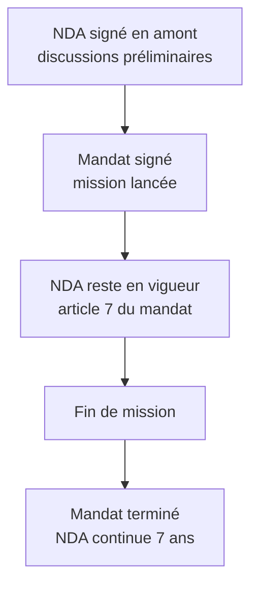

# 1.15 Construction d'un modèle de NDA

!!! quote "L'analogie du coffre-fort partagé"

    Quand un client confie ses bijoux à une banque, deux choses doivent exister : un coffre physique sécurisé et un contrat précis sur qui peut accéder, dans quelles conditions, sous quelles sanctions. Le coffre seul sans contrat laisse la banque libre. Le contrat seul sans coffre est lettre morte. Pour vos missions, le coffre c'est votre infrastructure technique de protection des données. Le contrat c'est le NDA. Ensemble, ils protègent à la fois votre client et vous-même. Ce chapitre vous donne un NDA prêt à l'emploi.

## Métadonnées du chapitre

| Champ | Valeur |
|---|---|
| Durée estimée | 2 heures |
| Niveau | Pratique |
| Prérequis | Chapitres 1.1 à 1.14 |
| Livrables | Template NDA personnel finalisé |
| Auto-explication | 8 minutes |

## Objectifs pédagogiques

À la fin de ce chapitre, vous serez capable de :

- Disposer d'un modèle de NDA complet et utilisable.
- Comprendre la fonction de chaque clause.
- Adapter le modèle à différents contextes (NDA bilatéral, unilatéral, multipartite).
- Identifier les pièges contractuels.

---

## 1. Structure d'un NDA professionnel

Un NDA professionnel comporte **12 articles** :

| # | Article | Fonction |
|---|---|---|
| 1 | Objet | Définit la finalité du NDA |
| 2 | Définitions | Précise les termes (informations confidentielles, etc.) |
| 3 | Engagements de confidentialité | Cœur du document |
| 4 | Exceptions | Cas où la confidentialité ne s'applique pas |
| 5 | Durée | Durée des obligations |
| 6 | Restitution | Sort des informations en fin |
| 7 | Sanctions | Conséquences d'une violation |
| 8 | Communication forcée | Cas judiciaires |
| 9 | Indépendance | Pas de cession de droits |
| 10 | Force majeure | Cas d'exonération |
| 11 | Loi applicable | Droit + juridiction |
| 12 | Dispositions diverses | Avenants, intégralité |

---

## 2. Le template complet

```text
================================================================
ACCORD DE CONFIDENTIALITÉ - NDA
Référence : NDA-[ANNÉE]-[NUMÉRO]
================================================================

ENTRE LES SOUSSIGNÉS

[RAISON SOCIALE], [forme juridique] au capital de [montant] €,
sise [adresse], immatriculée au RCS de [ville] sous le numéro
[SIRET], représentée par [nom, prénom, fonction],

Ci-après dénommée "le Mandant", d'une part,

ET

OMNYVIA, [forme juridique] au capital de [montant] €, sise
[adresse], immatriculée au RCS de [ville] sous le numéro
[SIRET], représentée par M. Alain GUILLON, [fonction],

Ci-après dénommée "le Prestataire", d'autre part,

Ci-après dénommées individuellement la "Partie" et collectivement
les "Parties".

PRÉAMBULE

Dans le cadre de la mission de [test d'intrusion / forensic /
audit] définie au mandat MND-[ANNÉE]-[NUMÉRO] du [DATE], les
Parties seront amenées à échanger des informations confidentielles.

Les Parties souhaitent encadrer ces échanges par le présent accord
afin de préserver la confidentialité de leurs informations
respectives.

================================================================
ARTICLE 1 - OBJET
================================================================

Le présent accord a pour objet de définir les conditions dans
lesquelles les Parties s'engagent à protéger les informations
confidentielles échangées dans le cadre de leurs relations.

================================================================
ARTICLE 2 - DÉFINITIONS
================================================================

2.1 "Informations Confidentielles" désigne toutes informations,
quels qu'en soient la nature, le support et le format, échangées
entre les Parties dans le cadre de leurs relations, identifiées
ou non comme confidentielles.

Sont notamment couvertes :

a) Informations techniques : architecture des systèmes d'information,
configurations, code source, identifiants et secrets, vulnérabilités
identifiées, logs, captures, données d'investigation, méthodologies
employées, outils, scripts ;

b) Informations commerciales : clientèle, contrats commerciaux,
tarifs, marges, stratégie commerciale, politiques de prix ;

c) Informations relatives au personnel : organigramme, contrats,
rémunérations, données RH ;

d) Informations relatives à la propriété intellectuelle : brevets,
savoir-faire, secrets d'affaires, projets de recherche ;

e) Informations stratégiques : projets en cours, partenariats,
acquisitions, fusions, restructurations ;

f) Données à caractère personnel au sens du RGPD.

2.2 "Partie Émettrice" désigne la Partie qui transmet une
Information Confidentielle.

2.3 "Partie Réceptrice" désigne la Partie qui reçoit une
Information Confidentielle.

================================================================
ARTICLE 3 - ENGAGEMENTS
================================================================

Chaque Partie, en qualité de Partie Réceptrice, s'engage à :

3.1 Préserver le caractère confidentiel des Informations
Confidentielles reçues, en mettant en œuvre les mesures de
sécurité techniques et organisationnelles appropriées :

- Stockage chiffré (AES-256 minimum)
- Accès limité aux seules personnes nécessaires
- Authentification multifacteur
- Journalisation des accès
- Sauvegardes chiffrées

3.2 Ne pas divulguer les Informations Confidentielles à des
tiers, sauf :

- À ses propres salariés ou prestataires strictement nécessaires
  à l'exécution de la mission, soumis à un engagement de
  confidentialité au moins équivalent ;
- Sur réquisition judiciaire après notification préalable de la
  Partie Émettrice lorsque cela est légalement possible (article 8) ;

3.3 N'utiliser les Informations Confidentielles que pour les
seuls besoins de la mission, à l'exclusion de tout autre usage ;

3.4 Ne pas reproduire ou exploiter les Informations Confidentielles
au-delà du nécessaire ;

3.5 Notifier à la Partie Émettrice, sans délai et au plus tard
sous 24 heures, toute violation suspectée ou avérée de la
confidentialité.

================================================================
ARTICLE 4 - EXCEPTIONS
================================================================

Les obligations du présent accord ne s'appliquent pas aux
informations qui :

4.1 Étaient déjà publiques au moment de leur communication ;

4.2 Sont devenues publiques sans faute de la Partie Réceptrice ;

4.3 Étaient déjà légitimement détenues par la Partie Réceptrice
avant leur communication, sous réserve de preuve documentée ;

4.4 Sont communiquées à la Partie Réceptrice par un tiers de
bonne foi sans obligation de confidentialité ;

4.5 Sont indépendamment développées par la Partie Réceptrice
sans utilisation des Informations Confidentielles, sous réserve
de preuve documentée.

================================================================
ARTICLE 5 - DURÉE
================================================================

5.1 Le présent accord prend effet à la date de sa signature.

5.2 Les obligations de confidentialité s'appliquent pendant
toute la durée de la mission et pendant 7 années après son
terme, indépendamment de la cause de cessation.

5.3 Pour les Informations Confidentielles particulièrement
sensibles (vulnérabilités identifiées, secrets cryptographiques,
données à caractère personnel), la durée est portée à 10 années.

================================================================
ARTICLE 6 - RESTITUTION OU DESTRUCTION
================================================================

6.1 Au terme de la mission, ou sur demande écrite de la Partie
Émettrice, la Partie Réceptrice procède, à l'option de la Partie
Émettrice :

- Soit à la restitution de l'ensemble des Informations
Confidentielles ;
- Soit à leur destruction sécurisée (effacement cryptographique,
broyage support physique).

6.2 Délai

Cette restitution ou destruction intervient dans un délai maximum
de 30 jours suivant la demande.

6.3 Attestation

La Partie Réceptrice fournit à la Partie Émettrice une attestation
écrite de restitution ou de destruction.

6.4 Conservation légale

La Partie Réceptrice peut conserver les Informations Confidentielles
nécessaires au respect de ses obligations légales (par exemple,
conservation comptable, archives judiciaires) pendant les durées
prescrites par la loi.

================================================================
ARTICLE 7 - SANCTIONS
================================================================

7.1 Pénalité forfaitaire

En cas de violation du présent accord, la Partie défaillante
s'expose à une pénalité forfaitaire de [50 000 à 200 000] € par
violation constatée.

7.2 Dommages-intérêts complémentaires

Cette pénalité forfaitaire ne fait pas obstacle à la réparation
intégrale du préjudice subi par la Partie Émettrice, sur la base
des éléments justificatifs.

7.3 Mesures conservatoires

La Partie Émettrice peut solliciter en référé toute mesure
conservatoire utile (injonction de cessation, séquestre).

7.4 Action pénale

La Partie défaillante peut également être poursuivie pénalement
sur le fondement notamment des articles 226-13, 226-15, 323-1 à
323-3-1 du Code pénal selon les circonstances.

================================================================
ARTICLE 8 - COMMUNICATION FORCÉE
================================================================

En cas de demande de communication d'Informations Confidentielles
par une autorité administrative ou judiciaire (réquisition,
ordonnance), la Partie Réceptrice :

8.1 Notifie immédiatement la Partie Émettrice, dans la mesure où
cela est légalement permis ;

8.2 Limite la communication aux seules informations explicitement
demandées ;

8.3 Soutient les éventuelles démarches de la Partie Émettrice
pour limiter la portée de la demande.

================================================================
ARTICLE 9 - ABSENCE DE CESSION DE DROITS
================================================================

Le présent accord ne confère aucun droit à la Partie Réceptrice
sur les Informations Confidentielles communiquées. Aucune licence,
explicite ou implicite, n'est consentie sur les droits de propriété
intellectuelle attachés à ces informations.

================================================================
ARTICLE 10 - FORCE MAJEURE
================================================================

Aucune des Parties ne peut être tenue pour responsable du
non-respect de ses obligations en cas de force majeure au sens
de l'article 1218 du Code civil. La Partie empêchée notifie
l'événement à l'autre Partie dans les meilleurs délais.

================================================================
ARTICLE 11 - LOI APPLICABLE ET JURIDICTION
================================================================

11.1 Le présent accord est régi par le droit français.

11.2 Tout litige relatif à son interprétation ou à son exécution
relève de la compétence exclusive du Tribunal de commerce de
[VILLE], y compris en cas de pluralité de défendeurs ou d'appel
en garantie.

11.3 Préalablement à toute saisine, les Parties tentent une
résolution amiable dans un délai de 30 jours.

================================================================
ARTICLE 12 - DISPOSITIONS DIVERSES
================================================================

12.1 Intégralité de l'accord

Le présent accord constitue l'intégralité de l'accord entre les
Parties sur la confidentialité et annule tout accord antérieur
de même nature.

12.2 Modifications

Toute modification du présent accord doit faire l'objet d'un
avenant écrit signé par les deux Parties.

12.3 Indépendance des stipulations

Si une stipulation du présent accord venait à être déclarée
nulle, les autres stipulations resteraient pleinement en vigueur.

12.4 Cession

Aucune des Parties ne peut céder le présent accord sans accord
préalable écrit de l'autre Partie.

================================================================
SIGNATURES
================================================================

Fait en deux exemplaires originaux, à [VILLE], le [DD/MM/YYYY]

Pour le Mandant                       Pour le Prestataire
[NOM, PRÉNOM]                          Alain GUILLON
[FONCTION]                             [FONCTION]
[Signature + cachet]                   [Signature + cachet]
```

---

## 3. Adaptations spécifiques

### 3.1 NDA unilatéral

Si seul le Prestataire reçoit des informations (cas inhabituel), simplifiez en :

- Article 3 ne s'applique qu'au Prestataire
- Article 6 ne concerne que la restitution par le Prestataire

**Recommandation** : préférer toujours un NDA **bilatéral** (mutuel). Vous communiquez aussi des informations confidentielles (méthodologies, outils internes).

### 3.2 NDA multipartite

Pour un projet impliquant plusieurs prestataires :

- Liste des Parties élargie
- Engagements croisés entre toutes
- Clause spécifique sur la communication entre Parties

### 3.3 NDA de courte durée

Pour des missions ponctuelles (audit flash, diagnostic) :

- Durée 3 ans plutôt que 7
- Pénalités forfaitaires réduites
- Restitution dans 15 jours

### 3.4 NDA renforcé pour secteurs sensibles

Pour banque, défense, santé :

- Durée portée à 10-15 ans
- Pénalités élevées (200 000 € ou plus)
- Habilitations explicitement requises
- Audit préalable du prestataire

---

## 4. Articulation NDA et mandat



**Pratique recommandée** : signer le NDA **avant** le mandat. Cela protège les échanges de pré-qualification.

---

## 5. Pièges fréquents

### Piège 1 - NDA reçu du client à signer aveuglément

Lisez intégralement avant signature. Vérifiez :

- Caractère bilatéral
- Durée raisonnable
- Sanctions proportionnées
- Loi française applicable

### Piège 2 - NDA imposant juridiction étrangère

Refusez les NDA soumis au droit californien, anglais, ou autre. En cas de litige, vos coûts seraient prohibitifs.

### Piège 3 - Définition trop restrictive des informations

Certains NDA limitent les informations confidentielles à celles "expressément marquées confidentiel". C'est dangereux : il faudrait marquer chaque email, chaque schéma. Préférez une définition large.

### Piège 4 - Durée limitée à 1-2 ans

Insuffisant pour des informations sensibles. **Minimum 5 ans, idéalement 7-10 ans**.

### Piège 5 - Pas de pénalités forfaitaires

Sans pénalités forfaitaires, vous devez prouver le préjudice exact, ce qui est difficile pour des informations confidentielles. Les pénalités forfaitaires simplifient.

---

## 6. Auto-évaluation

| # | Question | Réponse attendue |
|---|---|---|
| 1 | Combien d'articles dans un NDA professionnel ? | 12 |
| 2 | Durée recommandée des obligations ? | 7 ans, 10 pour sensible |
| 3 | Signer le NDA avant ou après le mandat ? | Avant |
| 4 | Pénalité forfaitaire recommandée ? | 50 000 à 200 000 € |
| 5 | Délai de restitution standard ? | 30 jours |
| 6 | NDA unilatéral ou bilatéral ? | Préférer bilatéral |

---

## 7. Manipulation pratique

Adaptez le template pour ARTECH et signez-le **avant** le mandat. Archivez-le dans votre dossier dédié.

---

## 8. Synthèse mémo

```text
NDA - 12 ARTICLES

Articles critiques :
  2.  Définitions (large)
  3.  Engagements
  5.  Durée (7-10 ans)
  7.  Sanctions
  11. Loi applicable

Pièges :
  Définition trop restrictive
  Durée trop courte
  Loi étrangère
  Pas de pénalités

Pratique :
  Signer AVANT le mandat
  Bilatéral toujours
  Archiver 10 ans
```

---

## 9. Auto-explication

Pour valider ce chapitre, enregistrez une vidéo de 8 minutes :

1. Différence NDA / mandat (2 minutes)
2. Articles critiques du NDA (3 minutes)
3. Pièges fréquents (2 minutes)
4. Démonstration adaptation rapide (1 minute)

---

**Chapitre précédent** : [1.14 Construction d'un modèle de mandat](01-14-modele-mandat.md)

**Chapitre suivant** : [1.16 Synthèse personnelle - Carnet juridique permanent](01-16-synthese-carnet-juridique.md)
