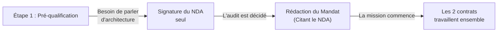

# Construction d'un modèle de NDA

<div
  class="omny-meta"
  data-level="🟡 Standard"
  data-version="Modèle 2026"
  data-time="2 heures">
</div>

!!! note "**Livrables :** _Template NDA personnel finalisé_"
!!! note "**Auto-explication :** _8 minutes_"

<br>

---

<br>

!!! quote "L'analogie du coffre-fort partagé"

    Quand un client confie ses bijoux à une banque, deux choses doivent exister de concert : un coffre physique sécurisé et un contrat précis stipulant qui peut y accéder, dans quelles conditions, et sous quelles sanctions. Le coffre seul, sans contrat, laisse la banque libre de piocher dedans. Le contrat seul, sans coffre, est inefficace contre les braqueurs.
    Pour vos missions d'audit, le coffre physique, c'est votre infrastructure technique (Chiffrement AES, 2FA, PC sécurisé). Le contrat, c'est le NDA (Non-Disclosure Agreement - Accord de confidentialité). Ensemble, ils protègent les secrets industriels de votre client et vous couvrent en cas de litige. Ce chapitre vous fournit un NDA robuste et prêt à l'emploi.

## Objectifs pédagogiques

!!! tip "À la fin de ce chapitre, vous serez capable de :"

    - Disposer d'un modèle de NDA (Accord de confidentialité) complet et utilisable.
    - Comprendre la fonction vitale de chaque clause de protection.
    - Adapter le modèle à différents contextes (NDA bilatéral vs unilatéral).
    - Identifier et déjouer les pièges contractuels tendus par les directions juridiques.

<br>

---

<br>

## Structure d'un NDA professionnel

Un NDA n'est pas un simple "bout de papier" d'une demi-page. Pour être opposable en justice, il s'articule généralement autour de **12 articles clés**.

> Anatomie d'un NDA :

| # | Nom de l'Article | Fonction de la clause |
|---|---|---|
| 1 | Objet | Définit la finalité des échanges d'information. |
| 2 | Définitions | Précise exactement ce qui est considéré comme "Confidentiel" (La clause la plus lue par les juges). |
| 3 | Engagements | Le cœur du document : Obligations de protection technique (Chiffrement) et juridique. |
| 4 | Exceptions | Les cas où la confidentialité ne s'applique pas (ex: L'information était déjà publique). |
| 5 | Durée | La période de validité de l'obligation (Généralement 5 à 10 ans). |
| 6 | Restitution / Destruction | Le sort des données une fois l'audit terminé. |
| 7 | Sanctions | Les conséquences financières d'une violation (Clauses pénales). |
| 8 à 12 | Clauses classiques | Loi applicable (Toujours Française), Indépendance, Force majeure. |

<br>

---

<br>

## Le Template Complet (Prêt à l'emploi)

> Le texte ci-dessous est un gabarit. Les `[CROCHETS]` indiquent les variables à remplir. 

<br>

!!! abstract "En-tête et Préambule"

    ```text
    ================================================================
    ACCORD DE CONFIDENTIALITÉ (NDA)
    Référence : NDA-[ANNÉE]-[NUMÉRO]
    ================================================================
    
    ENTRE LES SOUSSIGNÉS :
    
    [RAISON SOCIALE DU CLIENT], [Forme juridique] au capital de [Montant] €,
    sise [Adresse], immatriculée au RCS de [Ville] sous le numéro [SIRET], 
    représentée par [Nom, Prénom, Fonction],
    Ci-après dénommée "le Mandant", d'une part,
    
    ET
    
    [VOTRE SOCIÉTÉ OMNYVIA], [Forme juridique] au capital de [Montant] €, 
    sise [Adresse], immatriculée au RCS de [Ville] sous le numéro [SIRET], 
    représentée par [Votre Nom], [Fonction],
    Ci-après dénommée "le Prestataire", d'autre part,
    
    Ci-après dénommées individuellement la "Partie" et collectivement les "Parties".
    
    PRÉAMBULE
    Dans le cadre de la mission de [Test d'intrusion / Forensic / Audit] définie 
    au mandat MND-[ANNÉE]-[NUMÉRO], les Parties seront amenées à échanger des 
    informations hautement confidentielles. Les Parties souhaitent encadrer 
    ces échanges par le présent accord.
    ```

<br>

!!! abstract "Articles 2 et 3 - Définition et Engagements"

    ```text
    ARTICLE 2 - DÉFINITIONS (Informations Confidentielles)
    Sont considérées comme Informations Confidentielles toutes les données échangées, 
    qu'elles soient identifiées ou non comme telles, et notamment :
    a) Informations techniques : architectures SI, codes sources, identifiants, 
       vulnérabilités, logs, données d'investigation, méthodologies du Prestataire.
    b) Données stratégiques : clientèle, tarifs, projets de recherche.
    c) Données à caractère personnel au sens du RGPD.
    
    ARTICLE 3 - ENGAGEMENTS DE LA PARTIE RÉCEPTRICE
    Chaque Partie s'engage à :
    3.1 Préserver le caractère confidentiel en mettant en œuvre des mesures de 
        sécurité de l'état de l'art (Stockage chiffré AES-256, 2FA, accès stricts).
    3.2 Ne pas divulguer les informations à des tiers sans accord écrit.
    3.3 N'utiliser ces informations que pour les seuls besoins exclusifs de la mission.
    3.4 Notifier l'autre Partie, sous 24 heures maximum, de toute violation suspectée 
        ou avérée de la confidentialité (ex: Vol du PC de l'auditeur).
    ```

!!! warning "La Réciprocité (NDA Bilatéral)"
    Vous remarquerez que l'Article 3 parle de "Chaque Partie". C'est un NDA dit **Bilatéral** (ou Mutuel). Le client s'engage lui aussi à ne pas divulguer *vos* secrets commerciaux (votre méthodologie, vos outils internes, vos tarifs) à ses partenaires ou concurrents. Ne signez jamais un NDA "Unilatéral" où seul le prestataire est soumis au silence.

<br>

!!! abstract "Articles 5 et 6 - Durée et Destruction"

    ```text
    ARTICLE 5 - DURÉE DE L'OBLIGATION
    Les obligations de confidentialité s'appliquent pendant toute la durée de la mission 
    et survivront pendant une durée de SEPT (7) années après son terme.
    Pour les secrets cryptographiques et les données à caractère personnel, 
    cette durée est portée à DIX (10) années.
    
    ARTICLE 6 - DESTRUCTION ET RESTITUTION
    Au terme de la mission, la Partie Réceptrice procède, dans un délai de 30 jours, 
    à la destruction sécurisée (effacement cryptographique à passages multiples) 
    de l'ensemble des Informations Confidentielles. 
    Par exception, le Prestataire conservera une copie chiffrée hors-ligne du Rapport Final 
    pendant 5 ans à des fins de couverture de sa Responsabilité Civile Professionnelle.
    ```

<br>

!!! abstract "Articles 7 et 11 - Le Bâton"

    ```text
    ARTICLE 7 - SANCTIONS (CLAUSE PÉNALE)
    En cas de violation prouvée du présent accord, la Partie défaillante s'expose à une 
    pénalité forfaitaire de [50 000] € par violation constatée. Cette pénalité 
    ne fait pas obstacle à la réparation intégrale du préjudice par des dommages-intérêts 
    complémentaires.
    
    ARTICLE 11 - LOI APPLICABLE ET JURIDICTION
    Le présent accord est régi par le droit français.
    Tout litige relève de la compétence exclusive du Tribunal de commerce de [VILLE], 
    y compris en cas d'appel en garantie.
    ```

<br>

---

<br>

## Articulation entre NDA et Mandat

Une erreur classique de débutant est de confondre le NDA et le Mandat technique, ou de tout fusionner en un seul document brouillon.



!!! tip "La Règle Temporelle du NDA"
    **Signez toujours le NDA en premier !** Bien avant de signer le mandat d'audit. Pourquoi ? Parce que dès les réunions de "pré-qualification" (Pour évaluer le nombre de jours nécessaires), le client va vous révéler des architectures sensibles ou des incidents en cours. S'il ne signe finalement pas le mandat avec vous, ces informations échangées en amont restent protégées par le NDA déjà signé.

<br>

---

<br>

## Pièges Fréquents et Négociation

### Piège 1 - La juridiction étrangère
Un grand groupe international vous soumet son propre NDA : *"Le présent contrat est soumis au droit de l'État de Californie"*.
> **Votre réponse :** Vous refusez catégoriquement. En cas de litige, vous n'aurez jamais les moyens de payer un cabinet d'avocats californien pour vous défendre à Los Angeles. Exigez la soumission exclusive au Droit Français et à un tribunal en France.

### Piège 2 - La définition trop restrictive
Le NDA du client stipule : *"Sont confidentielles uniquement les informations portant la mention manuscrite CONFIDENTIEL"*.
> **Le Risque :** C'est un piège vicieux. Cela signifierait que tous les emails, requêtes API ou résultats de scan Nmap non tamponnés seraient techniquement publics. 
> **Correction :** Exigez la clause 2.1 du template : *"Toutes informations, identifiées ou non comme telles"*.

### Piège 3 - Une durée trop courte (1 an)
Un NDA qui expire au bout de 12 mois est inutile en cybersécurité. Une faille Zero-Day ou une architecture réseau reste sensible bien plus longtemps. **Exigez un minimum de 5 ans, idéalement 7 à 10 ans.**

<br>

---

<br>

## Manipulation pratique - Exercices

### Exercice 1 - L'Exception Juridique

> Un client a signé votre NDA. 6 mois plus tard, vous recevez une **réquisition judiciaire** formelle de la Gendarmerie (Section de Recherches) exigeant que vous fournissiez les logs de l'audit réalisé chez ce client. 
> 
> Que faites-vous face à la clause de confidentialité qui vous lie au client ?

!!! quote "Solution"

    1. **La loi prime le contrat.** Vous êtes obligé de déférer à la réquisition judiciaire d'un Officier de Police Judiciaire (OPJ) agissant sur commission rogatoire, sous peine de poursuites pour obstruction. Le NDA ne peut pas bloquer la justice.
    2. **Le respect du périmètre :** Vous fournissez à la Gendarmerie *exclusivement* ce qui est explicitement demandé dans le document judiciaire, et rien de plus.
    3. **Prévenir le client :** En vertu de l'obligation de loyauté contractuelle, vous notifiez immédiatement le client que vous avez été réquisitionné (Sauf si le juge vous l'interdit expressément pour les besoins de l'enquête).

<br>

### Exercice 2 - La Restitution vs l'Assurance

Votre mandat stipule qu'à la fin de la mission, toutes les données doivent être détruites. Mais votre cabinet d'assurance RC Pro exige que vous conserviez la preuve de votre travail (Le rapport d'audit détaillé) pendant 5 ans au cas où le client se retournerait contre vous. Comment gérer ce paradoxe ?

!!! quote "Solution"

    C'est l'utilité exacte de l'Article 6 du template présenté plus haut.
    Vous devez inclure une clause "d'Exception de conservation légale ou assurantielle". Vous détruisez bien les dumps de bases de données et les codes sources bruts (les données du client), mais vous chiffrez et archivez hors-ligne votre Rapport Final (Votre propriété intellectuelle) en précisant au client que cette archive ne sera exhumée qu'en cas de litige formel.

<br>

---

<br>

## Synthèse mémo

!!! success "À retenir absolument"
    
    **Le NDA (Accord de Confidentialité)**
    
    - **Le Timing :** Le NDA se signe **toujours avant** le mandat, dès le premier échange technique avec un prospect.
    - **La Réciprocité :** Exigez systématiquement un NDA Mutuel (Bilatéral). Vos méthodes de travail méritent autant de protection que les bases de données du client.
    - **Le Cycle de vie des données :** La clause la plus scrutée par les auditeurs externes est celle de la "Destruction/Restitution". Une fois le rapport livré et facturé, conserver des gigaoctets de bases de données client sur votre PC personnel est une hérésie sécuritaire et une faute pénale.

<br>

---

<br>

## Conclusion

!!! quote "Ce qu'il faut retenir"
    Un Non-Disclosure Agreement n'est pas une simple formalité bureaucratique pour rassurer un client paranoïaque. C'est l'acte fondateur de la relation de confiance en cybersécurité. En proposant d'emblée un NDA complet, rigoureux et protecteur des deux parties, vous démontrez votre maturité professionnelle. Les clients sérieux confient leurs systèmes d'information à des experts techniques, mais ils ne signent des chèques qu'à des partenaires qui comprennent les enjeux économiques de leurs secrets industriels.

> [Chapitre suivant : 1.16 Synthèse - Carnet juridique permanent →](01-16-synthese-carnet-juridique.md)
>
> [Retour à l'index →](./index.md)

<br>
