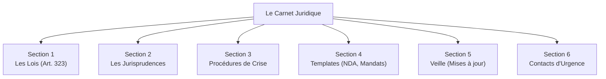
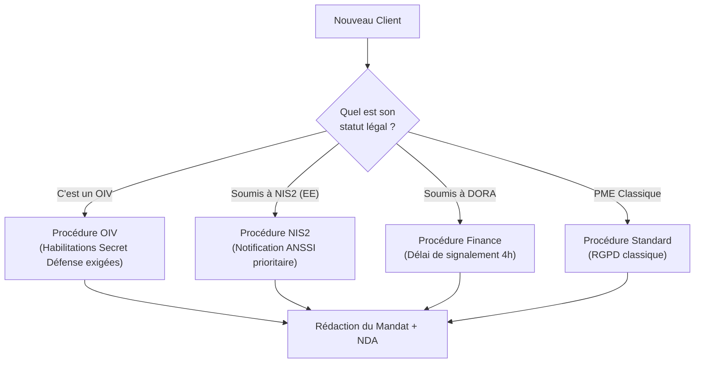
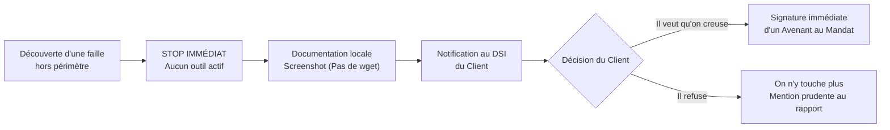

# Synthèse : Le carnet juridique permanent

<div
  class="omny-meta"
  data-level="🔴 Exhaustif"
  data-version="Synthèse Module 1"
  data-time="4 heures">
</div>

!!! note "**Livrables :** _Carnet juridique personnel finalisé, méthode de mise à jour_"
!!! note "**Auto-explication :** _45 minutes (Examen Final)_"

<br>

---

<br>

!!! quote "L'analogie de la trousse à pharmacie"

    Dans une famille, on ne court pas aux urgences pour chaque égratignure. On dispose d'une trousse à pharmacie : pansements, désinfectant, paracétamol. Tout ce qu'il faut pour gérer les situations courantes immédiatement, et surtout, les instructions pour reconnaître le moment où il faut appeler un professionnel de santé. 
    Votre Carnet Juridique Permanent est la trousse à pharmacie de votre activité Forensic. Articles de loi, jurisprudences, procédures de crise, modèles de contrats. Tout doit être à portée de main, vérifié, et à jour. Pour les cas courants, vous trouvez la réponse dans votre carnet. Pour les cas complexes, votre carnet vous indiquera le numéro d'un avocat spécialisé. Ce dernier chapitre est consacré à la construction de cet outil vital.

## Objectifs pédagogiques

!!! tip "À la fin de ce chapitre, vous serez capable de :"

    - Construire un carnet juridique personnel exhaustif et maintenable.
    - Articuler les 16 chapitres de ce premier cycle en un référentiel opérationnel.
    - Mettre en place une méthodologie de mise à jour annuelle (Veille).
    - Disposer de fiches "Réflexe" utilisables en plein cœur d'une mission de crise.

<br>

---

<br>

## Principes du carnet juridique

### À quoi sert le carnet ?

Le carnet juridique répond à **trois besoins opérationnels immédiats** :

| Le Besoin Terrain | La Réponse apportée par le Carnet |
|---|---|
| Vérification rapide en mission | Des fiches synthétiques ultra-accessibles (ex: "Quel délai pour prévenir la CNIL ?"). |
| Argumentation face au client | Des citations précises et à jour pour justifier un refus de tester hors-périmètre. |
| Sauvegarde des templates | Le coffre-fort de vos NDA et Mandats vierges. |

### Format recommandé (L'approche "Git")

Pour survivre à l'obsolescence, votre carnet ne doit pas être un document Word perdu sur un disque dur. 

| Caractéristique | Recommandation Technique |
|---|---|
| Le Format | Markdown (`.md`). Léger, pérenne, facile à lire sur mobile. |
| Le Stockage | Dans un repository Git privé. |
| La Structure | Modulaire. Une fiche technique = Un fichier. |
| La Synchronisation | Cloud sécurisé/chiffré (pour y accéder chez un client). |

<br>

---

<br>

## Architecture du carnet personnel

L'arborescence de votre repository devrait ressembler à ceci :



<br>

---

<br>

## Section 1 : Les Fiches "Lois & Articles"

Pour chaque article majeur vu dans ce module, vous devez créer une **fiche synthétique d'une page**.

!!! abstract "Modèle de Fiche d'Article"
    ```text
    ======================================
    FICHE ARTICLE : 323-1 du Code pénal
    ======================================
    [Version en vigueur depuis : 24 janvier 2023]
    
    1. LE DÉLIT
    L'accès et le maintien frauduleux dans un STAD.
    
    2. LES PEINES THÉORIQUES
    - De base : 3 ans de prison + 100 000 € d'amende.
    - Circonstance aggravante (modification de données) : 5 ans + 150 000 €.
    - Circonstance institutionnelle (STAD de l'État) : 7 ans + 300 000 €.
    
    3. LA JURISPRUDENCE LIÉE
    - Affaire Kitetoa (Nécessité d'une barrière technique).
    - Affaire Bluetouff (L'intention suffit pour le "maintien").
    
    4. DATE DE DERNIÈRE VÉRIFICATION LÉGIFRANCE : [DD/MM/YYYY]
    ```

> Liste des Articles obligatoires pour votre carnet :

| Catégorie | Articles à ficher impérativement |
|---|---|
| Le Code Pénal (Loi Godfrain) | 323-1 à 323-7 (Intrusions, Sabotages, Bande organisée) |
| La Vie Privée | 226-15 (Secret des correspondances) |
| Le RGPD | Articles 32 (Sécurité), 33 (Notification) et 34 (Communication) |
| La Loi Française (LRN) | LCEN Art. 6 (Hébergeurs), LRN Art. 47 (Hacker de bonne foi) |

<br>

---

<br>

## Section 3 : Les Procédures d'Urgence (Playbooks)

L'intérêt du carnet est de vous fournir des algorithmes de décision (Playbooks) quand la panique survient chez le client.

### Playbook : Qualification d'un prospect (Avant la mission)



### Playbook : Découverte Fortuite (Hors-Mandat)



<br>

---

<br>

## Section 5 : La Veille (L'entretien du carnet)

Le droit pourrit s'il n'est pas entretenu. Votre carnet deviendra toxique si vous citez des lois abrogées.

!!! warning "La Règle d'or de l'Auditeur"
    Vous devez bloquer **2 heures par mois** dans votre agenda, non-négociables, pour effectuer votre veille juridique et mettre à jour le carnet. 

> Le Tableau de bord de la veille :

| Fréquence | Action requise | Source Primaire |
|---|---|---|
| **Quotidienne** (5 min) | Lire les alertes de vulnérabilité. | CERT-FR (ANSSI), Fil LinkedIn (Experts). |
| **Hebdomadaire** (30 min) | Lire les nouvelles délibérations de sanction. | Site de la CNIL. |
| **Mensuelle** (2h) | Rédiger une Fiche de veille (Nouvelle Loi, Nouvel Arrêt). | Doctrine.fr, Légifrance. |
| **Annuelle** (8h) | Revue de l'intégralité du Carnet (Vérifier si les lois citées sont toujours en vigueur). | Légifrance. |

<br>

---

<br>

## Section 6 : Le Botin (Contacts d'urgence)

Dans l'urgence absolue (ex: Une saisie de vos disques durs par la gendarmerie suite à une plainte), vous ne devez pas chercher sur Google.

> Remplissez ce tableau dans votre carnet personnel avec de vrais contacts :

| Organisme / Besoin | Coordonnées directes |
|---|---|
| **L'ANSSI (CERT-FR)** | cert-fr.cossi@ssi.gouv.fr / 01 71 75 84 50 |
| **Avocat Pénaliste (Cyber)** | [Trouvez et listez le nom de 2 avocats spécialisés] |
| **Avocat RGPD (DPO Ext.)** | [Trouvez et listez le nom d'un cabinet compétent] |
| **Votre assurance RC Pro** | [Numéro d'astreinte de votre courtier] |
| **La CNIL** | 01 53 73 22 22 |

<br>

---

<br>

## L'Examen Final du Cycle 0 (Fondations)

Vous avez terminé l'intégralité des 16 chapitres du premier cycle consacré à la Législation Française.
Pour valider ce cycle et passer aux modules techniques, vous devez réaliser une auto-explication globale.

!!! quote "L'Épreuve d'Auto-explication Finale (45 minutes)"

    Enregistrez une vidéo (ou un audio continu) de **45 minutes** où vous présentez l'intégralité du droit de la cybersécurité comme si vous faisiez une conférence à de nouveaux consultants juniors. 
    Vous ne devez pas lire vos notes. 
    
    **Le plan exigé :**
    1. Le cadre pénal (Loi Godfrain, Art 323-1 à 323-7) - *10 minutes*
    2. Le secret des correspondances (Art 226-15) - *5 minutes*
    3. Le cadre civil et européen (RGPD, NIS2, DORA) - *15 minutes*
    4. L'ingénierie contractuelle (Pourquoi le NDA précède le Mandat) - *10 minutes*
    5. La Jurisprudence Française (Le duel Kitetoa / Bluetouff) - *5 minutes*

<br>

---

<br>

## Synthèse Mentale du Cycle 0

!!! success "Le Panorama Légal 2026"
    
    - **Le Pénal :** Le socle. Les 7 articles (323) de la Loi Godfrain. La prison et l'amende pour toute intrusion, sabotage ou vol de données non mandaté expressément. L'arrivée fracassante de la "Bande organisée" (10 ans).
    - **Le RGPD :** Le risque financier. L'Article 32 punit l'incompétence technique. L'Article 33 impose la notification en 72h.
    - **Les Lois de Rupture (NIS2 / DORA) :** Le basculement vers la responsabilité personnelle des dirigeants d'entreprise et l'obligation de résilience pour les fournisseurs (Tiers TIC).
    - **La Jurisprudence :** La technique ne suffit plus. L'intention et la conscience d'être dans un espace privé (Bluetouff) transforment le "hacker curieux" en "pirate pénal".
    - **L'Armure du Consultant :** Le NDA Bilatéral protège vos secrets. Le Mandat à périmètre ultra-strict (avec sa clause de responsabilité plafonnée) vous protège de la prison et de la faillite.

<br>

---

<br>

## Conclusion du Cycle

!!! quote "Le mot de la fin"
    Vous êtes désormais armé juridiquement. Le droit n'est pas une contrainte qui vous empêche de "hacker" librement, c'est l'infrastructure qui vous permet de le faire de manière professionnelle et rémunérée. Un pirate agit dans l'ombre par peur de la loi. Un auditeur Forensic utilise la loi pour s'imposer dans les salles de conseils d'administration. Gardez votre carnet à jour, protégez vos arrières avec des mandats stricts, et vous êtes prêt à ouvrir les terminaux Linux.

> **Cycle 0 - Législation Française : VALIDÉ ✅**
>
> [Passer au Cycle 1 : Prérequis techniques et théoriques →](../module-2-prerequis-techniques/README.md)
>
> [Retour à l'index du cursus →](../../index.md)

<br>
