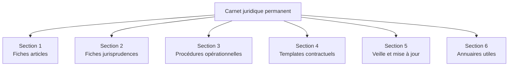
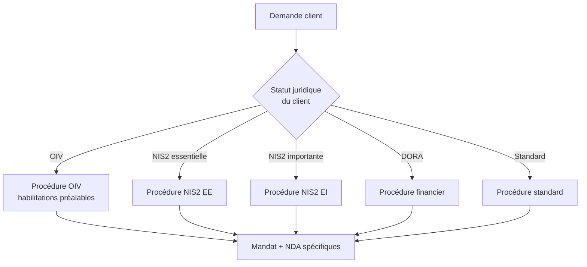
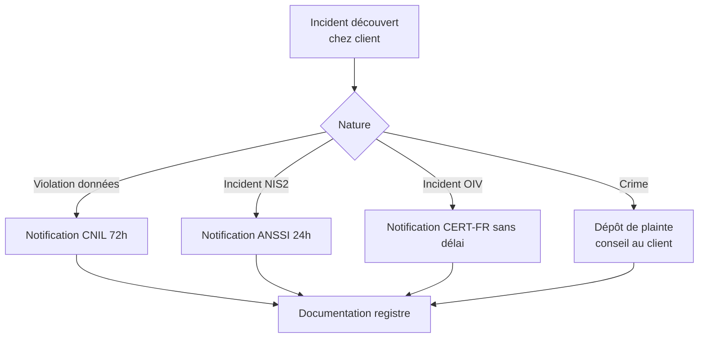
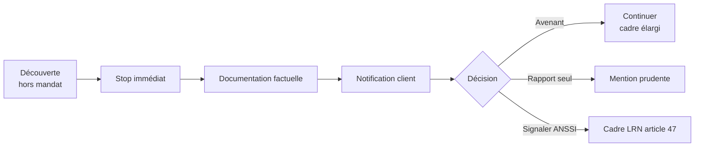

# 1.16 Synthèse personnelle - Carnet juridique permanent

!!! quote "L'analogie de la trousse à pharmacie"

    Dans une famille, on ne court pas chez le médecin pour chaque égratignure. On a une trousse à pharmacie : pansements, désinfectant, paracétamol, thermomètre. Tout ce qu'il faut pour gérer les situations courantes immédiatement, et reconnaître quand il faut appeler un professionnel. Votre carnet juridique est la trousse à pharmacie de votre activité forensic. Articles, jurisprudences, procédures, modèles. Tout doit être à portée de main, vérifié, à jour. Pour les cas courants, vous trouvez la réponse dans le carnet. Pour les cas complexes, le carnet vous dit qu'il faut appeler un avocat. Ce chapitre construit votre carnet.

## Métadonnées du chapitre

| Champ | Valeur |
|---|---|
| Durée estimée | 4 heures |
| Niveau | Pratique |
| Prérequis | Chapitres 1.1 à 1.15 (module 1 complet) |
| Livrables | Carnet juridique personnel finalisé, méthode de mise à jour |
| Auto-explication | 15 minutes |

## Objectifs pédagogiques

À la fin de ce chapitre, vous serez capable de :

- Construire un carnet juridique exhaustif et maintenable.
- Articuler les 16 chapitres du module 1 en un document opérationnel.
- Mettre en place une méthode de mise à jour annuelle.
- Disposer de fiches récapitulatives utilisables en mission.

---

## 1. Principes du carnet juridique

### 1.1 À quoi sert le carnet

Le carnet juridique répond à **trois besoins opérationnels** :

| Besoin | Réponse du carnet |
|---|---|
| Vérification rapide en mission | Fiches synthétiques accessibles |
| Argumentation face au client | Citations précises et à jour |
| Veille structurée | Méthodologie de mise à jour |

### 1.2 Format recommandé

| Caractéristique | Recommandation |
|---|---|
| Format | Markdown dans un repository Git privé |
| Structure | Une fiche par sujet, modulaire |
| Versionnement | Historique Git complet |
| Synchronisation | Cloud chiffré, accessible mobile |
| Recherche | Indexation full-text |

---

## 2. Architecture du carnet



---

## 3. Section 1 - Fiches articles

Pour chaque article majeur, une **fiche d'1 page** :

```text
FICHE ARTICLE
==============
Article : 323-1 Code pénal
Version : en vigueur depuis 24 janvier 2023

TEXTE COMPLET
[Reproduction intégrale]

PEINES
- Alinéa 1 : 3 ans + 100 000 €
- Alinéa 2 : 5 ans + 150 000 €
- Alinéa 3 (STAD État) : 7 ans + 300 000 €

ÉLÉMENTS CONSTITUTIFS
Matériel : accès ou maintien
Moral : caractère frauduleux

JURISPRUDENCE CLÉ
- Bluetouff (Cass. crim. 20 mai 2015)
- Kitetoa (CA Paris 30 octobre 2002)

ARTICULATION
- Cumul possible avec 226-15
- Cumul possible avec 311-1 (vol)
- Aggravation 323-4-1 (bande organisée)

DERNIÈRE VÉRIFICATION
DD/MM/YYYY
```

### 3.1 Articles à fiche obligatoire

| Article | Sujet |
|---|---|
| 323-1 | Accès et maintien frauduleux |
| 323-2 | Entrave fonctionnement |
| 323-3 | Atteinte aux données |
| 323-3-1 | Détention outils |
| 323-4 | Groupement |
| 323-4-1 | Bande organisée |
| 323-5 | Peines complémentaires |
| 226-15 | Secret correspondances |
| 226-1 | Atteinte vie privée |
| RGPD 32 | Sécurité du traitement |
| RGPD 33 | Notification autorité |
| RGPD 34 | Communication personnes |
| Article 60-1 CPP | Réquisition judiciaire |
| LCEN article 6 | Hébergeurs et FAI |

---

## 4. Section 2 - Fiches jurisprudences

Pour chaque arrêt majeur, fiche d'arrêt structurée selon le modèle du chapitre 1.13 :

| Arrêt | Apport |
|---|---|
| Cass. crim. Bluetouff 20/05/2015 | Maintien frauduleux après prise de conscience |
| CA Paris Kitetoa 30/10/2002 | Dispositif de sécurité effectif |
| Cass. soc. Nikon 02/10/2001 | Inviolabilité fichiers personnels |
| CJUE Schrems II 16/07/2020 | Invalidation Privacy Shield |
| CJUE Quadrature du Net 06/10/2020 | Conservation données limitée |
| Décisions CNIL marquantes | Sanctions modulation |

---

## 5. Section 3 - Procédures opérationnelles

### 5.1 Procédure de qualification de mission



### 5.2 Procédure de gestion d'incident découvert



### 5.3 Procédure de découverte fortuite



---

## 6. Section 4 - Templates contractuels

### 6.1 Templates à conserver

| Template | Source |
|---|---|
| Mandat de pentest standard | Chapitre 1.14 |
| Mandat forensic post-incident | Adaptation 1.14 |
| Mandat audit RGPD | Adaptation 1.14 |
| Mandat audit NIS2 | Adaptation 1.14 |
| NDA bilatéral standard | Chapitre 1.15 |
| NDA renforcé secteurs sensibles | Adaptation 1.15 |
| Notification CNIL pré-remplie | À développer chapitre 17 |
| Communication aux personnes | À développer chapitre 17 |
| Procès-verbal d'incident | Standard |
| Attestation de destruction | Standard |

### 6.2 Procédure de mise à jour

| Fréquence | Action |
|---|---|
| Annuelle | Revue complète des templates |
| Sur évolution législative | Mise à jour ciblée |
| Après chaque mission | Retour d'expérience intégré |

---

## 7. Section 5 - Veille et mise à jour

### 7.1 Calendrier de veille

| Fréquence | Tâche | Sources |
|---|---|---|
| Quotidienne (5 min) | Fil LinkedIn, alertes CERT-FR | Réseaux sociaux pro |
| Hebdomadaire (30 min) | CNIL délibérations, sites cabinets | CNIL.fr, blogs spécialisés |
| Mensuelle (2h) | Légifrance updates, fiche d'arrêt | Légifrance, Doctrine.fr |
| Trimestrielle (4h) | Revue complète et synthèse | Tout |
| Annuelle (8h) | Mise à jour exhaustive du carnet | Tout |

### 7.2 Modèle de fiche de veille mensuelle

```text
VEILLE JURIDIQUE - [MOIS] [ANNÉE]
===================================

DÉCISIONS NOTABLES
1. [Référence] - [Résumé 2 phrases]
   Impact pratique : [paragraphe]

2. [Référence] - [Résumé 2 phrases]
   Impact pratique : [paragraphe]

ÉVOLUTIONS LÉGISLATIVES
- [Loi/décret en cours]
- Statut : [adoption, promulgation, application]

SANCTIONS CNIL
- Liste des sanctions du mois
- Tendances observées

ALERTES CERT-FR
- Vulnérabilités majeures
- Campagnes en cours

À INTÉGRER AU CARNET
- Liste des fiches à mettre à jour
- Templates à modifier

DATE PROCHAINE VEILLE : [date]
```

---

## 8. Section 6 - Annuaires utiles

### 8.1 Contacts institutionnels

| Organisme | Coordonnées |
|---|---|
| ANSSI - CERT-FR | cert-fr.cossi@ssi.gouv.fr / 01 71 75 84 50 |
| CNIL | 01 53 73 22 22 / cnil.fr |
| Parquet National Cyber | À documenter |
| Police judiciaire OCLCTIC | À documenter |
| ARCEP | 01 40 47 70 00 |
| ACPR | 01 49 95 40 00 |
| AMF | 01 53 45 60 00 |

### 8.2 Avocats spécialisés

À renseigner avec **2-3 contacts** d'avocats spécialisés :

| Cabinet | Spécialité | Coordonnées |
|---|---|---|
| [À renseigner] | Droit pénal numérique | [coords] |
| [À renseigner] | Droit RGPD | [coords] |
| [À renseigner] | Conseil contractuel | [coords] |

### 8.3 Références techniques

| Ressource | Type |
|---|---|
| Légifrance | Site officiel textes |
| Cybermalveillance.gouv.fr | Aide PME |
| Cyber.gouv.fr | ANSSI |
| Notifications.cnil.fr | Téléservice CNIL |
| MonEspaceNIS2 | Auto-évaluation NIS2 |

---

## 9. Le fichier maître - Structure complète

Voici la structure de fichiers Git recommandée pour votre carnet :

```text
carnet-juridique-omnyvia/
├── README.md                         # Vue d'ensemble du carnet
├── CHANGELOG.md                       # Historique des modifications
├── 01-articles/
│   ├── 323-1-acces-maintien.md
│   ├── 323-2-entrave.md
│   ├── 323-3-atteinte-donnees.md
│   ├── 323-3-1-detention-outils.md
│   ├── 323-4-groupement.md
│   ├── 323-4-1-bande-organisee.md
│   ├── 226-15-correspondances.md
│   ├── rgpd-32-securite.md
│   ├── rgpd-33-notification.md
│   ├── rgpd-34-communication.md
│   └── ...
├── 02-jurisprudences/
│   ├── 2002-kitetoa.md
│   ├── 2015-bluetouff.md
│   ├── 2020-schrems-ii.md
│   ├── 2020-quadrature-du-net.md
│   └── ...
├── 03-procedures/
│   ├── qualification-mission.md
│   ├── gestion-incident.md
│   ├── decouverte-fortuite.md
│   ├── notification-cnil.md
│   └── ...
├── 04-templates/
│   ├── mandat-pentest-standard.md
│   ├── mandat-forensic.md
│   ├── nda-bilateral.md
│   ├── notification-cnil.md
│   └── ...
├── 05-veille/
│   ├── 2026-01-veille.md
│   ├── 2026-02-veille.md
│   └── ...
└── 06-annuaires/
    ├── contacts-institutionnels.md
    ├── avocats-specialises.md
    └── ressources-techniques.md
```

---

## 10. Méthode de construction initiale

### 10.1 Plan en 8 sessions

| Session | Durée | Action |
|---|---|---|
| 1 | 2h | Création structure Git, README |
| 2 | 2h | Fiches articles 323-1 à 323-7 |
| 3 | 2h | Fiches RGPD 32, 33, 34 |
| 4 | 2h | Autres articles (226-15, LCEN, NIS2) |
| 5 | 2h | Fiches jurisprudences principales |
| 6 | 2h | Procédures opérationnelles |
| 7 | 2h | Templates contractuels |
| 8 | 2h | Annuaires et veille initiale |

Total : **16 heures** sur 2-3 semaines.

### 10.2 Critères de validation

Le carnet est considéré complet quand :

- Toutes les fiches obligatoires sont présentes
- Chaque fiche est à jour à date
- Les templates ont été testés sur un cas
- La procédure de veille est en place
- Les annuaires sont renseignés

---

## 11. Validation finale du module 1

Vous avez parcouru les **16 chapitres** du module 1. Pour valider l'ensemble :

### 11.1 Auto-évaluation globale

Sur 50 questions tirées des chapitres 1.1 à 1.16, visez **80% minimum**.

### 11.2 Auto-explication globale

Enregistrez une vidéo de **45 minutes** où vous présentez l'intégralité du module 1 comme si vous étiez face à un client. Sans support, articulé, professionnel.

### 11.3 Application pratique

Sur un cas fictif (par exemple ARTECH du scénario fil rouge), produisez :

- Le mandat de pentest adapté
- Le NDA correspondant
- La procédure de notification CNIL si incident
- L'analyse juridique du scénario d'attaque

### 11.4 Critères de succès

| Critère | Validation |
|---|---|
| Vous citez de mémoire les peines des articles 323 | Oui / Non |
| Vous expliquez le délai 72h RGPD sans hésiter | Oui / Non |
| Vous distinguez OIV, NIS2 et DORA correctement | Oui / Non |
| Vous savez rédiger un mandat en 1 heure | Oui / Non |
| Votre carnet juridique est complet et à jour | Oui / Non |

Si tous les critères sont **Oui**, vous êtes prêt pour le module 2.

---

## 12. Synthèse du module 1

```text
MODULE 1 - LÉGISLATION FRANÇAISE - SYNTHÈSE FINALE

Cadre juridique :
  Constitution + traités + UE + lois + règlements

Articles pénaux clés :
  323-1 : 3 ans + 100k€ (5 ans + 150k€ avec altération)
  323-2 : 5 ans + 150k€ (entrave)
  323-3 : 5 ans + 150k€ (atteinte données)
  323-3-1 : peines de l'infraction (outils sans motif)
  323-4-1 : 10 ans + 300k€ (bande organisée)
  226-15 : 1 an + 45k€ (secret correspondances)

RGPD :
  Article 32 : sécurité (CIDR)
  Article 33 : notification 72h
  Article 34 : communication risque élevé

NIS2 (Loi Résilience 2026) :
  18 secteurs, ~15 000 entités
  Sanctions jusqu'à 10 M€ ou 2% CA mondial

DORA (depuis 17 janvier 2025) :
  Secteur financier
  Notification 4h - 72h - 1 mois

Cadre du pentest :
  Mandat écrit obligatoire
  NDA recommandé en amont
  RC pro cyber adaptée

Jurisprudence :
  Kitetoa : dispositif effectif
  Bluetouff : conscience du privé prévaut

Votre carnet juridique :
  Maintenu à jour, accessible, opérationnel
  Mise à jour annuelle systématique
```

---

## 13. Auto-explication finale

Pour valider le module 1 dans son ensemble, enregistrez une vidéo de 45 minutes structurée :

1. Cadre général de la cybersécurité juridique française (5 min)
2. Articles 323 du Code pénal en détail (10 min)
3. Articles 226-15 et secret correspondances (3 min)
4. RGPD articles 32, 33, 34 (10 min)
5. NIS2 et Loi Résilience 2026 (5 min)
6. DORA pour le financier (3 min)
7. Cadre du pentest légal (5 min)
8. Jurisprudences clés (3 min)
9. Votre méthode de veille (1 min)

---

**Module 1 - Législation française : VALIDÉ**

**Chapitre précédent** : [1.15 Construction d'un modèle de NDA](01-15-modele-nda.md)

**Chapitre suivant** : [Module 2 - Prérequis techniques et théoriques](../module-2-prerequis-techniques/README.md)
