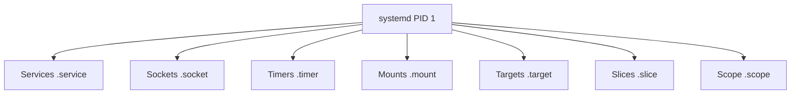

# 2.3 Linux avancé pour le forensic

!!! quote "L'analogie de l'horloge mécanique"

    Si vous ouvrez le boîtier d'une horloge mécanique de qualité, vous découvrez un univers d'engrenages, de ressorts et de mécanismes invisibles de l'extérieur. C'est précisément ce qui permet l'horloge de fonctionner si précisément. Linux moderne fonctionne pareillement. Sous l'apparence d'une simple ligne de commande se cache systemd qui orchestre les services, journald qui structure les journaux, /proc qui expose l'état en temps réel, les namespaces qui isolent les processus. Ce chapitre ouvre le boîtier.

## Métadonnées du chapitre

| Champ | Valeur |
|---|---|
| Durée estimée | 6 heures |
| Niveau | Standard |
| Prérequis | Chapitre 2.2 |
| Livrables | Scripts d'investigation systemd et journald |
| Auto-explication | 12 minutes |

## Objectifs pédagogiques

- Maîtriser systemd : services, timers, units
- Investiguer via journald avec filtres avancés
- Exploiter `/proc` et `/sys` pour le forensic
- Comprendre les namespaces et leur rôle dans la conteneurisation
- Configurer auditd pour la détection

---

## 1. systemd - Le superviseur moderne

### 1.1 Architecture

systemd est le **gestionnaire de services et d'init** standard sur Linux moderne (Debian 8+, Ubuntu 15+, RHEL 7+). Il remplace SysV init et Upstart.



### 1.2 Hiérarchie des unités systemd

| Type | Extension | Rôle | Exemple |
|---|---|---|---|
| Service | `.service` | Daemon | `sshd.service` |
| Socket | `.socket` | Lié à un port/socket | `cups.socket` |
| Timer | `.timer` | Tâche planifiée | `apt-daily.timer` |
| Mount | `.mount` | Point de montage | `var.mount` |
| Target | `.target` | Groupe d'unités | `multi-user.target` |
| Path | `.path` | Surveillance fichier | `cups.path` |

### 1.3 Localisation des unités

| Répertoire | Priorité | Usage |
|---|---|---|
| `/lib/systemd/system/` | Faible | Unités système installées par paquets |
| `/etc/systemd/system/` | **Haute** | Unités custom administrateur |
| `/run/systemd/system/` | Très haute | Unités runtime |
| `~/.config/systemd/user/` | Spécifique | Unités utilisateur |

**Règle** : `/etc/` surclasse `/lib/`. Une unité dans `/etc/` masque celle de même nom dans `/lib/`.

### 1.4 Investigation forensic des services

```bash
# Tous les services activés au démarrage
systemctl list-unit-files --state=enabled

# Services en cours d'exécution
systemctl list-units --type=service --state=running

# Services installés mais désactivés
systemctl list-unit-files --state=disabled

# Détails d'un service
systemctl status nginx.service
systemctl cat nginx.service        # contenu du fichier unit

# Suivre les logs d'un service
journalctl -u nginx.service -f
```

### 1.5 Détecter une persistance par service

Un attaquant peut créer un service custom dans `/etc/systemd/system/` pour persister.

```bash
# Lister les services custom (hors paquets distribution)
ls -la /etc/systemd/system/*.service 2>/dev/null

# Lister les timers custom
ls -la /etc/systemd/system/*.timer 2>/dev/null

# Voir les unités modifiées récemment
find /etc/systemd/system/ -mtime -30 -type f
```

**Indices forensic** :

| Indice | Suspicion |
|---|---|
| Service avec ExecStart pointant vers `/tmp/` | Très haute |
| Service propriétaire root mais binaire utilisateur | Haute |
| Service avec ligne de commande encodée base64 | Très haute |
| Service au nom mimétique (sshdd, systemd-init) | Haute |
| Timer planifié à intervalle court (1m) | Suspect |

---

## 2. journald - Journaux structurés

### 2.1 Différence avec syslog

| Aspect | syslog (legacy) | journald |
|---|---|---|
| Format | Texte ligne | Binaire structuré |
| Métadonnées | Limitées | Riches (PID, UID, unit, etc.) |
| Recherche | grep | journalctl avec filtres |
| Persistance | Texte plat | Base de données |
| Rotation | logrotate | Auto |

### 2.2 Stockage

| Mode | Localisation | Persistance |
|---|---|---|
| Volatile | `/run/log/journal/` | Perdu au reboot |
| Persistant | `/var/log/journal/` | Conservé |

Activer la persistance :

```bash
mkdir -p /var/log/journal
systemd-tmpfiles --create --prefix /var/log/journal
systemctl restart systemd-journald
```

### 2.3 Filtres journalctl essentiels

```bash
# Tout
journalctl

# Dernières 100 lignes
journalctl -n 100

# Suivre en direct
journalctl -f

# Pour un service précis
journalctl -u nginx.service

# Dans une plage de temps
journalctl --since "2026-04-29 08:00" --until "2026-04-29 12:00"
journalctl --since "2 hours ago"
journalctl --since today

# Par priorité (0=emerg, 7=debug)
journalctl -p err     # erreurs et au-dessus
journalctl -p warning..err

# Par utilisateur
journalctl _UID=1000

# Par PID
journalctl _PID=1234

# Par exécutable
journalctl /usr/bin/sshd

# Par boot
journalctl -b           # boot actuel
journalctl -b -1        # boot précédent
journalctl --list-boots

# Format JSON pour traitement
journalctl -o json
journalctl -o json-pretty
```

### 2.4 Investigation forensic typique

**Tentatives SSH** :

```bash
journalctl -u ssh.service --since today | grep -i "failed\|invalid"
```

**Erreurs sudo** :

```bash
journalctl _COMM=sudo --since "1 week ago"
```

**Démarrages successifs** :

```bash
journalctl --list-boots
# Identifier reboot inattendu
```

**Activité d'un utilisateur** :

```bash
journalctl _UID=1001 --since today
```

### 2.5 Vérification d'intégrité journald

journald supporte la **vérification cryptographique** :

```bash
# Vérifier l'intégrité
journalctl --verify
```

Cette vérification détecte une altération du journal par un attaquant.

---

## 3. /proc - Système de fichiers virtuel

### 3.1 Vue d'ensemble

`/proc` est un **pseudo-système de fichiers** exposant l'état du noyau et des processus en RAM. Il n'occupe pas d'espace disque.

```mermaid
flowchart TB
    A[/proc] --> B[/proc/PID/<br>par processus]
    A --> C[/proc/cpuinfo CPU]
    A --> D[/proc/meminfo RAM]
    A --> E[/proc/version noyau]
    A --> F[/proc/cmdline boot]
    A --> G[/proc/mounts montages]
    A --> H[/proc/net réseau]
    A --> I[/proc/sys paramètres noyau]
    A --> J[/proc/modules modules chargés]
```

### 3.2 Fichiers globaux clés

| Fichier | Contenu |
|---|---|
| `/proc/cpuinfo` | Détails CPU |
| `/proc/meminfo` | Utilisation mémoire |
| `/proc/version` | Version noyau, compilateur, date |
| `/proc/cmdline` | Arguments de boot du noyau |
| `/proc/mounts` | Points de montage actifs |
| `/proc/modules` | Modules noyau chargés |
| `/proc/uptime` | Uptime |
| `/proc/loadavg` | Charge système |
| `/proc/net/tcp` | Connexions TCP IPv4 |
| `/proc/net/tcp6` | Connexions TCP IPv6 |
| `/proc/net/udp` | Connexions UDP |
| `/proc/net/arp` | Cache ARP |

### 3.3 Inspection d'un processus via /proc/[PID]/

| Fichier | Contenu |
|---|---|
| `cmdline` | Ligne de commande complète (séparée par `\0`) |
| `environ` | Variables d'environnement |
| `cwd` | Lien vers le répertoire courant |
| `exe` | Lien vers l'exécutable |
| `fd/` | Descripteurs de fichiers ouverts |
| `maps` | Mappings mémoire (très utile forensic) |
| `mem` | Mémoire du processus |
| `net/` | Statistiques réseau du namespace |
| `status` | État détaillé |
| `stack` | Pile noyau |

### 3.4 Cas pratique - Analyser un processus suspect

```bash
# 1. Identifier le PID
ps auxf | grep suspect

# 2. Ligne de commande complète
cat /proc/[PID]/cmdline | tr '\0' ' '

# 3. Variables d'environnement
cat /proc/[PID]/environ | tr '\0' '\n'

# 4. Exécutable d'origine
ls -la /proc/[PID]/exe

# 5. Répertoire courant
ls -la /proc/[PID]/cwd

# 6. Fichiers ouverts
ls -la /proc/[PID]/fd/

# 7. Mappings mémoire (libraires chargées)
cat /proc/[PID]/maps

# 8. Connexions réseau du processus
ls -la /proc/[PID]/fd/ | grep socket
# Croiser avec /proc/net/tcp via inode
```

### 3.5 Détection malware via /proc

**Indices** :

| Observation | Suspicion |
|---|---|
| `exe` pointe vers fichier supprimé | Élevée (malware effacé après lancement) |
| `cwd` dans `/tmp/` | Élevée |
| Mappings vers binaires non standards | Modérée |
| Sockets en écoute non documentés | Élevée |
| Variables d'environnement encodées | Élevée |

---

## 4. /sys - Configuration noyau

`/sys` expose les **paramètres du noyau et des périphériques**. Moins critique en forensic que `/proc`, mais utile pour :

| Sous-répertoire | Usage forensic |
|---|---|
| `/sys/class/net/` | Interfaces réseau |
| `/sys/class/block/` | Périphériques de stockage |
| `/sys/devices/` | Hiérarchie matérielle |
| `/sys/kernel/security/` | LSM (SELinux, AppArmor) |

```bash
# Adresse MAC d'une interface
cat /sys/class/net/eth0/address

# Driver d'un périphérique
ls -la /sys/class/block/sda/device/driver
```

---

## 5. Namespaces - Isolation des processus

### 5.1 Concept

Les **namespaces** isolent les processus d'un point de vue noyau. Un processus dans un namespace ne voit pas (ou différemment) les ressources d'un autre namespace.

| Namespace | Isole |
|---|---|
| PID | Identifiants de processus |
| NET | Pile réseau (interfaces, ports) |
| MNT | Points de montage |
| UTS | Hostname et domaine |
| IPC | Communication inter-processus |
| USER | UID/GID |
| Cgroup | Hiérarchie cgroups |
| Time | Horloge (kernel 5.6+) |

### 5.2 Conteneurs - Application

Docker, Podman, LXC utilisent les namespaces pour isoler les conteneurs.

```bash
# Voir les namespaces d'un processus
ls -la /proc/[PID]/ns/

# Lister les conteneurs Docker
docker ps

# Inspecter un conteneur
docker inspect [container_id]
```

### 5.3 Implications forensic

Un attaquant peut **se cacher dans un namespace** distinct :

| Cas | Impact |
|---|---|
| Conteneur compromis | Attaquant isolé du host mais persistant |
| Conteneur s'évadant | Compromission du host |
| Namespaces custom | Contournement de la visibilité |

```bash
# Lister tous les namespaces
lsns

# Investiguer un namespace réseau
nsenter -t [PID] -n ip a
```

---

## 6. auditd - Audit système

### 6.1 Concept

**auditd** est le service d'audit du noyau Linux. Il enregistre les événements système (appels système, accès aux fichiers) selon des règles configurables.

### 6.2 Architecture

```mermaid
flowchart LR
    A[Noyau Linux] -->|Événements audit| B[auditd]
    B --> C[/var/log/audit/audit.log]
    D[auditctl] -->|Configure règles| B
    E[ausearch] -->|Interroge| C
    F[aureport] -->|Statistiques| C
```

### 6.3 Configuration de règles

Fichier : `/etc/audit/rules.d/audit.rules`

```text
# Surveiller modifications /etc/passwd
-w /etc/passwd -p wa -k passwd_changes

# Surveiller modifications /etc/shadow
-w /etc/shadow -p wa -k shadow_changes

# Surveiller modifications sudoers
-w /etc/sudoers -p wa -k sudoers_changes

# Surveiller exec dans /tmp
-a always,exit -F dir=/tmp -F perm=x -k exec_in_tmp

# Surveiller chargement de modules noyau
-w /sbin/insmod -p x -k modules
-w /sbin/modprobe -p x -k modules

# Verrouiller la configuration auditd elle-même
-e 2
```

### 6.4 Investigation des logs auditd

```bash
# Tous les événements
ausearch --start today

# Par clé
ausearch -k passwd_changes

# Par utilisateur
ausearch -ui 1000 --start today

# Par PID
ausearch -p [PID]

# Statistiques
aureport --summary
aureport --user
aureport --auth      # authentifications
aureport --file      # accès fichiers
```

### 6.5 Règles MITRE ATT&CK

Configuration recommandée pour détecter les techniques MITRE :

```text
# T1003 OS Credential Dumping
-w /etc/shadow -p r -k T1003_shadow_read

# T1059.004 Command Shell
-a always,exit -F arch=b64 -S execve -F path=/bin/bash -k T1059_bash_exec

# T1078 Valid Accounts
-w /var/log/auth.log -p wa -k T1078_auth

# T1543 Persistence Service
-w /etc/systemd/system/ -p wa -k T1543_systemd
-w /lib/systemd/system/ -p wa -k T1543_systemd_lib
```

---

## 7. Manipulation pratique

### Exercice 7.1 - Investigation systemd

Sur votre VM Linux, identifiez :

| Question | Méthode |
|---|---|
| Liste des services activés au démarrage | `systemctl list-unit-files --state=enabled` |
| Services en cours | `systemctl list-units --type=service --state=running` |
| Timers actifs | `systemctl list-timers` |
| Services modifiés récemment | `find /etc/systemd/system -mtime -30 -type f` |

### Exercice 7.2 - Analyse journald

```bash
# Top 10 IP avec failed SSH
journalctl -u ssh.service --since "1 month ago" | \
  grep "Failed password" | \
  grep -oP "from \K[\d.]+" | \
  sort | uniq -c | sort -rn | head -10

# Chronologie des sudo
journalctl _COMM=sudo --since "1 week ago" -o json-pretty

# Vérifier intégrité
journalctl --verify
```

### Exercice 7.3 - Auditd

Configurez auditd avec les règles MITRE essentielles, redémarrez le service, puis :

```bash
# Tester en modifiant /etc/passwd
sudo touch /etc/passwd

# Vérifier la trace
ausearch -k passwd_changes
```

---

## 8. Auto-évaluation

| # | Question | Réponse |
|---|---|---|
| 1 | Où placer un service custom systemd ? | `/etc/systemd/system/` |
| 2 | Suivre les logs d'un service ? | `journalctl -u service -f` |
| 3 | Vérifier intégrité journald ? | `journalctl --verify` |
| 4 | Mappings mémoire d'un processus ? | `cat /proc/[PID]/maps` |
| 5 | Combien de namespaces principaux ? | 8 (PID, NET, MNT, UTS, IPC, USER, Cgroup, Time) |
| 6 | Outil pour interroger logs auditd ? | `ausearch` |
| 7 | Localiser timers systemd actifs ? | `systemctl list-timers` |
| 8 | Verrouiller config auditd ? | `-e 2` |

---

## 9. Synthèse mémo

```text
LINUX AVANCÉ - ESSENTIELS

systemd :
  /lib/systemd/system/    standards
  /etc/systemd/system/    custom (priorité)
  systemctl list-unit-files --state=enabled
  systemctl list-timers

journald :
  journalctl -u service
  journalctl --since
  journalctl -p err
  journalctl --verify

/proc/[PID]/ :
  cmdline   ligne de commande
  exe       binaire (suspicion si supprimé)
  cwd       répertoire courant
  maps      mappings mémoire
  fd/       fichiers ouverts

Namespaces :
  PID NET MNT UTS IPC USER Cgroup Time
  lsns liste tous

auditd :
  /etc/audit/rules.d/
  ausearch -k key
  Règles MITRE configurables
```

---

**Chapitre précédent** : [2.2 Linux fondamentaux](02-2-linux-fondamentaux.md)

**Chapitre suivant** : [2.4 Windows architecture pour forensic](02-4-windows.md)
