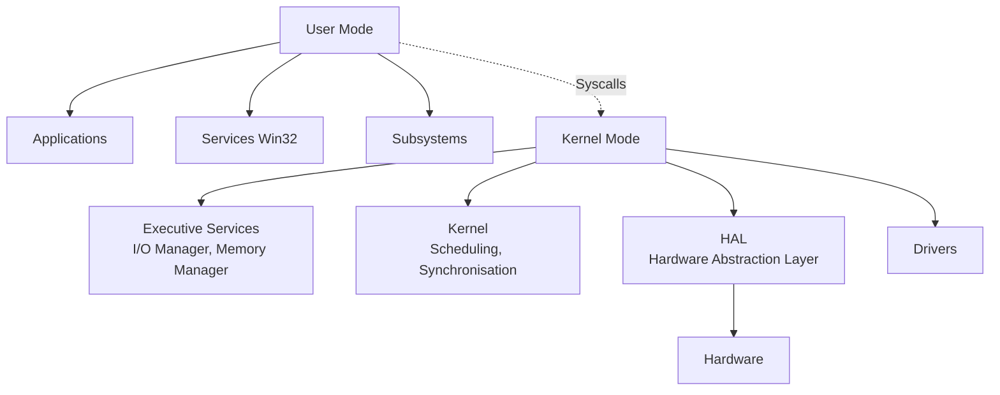
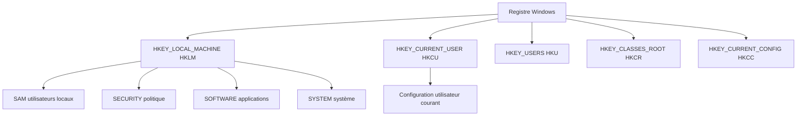

# 2.4 Windows architecture pour forensic

!!! quote "L'analogie de la cathédrale gothique"

    Une cathédrale gothique n'est pas un simple bâtiment. C'est une architecture complexe avec ses arc-boutants, ses voûtes, ses vitraux, ses cryptes. Pour comprendre comment elle tient debout, il faut connaître le rôle de chaque élément. Windows est exactement cette cathédrale. Le registre est sa fondation. Les services sont ses arc-boutants. Les processus sont ses vitraux. Les tokens sont ses serrures. Les Event Logs sont sa mémoire. L'analyste forensic qui ne comprend pas cette architecture analyse une cathédrale les yeux fermés.

## Métadonnées du chapitre

| Champ | Valeur |
|---|---|
| Durée estimée | 8 heures |
| Niveau | Standard |
| Prérequis | Notions Windows utilisateur |
| Livrables | Mémo CLI Windows, scripts d'investigation |
| Auto-explication | 15 minutes |

## Objectifs pédagogiques

- Naviguer dans le registre Windows et identifier les ruches
- Analyser les services Windows et détecter les persistances
- Inspecter les processus, threads et tokens
- Comprendre les GPO et leurs impacts forensic
- Lire les Event Logs essentiels (Security, System, Application)

---

## 1. Architecture Windows simplifiée



### 1.1 Composants clés pour le forensic

| Composant | Localisation | Intérêt forensic |
|---|---|---|
| Registre | `C:\Windows\System32\config\` | Configuration, persistance |
| Services | `services.msc` | Persistance fréquente |
| Processus | `tasklist`, Process Explorer | Activité en cours |
| Event Logs | `C:\Windows\System32\winevt\Logs\` | Traces |
| Prefetch | `C:\Windows\Prefetch\` | Exécutions passées |
| Pagefile | `C:\pagefile.sys` | Mémoire swappée |
| Hibernation | `C:\hiberfil.sys` | Snapshot mémoire au sommeil |

---

## 2. Le registre Windows

### 2.1 Structure des ruches

Le **registre** est une base de configuration hiérarchique. Il est physiquement stocké dans des **ruches** (hives).



### 2.2 Ruches physiques

| Ruche | Fichier |
|---|---|
| HKLM\SAM | `C:\Windows\System32\config\SAM` |
| HKLM\SECURITY | `C:\Windows\System32\config\SECURITY` |
| HKLM\SOFTWARE | `C:\Windows\System32\config\SOFTWARE` |
| HKLM\SYSTEM | `C:\Windows\System32\config\SYSTEM` |
| HKCU | `C:\Users\[user]\NTUSER.DAT` |
| HKCU\Software\Classes | `C:\Users\[user]\AppData\Local\Microsoft\Windows\UsrClass.dat` |

**Forensic** : ces fichiers sont les premiers à acquérir lors d'une analyse.

### 2.3 Clés de persistance

Les attaquants exploitent ces clés pour rester actifs après reboot.

| Clé | Description |
|---|---|
| `HKLM\SOFTWARE\Microsoft\Windows\CurrentVersion\Run` | Lancement au démarrage (toutes sessions) |
| `HKCU\SOFTWARE\Microsoft\Windows\CurrentVersion\Run` | Lancement au démarrage (utilisateur) |
| `HKLM\SOFTWARE\Microsoft\Windows\CurrentVersion\RunOnce` | Lancement unique |
| `HKLM\System\CurrentControlSet\Services\` | Services |
| `HKLM\Software\Microsoft\Windows NT\CurrentVersion\Winlogon\Userinit` | Userinit (très utilisé en attaque) |
| `HKLM\Software\Microsoft\Windows NT\CurrentVersion\Winlogon\Shell` | Shell par défaut |
| `HKLM\System\CurrentControlSet\Control\Session Manager\BootExecute` | Exécution avant boot complet |

### 2.4 Clés d'investigation utiles

| Clé | Information |
|---|---|
| `HKLM\Software\Microsoft\Windows\CurrentVersion\Uninstall\` | Programmes installés |
| `HKLM\System\CurrentControlSet\Control\TimeZoneInformation` | Fuseau horaire système |
| `HKLM\System\CurrentControlSet\Control\ComputerName\` | Nom machine |
| `HKLM\Software\Microsoft\Windows NT\CurrentVersion` | Version Windows et build |
| `HKCU\Software\Microsoft\Windows\CurrentVersion\Explorer\RecentDocs` | Documents récents |
| `HKCU\Software\Microsoft\Office\*\*\File MRU` | Fichiers MRU Office |

### 2.5 Investigation via PowerShell

```powershell
# Lister une clé
Get-ChildItem -Path "HKLM:\SOFTWARE\Microsoft\Windows\CurrentVersion\Run"

# Détailler les valeurs
Get-ItemProperty -Path "HKLM:\SOFTWARE\Microsoft\Windows\CurrentVersion\Run"

# Lister tous les services
Get-ChildItem -Path "HKLM:\System\CurrentControlSet\Services"

# Recherche par valeur
Get-ChildItem -Path "HKLM:\SOFTWARE" -Recurse | 
    Where-Object { $_.PSChildName -like "*malware*" }
```

---

## 3. Services Windows

### 3.1 Architecture des services

Un **service Windows** est un programme tournant en arrière-plan, géré par le **Service Control Manager (SCM)**.

| État | Signification |
|---|---|
| Running | En cours |
| Stopped | Arrêté |
| Paused | En pause |
| Pending | Transition |

### 3.2 Configuration d'un service

Stockée dans `HKLM\System\CurrentControlSet\Services\[ServiceName]` :

| Valeur | Rôle |
|---|---|
| `ImagePath` | Chemin vers l'exécutable |
| `Start` | 0=Boot, 1=System, 2=Auto, 3=Manual, 4=Disabled |
| `Type` | 1=Driver, 2=FileSystem, 16=OwnProcess, 32=ShareProcess |
| `DisplayName` | Nom affiché |
| `Description` | Description |
| `ObjectName` | Compte d'exécution (LocalSystem, NetworkService, etc.) |

### 3.3 Investigation des services

```powershell
# Tous les services
Get-Service

# Services en cours d'exécution
Get-Service | Where-Object { $_.Status -eq "Running" }

# Détails complets via WMI
Get-WmiObject Win32_Service | 
    Select-Object Name, State, StartMode, PathName, StartName

# Services dont le binaire est dans un emplacement suspect
Get-WmiObject Win32_Service | 
    Where-Object { $_.PathName -like "*temp*" -or $_.PathName -like "*appdata*" }

# Services modifiés récemment
$cutoff = (Get-Date).AddDays(-30)
Get-WmiObject Win32_Service | 
    ForEach-Object { 
        $reg = "HKLM:\System\CurrentControlSet\Services\$($_.Name)"
        if (Test-Path $reg) {
            $info = Get-Item $reg
            if ($info.LastWriteTime -gt $cutoff) {
                Write-Output "$($_.Name) modified $($info.LastWriteTime)"
            }
        }
    }
```

### 3.4 Indices forensic

| Indice | Suspicion |
|---|---|
| Service avec ImagePath dans `\Temp\` ou `\AppData\` | Très haute |
| Service avec ImagePath sans guillemets et espaces | Haute (exploitation possible) |
| Service au DisplayName mimétique | Haute |
| Service propriétaire LocalSystem mais inutile | Modérée |
| Service avec timestamp récent et nom inconnu | Haute |

---

## 4. Processus et tokens

### 4.1 Modèle de processus Windows

| Élément | Description |
|---|---|
| Process | Conteneur de threads et ressources |
| Thread | Unité d'exécution |
| Handle | Référence vers ressource |
| Token | Représente l'identité de sécurité |

### 4.2 Inspection des processus

```powershell
# Liste basique
Get-Process

# Avec détails
Get-Process | Select-Object Name, Id, Path, Company, Description

# Processus suspects
Get-Process | Where-Object { 
    $_.Path -like "*temp*" -or 
    $_.Path -like "*appdata*" -or
    [string]::IsNullOrEmpty($_.Path) 
}

# Avec ligne de commande (WMI)
Get-WmiObject Win32_Process | 
    Select-Object ProcessId, Name, CommandLine, ExecutablePath

# Arborescence
Get-WmiObject Win32_Process | 
    Select-Object ProcessId, ParentProcessId, Name, ExecutablePath
```

### 4.3 Tokens et privilèges

Un **token** contient :

- SID utilisateur
- SIDs des groupes
- Privilèges
- Niveau d'intégrité (Low, Medium, High, System)

Privilèges critiques :

| Privilège | Pouvoir |
|---|---|
| SeDebugPrivilege | Déboguer/manipuler tout processus |
| SeImpersonatePrivilege | Usurper l'identité |
| SeBackupPrivilege | Lire tous fichiers (bypass ACL) |
| SeRestorePrivilege | Écrire tous fichiers (bypass ACL) |
| SeTakeOwnershipPrivilege | Prendre possession |
| SeLoadDriverPrivilege | Charger drivers |
| SeShutdownPrivilege | Arrêter le système |

### 4.4 whoami pour audit personnel

```cmd
whoami /user        # SID utilisateur
whoami /groups      # Groupes et SIDs
whoami /priv        # Privilèges actuels
whoami /all         # Tout
```

---

## 5. Stratégies de groupe (GPO)

### 5.1 Concept

Les **Group Policy Objects** centralisent la configuration sur des machines Windows en domaine.

### 5.2 Localisation

| Type | Localisation |
|---|---|
| Local | `C:\Windows\System32\GroupPolicy\` |
| Domaine | `\\domain\SYSVOL\domain\Policies\` |

### 5.3 Configuration appliquée

```cmd
gpresult /h report.html        # rapport complet
gpresult /r                    # résumé
```

### 5.4 Indices forensic

GPO modifiée par attaquant peut :

- Désactiver Defender
- Configurer relais SMTP malveillant
- Désactiver Event Log
- Installer scripts au logon
- Modifier proxy

---

## 6. Event Logs

### 6.1 Localisation

`C:\Windows\System32\winevt\Logs\*.evtx`

### 6.2 Logs principaux

| Log | Contenu |
|---|---|
| Security | Authentifications, accès |
| System | Événements système |
| Application | Erreurs applications |
| Setup | Installation |
| Forwarded Events | Logs centralisés |
| PowerShell | Activité PowerShell |
| Microsoft-Windows-Sysmon | Si Sysmon installé |

### 6.3 Event IDs critiques pour le forensic

| Event ID | Log | Description |
|---|---|---|
| 4624 | Security | Logon réussi |
| 4625 | Security | Logon échoué |
| 4634 | Security | Logoff |
| 4672 | Security | Privilèges spéciaux assignés |
| 4720 | Security | Compte créé |
| 4732 | Security | Membre ajouté à groupe |
| 4688 | Security | Process créé (si audité) |
| 4697 | Security | Service installé |
| 1102 | Security | Audit cleared (suspect !) |
| 7045 | System | Service installé |
| 7036 | System | Service start/stop |
| 4104 | PowerShell | ScriptBlock executed |

### 6.4 Investigation PowerShell

```powershell
# Logon failures derniers 7 jours
Get-WinEvent -FilterHashtable @{
    LogName='Security'
    ID=4625
    StartTime=(Get-Date).AddDays(-7)
} | Select-Object TimeCreated, Message

# Services nouvellement installés
Get-WinEvent -FilterHashtable @{
    LogName='System'
    ID=7045
}

# PowerShell logs (si activé)
Get-WinEvent -FilterHashtable @{
    LogName='Microsoft-Windows-PowerShell/Operational'
    ID=4104
} | Select-Object TimeCreated, Message
```

### 6.5 Cas critique - Suppression de logs

L'event ID **1102** signifie qu'un attaquant a vidé le journal Security. C'est un indice fort de compromission.

---

## 7. Artefacts forensic Windows essentiels

### 7.1 Prefetch

`C:\Windows\Prefetch\*.pf` - traces des programmes exécutés.

```powershell
Get-ChildItem C:\Windows\Prefetch\ -Filter *.pf | 
    Select-Object Name, LastWriteTime, CreationTime
```

### 7.2 ShimCache (AppCompatCache)

Trace tous les exécutables lancés. Stocké dans HKLM\System\CurrentControlSet\Control\Session Manager\AppCompatCache.

### 7.3 Amcache

`C:\Windows\AppCompat\Programs\Amcache.hve` - métadonnées des exécutables.

### 7.4 SRUM (System Resource Usage Monitor)

`C:\Windows\System32\sru\SRUDB.dat` - utilisation réseau et CPU par application.

### 7.5 Windows Search Index

`C:\ProgramData\Microsoft\Search\Data\Applications\Windows\Windows.edb` - indexation contenus.

---

## 8. Manipulation pratique

### Exercice 8.1 - Quick scan PowerShell

```powershell
# Script forensic-windows-quick.ps1

$Output = "C:\temp\forensic_$(Get-Date -Format 'yyyyMMdd_HHmmss').txt"

"=== FORENSIC WINDOWS QUICK ===" | Out-File $Output
"Date: $(Get-Date -Format u)" | Out-File $Output -Append
"Hostname: $env:COMPUTERNAME" | Out-File $Output -Append

"`n=== UTILISATEURS LOCAUX ===" | Out-File $Output -Append
Get-LocalUser | Format-Table | Out-String | Out-File $Output -Append

"`n=== ADMINS LOCAUX ===" | Out-File $Output -Append
Get-LocalGroupMember -Group "Administrators" | Out-File $Output -Append

"`n=== AUTORUN ===" | Out-File $Output -Append
Get-ItemProperty "HKLM:\SOFTWARE\Microsoft\Windows\CurrentVersion\Run" | 
    Out-File $Output -Append

"`n=== SERVICES SUSPECTS (chemin temp/appdata) ===" | Out-File $Output -Append
Get-WmiObject Win32_Service | 
    Where-Object { $_.PathName -match "temp|appdata" } | 
    Select-Object Name, State, PathName | 
    Out-File $Output -Append

"`n=== TOP PROCESSUS PAR MÉMOIRE ===" | Out-File $Output -Append
Get-Process | Sort-Object WorkingSet -Descending | 
    Select-Object -First 20 Name, Id, WorkingSet, Path | 
    Out-File $Output -Append

"`n=== CONNEXIONS RÉSEAU ===" | Out-File $Output -Append
Get-NetTCPConnection | Where-Object { $_.State -eq "Established" } | 
    Out-File $Output -Append

"`n=== TÂCHES PLANIFIÉES ===" | Out-File $Output -Append
Get-ScheduledTask | Where-Object { $_.State -ne "Disabled" } | 
    Select-Object TaskName, State, Author | 
    Out-File $Output -Append

"Rapport: $Output"
Get-FileHash $Output -Algorithm SHA256
```

---

## 9. Auto-évaluation

| # | Question | Réponse |
|---|---|---|
| 1 | Localisation physique de SAM ? | `C:\Windows\System32\config\SAM` |
| 2 | Clé Run pour persistance ? | `HKLM\SOFTWARE\Microsoft\Windows\CurrentVersion\Run` |
| 3 | Event ID failed logon ? | 4625 |
| 4 | Event ID logs cleared ? | 1102 (suspect !) |
| 5 | Privilege pour debug processus ? | SeDebugPrivilege |
| 6 | Localisation Event Logs ? | `C:\Windows\System32\winevt\Logs\` |
| 7 | Prefetch contient quoi ? | Traces programmes exécutés |
| 8 | Commande pour audit personnel ? | `whoami /all` |

---

## 10. Synthèse mémo

```text
WINDOWS FORENSIC - ESSENTIELS

REGISTRE :
  HKLM\System\CurrentControlSet\Services\
  HKLM\Software\Microsoft\Windows\CurrentVersion\Run
  HKCU\Software\Microsoft\Windows\CurrentVersion\Run

RUCHES PHYSIQUES :
  C:\Windows\System32\config\SAM
  C:\Windows\System32\config\SYSTEM
  C:\Users\[user]\NTUSER.DAT

EVENT IDs CRITIQUES :
  4624 logon réussi
  4625 logon échoué
  4688 process créé
  7045 service installé
  1102 logs cleared (alerte!)

PERSISTANCE FRÉQUENTE :
  Services
  Run keys
  Scheduled tasks
  Userinit / Shell

INVESTIGATION :
  PowerShell + WMI
  Get-Process, Get-Service
  Get-WinEvent
  Sysmon si déployé
```

---

**Chapitre précédent** : [2.3 Linux avancé](02-3-linux-avance.md)

**Chapitre suivant** : [2.4 bis macOS architecture pour forensic](02-4bis-macos.md)
