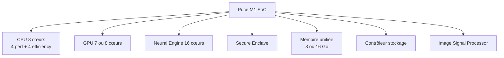

# 2.4 bis macOS architecture pour forensic

!!! quote "L'analogie du coffre-fort à plusieurs serrures"

    Un coffre-fort Apple Silicon n'a pas une porte mais quatre. La première serrure est SIP qui empêche même root de toucher au système. La deuxième est SSV qui chiffre cryptographiquement la signature du système. La troisième est FileVault qui chiffre intégralement le disque utilisateur. La quatrième est la Secure Enclave, processeur séparé qui détient les clés et n'en sort jamais. Chacune de ces serrures est ouvrable individuellement par un attaquant suffisamment habile. Toutes les quatre simultanément ne le sont pas. C'est ce qui rend Apple Silicon presque imprenable en forensic. Comprendre cette architecture vous permet de savoir précisément ce que vous pouvez faire et ce qui restera à jamais inaccessible. C'est un changement de perspective critique pour tout analyste qui pensait jusque-là que tout finit par tomber.

## Métadonnées du chapitre

| Champ | Valeur |
|---|---|
| Durée estimée | 8 heures |
| Niveau | Standard |
| Prérequis | Notions Unix, accès à un Mac (idéalement Apple Silicon) |
| Livrables | Inventaire MacBook M1 personnel, mémo CLI |
| Auto-explication | 18 minutes |

## Objectifs pédagogiques

- Comprendre l'architecture matérielle Apple Silicon
- Maîtriser la hiérarchie système macOS et ses spécificités
- Identifier les fichiers et répertoires critiques pour le forensic
- Appréhender les protections SIP, SSV, FileVault, Secure Enclave
- Investiguer launchd, TCC.db, Endpoint Security Framework
- Connaître les outils forensic spécifiques macOS (mac_apt, AutoMacTC)

---

## 1. Apple Silicon - Architecture matérielle M1

### 1.1 Vue d'ensemble du M1

Le **M1** sorti en novembre 2020 est la première puce Apple Silicon pour Mac. Le MacBook équivalent que vous possédez intègre :



### 1.2 Différences fondamentales avec Intel

| Aspect | Intel Mac | Apple Silicon M1 |
|---|---|---|
| Architecture | x86_64 | ARM64 (aarch64) |
| Mémoire | RAM séparée | Unifiée (CPU+GPU partagent) |
| T2 | Puce séparée | Intégrée au M1 |
| Secure Boot | Optionnel | Intégré dans le SoC |
| Volatility plugins | Disponibles | Quasi-inexistants 2026 |
| Acquisition mémoire | Outils standards | Très limité |

### 1.3 Implications forensic majeures

| Limite Apple Silicon | Conséquence |
|---|---|
| Secure Enclave inaccessible | Clés FileVault non extractibles |
| Mémoire unifiée | Acquisition encore plus complexe |
| Pas de port Thunderbolt en host de DMA | DMA attacks impossibles |
| SSV vérifié au boot | Modifications système détectées |
| Boot security par défaut | Exécution OS modifié bloquée |
| Pas de mode Single User | Boot dégradé impossible |
| Recovery Mode protégé | Authentification requise |

---

## 2. Hiérarchie du système de fichiers macOS

### 2.1 Structure générale

```mermaid
flowchart TB
    A["/ racine APFS Sealed"] --> B[/Applications]
    A --> C[/Library système]
    A --> D[/System verrouillé SSV]
    A --> E[/Users utilisateurs]
    A --> F[/private]
    A --> G[/usr]
    A --> H[/bin /sbin]
    A --> I[/Volumes]

    F --> F1[/private/etc]
    F --> F2[/private/var]
    F --> F3[/private/tmp]

    E --> E1[/Users/USER]
    E1 --> E2[~/Library]
```

### 2.2 Répertoires critiques

| Chemin | Contenu | Forensic |
|---|---|---|
| `/Applications/` | Apps installées | Liste des logiciels |
| `/Library/` | Configuration système | Persistance, settings |
| `/Library/LaunchDaemons/` | Daemons système | Persistance fréquente |
| `/Library/LaunchAgents/` | Agents système | Persistance fréquente |
| `~/Library/LaunchAgents/` | Agents utilisateur | Persistance utilisateur |
| `~/Library/Preferences/` | Préférences plist | Configuration apps |
| `~/Library/Application Support/` | Données apps | Caches, données |
| `~/Library/Containers/` | Apps sandboxées (App Store) | Isolés |
| `/private/etc/` | Configs Unix | Compatibilité POSIX |
| `/private/var/log/` | Logs système | Traces |
| `/System/Library/` | Système (SSV) | **Lecture seule** |
| `/Volumes/` | Volumes montés | Disques externes |

### 2.3 Particularité - System Integrity Protection

Le système est en **lecture seule** depuis macOS Big Sur. La structure `/` est en réalité un **Sealed System Volume (SSV)** signé cryptographiquement. Toute modification :

- Casse la signature
- Empêche le démarrage
- Active la récupération automatique

**Conséquence forensic** : un malware ne peut **plus modifier le système macOS** lui-même. Il agit dans `/Users/`, `~/Library/`, ou via des persistances LaunchDaemons/Agents.

---

## 3. launchd - Le superviseur macOS

### 3.1 Concept

**launchd** est l'équivalent macOS de systemd Linux. C'est le **PID 1** qui orchestre les services et applications.

### 3.2 Types d'unités

| Type | Localisation | Cible |
|---|---|---|
| LaunchDaemon | `/Library/LaunchDaemons/` | Système (sans utilisateur connecté) |
| LaunchDaemon | `/System/Library/LaunchDaemons/` | Apple uniquement (SSV) |
| LaunchAgent | `/Library/LaunchAgents/` | Tous utilisateurs (à la connexion) |
| LaunchAgent | `/System/Library/LaunchAgents/` | Apple uniquement |
| LaunchAgent | `~/Library/LaunchAgents/` | Utilisateur courant |

### 3.3 Format plist

Une unité launchd est un fichier `.plist` (XML ou binaire). Exemple :

```xml
<?xml version="1.0" encoding="UTF-8"?>
<!DOCTYPE plist PUBLIC "-//Apple//DTD PLIST 1.0//EN"
  "http://www.apple.com/DTDs/PropertyList-1.0.dtd">
<plist version="1.0">
<dict>
    <key>Label</key>
    <string>com.exemple.malware</string>
    <key>ProgramArguments</key>
    <array>
        <string>/Users/zyrass/.cache/.hidden/payload</string>
    </array>
    <key>RunAtLoad</key>
    <true/>
    <key>StartInterval</key>
    <integer>3600</integer>
</dict>
</plist>
```

### 3.4 Investigation launchd

```bash
# Lister tous les daemons et agents
launchctl list

# Daemons système custom
ls -la /Library/LaunchDaemons/

# Agents système custom
ls -la /Library/LaunchAgents/

# Agents utilisateur courant
ls -la ~/Library/LaunchAgents/

# Détails d'un .plist
plutil -p /Library/LaunchDaemons/com.exemple.plist

# Convertir binary plist en XML
plutil -convert xml1 -o - /Library/LaunchDaemons/com.exemple.plist
```

### 3.5 Indices forensic

| Indice | Suspicion |
|---|---|
| Plist dans `/Library/Launch*/` créé récemment | Élevée |
| Plist au Label mimétique (com.apple.update.X) | Élevée |
| ProgramArguments pointant vers `/tmp` ou `~/.cache` | Très élevée |
| StartInterval court (60s) | Suspect |
| KeepAlive=true sur process inconnu | Suspect |

---

## 4. TCC - Transparency Consent and Control

### 4.1 Concept

**TCC** est le framework Apple qui gère les autorisations applicatives :

- Accès microphone
- Accès caméra
- Accès localisation
- Accès photos, contacts, calendrier
- Accès accessibilité (sensible !)
- Accès complet au disque
- Surveillance écran
- Enregistrement frappe

### 4.2 Stockage

| Niveau | Localisation |
|---|---|
| Système | `/Library/Application Support/com.apple.TCC/TCC.db` |
| Utilisateur | `~/Library/Application Support/com.apple.TCC/TCC.db` |

### 4.3 Importance forensic

Une **modification de TCC.db** par un malware est un signe de compromission grave :

- Le malware s'auto-accorde des permissions
- Contourne les dialogues utilisateur
- Permet enregistrement écran, frappe, etc.

### 4.4 Investigation

```bash
# Nécessite Full Disk Access pour lire
# Lister les permissions système
sudo sqlite3 "/Library/Application Support/com.apple.TCC/TCC.db" \
  "SELECT service, client, auth_value FROM access;"

# Permissions utilisateur
sqlite3 "~/Library/Application Support/com.apple.TCC/TCC.db" \
  "SELECT service, client, auth_value FROM access;"
```

---

## 5. Logs unifiés (Unified Logging System)

### 5.1 Concept

Depuis macOS Sierra, Apple a remplacé les logs textuels par un **système de logs unifié** stocké au format binaire propriétaire.

### 5.2 Localisation

`/var/db/diagnostics/` - logs binaires
`/var/db/uuidtext/` - chaînes de format

### 5.3 Outil log

```bash
# Tous les logs récents (1 minute)
log show --last 1m

# Logs de la dernière heure
log show --last 1h

# Filtrer par subsystem
log show --predicate 'subsystem == "com.apple.securityd"' --last 1h

# Filtrer par processus
log show --predicate 'process == "sshd"' --last 1d

# Logs de connexion
log show --predicate 'subsystem == "com.apple.opendirectoryd"' --last 7d

# Format JSON
log show --last 10m --style json
```

### 5.4 Investigation forensic

| Cas | Commande |
|---|---|
| Tentatives login échouées | `log show --predicate 'eventMessage contains "authentication failure"'` |
| Activité sudo | `log show --predicate 'process == "sudo"'` |
| Connexions SSH | `log show --predicate 'process == "sshd"'` |
| Lancements applications | `log show --predicate 'subsystem == "com.apple.launchservices"'` |

---

## 6. Système de fichiers APFS

Détaillé en chapitre 2.10 bis. Aperçu rapide :

### 6.1 Caractéristiques principales

| Feature | Description |
|---|---|
| Copy-on-write | Modifications créent nouveaux blocs |
| Snapshots | Photos instantanées à coût zéro |
| Cloning | Copie de fichier sans duplication réelle |
| Encryption native | FileVault intégré |
| Container/Volume | Multiples volumes dans un container |
| Sealed Volumes | SSV macOS Big Sur+ |

### 6.2 Implications forensic

- Récupération de fichiers supprimés **plus difficile** qu'avec HFS+
- Les **snapshots** sont une source de données précieuse
- Le chiffrement FileVault est **par défaut**
- Les **clones** font qu'un même fichier peut apparaître à plusieurs endroits

---

## 7. Outils forensic macOS

### 7.1 Outils dédiés

| Outil | Description | Disponibilité |
|---|---|---|
| mac_apt | Framework artefacts macOS | Open source, Python |
| AutoMacTC | Triage rapide | Open source, Python |
| mac_robber | Timeline metadata | Open source |
| Recon ITR | Commercial | Pourriel ou licence |
| Volexity Surge | Capture mémoire | Commercial |
| BlackBag MacQuisition | Suite complète | Commercial |

### 7.2 mac_apt - Artefacts macOS

mac_apt extrait :

- Comptes utilisateurs et groupes
- Préférences système
- Historique navigateurs (Safari, Chrome, Firefox)
- Préférences applications
- Logs unifiés
- Réseau Wi-Fi connus
- Utilisation Spotlight
- Quarantaine (downloads)

```bash
# Installation
pip install mac_apt

# Usage sur image disque
python mac_apt.py -i image.dmg -o output_dir

# Modules ciblés
python mac_apt.py -i image.dmg -o output_dir --plugins SAFARI,LAUNCHD,USERS
```

### 7.3 AutoMacTC

Triage rapide en quelques minutes :

```bash
# Téléchargement
git clone https://github.com/CrowdStrike/automactc.git

# Exécution
python automactc.py -m all -o output/

# Modules courants : asl, audit, autoruns, bash, chrome, firefox, safari,
# coreanalytics, dirlist, eventtaps, installhistory, lsof, mru, netstat,
# pslist, quarantines, quicklook, spotlight, ssh, syslog, systeminfo,
# terminalstate, users, utmpx, wifi
```

---

## 8. Investigation rapide d'un Mac

### 8.1 Inventaire système

```bash
# Modèle et puce
system_profiler SPHardwareDataType

# Version macOS détaillée
sw_vers
system_profiler SPSoftwareDataType

# Utilisateurs locaux
dscl . -list /Users | grep -v ^_

# Applications installées
system_profiler SPApplicationsDataType

# Réseau
networksetup -listallhardwareports
ifconfig

# Wi-Fi connus
defaults read /Library/Preferences/com.apple.wifi.message-tracer
```

### 8.2 Investigation rapide

```bash
# Processus
ps auxf

# Connexions réseau
lsof -i -P -n
netstat -an | grep LISTEN

# Daemons et agents
launchctl list | grep -v com.apple

# Login items utilisateur
osascript -e 'tell application "System Events" to get the name of every login item'

# Quarantine database (downloads)
sqlite3 ~/Library/Preferences/com.apple.LaunchServices.QuarantineEventsV2 \
  "SELECT * FROM LSQuarantineEvent ORDER BY LSQuarantineTimeStamp DESC LIMIT 50;"

# Historique terminal (zsh)
cat ~/.zsh_history | tail -100

# Historique terminal (bash legacy)
cat ~/.bash_history | tail -100
```

### 8.3 Script d'investigation rapide

```bash
#!/bin/bash
# Script forensic-macos-quick.sh

OUTPUT="/tmp/forensic_$(hostname)_$(date +%Y%m%d_%H%M%S).txt"

{
  echo "=== FORENSIC MACOS QUICK ==="
  echo "Date: $(date -u)"
  echo "Hostname: $(hostname)"
  echo ""

  echo "=== SYSTÈME ==="
  sw_vers
  system_profiler SPHardwareDataType | grep -E "Model|Chip|Memory|Serial"

  echo ""
  echo "=== UTILISATEURS ==="
  dscl . -list /Users | grep -v ^_

  echo ""
  echo "=== ADMINS ==="
  dscl . -read /Groups/admin GroupMembership

  echo ""
  echo "=== LAUNCHDAEMONS CUSTOM ==="
  ls -la /Library/LaunchDaemons/ 2>/dev/null | grep -v ^total

  echo ""
  echo "=== LAUNCHAGENTS CUSTOM ==="
  ls -la /Library/LaunchAgents/ 2>/dev/null | grep -v ^total
  echo "--- Utilisateur ---"
  ls -la ~/Library/LaunchAgents/ 2>/dev/null | grep -v ^total

  echo ""
  echo "=== PROCESSUS ==="
  ps auxf

  echo ""
  echo "=== CONNEXIONS RÉSEAU ==="
  lsof -i -P -n 2>/dev/null | head -50

  echo ""
  echo "=== DOWNLOADS RÉCENTS ==="
  sqlite3 ~/Library/Preferences/com.apple.LaunchServices.QuarantineEventsV2 \
    "SELECT datetime(LSQuarantineTimeStamp+978307200,'unixepoch') as date, \
            LSQuarantineAgentName as app, LSQuarantineDataURLString as url \
     FROM LSQuarantineEvent ORDER BY LSQuarantineTimeStamp DESC LIMIT 30;" 2>/dev/null

  echo ""
  echo "=== SUDO RÉCENTS ==="
  log show --predicate 'process == "sudo"' --last 7d --style compact 2>/dev/null | tail -50

  echo ""
  echo "=== SSH RÉCENTS ==="
  log show --predicate 'process == "sshd"' --last 7d --style compact 2>/dev/null | tail -30

} > "$OUTPUT"

echo "Rapport: $OUTPUT"
shasum -a 256 "$OUTPUT"
```

---

## 9. Spécificités MacBook M1 - Préparation forensic

### 9.1 Vérifications préalables

Sur votre MacBook M1, vérifiez :

```bash
# Confirmation Apple Silicon
uname -m
# Attendu : arm64

# Détails puce
system_profiler SPHardwareDataType | grep "Chip"
# Attendu : Apple M1

# Statut FileVault
fdesetup status

# Statut SIP
csrutil status

# Statut SSV
csrutil authenticated-root status
```

### 9.2 Configuration recommandée pour le forensic

| Action | Pourquoi |
|---|---|
| Garder FileVault actif | Réaliste, comme un cas client |
| Installer Xcode CLI tools | Outils unix complets |
| Installer Homebrew | Gestionnaire de paquets |
| Cloner mac_apt et AutoMacTC | Outils forensic |
| Activer Time Machine | Sauvegardes test |
| Configurer Touch ID | Test biométrie |

### 9.3 Limites du M1 pour le forensic apprenant

| Limite | Solution |
|---|---|
| Volatility limité | Utiliser pour cibles, pas comme analyseur |
| 8 Go RAM | Pas pour analyser de gros dumps |
| Pas de virtualisation x86_64 native | Emulation lente |
| Outils forensic ARM limités | Croiser avec poste analyste |

**Stratégie** : utilisez le MacBook M1 comme **cible** d'analyse, pas comme **poste analyste**. Les acquisitions et analyses lourdes se font sur votre Windows 48 Go.

---

## 10. Auto-évaluation

| # | Question | Réponse |
|---|---|---|
| 1 | Architecture du M1 ? | ARM64 (aarch64) |
| 2 | Que fait SIP ? | Empêche modifications système même par root |
| 3 | Localisation LaunchDaemons système custom ? | `/Library/LaunchDaemons/` |
| 4 | Qu'est-ce que TCC ? | Transparency Consent Control |
| 5 | Outil pour logs unifiés ? | `log show` |
| 6 | Format des unités launchd ? | `.plist` (XML ou binaire) |
| 7 | Outil forensic Python pour macOS ? | mac_apt ou AutoMacTC |
| 8 | Statut FileVault ? | `fdesetup status` |

---

## 11. Synthèse mémo

```text
MACOS FORENSIC - ESSENTIELS

ARCHITECTURE :
  M1 = ARM64
  Secure Enclave intégré
  Mémoire unifiée

PROTECTIONS :
  SIP   System Integrity Protection
  SSV   Sealed System Volume
  FileVault chiffrement disque
  Secure Enclave clés isolées

PERSISTANCE :
  /Library/LaunchDaemons/        système
  /Library/LaunchAgents/         tous users
  ~/Library/LaunchAgents/        user courant
  Login Items                    UI
  TCC.db modifié                 grave

LOGS :
  log show --last
  /var/db/diagnostics/

OUTILS :
  mac_apt
  AutoMacTC
  Volexity Surge (mémoire, commercial)

INVESTIGATION RAPIDE :
  launchctl list
  ps auxf
  lsof -i -P -n
  Quarantine DB
```

---

**Chapitre précédent** : [2.4 Windows architecture pour forensic](02-4-windows.md)

**Chapitre suivant** : [2.5 PowerShell pour analyste forensic](02-5-powershell.md)
