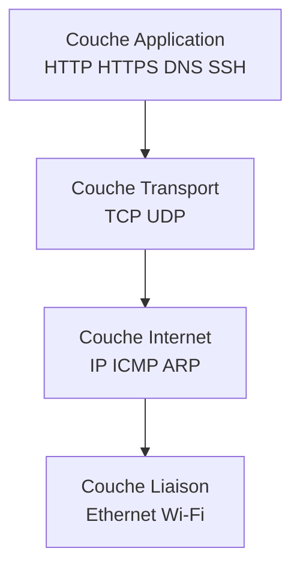
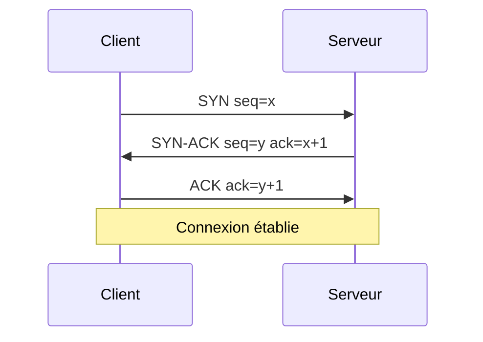
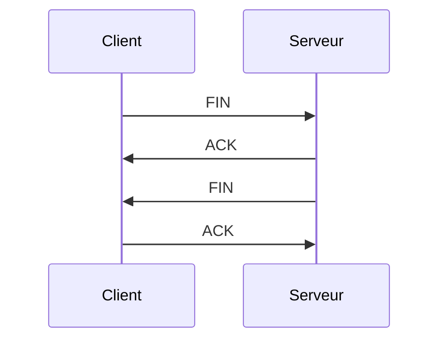
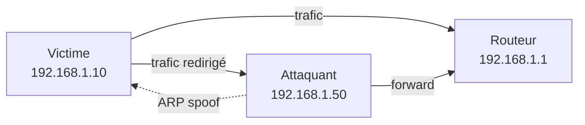
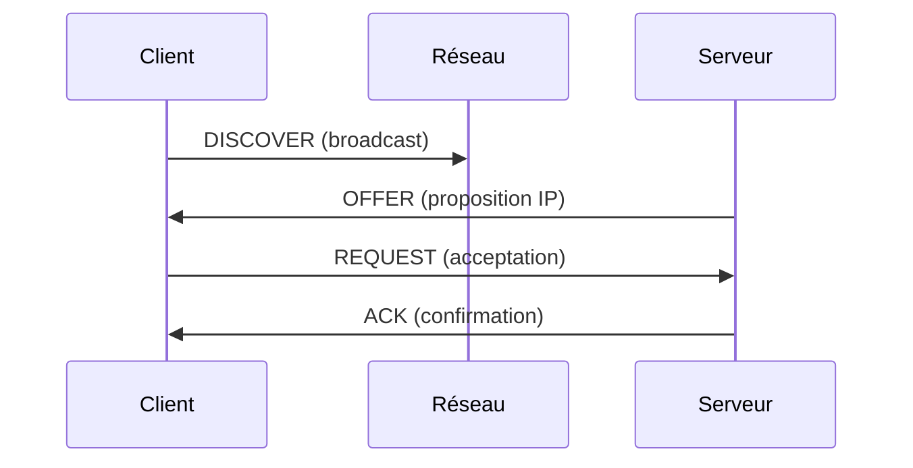

# 2.6 Réseaux TCP/IP approfondi

!!! quote "L'analogie du système postal"

    Un réseau TCP/IP fonctionne comme un système postal mondial. L'IP est l'adresse postale qui dit où aller. TCP est le service recommandé qui garantit la livraison ordonnée. UDP est le courrier simple qui part sans accusé. ARP est le facteur local qui sait quelle maison est qui. DNS est l'annuaire qui traduit les noms en adresses. Pour vous, analyste forensic, comprendre cette plomberie est essentiel : la majorité des intrusions passent par le réseau, et chaque paquet capturé raconte une histoire.

## Métadonnées

| Champ | Valeur |
|---|---|
| Durée | 4 heures |
| Niveau | Standard |
| Prérequis | Notions de base réseau |

## 1. Modèle TCP/IP



| Couche | Exemples |
|---|---|
| Application | HTTP, HTTPS, DNS, SSH, SMTP, FTP |
| Transport | TCP, UDP |
| Internet | IPv4, IPv6, ICMP, ARP |
| Liaison | Ethernet, Wi-Fi, PPP |

## 2. Adressage IP

### 2.1 Plages privées RFC 1918

| Plage | Préfixe | Hôtes |
|---|---|---|
| 10.0.0.0/8 | 10. | ~16 millions |
| 172.16.0.0/12 | 172.16 à 172.31 | ~1 million |
| 192.168.0.0/16 | 192.168 | ~65 000 |

### 2.2 Plages spéciales

| Plage | Usage |
|---|---|
| 127.0.0.0/8 | Loopback (localhost) |
| 169.254.0.0/16 | Link-local (APIPA, faute DHCP) |
| 224.0.0.0/4 | Multicast |
| 255.255.255.255 | Broadcast |

## 3. TCP en détail

### 3.1 3-way handshake



### 3.2 4-way handshake (fermeture)



### 3.3 États TCP

| État | Description |
|---|---|
| LISTEN | Serveur en attente |
| SYN_SENT | Client a envoyé SYN |
| SYN_RECV | Serveur a reçu SYN |
| ESTABLISHED | Connexion établie |
| FIN_WAIT_1 | Initiateur a envoyé FIN |
| TIME_WAIT | Attente fin propre |
| CLOSE_WAIT | A reçu FIN, doit envoyer le sien |
| CLOSED | Fermé |

## 4. ARP - Vulnérabilité fondamentale

ARP (Address Resolution Protocol) traduit IP → MAC sur le réseau local.

```bash
# Voir le cache ARP Linux
ip neigh show

# Sur Windows
arp -a

# Sur macOS
arp -a
```

### 4.1 ARP spoofing

ARP n'a **aucune authentification**. Un attaquant peut envoyer des réponses ARP forgées pour rediriger le trafic.



**Détection** :

- IP avec MAC qui change fréquemment
- MAC dupliquée sur plusieurs IP
- Outil `arpwatch` qui surveille

## 5. DHCP

DHCP attribue automatiquement les IP. 4 étapes :



### 5.1 Investigation forensic DHCP

```bash
# Lease en cours Linux
cat /var/lib/dhcp/dhclient.leases

# Sur macOS
ipconfig getsummary en0
```

## 6. DNS

### 6.1 Résolution

```bash
# nslookup basique
nslookup omnyvia.fr

# dig détaillé
dig omnyvia.fr A
dig omnyvia.fr MX
dig +trace omnyvia.fr     # toute la chaîne récursive

# Logs DNS Windows
Get-DnsClientCache
```

### 6.2 Types d'enregistrements

| Type | Usage |
|---|---|
| A | IPv4 |
| AAAA | IPv6 |
| CNAME | Alias |
| MX | Mail Exchange |
| TXT | Texte (SPF, DKIM, vérifs) |
| NS | Name Server |
| SOA | Start of Authority |

### 6.3 Investigation forensic DNS

| Indice | Suspicion |
|---|---|
| Requêtes vers domaines DGA | Très haute (C2 typique) |
| Requêtes vers TLD exotiques (.tk, .xyz) | Élevée |
| Requêtes TXT massives | Possible exfiltration |
| Requêtes vers domaines récemment créés | Élevée |

## 7. Wireshark / tcpdump - Lecture

### 7.1 Filtres tcpdump

```bash
# Tout sur eth0
tcpdump -i eth0

# Sans résolution DNS
tcpdump -i eth0 -nn

# Port spécifique
tcpdump -i eth0 port 443

# Vers/depuis IP
tcpdump -i eth0 host 192.168.1.10

# Combinaison
tcpdump -i eth0 'port 80 and host 192.168.1.10'

# Sauver
tcpdump -i eth0 -w capture.pcap

# Lire
tcpdump -r capture.pcap
```

### 7.2 Filtres Wireshark display

```text
ip.addr == 192.168.1.10
tcp.port == 443
http
http.request.method == "POST"
dns
dns.qry.name contains "suspicious"
tcp.flags.syn == 1 and tcp.flags.ack == 0     # SYN seuls (scan)
```

### 7.3 Indices forensic dans capture

| Indice | Suspicion |
|---|---|
| Beaucoup de SYN sans réponse | Scan en cours |
| Connexions vers IP non résolue (pas de DNS prior) | C2 hardcodé |
| Trafic TLS vers IP étrange | Possible C2 |
| Beacons réguliers (même intervalle) | C2 typique |
| DNS TXT vers même domaine | Possible exfiltration DNS |
| HTTP POST volumineux vers domaine inconnu | Exfiltration |

## 8. Auto-évaluation

| # | Question | Réponse |
|---|---|---|
| 1 | Plages RFC 1918 ? | 10/8, 172.16-31/12, 192.168/16 |
| 2 | Étapes 3-way handshake ? | SYN, SYN-ACK, ACK |
| 3 | Vulnérabilité ARP ? | Pas d'authentification, spoofing |
| 4 | 4 étapes DHCP ? | Discover Offer Request Ack |
| 5 | Filtrer port 443 tcpdump ? | `tcpdump port 443` |
| 6 | Indice DNS suspect ? | DGA, TLD exotique, TXT massif |

## 9. Synthèse

```text
RÉSEAUX TCP/IP FORENSIC

Couches : Application Transport Internet Liaison

IP privées : 10/8, 172.16-31/12, 192.168/16

TCP : 3-way handshake (SYN/SYN-ACK/ACK)
      États : LISTEN ESTABLISHED TIME_WAIT

ARP : pas d'auth = spoofing facile

DHCP : Discover Offer Request Ack

DNS : A AAAA CNAME MX TXT NS

tcpdump :
  -i interface
  -nn pas de résolution
  -w fichier.pcap

Indices forensic :
  Beacons réguliers
  DNS TXT massifs
  POST volumineux étranges
  Trafic non résolu
```

---

**Chapitre suivant** : [2.7 Cryptographie symétrique et asymétrique](02-7-cryptographie.md)
