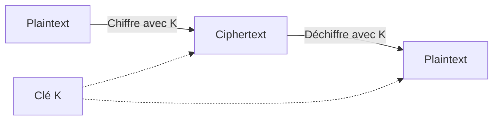
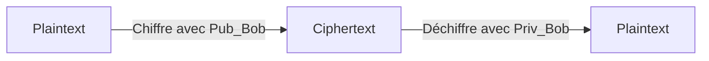
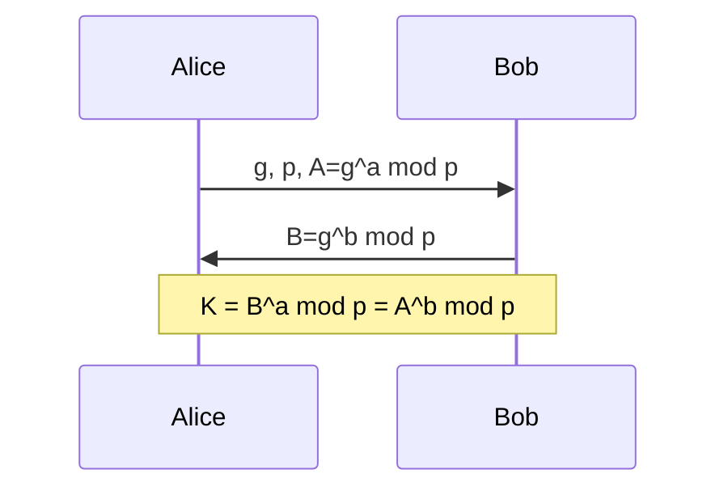
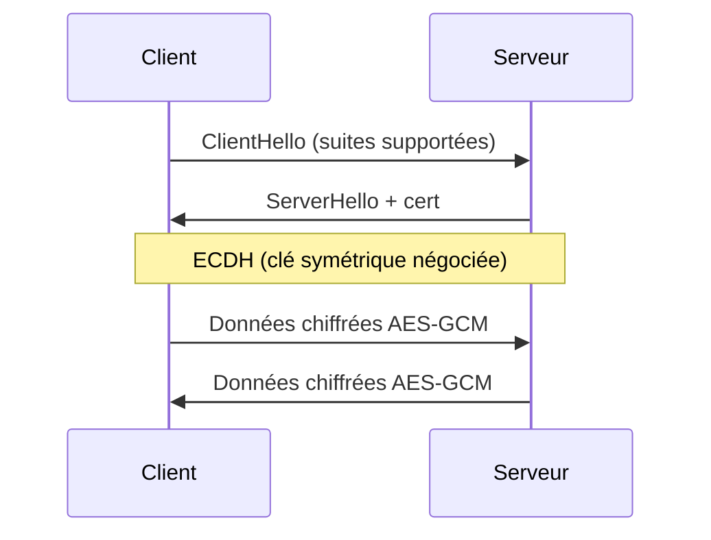

# 2.7 Cryptographie symétrique et asymétrique

!!! quote "L'analogie du coffre et de la clé"

    Un coffre-fort accepte deux modèles de serrures. Le premier modèle utilise une seule clé qui ouvre et ferme : c'est la cryptographie symétrique. Rapide, mais comment partager la clé sans qu'on l'intercepte ? Le second modèle utilise deux clés mathématiquement liées : une publique pour fermer, une privée pour ouvrir. C'est la cryptographie asymétrique. Lente, mais résout le problème du partage. Toute la sécurité moderne combine les deux : asymétrique pour échanger une clé symétrique, puis symétrique pour le gros du trafic.

## Métadonnées

| Champ | Valeur |
|---|---|
| Durée | 4 heures |
| Niveau | Standard |

## 1. Cryptographie symétrique

### 1.1 Principe

Une **seule clé secrète** partagée entre émetteur et récepteur.



### 1.2 AES - Standard moderne

| Variante | Taille clé | Tours | Sécurité 2026 |
|---|---|---|---|
| AES-128 | 128 bits | 10 | Suffisant |
| AES-192 | 192 bits | 12 | Très bon |
| AES-256 | 256 bits | 14 | **Recommandé** |

### 1.3 Modes opératoires

| Mode | Usage | Forensic |
|---|---|---|
| ECB | Aucun (faible) | Reconnaissable visuellement |
| CBC | Anciennement standard | IV requis |
| CTR | Streaming | Pas de padding |
| GCM | **Standard moderne** | Authentifié (AEAD) |
| XTS | Disque (BitLocker, FileVault) | Adapté blocs |

### 1.4 Applications forensic

| Application | Mode | Clé |
|---|---|---|
| BitLocker | AES-XTS | FVEK protégée par TPM/PIN |
| FileVault 2 | AES-XTS | Clé dérivée + Secure Enclave |
| LUKS | AES-XTS | Clé maître protégée par passphrase |
| TLS 1.3 | AES-GCM | Négociée |
| VPN IPsec | AES-CBC ou GCM | Négociée |

## 2. Cryptographie asymétrique

### 2.1 Principe

**Paire de clés** : publique (partagée) et privée (secrète).



| Opération | Clé utilisée | Effet |
|---|---|---|
| Chiffrement | Publique destinataire | Confidentialité |
| Déchiffrement | Privée destinataire | Lecture |
| Signature | Privée signataire | Authenticité |
| Vérification | Publique signataire | Validation |

### 2.2 RSA

Repose sur la difficulté de factorisation de grands nombres.

| Taille | Sécurité 2026 |
|---|---|
| RSA-1024 | Compromis, à éviter |
| RSA-2048 | **Minimum** |
| RSA-3072 | Recommandé |
| RSA-4096 | Très sûr |

### 2.3 Cryptographie à courbes elliptiques (ECC)

Plus efficace que RSA à sécurité équivalente.

| ECC | Équivalent RSA |
|---|---|
| ECDSA-256 | RSA-3072 |
| ECDSA-384 | RSA-7680 |
| Ed25519 | RSA-3000+ |

## 3. Échange Diffie-Hellman

Permet de **dériver une clé symétrique** à travers un canal non sécurisé.



Variante moderne : **ECDH** sur courbes elliptiques (X25519).

## 4. TLS - Combinaison pratique



## 5. Gestion des clés

### 5.1 Hiérarchie typique

| Niveau | Clé | Usage |
|---|---|---|
| Maître | KEK | Chiffre les autres clés |
| Données | DEK | Chiffre les données réelles |
| Session | SK | Échangée par session |

### 5.2 Stockage

| Méthode | Sécurité |
|---|---|
| Fichier brut | Très faible |
| Keystore OS | Bonne (Keychain macOS, Windows DPAPI) |
| HSM matériel | Excellente |
| Secure Enclave | Excellente (M1+) |
| TPM | Bonne (Windows BitLocker) |

## 6. Implications forensic

### 6.1 Acquisition clés depuis RAM

Les clés AES-XTS de BitLocker ou LUKS résident **en clair en RAM** quand le disque est monté. Volatility peut les extraire.

### 6.2 Attaque sur disque chiffré

| Cible | Difficulté |
|---|---|
| BitLocker TPM seul (sans PIN) | Possible avec accès physique |
| BitLocker TPM + PIN | Très difficile |
| FileVault Apple Silicon | Quasi-impossible sans password |
| LUKS sans master key extraite | Bruteforce passphrase, lent |
| Conteneur VeraCrypt | Bruteforce passphrase |

### 6.3 Mauvaises pratiques cryptographiques (à détecter en audit)

| Faute | Indice |
|---|---|
| Mots de passe stockés en clair | Critique |
| MD5 utilisé pour authentification | Faute grave |
| RC4 ou DES | Algorithmes cassés |
| ECB pour disque | Visuellement reconnaissable |
| Clés codées en dur | Faute critique |

## 7. Auto-évaluation

| # | Question | Réponse |
|---|---|---|
| 1 | Différence symétrique/asymétrique ? | Une clé / paire publique-privée |
| 2 | Standard moderne symétrique ? | AES-256-GCM |
| 3 | Mode disque ? | XTS |
| 4 | Minimum RSA ? | 2048 bits |
| 5 | Clé Ed25519 équivalente RSA ? | RSA-3000+ |
| 6 | TLS combine quoi ? | Asymétrique pour négocier, symétrique pour data |

## 8. Synthèse

```text
CRYPTOGRAPHIE FORENSIC

SYMÉTRIQUE
  AES-256-GCM moderne
  AES-XTS pour disque
  Clé partagée

ASYMÉTRIQUE
  RSA-2048+ minimum
  ECDSA / Ed25519 modernes
  Clés publique + privée

ÉCHANGE
  Diffie-Hellman / ECDH
  Permet clé symétrique sur canal non sûr

APPLICATIONS
  BitLocker LUKS FileVault : AES-XTS
  TLS 1.3 : ECDH + AES-GCM
  Signatures : ECDSA Ed25519

FORENSIC
  Clés en RAM si disque monté
  Volatility extraction
  Attaques offline possibles selon cas
```

---

**Chapitre suivant** : [2.8 Hash, signatures, X.509](02-8-hash-signatures.md)
