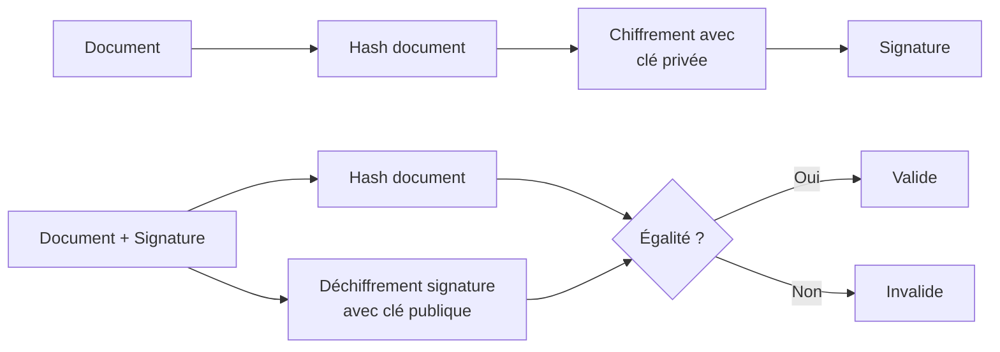
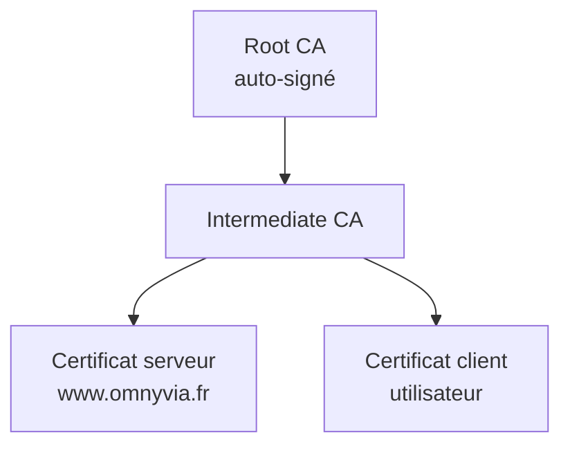

# 2.8 Hash, signatures, certificats X.509

!!! quote "L'analogie de l'empreinte digitale"

    Une empreinte digitale a trois propriétés magiques : courte (10 cm² au lieu d'un corps entier), unique (deux personnes ont rarement la même), et sensible (le moindre changement rend l'empreinte différente). Un hash cryptographique a exactement ces trois propriétés appliquées aux données numériques. Court (256 bits pour SHA-256), unique en pratique (collisions astronomiquement improbables), et sensible (changer un bit change tout le hash). Pour vous, analyste forensic, le hash est l'empreinte qui prouve qu'une preuve n'a pas été altérée. Sans hash systématique, votre rapport perd sa valeur juridique.

## Métadonnées

| Champ | Valeur |
|---|---|
| Durée | 3 heures |
| Niveau | Standard |

## 1. Fonctions de hash

### 1.1 Propriétés requises

| Propriété | Définition |
|---|---|
| Déterministe | Même entrée = même sortie |
| Rapide | Calcul en millisecondes |
| One-way | Impossible de retrouver l'entrée |
| Résistance aux collisions | Trouver deux entrées au même hash est calculatoirement impossible |
| Effet avalanche | 1 bit changé = ~50% des bits du hash changent |

### 1.2 Algorithmes

| Algorithme | Taille | Sécurité 2026 |
|---|---|---|
| MD5 | 128 bits | **Cassé** (collisions) |
| SHA-1 | 160 bits | **Cassé** (collisions 2017) |
| SHA-256 | 256 bits | **Standard** |
| SHA-3 | 256/512 | Alternative SHA-2 |
| SHA-512 | 512 bits | Plus lent, plus de marge |
| BLAKE3 | Variable | Très rapide, moderne |

**Règle forensic 2026** : utilisez **SHA-256** comme défaut. Doublez avec **SHA-1** uniquement pour compatibilité (pas pour sécurité).

### 1.3 Calcul

```bash
# Linux / macOS
sha256sum fichier
shasum -a 256 fichier   # macOS

# Windows PowerShell
Get-FileHash fichier -Algorithm SHA256

# Hash multi-algorithmes
md5sum fichier
sha1sum fichier
sha256sum fichier
```

### 1.4 Forensic - Chaîne de garde

```text
PROCÉDURE TYPE
==============

1. Acquisition
   sha256sum disque_original > original.sha256
   
2. Copie forensic
   dc3dd if=/dev/sdb of=image.dd hash=sha256
   
3. Vérification post-acquisition
   sha256sum image.dd
   
4. Stockage
   sha256sum image.dd > image.sha256
   
5. Chaque accès ultérieur
   sha256sum image.dd | diff - image.sha256
```

## 2. HMAC

**Hash-based Message Authentication Code** : prouve l'authenticité ET l'intégrité.

```text
HMAC = Hash(clé || Hash(clé || message))
```

Utilisation : authentification API, JWT, signature de tokens.

```bash
# OpenSSL HMAC
echo -n "message" | openssl dgst -sha256 -hmac "cle_secrete"
```

## 3. Signatures numériques

### 3.1 Principe



### 3.2 Algorithmes courants

| Algorithme | Usage 2026 |
|---|---|
| RSA-PSS | Standard, sécurisé |
| ECDSA | Performant |
| Ed25519 | Moderne, recommandé |
| RSA-PKCS#1 v1.5 | Legacy, à éviter |

### 3.3 Signature de fichier

```bash
# Générer une paire RSA
openssl genrsa -out priv.pem 2048
openssl rsa -in priv.pem -pubout -out pub.pem

# Signer
openssl dgst -sha256 -sign priv.pem fichier.bin > sig.bin

# Vérifier
openssl dgst -sha256 -verify pub.pem -signature sig.bin fichier.bin
```

## 4. Certificats X.509

### 4.1 Structure

Un certificat X.509 lie une **clé publique** à une **identité**, signé par une **autorité de certification (CA)**.

| Champ | Contenu |
|---|---|
| Subject | Identité (CN, O, C, etc.) |
| Issuer | Autorité émettrice |
| Validity | Dates début/fin |
| Public Key | Clé publique |
| Serial Number | Identifiant unique |
| Signature | Signature de la CA |
| Extensions | Usages, alt names, etc. |

### 4.2 Hiérarchie PKI



### 4.3 Inspection

```bash
# Afficher détails certificat
openssl x509 -in cert.pem -text -noout

# Vérifier chaîne
openssl verify -CAfile chain.pem cert.pem

# Récupérer cert d'un site
openssl s_client -connect www.omnyvia.fr:443 -showcerts < /dev/null

# Empreinte
openssl x509 -in cert.pem -fingerprint -sha256 -noout
```

## 5. PKI - Public Key Infrastructure

### 5.1 Composants

| Composant | Rôle |
|---|---|
| CA | Émet et signe les certificats |
| RA (Registration Authority) | Vérifie l'identité avant émission |
| CRL (Certificate Revocation List) | Liste des certificats révoqués |
| OCSP | Service en ligne de vérification |
| Certificate Transparency | Logs publics des certificats émis |

### 5.2 Certificats Apple Silicon

Sur Apple Silicon, plusieurs certificats sont **profondément ancrés dans le silicium** :

- Certificat Apple Boot ROM (UID/GID dans la puce)
- Certificat Secure Enclave
- Chaîne SSV (Sealed System Volume)

C'est ce qui rend la falsification du système quasi-impossible.

## 6. Applications forensic

### 6.1 Vérifier intégrité d'un binaire suspect

```bash
# Hash du binaire
sha256sum suspect.exe

# Recherche dans VirusTotal (manuel, hash uniquement, pas le fichier !)
# https://www.virustotal.com/gui/file/[hash]

# Vérifier signature numérique Windows
Get-AuthenticodeSignature suspect.exe

# Sur macOS
codesign -dvv suspect.app
spctl --assess --verbose suspect.app
```

### 6.2 Détection altération via hash

```bash
# Tripwire-like (manuel)
find /etc -type f -exec sha256sum {} \; > etc_baseline.sha256

# Plus tard
find /etc -type f -exec sha256sum {} \; > etc_current.sha256
diff etc_baseline.sha256 etc_current.sha256
```

### 6.3 Rainbow tables et hash de mots de passe

Pour les mots de passe **anciens** :

| Hash | Cassable |
|---|---|
| MD5 | Très rapide |
| SHA-1 | Rapide |
| NTLM | Très rapide (Windows) |
| LM | Quasi-instantané |

Pour les mots de passe **modernes** :

| Hash | Difficulté |
|---|---|
| bcrypt | Très lent par design |
| scrypt | Très lent |
| Argon2 | Très lent (recommandé) |
| PBKDF2-SHA256 | Modéré |

Outil de cassage : **hashcat** (GPU), **john the ripper** (CPU).

## 7. Auto-évaluation

| # | Question | Réponse |
|---|---|---|
| 1 | Hash recommandé 2026 ? | SHA-256 |
| 2 | MD5 et SHA-1 ? | Cassés (collisions) |
| 3 | Effet avalanche ? | 1 bit changé = ~50% bits hash changent |
| 4 | Que prouve un hash ? | Intégrité (pas authenticité seule) |
| 5 | Composantes X.509 ? | Subject Issuer Validity PubKey Serial Signature |
| 6 | Signature numérique combine ? | Hash + chiffrement asymétrique |
| 7 | Algos modernes signature ? | Ed25519, ECDSA |
| 8 | Hashs lents pour mdp ? | bcrypt scrypt Argon2 |

## 8. Synthèse

```text
HASH ET SIGNATURES FORENSIC

HASH 2026 :
  SHA-256 standard
  SHA-512 plus de marge
  BLAKE3 rapide
  MD5 SHA-1 CASSÉS

PROPRIÉTÉS :
  Déterministe One-way
  Anti-collision Avalanche

SIGNATURES :
  Hash + chiffrement clé privée
  Vérification clé publique
  Algos : Ed25519 ECDSA RSA-PSS

X.509 :
  Subject + Issuer + Validity + PubKey
  Chaîne CA Root → Intermediate → Cert
  CRL et OCSP pour révocation

FORENSIC :
  Hash systématique des preuves
  SHA-256 sur acquisitions
  Vérifier signature binaires
  Cassage offline mots de passe (hashcat)
```

---

**Chapitre suivant** : [2.9 NTFS en profondeur](02-9-ntfs.md)
