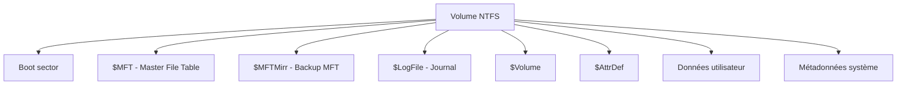
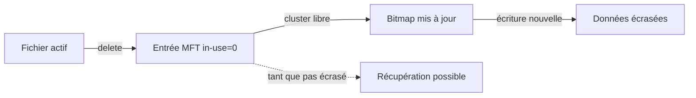

# 2.9 NTFS en profondeur

!!! quote "L'analogie de la bibliothèque universitaire"

    Une bibliothèque universitaire ne se contente pas de stocker des livres sur des étagères. Elle tient un catalogue où chaque livre est référencé avec son emplacement, sa cote, ses propriétés. Quand un livre est emprunté, déplacé ou abîmé, le catalogue est mis à jour. NTFS fonctionne de la même façon. Le catalogue, c'est la MFT. Chaque fichier y a son entrée. L'analyste forensic qui ne sait pas lire la MFT est comme un enquêteur qui chercherait dans une bibliothèque sans consulter le catalogue. Il passerait à côté des indices essentiels.

## Métadonnées

| Champ | Valeur |
|---|---|
| Durée | 5 heures |
| Niveau | Exhaustif |
| Prérequis | 2.4, 2.8 |

## 1. Vue d'ensemble NTFS

### 1.1 Caractéristiques

| Feature | Description |
|---|---|
| Year | Apparu Windows NT 1993 |
| Versions | 1.0 à 3.1 (actuel) |
| Taille max | 256 To partition, 16 To fichier |
| Journaling | Oui ($LogFile) |
| ACL | Riches (DACL, SACL) |
| Attributs étendus | Oui (multiples par fichier) |
| Compression | Native par fichier ou répertoire |
| Chiffrement | EFS (par fichier) |
| Quotas | Par utilisateur |

### 1.2 Structure générale



## 2. La MFT - Master File Table

### 2.1 Concept central

Chaque fichier ou répertoire d'un volume NTFS a **au moins une entrée** dans la MFT. La MFT est un fichier elle-même (`$MFT`).

### 2.2 Entrée MFT

Chaque entrée fait **1024 octets** par défaut.

```text
Structure d'une entrée MFT
==========================

[Header 56 octets]
  Magic "FILE"
  Update sequence
  LSN
  Sequence number
  Hard link count
  First attribute offset
  Flags (in-use, directory)
  Used size / Allocated size
  Base record reference
  Next attribute ID

[Attributs variables]
  $STANDARD_INFORMATION (0x10)
  $ATTRIBUTE_LIST (0x20)
  $FILE_NAME (0x30)
  $OBJECT_ID (0x40)
  $SECURITY_DESCRIPTOR (0x50)
  $VOLUME_NAME (0x60)
  $VOLUME_INFORMATION (0x70)
  $DATA (0x80)
  $INDEX_ROOT (0x90)
  $INDEX_ALLOCATION (0xA0)
  $BITMAP (0xB0)
  $REPARSE_POINT (0xC0)
  $EA_INFORMATION (0xD0)
  $EA (0xE0)
```

### 2.3 Attributs critiques pour le forensic

#### $STANDARD_INFORMATION (0x10)

| Champ | Description |
|---|---|
| Created | Date création |
| Modified | Date modification |
| Accessed | Date accès |
| Entry Modified | Date MFT modifiée |
| Flags | Read-only, hidden, system, etc. |
| Owner ID | Propriétaire |

Cet attribut contient les **timestamps SI** (souvent altérés par malwares).

#### $FILE_NAME (0x30)

| Champ | Description |
|---|---|
| Parent reference | Pointe vers le parent |
| File name | Nom du fichier |
| Created/Modified/Accessed | **Timestamps FN** (séparés des SI) |

**Astuce forensic** : un malware peut modifier les timestamps SI mais oublier les **timestamps FN**. Comparer les deux révèle la manipulation.

#### $DATA (0x80)

Contient le **contenu réel** du fichier. Peut être :

- **Resident** : si petit (< ~700 octets), stocké directement dans la MFT
- **Non-resident** : si grand, pointe vers des clusters de données

#### $INDEX_ROOT et $INDEX_ALLOCATION

Pour les répertoires, ces attributs maintiennent l'**arborescence B+** des fichiers contenus.

### 2.4 Lecture de MFT - Outils

```bash
# Linux
icat -o offset image.dd 0    # entrée 0 = $MFT
mft2csv image.dd

# Sur Windows
MFTECmd.exe -f $MFT --csv output

# Python (analyse-MFT)
analyzeMFT.py -f $MFT -o output.csv
```

---

## 3. ADS - Alternate Data Streams

### 3.1 Concept

NTFS supporte **plusieurs flux de données** par fichier. Le flux par défaut est `$DATA`. Mais on peut ajouter `$DATA:nom_alternate`.

### 3.2 Création

```cmd
echo "Contenu visible" > fichier.txt
echo "Contenu caché" > fichier.txt:cache
```

`fichier.txt` reste de taille apparente normale, mais contient un flux caché.

### 3.3 Détection

```cmd
dir /r                        # affiche les ADS
streams.exe -accepteula -s C:\suspect_dir   # outil Sysinternals
```

```powershell
Get-Item -Path fichier.txt -Stream *
```

### 3.4 Usage malveillant

| Cas | Exemple |
|---|---|
| Cacher exécutable | `notepad.exe:malware.exe` |
| Cacher données exfil | `image.jpg:data.zip` |
| Persistance | Stockage de scripts dans ADS de fichiers système |

### 3.5 Élimination

```cmd
# Copier sans ADS (FAT/exFAT puis revenir)
copy fichier.txt /d
```

---

## 4. USN Journal - Update Sequence Number

### 4.1 Concept

Le **USN Journal** ou `$UsnJrnl` enregistre **toutes les modifications** sur le système de fichiers. Très utilisé en forensic pour reconstituer l'historique.

### 4.2 Localisation

`C:\$Extend\$UsnJrnl:$J` (ADS sur fichier $UsnJrnl)

### 4.3 Lecture

```cmd
# CLI
fsutil usn readjournal C:

# Outil
UsnJrnl2Csv.exe -f $UsnJrnl:$J -o output.csv
```

### 4.4 Indices forensic

| Indice | Suspicion |
|---|---|
| Création/suppression rapides du même fichier | Comportement malware |
| Nombreux fichiers chiffrés (.encrypted, .locked) | Ransomware |
| Modifications massives en peu de temps | Activité automatisée |

---

## 5. $LogFile - Journaling NTFS

### 5.1 Rôle

Maintient un journal des transactions pour permettre la **récupération** en cas de crash.

### 5.2 Forensic

```bash
# Outil LogFileParser
LogFileParser.exe -f $LogFile -o output.csv
```

Le `$LogFile` complète l'USN Journal. Ensemble, ils donnent une **timeline ultra-détaillée** de l'activité.

---

## 6. Récupération de fichiers supprimés

### 6.1 Principe

Quand un fichier est supprimé sur NTFS :

1. L'entrée MFT est marquée comme **non utilisée** (flag in-use à 0)
2. Les **clusters** sont marqués libres dans le bitmap
3. Mais les **données restent** jusqu'à écrasement



### 6.2 Outils de récupération

| Outil | Usage |
|---|---|
| testdisk / photorec | Open source |
| Autopsy | Suite forensic |
| FTK Imager | Free version |
| Recuva | Grand public |
| EaseUS | Commercial |

### 6.3 Carving

Pour les fichiers dont l'entrée MFT est écrasée mais dont les données existent encore, on utilise le **file carving** : recherche par signatures.

```bash
# Avec foremost
foremost -i image.dd -o recovered/

# Avec scalpel
scalpel -c scalpel.conf image.dd -o recovered/
```

---

## 7. Volume Shadow Copies (VSS)

### 7.1 Concept

Windows crée des **snapshots** automatiques (Restore Points, sauvegardes) via VSS. Ces snapshots peuvent contenir des **versions antérieures** de fichiers.

### 7.2 Listage

```cmd
vssadmin list shadows
```

### 7.3 Forensic

Les VSS sont une **source précieuse** : un malware peut effacer des fichiers actifs, mais leurs versions précédentes peuvent rester dans les snapshots.

```cmd
# Monter une VSS
mklink /d C:\vss_mount \\?\GLOBALROOT\Device\HarddiskVolumeShadowCopy1\
```

---

## 8. Sécurité - DACL et SACL

### 8.1 DACL - Discretionary ACL

Définit **qui peut faire quoi** sur un fichier.

### 8.2 SACL - System ACL

Définit ce qui est **audité**.

### 8.3 Inspection PowerShell

```powershell
Get-Acl "C:\fichier.txt" | Format-List

# Voir les ACL en détail
(Get-Acl "C:\fichier.txt").Access | 
    Select-Object IdentityReference, FileSystemRights, AccessControlType
```

---

## 9. Indices forensic NTFS critiques

| Indice | Localisation | Suspicion |
|---|---|---|
| Timestamps SI très récents mais FN anciens | MFT | Time stomping |
| ADS sur fichiers système | dir /r ou streams | Malware |
| $UsnJrnl mass create/delete | UsnJrnl | Ransomware |
| Fichiers in-use=0 récents | MFT supprimés | Activité de cleanup |
| Fichiers en EFS non liés à user | Encrypted attribut | Possible exfil |

## 10. Manipulation pratique

### 10.1 Lecture MFT d'une image

```bash
# Sur image dd
mft2csv image.dd > mft.csv

# Analyse Excel/CSV
# Filtrer in-use=0 pour voir les supprimés
# Comparer SI vs FN timestamps pour détecter time stomping
```

### 10.2 Chercher des ADS

```powershell
Get-ChildItem -Path C:\ -Recurse -Force -ErrorAction SilentlyContinue |
    ForEach-Object {
        Get-Item -Path $_.FullName -Stream * -ErrorAction SilentlyContinue
    } | Where-Object Stream -ne ':$DATA'
```

## 11. Auto-évaluation

| # | Question | Réponse |
|---|---|---|
| 1 | Que contient la MFT ? | Une entrée par fichier/répertoire |
| 2 | Taille entrée MFT par défaut ? | 1024 octets |
| 3 | Que sont SI et FN timestamps ? | StandardInformation et FileName |
| 4 | Que sont les ADS ? | Alternate Data Streams |
| 5 | Voir les ADS ? | `dir /r` |
| 6 | Que fait $UsnJrnl ? | Journal des modifications |
| 7 | Récupérer un fichier supprimé ? | testdisk, photorec, Autopsy |
| 8 | VSS ? | Volume Shadow Copies, snapshots Windows |

## 12. Synthèse

```text
NTFS FORENSIC

MFT :
  $MFT - Master File Table
  Entrée par fichier (1024 oct)
  Attributs $STANDARD_INFORMATION $FILE_NAME $DATA

TIMESTAMPS :
  SI (StandardInfo) : altérables par malware
  FN (FileName) : moins facilement
  Comparer = détection time stomping

ADS :
  Alternate Data Streams
  fichier.txt:cache
  dir /r ou Get-Item -Stream *

JOURNAUX :
  $UsnJrnl ($J ADS) : modifications
  $LogFile : transactions

RÉCUPÉRATION :
  Fichiers supprimés : MFT in-use=0 + bitmap libre
  Tant que pas écrasé : récupérable
  Outils : testdisk photorec Autopsy

VSS :
  Snapshots Windows
  vssadmin list shadows
  Source de versions antérieures
```

---

**Chapitre suivant** : [2.10 ext4 en profondeur](02-10-ext4.md)
