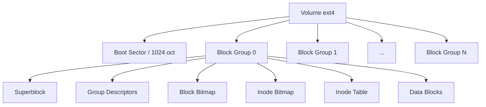

# 2.10 ext4 en profondeur

!!! quote "L'analogie du cadastre"

    Un cadastre français découpe un territoire en parcelles, chacune référencée par un numéro unique, avec ses coordonnées, ses propriétaires, ses caractéristiques. Quand vous voulez connaître un terrain, vous interrogez le cadastre. ext4 fonctionne pareillement. Les parcelles sont les blocs. Les numéros de référence sont les inodes. Le cadastre est la table des inodes. Pour un analyste forensic Linux, lire un système ext4 c'est lire le cadastre numérique.

## Métadonnées

| Champ | Valeur |
|---|---|
| Durée | 4 heures |
| Niveau | Exhaustif |
| Prérequis | 2.2, 2.3, 2.8 |

## 1. Vue d'ensemble ext4

### 1.1 Caractéristiques

| Feature | Description |
|---|---|
| Apparu | 2008 (linux 2.6.28) |
| Successeur de | ext3, lui-même de ext2 |
| Taille volume max | 1 EiB (1 152 921 To) |
| Taille fichier max | 16 TiB |
| Nombre d'inodes | Fixé à la création |
| Journaling | Oui |
| Extents | Oui (vs blocs ext3) |
| Délais d'allocation | Oui (defer) |
| Multiblock allocator | Oui |
| Distributions | Debian, Ubuntu, Fedora, RHEL par défaut |

### 1.2 Structure générale



### 1.3 Concepts fondamentaux

| Concept | Description |
|---|---|
| Bloc | Unité de stockage (1, 2, ou 4 KiB) |
| Groupe de blocs | Ensemble cohérent de blocs et inodes |
| Inode | Métadonnées d'un fichier (sans son nom) |
| Entrée de répertoire | Liaison nom ↔ inode |
| Extent | Plage contiguë de blocs |
| Superblock | Configuration globale du FS |

---

## 2. Le superblock

### 2.1 Rôle

Le **superblock** contient la configuration globale du système de fichiers. Il est répliqué dans plusieurs groupes pour la résilience.

### 2.2 Champs principaux

| Champ | Description |
|---|---|
| `s_inodes_count` | Nombre total d'inodes |
| `s_blocks_count` | Nombre total de blocs |
| `s_free_blocks_count` | Blocs libres |
| `s_free_inodes_count` | Inodes libres |
| `s_first_data_block` | Premier bloc de données |
| `s_log_block_size` | Taille bloc (log2) |
| `s_blocks_per_group` | Blocs par groupe |
| `s_inodes_per_group` | Inodes par groupe |
| `s_mtime` | Date dernier montage |
| `s_wtime` | Date dernière écriture |
| `s_state` | État (clean, errors, etc.) |
| `s_uuid` | UUID du FS |
| `s_volume_name` | Label |

### 2.3 Lecture forensic

```bash
# Afficher superblock d'une image
sudo debugfs -R "show_super_stats" image.dd

# Avec dumpe2fs
sudo dumpe2fs -h /dev/sdb1
sudo dumpe2fs -h image.dd
```

---

## 3. Inodes

### 3.1 Concept

Un **inode** contient toutes les métadonnées d'un fichier **sauf son nom**. Le nom est stocké dans l'entrée du répertoire qui pointe vers l'inode.

### 3.2 Structure d'un inode (256 octets sur ext4)

| Champ | Description |
|---|---|
| `i_mode` | Type fichier + permissions |
| `i_uid` / `i_gid` | Propriétaire / groupe |
| `i_size` | Taille |
| `i_atime` | Dernier accès |
| `i_ctime` | Dernière modification metadata |
| `i_mtime` | Dernière modification contenu |
| `i_dtime` | **Date de suppression** (0 si actif) |
| `i_links_count` | Nombre de hard links |
| `i_blocks` | Blocs alloués |
| `i_flags` | Flags (immutable, append-only, etc.) |
| `i_block[15]` | Pointeurs vers données (extents en ext4) |
| `i_crtime` | Date de création (ext4 added) |

### 3.3 Inodes spéciaux

| Inode | Rôle |
|---|---|
| 1 | Liste des blocs défectueux |
| 2 | Répertoire racine `/` |
| 3 | Bloc de réserve user |
| 5 | Boot loader (legacy) |
| 6 | Réservé groupes |
| 7 | Réservé description |
| 8 | Journal |
| 11 | Souvent lost+found |

### 3.4 Inspection forensic

```bash
# Détails d'un inode (numéro 12345)
sudo debugfs -R "stat <12345>" /dev/sdb1
sudo debugfs -R "stat <12345>" image.dd

# Voir le contenu
sudo debugfs -R "cat <12345>" image.dd

# Lister les inodes supprimés (i_dtime > 0)
sudo debugfs -R "lsdel" image.dd
```

---

## 4. Extents - Innovation ext4

### 4.1 Différence avec ext3

ext3 utilisait des **block pointers** : chaque pointeur indique un bloc. Avec un fichier de 100 Mo, des milliers de pointeurs sont nécessaires.

ext4 utilise des **extents** : un extent décrit une **plage contiguë de blocs**. Un seul extent peut couvrir des Go.

### 4.2 Structure extent

```text
Header
  Magic 0xF30A
  Number of entries
  Max entries
  Depth (0 = leaf)
  Generation

Entries (4 par défaut dans inode)
  Logical block
  Length (en blocs)
  Physical block
```

### 4.3 Avantages forensic

| Avantage | Conséquence |
|---|---|
| Métadonnées plus compactes | Plus rapide à analyser |
| Fichiers défragmentés naturellement | Récupération facilitée |
| Mais : si magic 0xF30A altéré, lecture cassée | Vulnérabilité corruption |

---

## 5. Journal ext4

### 5.1 Modes

| Mode | Description |
|---|---|
| `data=writeback` | Métadonnées seules journalées (rapide, moins sûr) |
| `data=ordered` | **Défaut** : métadonnées journalées, données écrites avant |
| `data=journal` | Tout journalé (plus lent, plus sûr) |

### 5.2 Localisation

Inode 8 par défaut. Lecture :

```bash
sudo debugfs -R "logdump" image.dd
```

### 5.3 Forensic du journal

Le journal contient des **traces de transactions récentes**. Il peut révéler :

- Modifications très récentes même si fichier ensuite supprimé
- Création/suppression rapides
- Chronologie ordonnée

---

## 6. Suppression et récupération

### 6.1 Que se passe-t-il à la suppression


### 6.2 Différence avec NTFS

Sur ext4 (vs NTFS), la suppression est **plus destructive** :

- Sur ext3 : pointeurs effacés à la suppression (récupération difficile)
- Sur ext4 : avec extents, parfois conservés (mais variable)

### 6.3 Outils

```bash
# Lister les supprimés via debugfs
sudo debugfs -R "lsdel" image.dd

# Récupérer un inode supprimé
sudo debugfs -R "dump <12345> /tmp/recovered" image.dd

# Outils dédiés
extundelete /dev/sdb1 --restore-all -o /recovery/
ext4magic image.dd -r -d /recovery/
```

### 6.4 File carving

Si la récupération via inode échoue :

```bash
# foremost (par signature)
foremost -i image.dd -o /recovery/ -t pdf,jpg,doc,zip

# scalpel (configuration plus fine)
scalpel -c scalpel.conf -o /recovery/ image.dd

# photorec (interactif)
photorec image.dd
```

---

## 7. Caractéristiques avancées

### 7.1 Hash trees pour gros répertoires

Pour les répertoires contenant beaucoup de fichiers, ext4 utilise un **htree** (B-tree haché) qui accélère la recherche.

### 7.2 Préallocation et délais

ext4 peut **préallouer** des blocs et **différer** l'allocation effective. Conséquence forensic : un fichier peut apparaître avec une taille mais pas encore avoir ses blocs alloués si crash.

### 7.3 Attributs étendus (xattr)

```bash
# Voir les xattr
getfattr -d -m ".*" fichier

# Système (ACL POSIX, SELinux)
ls -lZ fichier
```

xattr utilisés pour : ACL POSIX étendues, SELinux, capacités, signatures.

### 7.4 ACL POSIX

```bash
# Voir
getfacl fichier

# Modifier
setfacl -m u:zyrass:rwx fichier
```

ACL plus fines que les permissions UNIX classiques.

---

## 8. Forensic - Méthodologie

### 8.1 Acquisition

```bash
# Acquisition write-blocked d'un disque ext4
sudo dd if=/dev/sdb of=image.dd bs=4M status=progress conv=noerror,sync
sha256sum image.dd > image.sha256

# Variante dc3dd avec hash intégré
sudo dc3dd if=/dev/sdb of=image.dd hash=sha256 log=acquisition.log
```

### 8.2 Analyse offline

```bash
# Monter en lecture seule
sudo mkdir /mnt/forensic
sudo mount -o ro,loop,noexec,noload image.dd /mnt/forensic

# Inspection
ls -la /mnt/forensic
find /mnt/forensic -mtime -7

# Démonter
sudo umount /mnt/forensic
```

### 8.3 Timeline avec fls

```bash
# Outil The Sleuth Kit
fls -r -m / image.dd > body.txt

# Convertir en timeline lisible
mactime -b body.txt > timeline.csv

# Analyser
head -100 timeline.csv
grep "2026-03-15" timeline.csv
```

### 8.4 Indices forensic clés

| Indice | Méthode |
|---|---|
| Modifications massives récentes | timeline mactime |
| Fichiers supprimés | `debugfs -R lsdel` |
| Modifications dans /etc | `find /etc -mtime -30` |
| Binaires SUID custom | `find / -perm -4000` |
| Inodes supprimés journal | `debugfs -R logdump` |

---

## 9. Sysinternals ext4 - Outils

| Outil | Usage |
|---|---|
| `dumpe2fs` | Dump métadonnées |
| `tune2fs` | Modifier paramètres |
| `debugfs` | Inspection bas niveau |
| `e2fsck` | Vérification |
| `extundelete` | Récupération |
| `ext4magic` | Récupération avec timestamps |
| The Sleuth Kit (`fls`, `icat`, etc.) | Suite forensic |
| Autopsy | GUI sur Sleuth Kit |

---

## 10. Auto-évaluation

| # | Question | Réponse |
|---|---|---|
| 1 | Inode contient le nom du fichier ? | Non, juste métadonnées |
| 2 | Inode du répertoire racine ? | 2 |
| 3 | Que signifie `i_dtime` non nul ? | Inode supprimé |
| 4 | Différence ext3 / ext4 ? | Extents, htree, crtime, taille |
| 5 | Mode journal par défaut ? | `data=ordered` |
| 6 | Récupération supprimés ? | extundelete, ext4magic |
| 7 | Outil bas niveau ? | debugfs |
| 8 | Lister supprimés via debugfs ? | `lsdel` |

## 11. Synthèse

```text
EXT4 FORENSIC

STRUCTURE :
  Superblock (config FS)
  Block Groups
  Inodes (métadonnées)
  Data Blocks

INODE :
  Pas de nom
  Permissions, UID/GID, taille
  atime ctime mtime dtime crtime
  Extents pointeurs

INODES SPÉCIAUX :
  2  : racine /
  8  : journal
  11 : lost+found

EXTENTS :
  Plages contiguës
  Magic 0xF30A

JOURNAL :
  data=ordered par défaut
  logdump pour analyse

SUPPRESSION :
  i_dtime > 0
  Bitmap libéré
  Récupération : extundelete

OUTILS :
  debugfs    inspection
  dumpe2fs   métadonnées
  fls        timeline
  Autopsy    GUI

INDICES FORENSIC :
  Inodes supprimés récents
  Activité massive
  Modifications /etc, /root
  Binaires SUID custom
```

---

**Chapitre suivant** : [2.10 bis APFS en profondeur](02-10bis-apfs.md)
