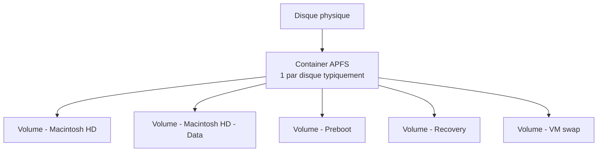
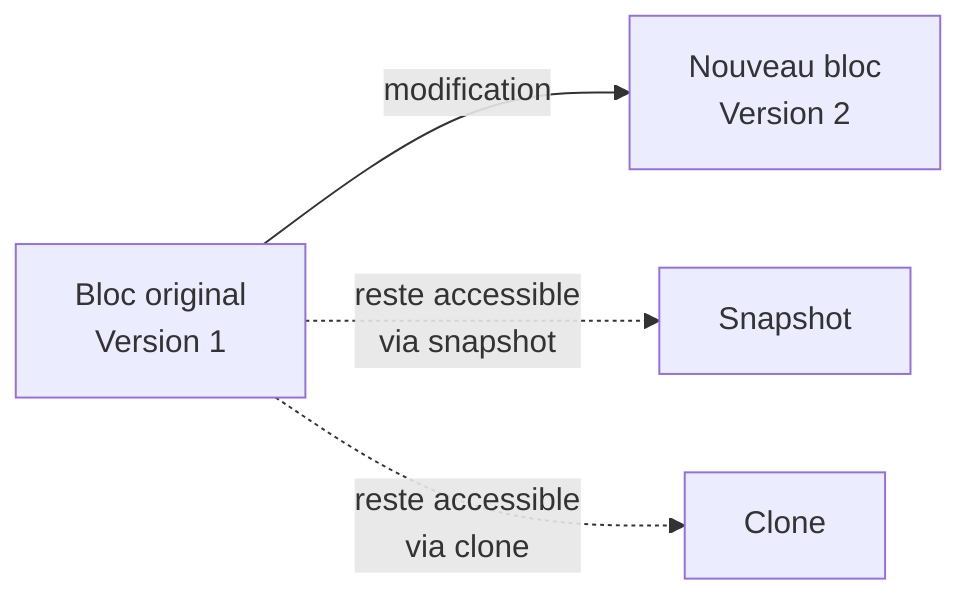
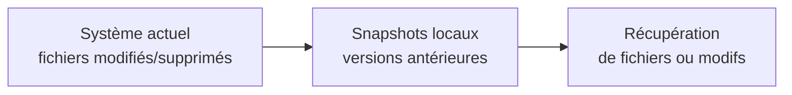
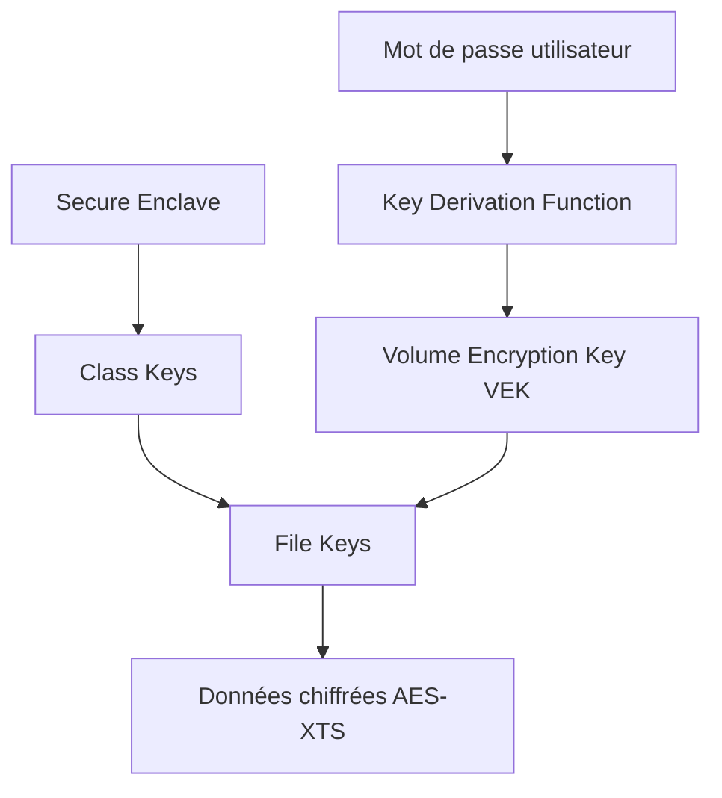

# 2.10 bis APFS en profondeur

!!! quote "L'analogie de la photographie numérique"

    Une photo argentique consomme un film à chaque cliché. Une photo numérique partage la même mémoire SD pour des milliers d'images. Pour copier une photo numérique, on ne duplique pas les bits, on ajoute juste un pointeur. Si on modifie la copie, seuls les bits modifiés sont écrits ailleurs. C'est exactement le principe d'APFS. Apple Silicon a adopté cette technologie parce qu'elle offre des fonctionnalités impossibles avec les anciens systèmes : snapshots à coût zéro, clones instantanés, copy-on-write systématique. Pour vous, analyste forensic, cela signifie qu'un même fichier peut apparaître à plusieurs endroits sans en occuper la place. Et que l'historique d'un fichier peut être reconstitué via les snapshots automatiques du système. APFS est plus complexe à analyser que NTFS ou ext4. Mais c'est aussi plus riche en informations.

## Métadonnées

| Champ | Valeur |
|---|---|
| Durée | 6 heures |
| Niveau | Exhaustif |
| Prérequis | 2.4 bis, 2.8 |

## 1. Vue d'ensemble APFS

### 1.1 Caractéristiques

| Feature | Description |
|---|---|
| Apparu | 2017 (iOS 10.3, macOS High Sierra) |
| Successeur de | HFS+ |
| Architecture | 64 bits, optimisé SSD |
| Copy-on-write | Oui (CoW systématique) |
| Snapshots | Oui (à coût zéro) |
| Clones | Oui (copies sans duplication) |
| Encryption | Natif (FileVault intégré) |
| Containers | Multi-volumes dans un container |
| Sealed Volume | Oui depuis macOS Big Sur (SSV) |
| Sparse files | Optimisation natives |
| Crash-safe | Atomic writes |

### 1.2 Différence majeure - Container et Volume



| Concept | Description |
|---|---|
| Container | Pool d'espace physique partagé |
| Volume | Système de fichiers logique dans le container |
| Pas de partitions fixes | Tous les volumes partagent l'espace dynamiquement |

### 1.3 Volumes typiques d'un Mac Apple Silicon

| Volume | Rôle | Particularité |
|---|---|---|
| Macintosh HD | Système (SSV) | Lecture seule, scellé |
| Macintosh HD - Data | Données utilisateur | FileVault chiffré |
| Preboot | Boot files | Boot Apple Silicon |
| Recovery | Recovery mode | recoveryOS |
| VM | Swap, Time Machine local | Volatile |
| Update | Mises à jour OS | Temporaire |

---

## 2. Architecture technique

### 2.1 Container Superblock

Le container superblock (NX_SUPERBLOCK) contient :

| Champ | Description |
|---|---|
| Magic | "NXSB" |
| Block size | Typiquement 4096 octets |
| Block count | Total blocs |
| Features | UUIDs, options |
| Volumes | Liste OIDs des volumes |
| Checkpoint | Pointeur vers metadata récente |

### 2.2 Volume Superblock

Chaque volume a son APFS_SUPERBLOCK :

| Champ | Description |
|---|---|
| Magic | "APSB" |
| Volume name | Nom |
| Encryption state | Chiffrement état |
| Total files | Nombre fichiers |
| Total directories | Nombre dossiers |
| Last mount time | Dernier montage |
| Tree root | Racine B-tree |

### 2.3 B-trees

APFS utilise des **B-trees** pour stocker les métadonnées :

| Tree | Contenu |
|---|---|
| Object Map | Mapping OID → emplacement |
| File System Tree | Inodes, entrées répertoires, extents |
| Extent Reference Tree | Suivi des extents pour clonage |
| Snapshot Metadata Tree | Snapshots |

---

## 3. Copy-on-Write (CoW)

### 3.1 Principe

Toute modification crée de **nouveaux blocs**. L'ancienne version reste accessible **tant qu'aucune référence ne pointe plus dessus**.



### 3.2 Implications forensic

| Implication | Conséquence |
|---|---|
| Anciennes versions persistent souvent | Récupération possible via snapshots |
| Modifications laissent traces | Plus d'indices que ext3/HFS+ |
| Mais : suppression définitive plus rapide | Moins de "lost+found" classique |

### 3.3 Time Machine local et CoW

macOS profite du CoW pour les **snapshots Time Machine locaux**, même sans disque externe. Ces snapshots sont automatiques et peuvent contenir des versions antérieures de fichiers.

```bash
# Lister les snapshots locaux
tmutil listlocalsnapshots /

# Format : com.apple.TimeMachine.YYYY-MM-DD-HHMMSS.local
```

---

## 4. Snapshots APFS

### 4.1 Concept

Un snapshot APFS est une **vue immuable et instantanée** d'un volume à un instant T. Il est créé en quelques millisecondes (pas de copie réelle).

### 4.2 Création et gestion

```bash
# Lister snapshots d'un volume
diskutil apfs listSnapshots /

# Créer manuellement
sudo tmutil snapshot

# Supprimer un snapshot
sudo tmutil deletelocalsnapshots 2026-04-29-120000
```

### 4.3 Investigation forensic

Les snapshots sont une **mine d'or forensic** :



```bash
# Monter un snapshot pour analyse
mkdir /tmp/snap
sudo mount_apfs -s 2026-04-29-120000 /dev/disk1s1 /tmp/snap

# Comparer avec l'actuel
diff -rq /Users /tmp/snap/Users 2>/dev/null
```

### 4.4 Limites

| Limite | Précision |
|---|---|
| Snapshots locaux limités | Auto-suppression si espace requis |
| Conservation typique | 24 heures à 1 semaine |
| Ne survivent pas si volume effacé | Erase = perte snapshots |

---

## 5. Clones

### 5.1 Concept

Un **clone** est une copie d'un fichier qui partage les mêmes blocs avec l'original. Tant qu'aucune modification n'est faite, aucun bloc supplémentaire n'est consommé.

### 5.2 Création

```bash
# Le Finder fait des clones par défaut sur APFS
cp -c source.txt dest.txt    # forçage explicite
```

### 5.3 Implication forensic

Un même contenu peut apparaître à **plusieurs emplacements** sans signature de duplication. Pour la forensic :

- Hash identiques attendus = normal sur APFS
- Pas un indice de copie volontaire intentionnelle
- Mais : si modification, divergence avec l'original

---

## 6. Chiffrement APFS / FileVault

### 6.1 Architecture sur Apple Silicon



### 6.2 Niveaux de chiffrement

| Niveau | Description |
|---|---|
| Volume Encryption Key (VEK) | Clé maître du volume |
| Class Keys | Clés par classe de protection |
| File Keys | Clés individuelles par fichier |

### 6.3 États

```bash
# Voir état FileVault
fdesetup status

# Détails techniques
diskutil apfs list
```

### 6.4 Implications forensic critiques

| Cas | Possibilité forensic |
|---|---|
| Mac éteint et FileVault activé | **Quasi-impossible** sans password |
| Mac allumé, session ouverte | Données accessibles si déjà déchiffrées |
| Mac en veille avec session active | Données accessibles |
| Mac à froid Apple Silicon | Cold boot attack quasi-impossible |
| Backup Time Machine non chiffré | Accessible |
| Backup iCloud | Procédure légale Apple |

**Pour Apple Silicon spécifiquement** : la Secure Enclave **ne libère jamais** les clés en clair. Aucune extraction directe possible.

---

## 7. Sealed System Volume (SSV)

### 7.1 Concept

Depuis macOS Big Sur (11), le volume système est un **SSV** :

- Lecture seule
- Signé cryptographiquement
- Hash Merkle tree de tout le contenu
- Vérifié au boot

### 7.2 Conséquences

| Aspect | Conséquence |
|---|---|
| Modification système | Impossible sans casser le seal |
| Persistance malware | Doit éviter / |
| Investigation système | Système intègre garanti |
| Mise à jour | Reconstruction du seal |

### 7.3 Vérification

```bash
csrutil authenticated-root status
# Authenticated Root status: enabled
```

### 7.4 Localisation du firmlink système

Le système est en réalité **deux volumes** :
- `/` (Macintosh HD) : SSV en lecture seule
- `/System/Volumes/Data` : volume Data utilisateur

Les deux sont fusionnés visuellement par des **firmlinks** (`/etc/synthetic.conf`).

---

## 8. Acquisition forensic APFS

### 8.1 Difficulté Apple Silicon

L'acquisition d'un Mac Apple Silicon est **considérablement plus complexe** qu'Intel :

| Aspect | Intel Mac | Apple Silicon |
|---|---|---|
| Boot externe | Aisé | Très restrictif |
| DMA via Thunderbolt | Possible | Bloqué |
| Single user mode | Oui | Non |
| Mode cible disque | Oui | Mode partage de fichiers (réseau) |
| Acquisition à froid | Possible | Très limitée |

### 8.2 Méthodes d'acquisition possibles

#### Méthode 1 - Acquisition logique (Mac sous tension)

```bash
# Avec autorisation utilisateur
sudo dd if=/dev/disk1 of=/Volumes/EXT/image.dd bs=1m

# Ou avec asr (Apple System Restore)
sudo asr restore --source /Volumes/Macintosh\ HD --target /Volumes/EXT/...
```

Limitation : nécessite session utilisateur active et disque déchiffré.

#### Méthode 2 - Mode Recovery + share disk (Mac M1)

1. Boot en Recovery (Power + Touch ID maintenu)
2. Utilities → Share Disk
3. Activer le partage réseau
4. Sur autre Mac : Finder → Network → Sélection
5. Acquisition par copie réseau (lente mais légale)

#### Méthode 3 - Partage de fichiers en mode DFU + custom firmware

Très complexe, requiert outils dédiés (Magnet AXIOM, Cellebrite, BlackBag MacQuisition).

### 8.3 Cas recommandé pour l'apprentissage

Pour votre laboratoire, **acquisition logique avec session ouverte** est la méthode la plus accessible. Elle simule ce qu'un investigateur ferait avec coopération de l'utilisateur.

---

## 9. Outils d'analyse APFS

| Outil | Usage |
|---|---|
| Apple `diskutil apfs` | Inspection native |
| Apple `fsapfsutil` | Bas niveau (privé Apple) |
| `apfs-fuse` (open source) | Montage Linux |
| `mac_apt` | Framework forensic Python |
| `AutoMacTC` | Triage rapide |
| `Plaso log2timeline` | Timeline avec plugins APFS |
| Magnet AXIOM | Commercial complet |
| BlackBag MacQuisition | Commercial Apple-specifique |

### 9.1 apfs-fuse - Lecture sur Linux

```bash
# Installation
git clone https://github.com/sgan81/apfs-fuse.git
cd apfs-fuse
git submodule update --init
mkdir build && cd build
cmake ..
make

# Usage
./apfs-fuse image.dd /mnt/apfs
```

### 9.2 mac_apt - Analyse complète

```bash
# Installation
pip3 install mac_apt

# Sur image
python3 mac_apt.py -i image.dmg -o output_dir

# Modules ciblés
python3 mac_apt.py -i image.dmg -o output_dir \
  --plugins SAFARI,LAUNCHD,USERS,QUARANTINE,SPOTLIGHT

# Liste des modules
python3 mac_apt.py --list_plugins
```

mac_apt extrait notamment :

- Comptes utilisateurs et groupes
- Préférences système
- Historique navigateurs
- Préférences applications
- Logs unifiés
- Wi-Fi connus
- Spotlight cache
- Quarantaine downloads
- Time Machine config

---

## 10. Spécificités MacBook M1 - Préparation

### 10.1 Vérification système

```bash
# Confirmer Apple Silicon
uname -m
# Attendu : arm64

# Détails M1
system_profiler SPHardwareDataType | grep -E "Chip|Memory|Serial"

# APFS containers
diskutil apfs list

# FileVault
fdesetup status

# SIP
csrutil status
csrutil authenticated-root status
```

### 10.2 Préparation pour acquisition forensic

Pour vous entraîner sur votre propre MacBook M1 :

1. **Faire une sauvegarde Time Machine complète** AVANT
2. Activer FileVault (réaliste)
3. Installer mac_apt et AutoMacTC
4. Pratiquer l'acquisition logique avec session ouverte
5. Tester les snapshots APFS
6. Étudier les logs unifiés

### 10.3 Limites pour votre M1 8 Go

| Limite | Solution |
|---|---|
| 8 Go RAM insuffisants pour analyses lourdes | Faire l'acquisition sur M1, l'analyse sur Windows 48 Go |
| Pas de virtualisation x86 native | Emulation Rosetta 2 si nécessaire |
| Espace disque limité | Disque externe pour acquisitions |

---

## 11. Indices forensic APFS

| Indice | Source | Suspicion |
|---|---|---|
| Snapshots automatiques manquants | tmutil | Effacement intentionnel |
| Modifications massives /Users/Library/LaunchAgents | timeline | Persistance |
| TCC.db modifié récemment | mtime | Bypass permissions |
| Quarantine flag absent sur app récente | xattr | Contournement Gatekeeper |
| Application non signée codesign | codesign | Code malveillant probable |
| Snapshot manuel récent inconnu | tmutil listlocalsnapshots | Tentative préservation |

---

## 12. Auto-évaluation

| # | Question | Réponse |
|---|---|---|
| 1 | Différence container / volume APFS ? | Container = pool, volume = FS logique |
| 2 | Que fait le copy-on-write ? | Modifications créent nouveaux blocs |
| 3 | Que sont les snapshots APFS ? | Vues immuables instantanées |
| 4 | Pourquoi snapshots utiles forensic ? | Versions antérieures de fichiers |
| 5 | Architecture FileVault Apple Silicon ? | Secure Enclave + VEK + Class Keys |
| 6 | Que protège le SSV ? | Volume système signé immuable |
| 7 | Outils forensic APFS ? | mac_apt, AutoMacTC, apfs-fuse |
| 8 | Acquisition Apple Silicon ? | Recovery + Share Disk recommandé |

---

## 13. Synthèse

```text
APFS FORENSIC - ESSENTIELS

ARCHITECTURE :
  Container (pool partagé)
  Volumes (Macintosh HD, Data, Preboot, Recovery, VM)
  B-trees pour métadonnées

FONCTIONNALITÉS :
  Copy-on-Write systématique
  Snapshots à coût zéro
  Clones (copies sans duplication)
  Encryption native (FileVault)
  SSV (Sealed System Volume)

CHIFFREMENT :
  AES-XTS
  VEK + Class Keys + File Keys
  Secure Enclave Apple Silicon = quasi imprenable

SNAPSHOTS :
  Time Machine local automatique
  tmutil listlocalsnapshots
  Source de versions antérieures

ACQUISITION :
  Mac sous tension, session ouverte = logique
  Recovery + Share Disk = méthode standard
  Cold Apple Silicon = quasi impossible

OUTILS :
  diskutil apfs (Apple)
  apfs-fuse (Linux)
  mac_apt (Python)
  AutoMacTC (Python)
  Magnet/BlackBag (commercial)

INDICES FORENSIC :
  Snapshots manquants
  Modifications LaunchAgents
  TCC.db altéré
  Apps non signées
  Quarantine flag absent
```

---

**Chapitre suivant** : [2.11 MITRE ATT&CK](02-11-mitre-attack.md)
