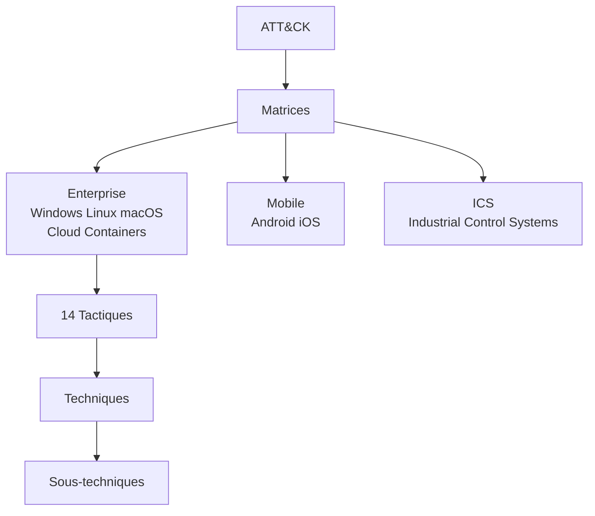

# 2.11 MITRE ATT&CK

!!! quote "L'analogie de la classification botanique"

    Avant Linné, les plantes étaient nommées par chacun selon ses propres critères. Une même plante avait dix noms différents en Europe, ce qui rendait les échanges scientifiques impossibles. Linné a imposé une classification universelle : règne, embranchement, classe, ordre, famille, genre, espèce. Ce système a permis à la botanique de devenir une science. MITRE ATT&CK joue le même rôle pour la cybersécurité. Avant, les attaques étaient décrites par chacun avec son vocabulaire. Aujourd'hui, T1078 Valid Accounts, T1059.001 PowerShell sont compris partout. L'analyste forensic qui parle MITRE ATT&CK se fait comprendre instantanément par tous les pairs internationaux.

## Métadonnées

| Champ | Valeur |
|---|---|
| Durée | 5 heures |
| Niveau | Standard |
| Prérequis | Notions sécurité offensive |

## 1. Le référentiel MITRE ATT&CK

### 1.1 Qu'est-ce que MITRE

**MITRE** (sans accent en français pour la fidélité au nom) est une organisation à but non lucratif américaine qui maintient des référentiels publics de cybersécurité. ATT&CK (Adversarial Tactics, Techniques, and Common Knowledge) est leur référentiel principal des comportements adverses observés.

### 1.2 Structure hiérarchique



### 1.3 Hiérarchie conceptuelle

| Niveau | Définition | Exemple |
|---|---|---|
| Matrice | Domaine technologique | Enterprise |
| Tactique | Pourquoi (objectif) | Persistence |
| Technique | Comment (méthode générale) | T1543 Create or Modify System Process |
| Sous-technique | Variante précise | T1543.003 Windows Service |
| Procedure | Implémentation concrète | "APT29 utilise svchost via service custom" |

---

## 2. Les 14 tactiques Enterprise


### 2.1 Description rapide

| # | Tactique | Objectif |
|---|---|---|
| 1 | Reconnaissance | Collecter des informations sur la cible |
| 2 | Resource Development | Préparer l'infrastructure d'attaque |
| 3 | Initial Access | Obtenir un premier accès |
| 4 | Execution | Exécuter du code |
| 5 | Persistence | Maintenir l'accès dans le temps |
| 6 | Privilege Escalation | Obtenir des privilèges supérieurs |
| 7 | Defense Evasion | Éviter détection et défenses |
| 8 | Credential Access | Voler des credentials |
| 9 | Discovery | Explorer l'environnement |
| 10 | Lateral Movement | Se déplacer sur le réseau |
| 11 | Collection | Rassembler les données cibles |
| 12 | Command and Control | Communiquer avec C2 |
| 13 | Exfiltration | Sortir les données |
| 14 | Impact | Affecter disponibilité ou intégrité |

---

## 3. Techniques et sous-techniques

### 3.1 Format d'identification

```text
T[Numéro]                              Technique
T[Numéro].[Sous-numéro]                Sous-technique

Exemples :
T1078       Valid Accounts
T1078.001   Default Accounts
T1078.002   Domain Accounts
T1078.003   Local Accounts
T1078.004   Cloud Accounts
```

### 3.2 Techniques fréquemment rencontrées en forensic

| ID | Nom | Tactique | Cas typique |
|---|---|---|---|
| T1566 | Phishing | Initial Access | Email piégé |
| T1078 | Valid Accounts | Initial Access / Persistence | Credentials volés |
| T1059 | Command and Scripting Interpreter | Execution | PowerShell, bash |
| T1059.001 | PowerShell | Execution | Scripts PS malveillants |
| T1059.003 | Windows Command Shell | Execution | cmd.exe |
| T1543 | Create or Modify System Process | Persistence | Services, launchd |
| T1543.003 | Windows Service | Persistence | Service Windows |
| T1547 | Boot or Logon Autostart | Persistence | Run keys, Startup |
| T1547.001 | Registry Run Keys | Persistence | HKLM\...\Run |
| T1003 | OS Credential Dumping | Credential Access | Mimikatz, lsass |
| T1003.001 | LSASS Memory | Credential Access | Mimikatz sur lsass |
| T1021 | Remote Services | Lateral Movement | RDP, SSH, PsExec |
| T1486 | Data Encrypted for Impact | Impact | Ransomware |
| T1490 | Inhibit System Recovery | Impact | Suppression VSS |

### 3.3 Cas pratique - Mapping d'une attaque

Une attaque ransomware typique (correspond au scénario ARTECH) :

```text
Phase 1 - Initial Access
  T1566.001 Spearphishing Attachment

Phase 2 - Execution
  T1204.002 User Execution: Malicious File
  T1059.005 Visual Basic

Phase 3 - Persistence
  T1547.001 Registry Run Keys

Phase 4 - Privilege Escalation
  T1068 Exploitation for Privilege Escalation

Phase 5 - Defense Evasion
  T1562.001 Disable or Modify Tools (Defender)
  T1027 Obfuscated Files or Information

Phase 6 - Credential Access
  T1003.001 LSASS Memory dumping

Phase 7 - Discovery
  T1018 Remote System Discovery
  T1083 File and Directory Discovery

Phase 8 - Lateral Movement
  T1021.002 SMB/Windows Admin Shares
  T1021.001 Remote Desktop Protocol

Phase 9 - Collection
  T1005 Data from Local System
  T1039 Data from Network Shared Drive

Phase 10 - Exfiltration
  T1041 Exfiltration Over C2 Channel

Phase 11 - Impact
  T1490 Inhibit System Recovery
  T1486 Data Encrypted for Impact
```

---

## 4. Outils MITRE ATT&CK

### 4.1 Navigator

**ATT&CK Navigator** est l'outil web officiel : https://mitre-attack.github.io/attack-navigator/

Permet de :

- Visualiser les matrices
- Marquer les techniques (couleurs, scores)
- Comparer plusieurs adversaires
- Exporter en JSON, SVG, Excel
- Créer des layers personnalisés

### 4.2 Detection rules

Pour chaque technique, MITRE fournit :

- Description
- Procedures observées (par groupes)
- Détection (sources de données, idées de règles)
- Mitigations
- Références

### 4.3 ATT&CK Workbench

Plateforme communautaire pour proposer des évolutions.

---

## 5. Application forensic

### 5.1 Mapping d'une investigation

Pour chaque artefact découvert, identifier la technique MITRE.

| Artefact | Technique MITRE |
|---|---|
| Service custom dans `/etc/systemd/system/` | T1543.002 Systemd Service |
| Run key `HKCU\Software\...\Run\` | T1547.001 Registry Run Keys |
| Fichier dans `/tmp/` exécuté | T1059 (selon shell) |
| LaunchDaemon macOS suspect | T1543.001 Launchd |
| .bash_history vidé | T1070.003 Clear Command History |
| Logs Security cleared (1102) | T1070.001 Clear Windows Event Logs |
| Rule firewall désactivée | T1562.004 Disable or Modify System Firewall |

### 5.2 Rapport forensic structuré ATT&CK

```text
RAPPORT FORENSIC ARTECH - INCIDENT 2026-XXX
=============================================

EXECUTIVE SUMMARY
[...]

KILL CHAIN OBSERVÉE

T1566.001 Spearphishing Attachment
  Date : 2026-03-12 14:22 UTC
  Vecteur : email avec PJ .docm
  Cible : stagiaire@artech.fr
  Évidence : email préservé, hash SHA-256 = ...

T1204.002 User Execution
  Date : 2026-03-12 14:35 UTC
  Action : ouverture du document Word
  Évidence : timestamp dans Office MRU

T1059.005 Visual Basic
  Date : 2026-03-12 14:35 UTC
  Action : macro VBA exécutée
  Évidence : Office macro logging, payload extrait

T1547.001 Registry Run Keys
  Date : 2026-03-12 14:36 UTC
  Action : ajout HKCU\...\Run\update
  Évidence : registre, timestamp clé MFT

[...]

MITIGATIONS RECOMMANDÉES

Pour T1566 - Phishing
  M1031 Network Intrusion Prevention
  M1049 Antivirus/Antimalware
  M1017 User Training

Pour T1547 - Registry Run Keys
  M1018 User Account Management
  M1028 Operating System Configuration
```

---

## 6. Mitigations et détections MITRE

### 6.1 Mitigations

MITRE catalogue les **mitigations** (M-codes) :

| ID | Nom |
|---|---|
| M1017 | User Training |
| M1018 | User Account Management |
| M1026 | Privileged Account Management |
| M1031 | Network Intrusion Prevention |
| M1037 | Filter Network Traffic |
| M1042 | Disable or Remove Feature or Program |
| M1049 | Antivirus/Antimalware |
| M1056 | Pre-compromise |

### 6.2 Sources de données pour détection

MITRE liste pour chaque technique les **sources de données** utiles à la détection :

| Source | Exemple |
|---|---|
| Process Creation | Sysmon Event ID 1 |
| Command Execution | PowerShell logging 4104 |
| File Modification | Audit File access |
| Registry Modification | Audit Object access |
| Network Connection | Sysmon ID 3 |

### 6.3 Sigma rules

Les règles **Sigma** sont un format de détection neutre transposable vers Splunk, ELK, Sentinel, etc. Elles référencent souvent ATT&CK.

```yaml
title: Suspicious PowerShell ScriptBlock
id: 12345-uuid
status: experimental
description: Detects suspicious PowerShell with encoded commands
tags:
    - attack.execution
    - attack.t1059.001
logsource:
    product: windows
    service: powershell
detection:
    selection:
        EventID: 4104
        ScriptBlockText|contains:
            - 'FromBase64String'
            - '-EncodedCommand'
    condition: selection
level: medium
```

---

## 7. Auto-évaluation

| # | Question | Réponse |
|---|---|---|
| 1 | Combien de tactiques Enterprise ? | 14 |
| 2 | T1078 ? | Valid Accounts |
| 3 | T1059.001 ? | PowerShell |
| 4 | T1486 ? | Data Encrypted for Impact (ransomware) |
| 5 | T1003.001 ? | LSASS Memory |
| 6 | Outil officiel de visualisation ? | ATT&CK Navigator |
| 7 | Format de règles compatible MITRE ? | Sigma |
| 8 | Tactique pour vol credentials ? | Credential Access |

## 8. Synthèse

```text
MITRE ATT&CK FORENSIC

STRUCTURE :
  Matrice (Enterprise, Mobile, ICS)
  14 Tactiques Enterprise
  Techniques (T1078)
  Sous-techniques (T1078.001)

TOP TECHNIQUES EN FORENSIC :
  T1566 Phishing
  T1078 Valid Accounts
  T1059 Command/Scripting
  T1543 Create/Modify Process (services)
  T1547 Boot/Logon Autostart (Run keys)
  T1003 Credential Dumping
  T1486 Data Encrypted (ransomware)

OUTILS :
  Navigator (web)
  ATT&CK Workbench

USAGE FORENSIC :
  Mapping techniques observées → ID
  Rapport structuré ATT&CK
  Mitigations M-codes
  Sigma rules pour détection
```

---

**Chapitre suivant** : [2.12 Cyber Kill Chain](02-12-cyber-kill-chain.md)
