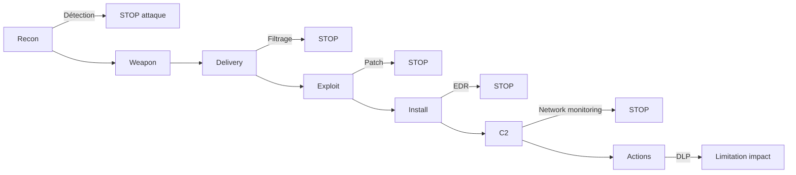

# 2.12 Cyber Kill Chain

!!! quote "L'analogie de l'opération militaire"

    Une opération militaire suit toujours les mêmes phases : reconnaissance du terrain, choix des armes, infiltration, prise de position, action, exfiltration. C'est précisément ce que Lockheed Martin a transposé au cyber en 2011 avec la Cyber Kill Chain. Sept étapes que tout attaquant doit franchir pour réussir. Pour le défenseur, comprendre cette chaîne signifie : casser un seul maillon casse l'attaque entière. Pour l'analyste forensic, elle structure le récit reconstitué : à quelle étape l'attaquant en est-il, et quels indices reste-t-il à trouver.

## Métadonnées

| Champ | Valeur |
|---|---|
| Durée | 1 heure |
| Niveau | Standard |

## 1. Les 7 étapes

| # | Phase | Description |
|---|---|---|
| 1 | Reconnaissance | Collecte d'infos sur la cible (OSINT, scan) |
| 2 | Weaponization | Préparation de l'arme (malware + exploit + leurre) |
| 3 | Delivery | Livraison (email, USB, web, supply chain) |
| 4 | Exploitation | Déclenchement de la vulnérabilité |
| 5 | Installation | Implantation du malware |
| 6 | Command & Control | Communication avec le C2 |
| 7 | Actions on Objectives | Exfiltration, destruction, ransomware |

## 2. Application forensic

### 2.1 Mapping des indices par phase

| Phase | Artefacts forensic typiques |
|---|---|
| 1 Recon | Logs DNS, scans réseau visibles |
| 2 Weaponization | Hors visibilité (chez attaquant) |
| 3 Delivery | Email serveur, web proxy, USB Quarantine |
| 4 Exploitation | Logs application, crashes, exceptions |
| 5 Installation | Persistance (services, run keys, launchd) |
| 6 C2 | Connexions réseau, beacons, DNS suspects |
| 7 Actions | Fichiers chiffrés, sortie volumineuse, suppression VSS |

### 2.2 Principe de "casser la chaîne"

**Plus on détecte tôt, moins l'impact est grand**.

## 3. Limites

| Limite | Précision |
|---|---|
| Linéaire | Réalité plus itérative |
| Ne couvre pas l'insider | Modèle conçu pour menace externe |
| Pas de granularité technique | MITRE ATT&CK plus précis |
| Phase 2 invisible défenseur | Pas exploitable forensic |

## 4. Articulation avec MITRE ATT&CK

| Kill Chain | Tactiques MITRE équivalentes |
|---|---|
| Reconnaissance | TA0043 Reconnaissance |
| Weaponization | TA0042 Resource Development |
| Delivery | TA0001 Initial Access |
| Exploitation | TA0002 Execution |
| Installation | TA0003 Persistence + TA0004 Privilege Escalation |
| C2 | TA0011 Command and Control |
| Actions | TA0007-0010 Discovery/Lateral Movement/Collection + TA0040 Impact |

Kill Chain = vue **macro**. MITRE ATT&CK = vue **micro**.

## 5. Auto-évaluation

| # | Question | Réponse |
|---|---|---|
| 1 | 7 étapes ? | Recon, Weapon, Delivery, Exploit, Install, C2, Actions |
| 2 | Origine ? | Lockheed Martin 2011 |
| 3 | Casser un maillon = ? | Stopper attaque entière |
| 4 | Phase invisible défenseur ? | Weaponization |

---

**Chapitre suivant** : [2.13 Diamond Model et Pyramid of Pain](02-13-diamond-pyramid.md)
