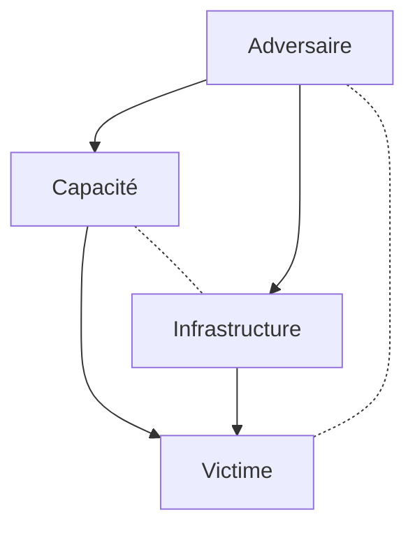
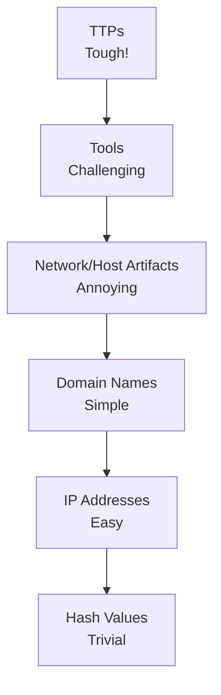
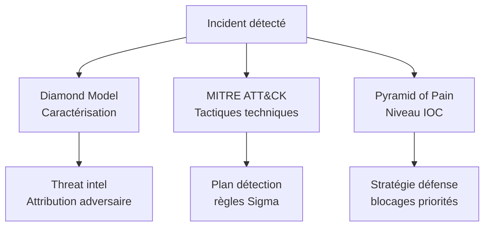

# 2.13 Diamond Model et Pyramid of Pain

!!! quote "L'analogie de la triangulation"

    En navigation, on triangule sa position en mesurant la distance à trois points connus. Une seule mesure est insuffisante. Deux mesures donnent deux possibilités. Trois mesures fixent la position. Le Diamond Model fait pareil pour les attaques. Quatre points - adversaire, capacité, infrastructure, victime - permettent de "trianguler" l'incident et de l'attribuer. La Pyramid of Pain complète : hiérarchise les indicateurs selon ce qui fait mal à l'attaquant. Bloquer un hash de fichier ne fait pas mal, l'attaquant en génère un nouveau en 5 minutes. Bloquer ses TTP fait mal, parce qu'il devra revoir toute sa méthodologie.

## Métadonnées

| Champ | Valeur |
|---|---|
| Durée | 2 heures |
| Niveau | Standard |

## 1. Diamond Model of Intrusion Analysis

### 1.1 Origine

Publié en 2013 par **Sergio Caltagirone, Andrew Pendergast, Christopher Betz**. Modèle de référence pour l'analyse d'intrusions et la threat intelligence.

### 1.2 Les 4 vertex



| Vertex | Description | Exemples |
|---|---|---|
| Adversaire | Qui mène l'attaque | APT29, Conti, individuel |
| Capacité | Comment | Ransomware EduCrypt, exploit CVE-XXX |
| Infrastructure | Avec quoi | C2 IP, domaines, VPN |
| Victime | Contre qui | ARTECH, secteur santé France |

### 1.3 Méta-features

Au-delà des 4 vertex, le modèle ajoute :

| Méta-feature | Précision |
|---|---|
| Timestamp | Quand |
| Phase | À quelle étape de la kill chain |
| Result | Succès, échec, en cours |
| Direction | Sens de la communication |
| Methodology | Méthode globale |
| Resources | Ressources consommées |

### 1.4 Application forensic ARTECH

```text
DIAMOND MODEL - INCIDENT ARTECH 2026-XXX
==========================================

VERTEX 1 - ADVERSAIRE
  Niveau de skill : opportuniste (pas APT)
  Motivation : financière (ransom)
  Possible attribution : groupe Conti-like

VERTEX 2 - CAPACITÉ
  Vecteur initial : phishing avec PJ Word
  Macro VBA : extraction d'un dropper
  Dropper : shellcode injecté dans rundll32
  Persistance : Run key
  Lateral : SMB exploitant credentials volés
  Payload : ransomware AES-256 chaque fichier

VERTEX 3 - INFRASTRUCTURE
  C2 : 185.XXX.XXX.XXX (Russie hébergeur)
  Domaine relais : update-microsft-7sg23.tk
  Wallet ransom : bc1qXXXXXXXXX

VERTEX 4 - VICTIME
  ARTECH SAS, Lyon
  PME 42 salariés, distribution médicale
  Pas de SOC, pas d'EDR
  Sauvegardes externes mais déconnectées

MÉTA-FEATURES
  Timestamp : 2026-03-12 14:22 UTC
  Phase : Actions on Objectives
  Result : succès partiel (chiffrement effectué,
           paiement non confirmé, fuite données)
  Methodology : double extorsion typique 2024-2026
```

### 1.5 Pivots d'investigation

Le Diamond Model permet de **pivoter** d'un vertex à l'autre :

- Adversaire connu → infrastructures associées
- Infrastructure connue → autres victimes ciblées
- Capacité connue → adversaires utilisant cette capacité
- Victime connue → attaques antérieures

Ce raisonnement est au cœur de la **threat intelligence**.

---

## 2. Pyramid of Pain

### 2.1 Origine

Publié par **David Bianco** (2013, mis à jour). Hiérarchise les **indicateurs de compromission (IOC)** selon la difficulté pour l'attaquant de les changer.

### 2.2 Les 6 niveaux



### 2.3 Détail par niveau

| Niveau | IOC | Coût pour attaquant | Action défenseur |
|---|---|---|---|
| Trivial | Hash MD5/SHA1/SHA256 | Quelques minutes (recompiler) | Bloquer dans EDR |
| Easy | IP addresses | Quelques heures (changer hébergeur) | Bloquer firewall |
| Simple | Domain names | Quelques jours (acheter nouveau) | DNS sinkhole |
| Annoying | Network/Host artifacts | Semaines | Détecter patterns |
| Challenging | Tools | Mois (développer) | Bloquer signatures |
| Tough | TTPs | Très long (changer méthodologie) | Détection comportementale |

### 2.4 Implication stratégique

La défense **réactive** (bloquer hashes, IPs) coûte peu à l'attaquant. La défense **comportementale** (détecter TTPs) le force à reconcevoir son attaque.

### 2.5 Application forensic

Pour chaque IOC remonté, identifier le niveau de la pyramide :

```text
IOC RAPPORT FORENSIC ARTECH

Niveau Trivial (faible valeur défense long terme)
  - SHA-256 dropper : 7a8f9b...
  - SHA-256 ransomware : 3c2d1e...

Niveau Easy
  - IP C2 : 185.XX.XX.XX
  - IP relais : 91.XX.XX.XX

Niveau Simple
  - Domaine : update-microsft-7sg23.tk
  - Domaine : api-cloud-svc.xyz

Niveau Annoying (commencer à faire mal)
  - Pattern : services nommés "WindowsUpd*"
  - Pattern : fichiers .lock dans %TEMP%
  - Pattern : POST DNS TXT vers domaines récents

Niveau Challenging (vraiment douloureux)
  - Outil : variante de Cobalt Strike custom
  - Outil : loader .NET reflective

Niveau Tough (maximum d'impact)
  - TTP : phishing avec macro Word + dropper rundll32
  - TTP : credential dumping via comsvcs.dll
  - TTP : lateral via SMB + WMI
```

### 2.6 Recommandations défensives

Une **bonne stratégie de threat intel** mise sur :

- 20% sur Trivial/Easy (réactif, court terme)
- 30% sur Simple/Annoying (tactique)
- 50% sur Challenging/Tough (stratégique)

Beaucoup d'organisations font l'inverse, ce qui les laisse vulnérables aux mêmes attaquants qui changent juste leurs hashes.

---

## 3. Articulation Diamond + Pyramid + ATT&CK



### 3.1 Cas pratique

| Élément observé | Diamond | MITRE | Pyramid |
|---|---|---|---|
| PJ .docm | Capacité | T1566.001 | Easy |
| 185.XX.XX.XX | Infrastructure | T1071 | Easy |
| Macro VBA | Capacité | T1059.005 | Annoying |
| Use mimikatz | Capacité | T1003.001 | Challenging |
| Méthode complète | Capacité+TTP | (ensemble) | Tough |

---

## 4. Auto-évaluation

| # | Question | Réponse |
|---|---|---|
| 1 | 4 vertex Diamond Model ? | Adversaire, Capacité, Infrastructure, Victime |
| 2 | Que veut dire "pivoter" ? | Passer d'un vertex à l'autre pour investigation |
| 3 | Niveau le plus douloureux pour attaquant ? | TTPs (Tough) |
| 4 | Niveau le plus facile à changer ? | Hash (Trivial) |
| 5 | Stratégie défense long terme ? | Cibler les TTPs |
| 6 | Articulation Diamond / MITRE / Pyramid ? | Diamond = caractérisation, MITRE = précision technique, Pyramid = priorités |

## 5. Synthèse

```text
DIAMOND MODEL ET PYRAMID OF PAIN

DIAMOND MODEL :
  4 vertex
    Adversaire
    Capacité
    Infrastructure
    Victime
  Méta-features
    Timestamp Phase Result
    Direction Methodology Resources
  Pivot entre vertex pour threat intel

PYRAMID OF PAIN :
  6 niveaux du facile au douloureux
    Hash         Trivial      (changer en minutes)
    IPs          Easy         (heures)
    Domains      Simple       (jours)
    Artifacts    Annoying     (semaines)
    Tools        Challenging  (mois)
    TTPs         Tough        (très long)
  Stratégie : viser haut

USAGE FORENSIC :
  Diamond pour caractériser
  MITRE pour préciser techniques
  Pyramid pour prioriser défense
```

---

**Chapitre suivant** : [2.14 Mise en pratique - Kill chain ARTECH](02-14-pratique-kill-chain-artech.md)
