# 2.14 Mise en pratique - Kill chain ARTECH

!!! quote "L'analogie du concert d'examen final"

    Un musicien étudie pendant des années. Solfège, technique, posture, théorie, histoire. Mais c'est lors de son concert d'examen qu'on évalue s'il sait jouer. Tous les fondamentaux du module 2 doivent maintenant fusionner dans cette mise en pratique. Vous allez construire la kill chain complète d'une attaque sur ARTECH, mapper chaque étape avec MITRE ATT&CK, caractériser via Diamond Model, prioriser via Pyramid of Pain. C'est votre concert d'examen avant le cycle 1.

## Métadonnées

| Champ | Valeur |
|---|---|
| Durée | 4 heures |
| Niveau | Pratique |
| Prérequis | Tout le module 2 |
| Livrable | Kill chain complète documentée |

## 1. Le scénario ARTECH

### 1.1 Contexte

```text
ARTECH SAS
==========
Activité : distribution matériel médical
Salariés : 42
CA : 12 M€
Site : Lyon Vaise
Direction : Hélène Lefebvre (DG)

INFRASTRUCTURE IT
- 1 routeur grand public (TP-Link Archer C7)
- Wi-Fi WPA2-PSK avec mot de passe court
- 1 serveur Linux (intranet, partage)
- 25 postes Windows 11
- Pas de SOC, pas d'EDR, pas de SIEM
- Sauvegardes externes mais souvent déconnectées

ÉQUIPE IT
- 1 administrateur système (M. Lemoine)
- Cabinet IT externe pour les gros sujets

VULNÉRABILITÉS CONNUES
- Wi-Fi avec passphrase faible "ArtechMedical2020!"
- Pas de MFA sur les accès distants
- Patchs Windows en retard (dernière vague non installée)
- Sensibilisation cybersécurité minimale
```

### 1.2 L'attaque - Vue d'ensemble

```mermaid
flowchart LR
    A[Attaquant<br>quartier Lyon] -->|Capture WPA2| B[Crack mdp Wi-Fi<br>quelques heures]
    B -->|Accès LAN| C[Phishing stagiaire<br>email piégé interne]
    C -->|RAT installé| D[Reconnaissance<br>interne]
    D -->|Credentials volés| E[Mouvement latéral<br>vers serveur]
    E -->|Privesc| F[Domain admin<br>ou local admin chaque poste]
    F -->|Déploiement| G[Ransomware EduCrypt<br>chiffrement masse]
    G -->|Demande ransom| H[Note de ransom<br>+ exfiltration menace]
```



---

## 2. Construction de la kill chain - Phase par phase

### 2.1 Phase 1 - Reconnaissance

**Récit** : l'attaquant identifie ARTECH comme cible (PME santé = paye souvent), cherche le SSID Wi-Fi visible depuis la rue.

| Élément | Détail |
|---|---|
| Kill Chain | Reconnaissance |
| MITRE | T1590 Gather Victim Network Information |
| Diamond | Adversaire (caractéristiques observables) |
| Pyramid | TTP : ciblage géographique secteur (Tough) |
| IOC potentiels | SSID ARTECH-WIFI captures wardriving |
| Détection possible | Surveillance signaux Wi-Fi, mais difficile en pratique |

### 2.2 Phase 2 - Weaponization

**Récit** : l'attaquant prépare son arsenal - aircrack pour le Wi-Fi, dictionnaire fourni, kit de phishing customisé pour ARTECH, RAT type Cobalt Strike, ransomware EduCrypt.

| Élément | Détail |
|---|---|
| Kill Chain | Weaponization |
| MITRE | TA0042 Resource Development |
| Diamond | Capacité (en construction) |
| Pyramid | Tools : custom (Challenging) |
| IOC potentiels | Hors visibilité défenseur |
| Détection | Aucune (chez attaquant) |

### 2.3 Phase 3 - Delivery

**Récit** : l'attaquant capture handshake WPA2 et le casse offline. Mot de passe trouvé en 4 heures (`ArtechMedical2020!` figurait dans les top 10 000 passwords santé).

| Élément | Détail |
|---|---|
| Kill Chain | Delivery (initial via Wi-Fi) |
| MITRE | T1078 Valid Accounts (PSK Wi-Fi) |
| Diamond | Infrastructure (Wi-Fi) + Capacité (aircrack/hashcat) |
| Pyramid | Annoying (TTP de wardriving) |
| IOC | Adresse MAC attaquant éventuelle |
| Détection | Surveillance MACs nouvelles, anomalie connexions |

### 2.4 Phase 4 - Exploitation interne via phishing

**Récit** : connecté au LAN, l'attaquant scanne, identifie la stagiaire (compte Windows newest), envoie un email "service@artech-medical.fr" avec PJ Word "Procedure_validation_facture.docm".

| Élément | Détail |
|---|---|
| Kill Chain | Delivery (phishing) + Exploitation |
| MITRE | T1566.001 Spearphishing Attachment + T1204.002 User Execution |
| Diamond | Capacité (PJ piégée) |
| Pyramid | Easy (domaine usurpé) à Tough (méthode) |
| IOC | Email source, hash PJ, sujet, expéditeur |
| Détection | Protection email (Sandboxing), formation |

### 2.5 Phase 5 - Installation

**Récit** : la stagiaire ouvre le Word, autorise les macros. La macro VBA télécharge un loader, qui injecte du shellcode dans `rundll32.exe`. Persistance via clé Run.

| Élément | Détail |
|---|---|
| Kill Chain | Installation |
| MITRE | T1059.005 Visual Basic + T1547.001 Registry Run Keys + T1055 Process Injection |
| Diamond | Capacité (loader, shellcode) |
| Pyramid | Tools (Challenging), TTP (Tough) |
| IOC | Hash macro, registry key, process tree |
| Détection | EDR comportemental, audit registre, Sysmon ID 1 |

### 2.6 Phase 6 - Command and Control

**Récit** : le RAT établit une connexion C2 vers un serveur compromis hébergé en Russie. Communication HTTPS sur port 443, beacons toutes les 5 minutes avec jitter.

| Élément | Détail |
|---|---|
| Kill Chain | Command and Control |
| MITRE | T1071.001 Web Protocols + T1573.002 Asymmetric Cryptography |
| Diamond | Infrastructure (C2 IP, domaine) |
| Pyramid | Easy (IP), Simple (domaine), Annoying (pattern beaconing) |
| IOC | IP, domaine, certificat, User-Agent, intervalle beacon |
| Détection | NDR, DNS analytics, anomaly detection |

### 2.7 Phase 7 - Discovery et privilege escalation

**Récit** : l'attaquant explore le réseau, trouve le serveur Linux. Lance Mimikatz sur le poste stagiaire, récupère les hashes NTLM. Trouve le hash de l'admin local utilisé partout (pass-the-hash).

| Élément | Détail |
|---|---|
| Kill Chain | Actions on Objectives (préparation) |
| MITRE | T1003.001 LSASS Memory + T1018 Remote System Discovery + T1550.002 Pass the Hash |
| Diamond | Capacité (Mimikatz) |
| Pyramid | Challenging (outil), Tough (TTP combo) |
| IOC | Process Mimikatz, accès LSASS handle |
| Détection | EDR, Sysmon ID 10 (LSASS access), Defender ASR |

### 2.8 Phase 8 - Lateral movement

**Récit** : avec hash admin local, l'attaquant rebondit via SMB/PsExec sur tous les postes Windows et le serveur. Confirme l'accès admin sur chaque machine.

| Élément | Détail |
|---|---|
| Kill Chain | Actions on Objectives |
| MITRE | T1021.002 SMB/Windows Admin Shares + T1570 Lateral Tool Transfer |
| Diamond | Capacité (PsExec, SMB) |
| Pyramid | Annoying (pattern de pivoting) |
| IOC | Connexions SMB, processus distants |
| Détection | Logs 4624 type 3, Sysmon ID 1 |

### 2.9 Phase 9 - Collection et exfiltration

**Récit** : l'attaquant identifie les données sensibles (clients, comptabilité). Compresse en archive, exfiltre via HTTPS vers le C2. ~50 Go en plusieurs heures.

| Élément | Détail |
|---|---|
| Kill Chain | Actions on Objectives |
| MITRE | T1005 Data from Local System + T1041 Exfiltration Over C2 Channel |
| Diamond | Capacité, Infrastructure |
| Pyramid | Annoying (pattern volumes) |
| IOC | Volumes anormaux, archives temporaires |
| Détection | DLP, NDR volumes, monitoring proxy |

### 2.10 Phase 10 - Impact (ransomware)

**Récit** : les VSS sont supprimées. Le ransomware EduCrypt est déployé sur tous les postes via PsExec. Chiffrement AES-256 par fichier, clés AES chiffrées par RSA-2048 dans header. Note de ransom sur le bureau.

| Élément | Détail |
|---|---|
| Kill Chain | Actions on Objectives |
| MITRE | T1490 Inhibit System Recovery + T1486 Data Encrypted for Impact |
| Diamond | Capacité (ransomware) |
| Pyramid | Tools (Challenging) à TTPs (Tough) |
| IOC | vssadmin delete, fichiers .educrypt, ransom note |
| Détection | Comportement EDR (mass file write), entropie |

---

## 3. Synthèse Diamond Model ARTECH

```text
DIAMOND MODEL - ARTECH INCIDENT 2026-XXX
==========================================

ADVERSAIRE
  Niveau : opportuniste à compétent
  Motivation : financière (ransom + extorsion)
  Comportement : double extorsion typique
  Probable groupe : non attribué, méthodes Conti-like

CAPACITÉ
  Vecteurs :
    Wardriving + crack WPA2
    Phishing avec macro VBA
    Mimikatz LSASS
    Pass-the-hash
    PsExec lateral
    Ransomware EduCrypt

INFRASTRUCTURE
  IP C2 : 185.XX.XX.XX (offshore)
  Domaine : artech-mediсаl.com (cyrillique mimétique)
  Wallet : bc1q...

VICTIME
  ARTECH SAS
  PME 42 salariés santé Lyon
  Maturité cyber : faible
  Sauvegardes : partiellement déconnectées (chance)

MÉTA-FEATURES
  Timestamp début : 2026-03-08 (capture WPA2)
  Timestamp impact : 2026-03-12 14:22 UTC
  Phase finale : Impact réussi
  Result : ransomware déployé, exfiltration ok,
           paiement non confirmé
  Methodology : opportuniste réaliste 2026
```

---

## 4. Pyramid of Pain ARTECH

```text
PYRAMID OF PAIN - ARTECH

TRIVIAL (réactif faible valeur)
  - SHA256 macro Word
  - SHA256 EduCrypt binary
  - SHA256 Mimikatz utilisé

EASY
  - IP C2 : 185.XX.XX.XX
  - IP relais

SIMPLE
  - Domaine usurpé : artech-mediсаl.com
  - Domaine C2

ANNOYING (commencer à faire mal)
  - Pattern services nommés
  - Pattern fichiers temp .educrypt
  - Pattern beacon HTTPS 5min jitter
  - Pattern PsExec massif

CHALLENGING
  - Variante personnalisée Cobalt Strike
  - EduCrypt builder custom

TOUGH (frapper là où ça fait mal)
  - TTP : Wi-Fi crack offline → phishing interne
  - TTP : Mimikatz → pass-the-hash → ransomware
  - TTP : double extorsion via leak site
```

---

## 5. Plan de défense priorisé

Sur la base de Pyramid of Pain, voici les priorités défensives **à fort impact** :

| Priorité | Mesure | Coût relatif | Niveau Pyramid |
|---|---|---|---|
| 1 | Wi-Fi WPA3 + passphrase 20+ caractères | Bas | Tough |
| 2 | Sensibilisation phishing réaliste | Bas | Tough |
| 3 | EDR sur tous les postes | Moyen | Challenging |
| 4 | MFA sur accès admin | Bas | Tough |
| 5 | Sauvegardes immuables/airgap | Moyen | Tough |
| 6 | Désactiver macros par défaut Office | Bas | Annoying |
| 7 | Désactiver SMBv1, restreindre PsExec | Bas | Annoying |
| 8 | Defender ASR rules | Bas | Annoying |
| 9 | Plan de réponse à incident testé | Moyen | Tough |
| 10 | Audit annuel pentest | Moyen | Tough |

---

## 6. Travail final attendu

### 6.1 Documentation à produire

Construisez votre dossier de synthèse `module-2-final.md` contenant :

1. La kill chain complète ARTECH (10 phases)
2. Le mapping MITRE ATT&CK exhaustif
3. Le Diamond Model
4. La Pyramid of Pain
5. Les 10 mesures défensives priorisées
6. Une auto-évaluation honnête de vos compétences acquises

### 6.2 Auto-explication finale module 2

Enregistrez une vidéo de **30 minutes** où vous présentez :

1. La kill chain ARTECH expliquée comme à un client (10 minutes)
2. Le Diamond Model et son utilité (5 minutes)
3. La Pyramid of Pain et la stratégie défensive (5 minutes)
4. Les 10 priorités de défense pour ARTECH avec justification (10 minutes)

### 6.3 Validation de votre passage au cycle 1

Vous êtes prêt pour le cycle 1 si :

| Critère | Validation |
|---|---|
| Vous comprenez chaque phase de l'attaque ARTECH | OK |
| Vous savez identifier les techniques MITRE associées | OK |
| Vous savez prioriser défense via Pyramid | OK |
| Vous maîtrisez Linux, Windows, macOS basique | OK |
| Vous savez lire NTFS, ext4, APFS basiquement | OK |
| Votre laboratoire est opérationnel (module 3 fait) | OK |

---

## 7. Synthèse module 2 - Bilan

```text
MODULE 2 - PRÉREQUIS TECHNIQUES

ACQUIS :
  Linux fondamentaux et avancé
  Windows architecture forensic
  macOS Apple Silicon (essentiel pour France)
  PowerShell, bash, zsh
  Réseaux TCP/IP
  Cryptographie + hash
  NTFS, ext4, APFS exhaustif
  MITRE ATT&CK, Kill Chain, Diamond, Pyramid

PRÊT POUR :
  Module 3 - Configuration laboratoire
  Cycle 1 - Premier cas pratique

PROCHAINES ÉTAPES :
  1. Auto-évaluation finale module 2
  2. Module 3 setup laboratoire
  3. Cycle 1 - Investigation ARTECH bout-en-bout
```

---

**Module 2 - Prérequis techniques : VALIDÉ**

**Chapitre précédent** : [2.13 Diamond Model et Pyramid of Pain](02-13-diamond-pyramid.md)

**Module suivant** : [Module 3 - Configuration du laboratoire forensic physique](../module-3-configuration-laboratoire/README.md)
