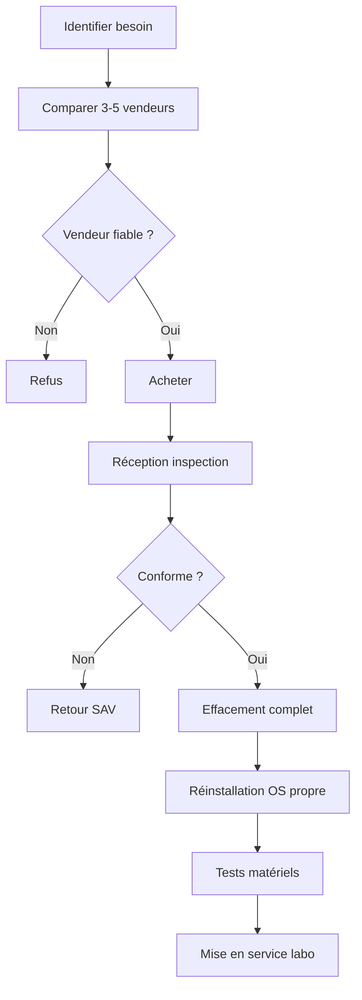

# 3.2 Achats reconditionnés - sources et précautions

!!! quote "L'analogie de la voiture d'occasion"

    Acheter une voiture d'occasion sans l'inspecter sous le capot, c'est jouer à la roulette russe. Le commerçant peut omettre des défauts, l'historique peut cacher un accident grave, le compteur peut être trafiqué. Le matériel informatique reconditionné suit la même logique. Sans précaution, vous achetez peut-être un poste avec un BIOS modifié, un firmware compromis, ou une carte mère défectueuse. Ce chapitre vous donne la méthode pour acheter sans regret.

## Métadonnées

| Champ | Valeur |
|---|---|
| Durée | 2 heures |
| Type | Pratique |

## 1. Workflow d'achat sécurisé



## 2. Sites par catégorie

### 2.1 Postes (PC, mini PC, portables)

| Site | Prix | Garantie | Note |
|---|---|---|---|
| Backmarket | Variable | 1 an minimum | Standard de référence |
| ITEK | Pro/serveur | 1 an | Spécialiste B2B |
| Recommerce | Pro/grand public | 1 an | Bon SAV |
| Retron | Postes pro reconditionnés | 6-12 mois | Catalogue varié |
| Cdiscount Pro Reconditionné | Variable | 6-12 mois | Choix large |

### 2.2 Réseau (routeurs, switches, cartes)

| Source | Type |
|---|---|
| Le Bon Coin (particuliers) | TP-Link Archer C7 |
| eBay | Routeurs spécifiques |
| AliExpress | Cartes Alfa AWUS036ACS officielles |
| Amazon Renewed | Switches gigabit |

### 2.3 Storage (SSD, disques durs)

**Vigilance maximum** : les SSD reconditionnés peuvent avoir un grand nombre de cycles d'écriture. Recommandation : **acheter neuf** pour le storage critique.

### 2.4 Clés USB et write-blocker

**Toujours neufs** : ces composants critiques pour la chaîne forensic doivent être sortis d'usine sans antécédents.

## 3. Vérifications à réception

### 3.1 Inspection physique

| Point | Vérification |
|---|---|
| Aspect général | Pas de chocs, fissures |
| Ports | Tous fonctionnels (test USB, Ethernet, etc.) |
| Écran | Pas de pixels morts (test pattern) |
| Batterie | Capacité > 80% (laptop) |
| Étiquettes | Numéro de série lisible et cohérent |

### 3.2 Tests logiciels

```bash
# CPU et mémoire (Linux ou via Live USB)
sudo dmidecode -t processor
sudo dmidecode -t memory

# Test mémoire (memtest86+)
# Booter sur Live USB memtest86+ et lancer 1 passe complète

# Test SSD
sudo smartctl -a /dev/sda
sudo smartctl -t short /dev/sda    # test rapide

# Cycles d'écriture SSD
sudo smartctl -A /dev/sda | grep -i "wear\|written"

# Réseau
ethtool eth0
```

### 3.3 Tests Windows

```powershell
# Infos système
systeminfo

# CPU
wmic cpu get name, currentclockspeed, maxclockspeed

# Mémoire
wmic memorychip get capacity, speed, manufacturer

# Disque
Get-PhysicalDisk | Select-Object FriendlyName, MediaType, HealthStatus, OperationalStatus

# SMART détails
Get-StorageReliabilityCounter
```

## 4. Effacement et réinstallation

### 4.1 Pourquoi systématique

Tout matériel reconditionné peut contenir :

- Données du précédent propriétaire
- Logiciel pré-installé non désiré
- Configuration BIOS modifiée
- Firmware éventuellement compromis (rare mais possible)

### 4.2 Effacement disque

```bash
# Effacement sécurisé multi-passes (Linux Live)
sudo shred -v -n 3 -z /dev/sda

# Plus rapide pour SSD (Secure Erase ATA)
sudo hdparm --user-master u --security-set-pass PASS /dev/sda
sudo hdparm --user-master u --security-erase PASS /dev/sda

# Pour SSD NVMe
sudo nvme format /dev/nvme0n1 -s 1
```

### 4.3 Réinstallation propre

| Étape | Action |
|---|---|
| 1 | Bootable USB officiel (téléchargé site Microsoft/Debian) |
| 2 | Vérification SHA-256 de l'ISO (signature officielle) |
| 3 | Installation propre (pas migration) |
| 4 | Mises à jour complètes |
| 5 | Configuration cybersécurité de base |

### 4.4 Mise à jour firmware

```bash
# BIOS/UEFI
# Site fabricant + USB Update

# Firmware composants
sudo fwupdmgr refresh
sudo fwupdmgr get-updates
sudo fwupdmgr update
```

## 5. Sécurité supply chain

### 5.1 Risques

| Risque | Mitigation |
|---|---|
| Firmware modifié | Reflashage complet |
| Module hardware (rare) | Inspection visuelle, comparaison photos officielles |
| Logiciel pré-installé | Réinstallation systématique |
| Backdoor BIOS | Reflashage UEFI officiel |

### 5.2 Sources fiables uniquement

Pour le **firmware**, ne télécharger que depuis :

- Site officiel fabricant
- Pas de sites tiers ("driver download")
- Vérifier signatures et hashes

---

**Chapitre suivant** : [3.3 Topologie réseau et plan d'adressage](03-3-topologie-adressage.md)
