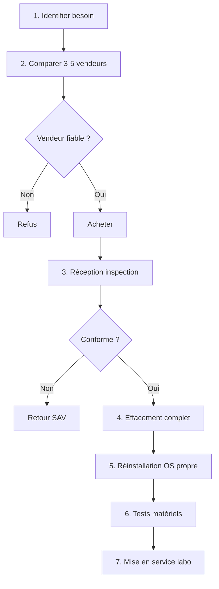

# Achats reconditionnés - sources et précautions

<div
  class="omny-meta"
  data-level="🟡 Standard"
  data-version="Modèle 2026"
  data-time="2 heures">
</div>

!!! note "**Livrables :** _Méthodologie de sécurisation du matériel de seconde main_"
!!! note "**Auto-explication :** _10 minutes_"

<br>

---

<br>

!!! quote "L'analogie de la voiture d'occasion"

    Acheter une voiture d'occasion sans l'inspecter sous le capot, c'est jouer à la roulette russe. Le commerçant peut omettre des défauts, l'historique peut cacher un accident grave, le compteur peut être trafiqué. Le matériel informatique reconditionné suit la même logique. Sans précaution, vous achetez peut-être un poste avec un BIOS modifié, un firmware compromis, ou une carte mère défectueuse. Ce chapitre vous donne la méthode pour acheter malin et sans danger.

## Objectifs pédagogiques

!!! tip "À la fin de ce chapitre, vous serez capable de :"

    - Sélectionner des fournisseurs fiables pour le matériel reconditionné.
    - Inspecter physiquement et tester le matériel à la réception.
    - Appliquer une procédure d'effacement sécurisé (Wipe) avant utilisation.
    - Mitiger les risques de sécurité (Firmware, Supply Chain) liés au matériel de seconde main.

<br>

---

<br>

## Workflow d'achat sécurisé

La chaîne d'acquisition d'un équipement de laboratoire ne se limite pas au paiement. Elle intègre la phase critique d'assainissement.



<br>

---

<br>

## Les bonnes sources par catégorie

### Postes (PC, Mini PC, Portables)

> Le tableau ci-dessous répertorie les plateformes d'achat de matériel informatique reconditionné :

| Site | Prix moyen | Garantie | Note |
|---|---|---|---|
| **Backmarket** | Variable | 1 an minimum | Standard de référence. |
| **ITEK** | Pro/Serveur | 1 an | Spécialiste B2B. Idéal pour les mini-PC. |
| **Recommerce** | Pro/Grand public | 1 an | Bon SAV. |
| **Retron** | Postes pro | 6-12 mois | Catalogue de flottes d'entreprise. |
| **Cdiscount Pro** | Variable | 6-12 mois | Choix large. |

### Réseau (Routeurs, Switches, Cartes Wi-Fi)

> Le tableau ci-dessous liste les sources pour l'équipement réseau spécifique :

| Source | Type de matériel |
|---|---|
| **Le Bon Coin** | Routeurs TP-Link Archer C7. |
| **eBay** | Routeurs spécifiques ou matériels EOL (End Of Life). |
| **AliExpress** | Cartes Alfa AWUS036ACS (Boutique officielle Alfa Network). |
| **Amazon Renewed** | Switches gigabit standards. |

!!! danger "Les pièces à acheter NEUVES"
    **Le Stockage et la Preuve.**
    Les SSD reconditionnés peuvent avoir un nombre de cycles d'écriture critiques. Achetez-les **neufs**. 
    De même, les clés USB de boot et les **Write-Blockers** doivent impérativement sortir d'usine pour garantir l'absence d'antécédents (risque d'infection ou de défaillance pendant une acquisition).

<br>

---

<br>

## Vérifications à réception

Ne branchez jamais un PC reconditionné directement sur votre réseau domestique avant ces vérifications.

### Inspection physique

> Points de contrôle visuels immédiats au déballage :

| Point de contrôle | Vérification attendue |
|---|---|
| **Aspect général** | Pas de chocs majeurs, fissures sur la coque. |
| **Ports I/O** | Tous fonctionnels (Test USB, Ethernet, HDMI). |
| **Écran** | Pas de pixels morts (Test pattern blanc/noir/RVB). |
| **Batterie** | Capacité restante > 80% (Pour les laptops). |
| **Étiquettes** | Numéro de série lisible et cohérent avec la facture. |

### Tests logiciels matériels (Sous Linux Live USB)

!!! abstract "Commandes de Diagnostic (Linux)"

    ```bash title="Commandes Linux - Tests composants matériels"
    # Vérification CPU et mémoire physique (Nécessite dmidecode)
    sudo dmidecode -t processor
    sudo dmidecode -t memory
    
    # Pour le Test mémoire (memtest86+)
    # -> Booter sur un Live USB memtest86+ et lancer 1 passe complète.
    
    # Test d'intégrité du SSD (SMART)
    sudo smartctl -a /dev/sda
    sudo smartctl -t short /dev/sda    # Lance un test rapide
    
    # Vérification de l'usure du SSD (Cycles d'écriture)
    sudo smartctl -A /dev/sda | grep -i "wear\|written"
    
    # Vérification de la carte réseau
    ethtool eth0
    ```

### Tests sous Windows (Si pré-installé)

Si la machine démarre sous Windows, vérifiez les composants avant de tout écraser.

!!! abstract "Commandes de Diagnostic (Windows PowerShell)"

    ```powershell title="Commandes PowerShell - Tests composants Windows"
    # Résumé complet du système
    systeminfo
    
    # Fréquence et type de CPU
    wmic cpu get name, currentclockspeed, maxclockspeed
    
    # Caractéristiques des barrettes de RAM
    wmic memorychip get capacity, speed, manufacturer
    
    # État de santé des disques physiques
    Get-PhysicalDisk | Select-Object FriendlyName, MediaType, HealthStatus, OperationalStatus
    
    # Détails des erreurs SMART éventuelles
    Get-StorageReliabilityCounter
    ```

<br>

---

<br>

## L'Assainissement : Effacement et réinstallation

### Pourquoi est-ce systématique ?

Tout matériel reconditionné, même vendu par un professionnel, est considéré comme "sale". Il peut contenir :

- Des données résiduelles du précédent propriétaire.
- Des "bloatwares" ou logiciels de tracking pré-installés par le reconditionneur.
- Une configuration de BIOS altérée.
- Un firmware compromis (Cas de *Supply Chain Attack*, rare mais possible).

### L'effacement complet (Wipe)

!!! abstract "Destruction cryptographique des données"

    ```bash title="Commandes Linux - Effacement sécurisé des disques"
    # Effacement sécurisé multi-passes pour disque mécanique (HDD)
    sudo shred -v -n 3 -z /dev/sda
    
    # Méthode plus rapide et sûre pour SSD (Secure Erase ATA)
    sudo hdparm --user-master u --security-set-pass PASS /dev/sda
    sudo hdparm --user-master u --security-erase PASS /dev/sda
    
    # Méthode spécifique pour SSD NVMe moderne
    sudo nvme format /dev/nvme0n1 -s 1
    ```

### La réinstallation propre ("From Scratch")

Une fois le disque vide, appliquez ce workflow rigoureux :

1. **Boot USB Officiel :** L'ISO doit provenir directement du site de Microsoft, Debian, ou Kali.
2. **Contrôle d'intégrité :** Vérification systématique du hash SHA-256 de l'ISO téléchargée.
3. **Installation :** Installation propre complète (Pas de mise à niveau ni de récupération).
4. **Mises à jour :** Application immédiate de tous les correctifs OS.
5. **Durcissement :** Configuration des bases de cybersécurité (Pare-feu, désactivation des services inutiles).

<br>

---

<br>

## Sécurité de la chaîne d'approvisionnement (Supply Chain)

Les attaques au niveau du firmware survivent à la réinstallation de l'OS.

### Risques et Mitigations

> Le tableau ci-dessous liste les risques matériels furtifs :

| Risque | Mitigation technique |
|---|---|
| **Firmware UEFI modifié** | Reflashage complet du BIOS/UEFI dès la réception. |
| **Module hardware espion** | Inspection visuelle de la carte mère (Si accès possible), comparaison avec les photos officielles. |
| **Backdoor de gestion (Intel ME)** | Mise à jour de tous les microcodes. |

### Mise à jour des Firmwares

!!! warning "La règle d'or des Drivers"
    Ne téléchargez **JAMAIS** de firmwares ou de pilotes depuis des sites tiers obscurs (du type "touslesdrivers.com" ou des forums). Le firmware (BIOS/UEFI) doit provenir **exclusivement** du site officiel du fabricant de la carte mère (Dell, Lenovo, HP).

!!! abstract "Mise à jour sous Linux (LVFS)"

    ```bash title="Commandes Linux - Mise à jour des firmwares matériels"
    # Actualise la liste des firmwares disponibles
    sudo fwupdmgr refresh
    
    # Vérifie si le matériel a des mises à jour
    sudo fwupdmgr get-updates
    
    # Applique les mises à jour (Nécessite souvent un redémarrage)
    sudo fwupdmgr update
    ```

<br>

---

<br>

## Conclusion

!!! quote "Ce qu'il faut retenir"
    L'achat reconditionné est la meilleure stratégie pour monter un laboratoire Forensic puissant à moindre coût. Cependant, la confiance n'exclut pas le contrôle. Un analyste Forensic ne travaille jamais sur une machine dont il ne maîtrise pas l'intégrité à 100%. L'effacement cryptographique et la réinstallation "from scratch" sont des étapes obligatoires.

> [Chapitre suivant : 3.3 Topologie réseau et plan d'adressage →](03-topologie-adressage.md)
>
> [Retour à l'index →](./index.md)

<br>
