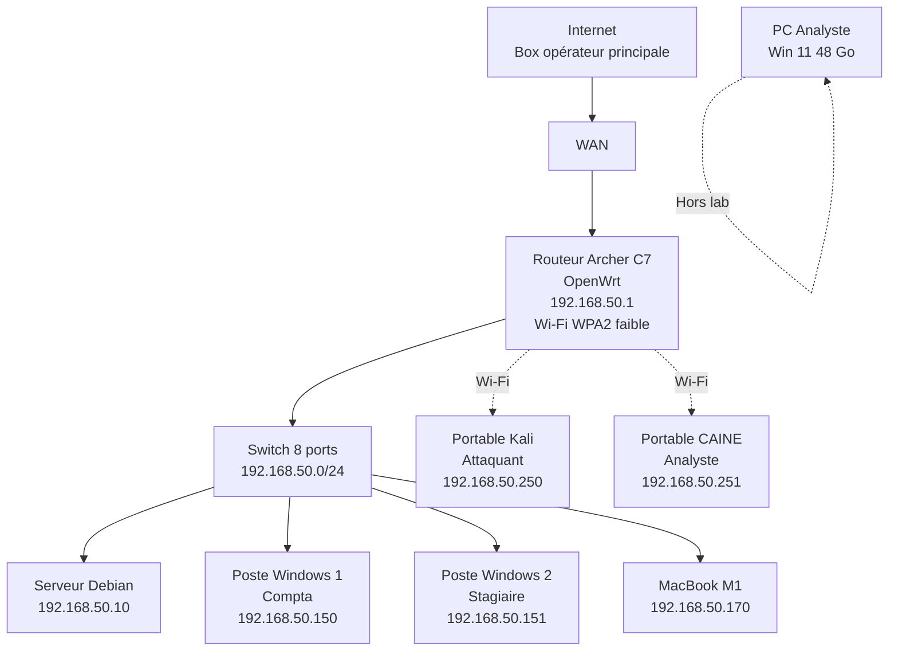
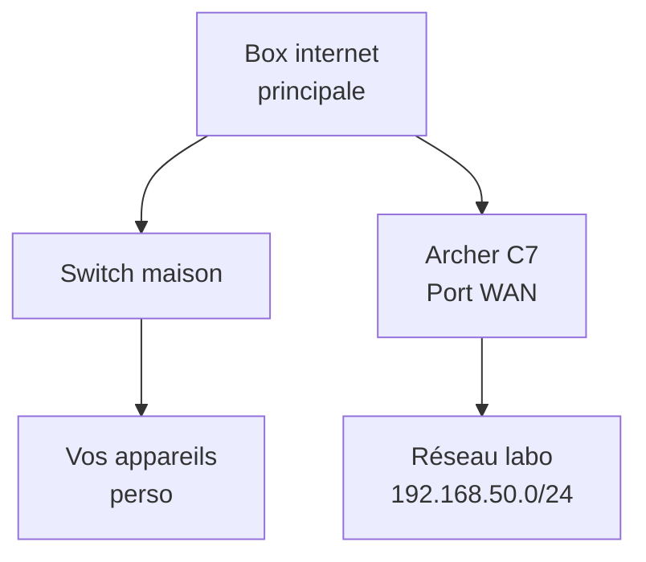
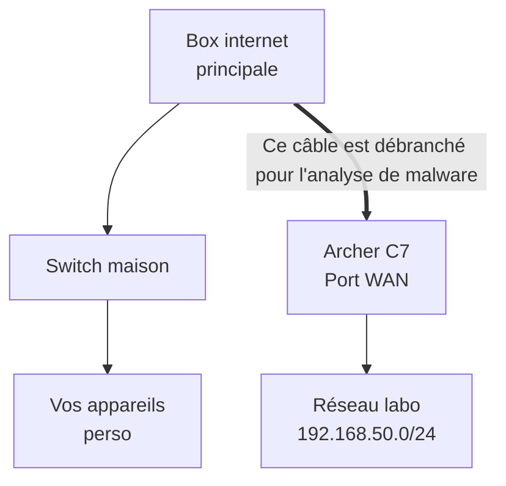

# Topologie réseau et plan d'adressage

<div
  class="omny-meta"
  data-level="🟡 Standard"
  data-version="Modèle 2026"
  data-time="2 heures">
</div>

!!! note "**Livrables :** _Cartographie IP et schéma de câblage_"
!!! note "**Auto-explication :** _10 minutes_"

<br>

---

<br>

!!! quote "L'analogie de la carte d'état-major"

    Imaginez un général qui déploierait ses troupes sans carte géographique, sans connaître les routes ni les ponts. C'est l'échec assuré. En cybersécurité et en Forensic, le réseau est votre champ de bataille. Si vous ne savez pas exactement quelle machine a quelle adresse IP, où se trouve le pare-feu, ou comment transitent les paquets, vous serez incapable d'isoler une menace ou de comprendre d'où vient une attaque. Ce chapitre est votre carte d'état-major.

## Objectifs pédagogiques

!!! tip "À la fin de ce chapitre, vous serez capable de :"

    - Déployer la topologie réseau complète du laboratoire OmnyAcademy.
    - Configurer un adressage IP statique pour l'infrastructure et dynamique pour les postes mobiles.
    - Mettre en place une isolation stricte d'Internet pour sécuriser vos expérimentations.
    - Réaliser et valider le schéma de câblage physique.

<br>

---

<br>

## Topologie complète (ARTECH PME)

Voici l'architecture logique de notre PME fictive : ARTECH.



<br>

---

<br>

## Plan d'adressage

Le réseau est structuré autour du subnet `192.168.50.0/24`. 

!!! abstract "Plan d'Adressage IP"

    ```text title="Configuration IP - Réseau Labo OmnyAcademy"
    RÉSEAU GLOBAL
    ================================
    Plage : 192.168.50.0/24
    Masque : 255.255.255.0 (/24)
    Gateway : 192.168.50.1
    
    ADRESSES STATIQUES (Infrastructure & Cibles)
    192.168.50.1     -> Routeur OpenWrt
    192.168.50.10    -> Serveur Debian
    192.168.50.150   -> Poste Windows 1 (Compta)
    192.168.50.151   -> Poste Windows 2 (Stagiaire)
    192.168.50.170   -> MacBook M1
    
    PLAGE DHCP (Attribuée automatiquement)
    192.168.50.200 à 192.168.50.249
    
    POSTES D'ANALYSE ET ATTAQUE (DHCP Fixé via Baux Statiques)
    192.168.50.250   -> Kali Linux (Attaquant)
    192.168.50.251   -> CAINE (Analyste Forensic)
    
    CONFIGURATION WI-FI
    SSID : ARTECH-WIFI
    Bande : 2.4 GHz (et 5 GHz optionnel)
    Sécurité : WPA2-PSK
    Passphrase : ArtechMedical2020! (Volontairement faible pour le module 5)
    
    DNS
    Par défaut DHCP : 1.1.1.1 / 9.9.9.9
    ```

<br>

---

<br>

## Isolation Internet

### Pourquoi l'isolation est critique ?

!!! danger "Alerte de Sécurité"
    Votre laboratoire **DOIT être isolé** d'Internet lors des phases d'attaque actives. Les risques de ne pas le faire incluent :
    - Votre FAI détectera du trafic malveillant (Scans Nmap massifs, Exploits) et pourrait bloquer votre ligne.
    - Fuite DNS exposant votre activité d'attaque.
    - Risque de propagation accidentelle d'un malware sur votre réseau personnel ou sur Internet.

### Les Architectures de protection

#### Option A - Ségrégation via WAN (Recommandé)



Dans ce modèle, le routeur OpenWrt (Archer C7) agit comme un véritable mur. Votre réseau domestique ne "voit" pas le réseau du laboratoire, et le trafic d'attaque reste confiné.

#### Option B - Isolation totale (Mode Air-Gap)

Pour les analyses de malwares réels (Ransomwares), vous devez débrancher physiquement le câble WAN de l'Archer C7. Le laboratoire fonctionnera alors en totale autarcie.



<br>

---

<br>

## Schéma de câblage physique

Respectez l'ordre de branchement suivant pour faciliter le dépannage futur :

!!! abstract "Branchements physiques"

    ```text title="Matrice de câblage Ethernet"
    CÂBLAGE PHYSIQUE (Câbles Cat.6)
    =================================
    
    Box opérateur [LAN]  ─── (1m) ─── [WAN] Archer C7
    Archer C7 [LAN1]     ─── (0.5m) ── [Port 1] Switch
    
    Switch [Port 2]      ─── (1m) ─── Serveur Debian
    Switch [Port 3]      ─── (1.5m) ─ Poste Win 1 (Compta)
    Switch [Port 4]      ─── (1.5m) ─ Poste Win 2 (Stagiaire)
    Switch [Port 5]      ─── (2m) ─── MacBook M1
    Switch [Port 6]      ─── (1m) ─── Hub USB analyste (Prise réseau)
    Switch [Port 7]      ─── (Libre)
    Switch [Port 8]      ─── (Libre)
    ```

<br>

---

<br>

## Documentation du laboratoire

Un bon ingénieur Forensic documente son propre réseau avant de documenter celui des autres. Créez un fichier texte (`lab_doc.txt`) et gardez-le à jour :

!!! abstract "Modèle de documentation"

    ```text title="lab_doc.txt - Registre de l'infrastructure"
    INFRASTRUCTURE OMNYACADEMY LAB - 2026-XX-XX
    ============================================
    
    ÉQUIPEMENTS :
    - Archer C7      : MAC XX:XX:XX:XX:XX:XX | FW OpenWrt 23.05
    - Serveur Debian : MAC XX:XX:XX:XX:XX:XX | Hostname server-lab
    - Poste Win 1    : MAC XX:XX:XX:XX:XX:XX | Hostname WIN-COMPTA-01
    - Poste Win 2    : MAC XX:XX:XX:XX:XX:XX | Hostname WIN-STAGE-01
    - MacBook M1     : MAC XX:XX:XX:XX:XX:XX | Hostname MBP-ZYRASS
    
    JOURNAL DE CONFIGURATION (Log Book) :
    - 2026-05-10 : Installation physique du switch.
    - 2026-05-11 : Flash OpenWrt sur l'Archer C7 réussi.
    - 2026-05-12 : Configuration du réseau Wi-Fi ARTECH-WIFI.
    ```

<br>

---

<br>

## Tests de validation

Une fois le réseau branché, vérifiez sa viabilité depuis votre poste d'attaque Kali Linux :

!!! abstract "Commandes de validation"

    ```bash title="Commandes Linux - Ping Sweep du réseau"
    # 1. Test de connectivité interne (Ping Sweep Bash)
    for ip in 192.168.50.{1,10,150,151,170,250,251}; do
      ping -c 1 -W 1 $ip > /dev/null && echo "$ip UP" || echo "$ip DOWN"
    done
    
    # 2. Test de résolution DNS vers l'extérieur
    nslookup google.com 192.168.50.1
    
    # 3. Test de routage pour vérifier la passerelle
    traceroute google.com
    ```

<br>

---

<br>

## Conclusion

!!! quote "Ce qu'il faut retenir"
    La topologie que vous venez de déployer est la réplique exacte d'un réseau d'entreprise typique. Un routeur, un switch central, des postes de travail fixes et des équipements nomades. C'est sur cette architecture précise que nous allons déployer les vulnérabilités de notre entreprise fictive ARTECH, puis réaliser nos investigations.

> [Chapitre suivant : 3.4 Configuration OpenWrt sur TP-Link Archer C7 →](04-openwrt-archer-c7.md)
>
> [Retour à l'index →](./index.md)

<br>
