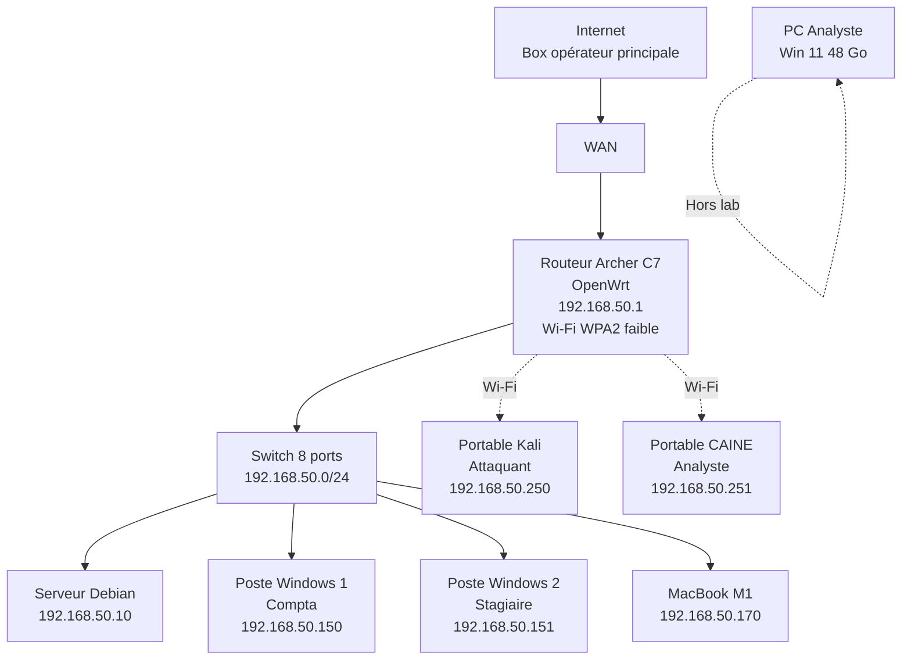
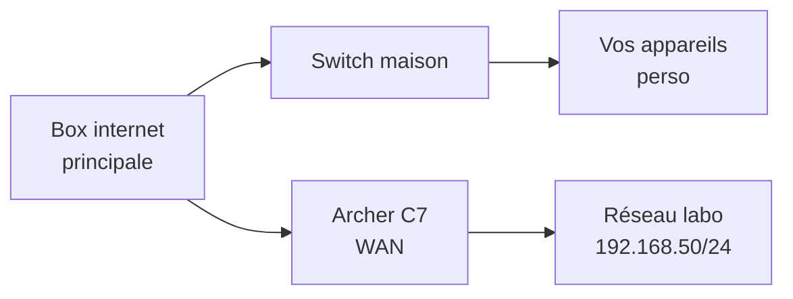

# 3.3 Topologie réseau et plan d'adressage

## Métadonnées

| Champ | Valeur |
|---|---|
| Durée | 2 heures |
| Type | Théorique préparatoire |

## 1. Topologie complète



## 2. Plan d'adressage

```text
RÉSEAU LABORATOIRE OMNYACADEMY
================================

Plage : 192.168.50.0/24
Masque : 255.255.255.0 (/24)
Gateway : 192.168.50.1

ADRESSES STATIQUES
192.168.50.1     Routeur OpenWrt
192.168.50.10    Serveur Debian
192.168.50.150   Poste Windows 1 (Compta)
192.168.50.151   Poste Windows 2 (Stagiaire)
192.168.50.170   MacBook M1

PLAGE DHCP (postes mobiles)
192.168.50.200 - 192.168.50.250

POSTES PORTABLES (DHCP fixé)
192.168.50.250   Kali attaquant
192.168.50.251   CAINE analyste

SSID Wi-Fi : ARTECH-WIFI
Bande : 2.4 GHz (et 5 GHz optionnel)
Sécurité : WPA2-PSK
Passphrase : ArtechMedical2020! (volontairement faible)

DNS
Par défaut DHCP : 1.1.1.1 / 9.9.9.9
Possible serveur DNS interne sur 192.168.50.10
```

## 3. Isolation Internet

### 3.1 Pourquoi isoler

Votre laboratoire **doit être isolé** d'Internet pour les phases d'attaque actives. Risques sinon :

- Trafic d'attaque vu par votre FAI
- Pollution DNS publique
- Risque de propagation malware réel
- Problèmes RGPD si données personnelles

### 3.2 Architectures possibles

#### Option A - Routeur Archer C7 isolé



L'Archer C7 a sa propre WAN. Pas de pont avec votre réseau perso.

#### Option B - Hors ligne complet (mode atelier)

Pour les phases d'attaque pure, débrancher complètement le WAN. Le labo fonctionne en autonomie.

## 4. Schéma de câblage

```text
CÂBLAGE PHYSIQUE
==================

Box opérateur ─── (cat.6 1m) ─── Archer C7 [WAN]
Archer C7 [LAN1] ─── (cat.6 0.5m) ─── Switch [Port 1]

Switch [Port 2] ─── (cat.6 1m) ─── Serveur Debian
Switch [Port 3] ─── (cat.6 1.5m) ─── Poste Win 1
Switch [Port 4] ─── (cat.6 1.5m) ─── Poste Win 2
Switch [Port 5] ─── (cat.6 2m) ─── MacBook M1
Switch [Port 6] ─── (cat.6 1m) ─── Hub USB analyste
Switch [Port 7] ─── (réserve)
Switch [Port 8] ─── (réserve)

Wi-Fi 2.4 GHz : Archer C7 → Portables Kali, CAINE
```

## 5. Documentation lab

À tenir à jour dans votre wiki labo :

```text
INFRASTRUCTURE OMNYACADEMY LAB - 2026-XX-XX
============================================

ÉQUIPEMENTS
- Archer C7 : MAC XX:XX:XX:XX:XX:XX, FW OpenWrt 23.05
- Serveur Debian : MAC XX:XX:XX:XX:XX:XX, hostname server-lab
- Poste Win 1 : MAC XX:XX:XX:XX:XX:XX, hostname WIN-COMPTA-01
- Poste Win 2 : MAC XX:XX:XX:XX:XX:XX, hostname WIN-STAGE-01
- MacBook M1 : MAC XX:XX:XX:XX:XX:XX, hostname MBP-ZYRASS

CREDENTIALS LAB
(stockés dans coffre-fort, hors fichier)

JOURNAL DE CONFIG
- 2026-XX-XX : OpenWrt installé
- 2026-XX-XX : Wi-Fi WPA2 configuré
- 2026-XX-XX : Serveur Debian opérationnel
- ...
```

## 6. Tests de validation

```bash
# Depuis votre poste analyste, ping chaque hôte
for ip in 192.168.50.{1,10,150,151,170,250,251}; do
  ping -c 1 -W 1 $ip > /dev/null && echo "$ip UP" || echo "$ip DOWN"
done

# Test résolution DNS
nslookup google.com 192.168.50.1

# Test routage
traceroute google.com
```

---

**Chapitre suivant** : [3.4 Configuration OpenWrt sur TP-Link Archer C7](03-4-openwrt-archer-c7.md)
