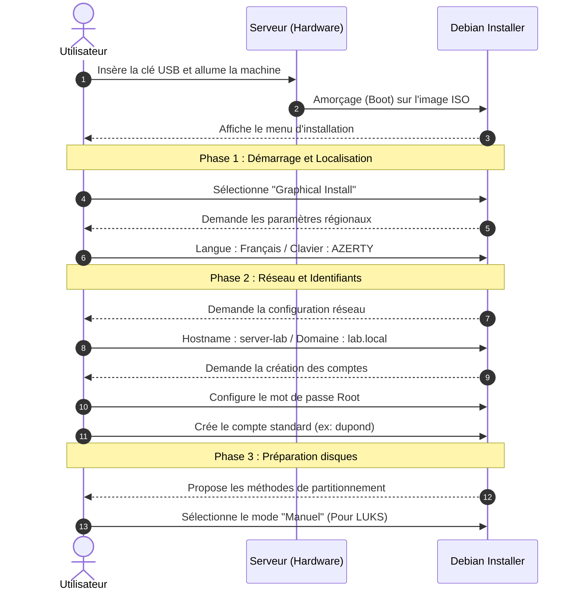

# Installation Debian 12 serveur

<div
  class="omny-meta"
  data-level="🟡 Standard"
  data-version="Modèle 2026"
  data-time="2 heures">
</div>

!!! note "**Livrables :** _Un serveur Linux chiffré, durci et opérationnel_"
!!! note "**Auto-explication :** _10 minutes_"

<br>

---

<br>

!!! quote "L'analogie des fondations du coffre-fort"

    Vous pouvez acheter la meilleure porte blindée du monde, si elle est montée sur des murs en placo, les voleurs passeront simplement à travers le mur. Le serveur Debian de la société ARTECH héberge les données de l'entreprise. Il sera notre cible principale lors de certaines attaques, et le coffre-fort des preuves lors de nos analyses. Il doit donc être installé avec une rigueur militaire (chiffrement des disques, partitionnement isolé, pare-feu). Construisons des fondations en béton.

## Objectifs pédagogiques

!!! tip "À la fin de ce chapitre, vous serez capable de :"

    - Réaliser une installation serveur Linux (Headless) pure et minimale.
    - Appliquer un chiffrement complet du disque (FDE) via LUKS.
    - Configurer une adresse IP statique et un DNS interne manuellement.
    - Durcir un serveur fraîchement installé (SSH, UFW, Fail2ban).

<br>

---

<br>

## Le choix de l'OS : Pourquoi Debian 12 ?

> Le tableau ci-dessous justifie le choix de l'architecture serveur :

| Critère | Raison du choix |
|---|---|
| **Stabilité** | Modèle LTS (Long Term Support), mises à jour de sécurité garanties 5 ans. |
| **Documentation** | La communauté Debian est l'une des plus rigoureuses au monde. |
| **Forensic-friendly** | L'immense majorité des outils Forensic (*SleuthKit*, *Volatility*) sont pensés pour Debian/Ubuntu. |
| **Sobriété** | Possibilité de faire une installation ultra-minimale (Sans interface graphique). |

<br>

---

<br>

## Préparation de l'installation

### Téléchargement de l'image ISO

```bash title="Commandes Linux - Récupération et contrôle de Debian 12"
# Récupérer l'ISO officielle 'netinst' (Environ 300 Mo, télécharge le reste via internet)
wget https://cdimage.debian.org/debian-cd/current/amd64/iso-cd/debian-12.X.0-amd64-netinst.iso

# Vérification cryptographique SHA-256 (Obligatoire)
wget https://cdimage.debian.org/debian-cd/current/amd64/iso-cd/SHA256SUMS
sha256sum -c SHA256SUMS --ignore-missing
```

### Création de la clé USB bootable

!!! danger "sda est généralement le premier disque dur de votre ordinateur, il contient déjà votre système d'exploitation."

```bash title="Commandes Linux - Flash USB"
# Attention, remplacez /dev/sdX par le bon périphérique (Sinon vous effacerez votre propre système)
sudo dd if=debian-12.X.0-amd64-netinst.iso of=/dev/sdX bs=4M status=progress conv=fdatasync
```

!!! note "La clé USB est prête !"
    Redémarrez votre machine et démarrez sur la clé USB.
    _Sous Windows, l'utilisation de **Rufus** ou **BalenaEtcher** est recommandée._

<br>

---

<br>

## Procédure d'installation (Phase d'amorçage)

!!! quote "La phase d'amorçage consiste à démarrer le serveur sur la clé USB d'installation et à configurer les paramètres de base du système (langue, réseau, comptes utilisateurs) avant d'aborder le partitionnement sécurisé."

### Séquence de configuration initiale

Le processus d'installation suit une logique d'échange interactif avec l'assistant Debian. Voici le déroulement exact de cette première phase :



### Paramètres de l'assistant

Afin de garantir la conformité de notre laboratoire Forensic, veillez à renseigner rigoureusement les valeurs ci-dessous lors des sollicitations de l'assistant :

| Étape de l'assistant | Valeur à sélectionner |
|---|---|
| **Démarrage** | **Graphical Install** (L'assistant sera graphique, même si le serveur final sera en CLI). |
| **Localisation** | Langue : **Français** / Pays : **France** / Clavier : **Français AZERTY**. |
| **Réseau** | Hostname : `server-lab` / Domaine : `lab.local`. |
| **Comptes (Root)** | Définissez un mot de passe Root robuste (Il sera désactivé ultérieurement). |
| **Comptes (User)** | Utilisateur standard : `dupond` (ou votre nom) + Mot de passe robuste. |
| **Partitionnement** | Mode : **Manuel** (Étape indispensable pour pouvoir configurer le chiffrement LUKS). |

!!! note "LUKS est un outil de chiffrement de disque qui permet de chiffrer le disque dur de manière sécurisée."

<br>

---

<br>

## Le Partitionnement Chiffré (LUKS & LVM)

### La structure cible

Nous simulons l'installation d'un serveur d'entreprise réel, où le vol physique des disques ne doit pas compromettre les données.

#### Schéma de partitionnement

```text title="Plan des partitions pour un disque de 256 Go"
STRUCTURE DU DISQUE PRINCIPAL (/dev/sda)
=========================================

/dev/sda1   1 GB      /boot           (ext4, en clair pour permettre le boot)
/dev/sda2   240 GB    LUKS Chiffré    (La grande boîte noire protégée par mot de passe)
    └─ /dev/mapper/sda2_crypt           (Le conteneur déverrouillé)
        └─ LVM (Logical Volume Manager)
            └─ vg-system              (Le groupe de volumes)
                    ├─ lv-root    50 GB  /         (Système principal - ext4)
                    ├─ lv-home    20 GB  /home     (Données utilisateurs - ext4)
                    ├─ lv-var     30 GB  /var      (Logs et bases de données - ext4)
                    ├─ lv-tmp     10 GB  /tmp      (Fichiers temporaires - ext4)
                    ├─ lv-swap    8 GB   swap      (Mémoire virtuelle)
                    └─ lv-data    100 GB /data     (Partage de fichiers PME - ext4)
```

!!! warning "Le piège LVM"
    Si vous choisissez "Assisté - Utiliser tout le disque avec LVM chiffré", l'assistant créera seulement une énorme partition `/`. En Forensic, et en sécurité globale, isoler `/var` et `/tmp` est fondamental pour empêcher une attaque par déni de service (Remplissage de disque par des logs infinis).

### Finalisation de l'installation

> Poursuivez l'assistant avec ces derniers réglages :

| Étape de l'assistant | Valeur à sélectionner |
|---|---|
| **Sélection des logiciels** | Cochez UNIQUEMENT `Serveur SSH` et `Utilitaires standard`. Décochez tout environnement de bureau (Debian Desktop, GNOME...). |
| **Chargeur d'amorçage (GRUB)** | Installer GRUB sur le secteur d'amorçage principal (`/dev/sda`). |

<br>

---

<br>

## Premier Boot et Configuration Réseau

### Le redémarrage

Au démarrage, le système s'arrêtera sur un écran noir demandant le mot de passe LUKS. C'est le comportement attendu de la **FDE** (Full Disk Encryption). Une fois le disque déverrouillé, connectez-vous avec votre utilisateur standard (`zyrass`).

### Adressage IP Statique

Ce serveur doit toujours conserver l'IP `192.168.50.10` sur notre réseau Labo.

#### Configuration Réseau Debian

```bash title="Commandes Linux - Édition fichier interfaces"
sudo vi /etc/network/interfaces
```

```text title="Contenu du fichier /etc/network/interfaces"
source /etc/network/interfaces.d/*

auto lo
iface lo inet loopback

# Configuration de l'interface Ethernet principale (eth0 ou enp0s3)
auto eth0
iface eth0 inet static
    address 192.168.50.10/24
    gateway 192.168.50.1
    dns-nameservers 192.168.50.1 1.1.1.1
```

```bash title="Commandes Linux - Application réseau"
# Redémarrage du service réseau
sudo systemctl restart networking

# Vérification
ip addr show eth0
```

### Résolution de noms locale

> Pour rappel, le fichier `/etc/hosts` est utilisé pour configurer la résolution de noms de domaine en local.

#### Configuration Fichier Hosts

```bash title="Commandes Linux - Édition du fichier hosts"
sudo vi /etc/hosts
```

> Ce fichier permet de configurer la résolution de noms de domaine en local.

```text title="Contenu du fichier /etc/hosts (Cartographie statique)"
127.0.0.1       localhost
127.0.1.1       server-lab.lab.local server-lab

# Cartographie de notre infrastructure ARTECH
192.168.50.1    router-lab.lab.local router-lab
192.168.50.10   server-lab.lab.local server-lab
192.168.50.150  win-compta.lab.local win-compta
192.168.50.151  win-stage.lab.local win-stage
192.168.50.170  mac-m1.lab.local mac-m1
```

<br>

---

<br>

## Durcissement système de base (Hardening)

Un serveur Forensic/Entreprise ne s'expose jamais tel quel.

### Sécurisation SSH

> Par défaut, Debian autorise toutes les connexions. Nous allons configurer un pare-feu pour autoriser uniquement les connexions SSH depuis notre réseau Labo.

#### Configuration Daemon SSH

```bash title="Commandes Linux - Édition sshd_config"
sudo vi /etc/ssh/sshd_config
```

> Paramètres à modifier ou décommenter :

```text title="Paramètres à modifier ou décommenter"
Port 22
Protocol 2
PermitRootLogin no               # Interdit l'accès direct en Root
PasswordAuthentication yes       # Provisoire (Sera mis à "no" après configuration des clés RSA/ED25519)
PermitEmptyPasswords no
X11Forwarding no                 # Bloque le déport d'affichage graphique
AllowUsers zyrass                # Liste blanche stricte
MaxAuthTries 3                   # Limite contre le brute-force
ClientAliveInterval 300
```

```bash title="Commandes Linux - Relance SSH"
sudo systemctl restart ssh
```

### Mise en place du Pare-feu (UFW)

> Le pare-feu UFW (Uncomplicated Firewall) est un pare-feu simple à utiliser. Il est réputé pour sa facilité d'utilisation et sa flexibilité. C'est un outil idéal pour les débutants en sécurité.

#### Configuration UFW

```bash title="Commandes Linux - Pare-feu par défaut"
sudo apt install ufw -y

# Stratégie : Tout interdire en entrée, tout autoriser en sortie
sudo ufw default deny incoming
sudo ufw default allow outgoing

# Autoriser uniquement le SSH depuis le sous-réseau interne
sudo ufw allow from 192.168.50.0/24 to any port 22

# Activation
sudo ufw enable
sudo ufw status verbose
```

### Protection anti-bruteforce (Fail2ban)

> Fail2ban est un logiciel open-source qui scanne les fichiers de logs (journaux) du système et bloque automatiquement les adresses IP qui montrent des signes d'activité malveillante, comme de multiples tentatives de connexion échouées.

#### Installation Fail2ban

```bash title="Commandes Linux - Installation Fail2ban"
sudo apt install fail2ban -y

sudo systemctl enable fail2ban
sudo systemctl start fail2ban

# Vérification du blocage actif sur le service SSH
sudo fail2ban-client status sshd
```

<br>

---

<br>

## Mises à jour automatiques

Pour éviter que notre PME ARTECH ne devienne une passoire de sécurité au fil du temps.

### Activation des correctifs de sécurité automatiques

```bash title="Commandes Linux - Unattended-upgrades"
sudo apt install unattended-upgrades -y

# Activer le démon via l'interface interactive
sudo dpkg-reconfigure -plow unattended-upgrades
```

<br>

---

<br>

## Conclusion

!!! quote "Ce qu'il faut retenir"
    Vous possédez maintenant un serveur Linux robuste, chiffré de bout en bout (LUKS), et protégé par un pare-feu réseau applicatif. Cette base ultra-propre et silencieuse va nous permettre de déployer, dans le chapitre suivant, les services métiers (Partage de fichiers, Intranet) vulnérables que nous auditerons par la suite.

> [Chapitre suivant : 3.7 Configuration serveur (SSH, Samba, intranet) →](07-config-serveur.md)
>
> [Retour à l'index →](./index.md)

<br>
