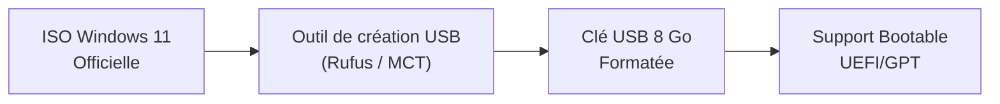

# Installation Windows 11 Pro - Poste 1 (Compta)

<div
  class="omny-meta"
  data-level="🟡 Standard"
  data-version="Modèle 2026"
  data-time="2 heures">
</div>

!!! note "**Livrables :** _Poste `WIN-COMPTA-01` opérationnel, chiffré et doté d'une baseline Forensic_"
!!! note "**Auto-explication :** _15 minutes_"

<br>

---

<br>

!!! quote "L'analogie du coffre-fort de la PME"

    Dans une PME comme ARTECH, le poste de la comptable est l'équivalent du coffre-fort de l'entreprise. Il contient les factures, les bulletins de paie, les coordonnées bancaires des clients, et les bilans. Sa compromission a des conséquences immédiates : Ransomware = paralysie de la facturation ; Exfiltration = chantage RGPD. Pour cette raison, ce poste sera configuré avec un niveau de sécurité supérieur (BitLocker), mais restera vulnérable à l'erreur humaine (Phishing).

## Objectifs pédagogiques

!!! tip "À la fin de ce chapitre, vous serez capable de :"

    - Installer Windows 11 Pro proprement en contournant l'obligation du compte Microsoft.
    - Configurer un poste destiné à un profil utilisateur "VIP" (Comptabilité).
    - Activer et documenter le chiffrement matériel BitLocker.
    - Capturer la "Baseline Forensic" (État sain) d'un poste Windows.

<br>

---

<br>

## Le Profil de la Cible (Persona)

Pour que nos exercices d'attaque et de Forensic soient réalistes, nous ne configurons pas des "PC vides", mais des machines appartenant à des humains fictifs.

```text title="Profil ARTECH - Fiche RH - Comptabilité -Sophie Dupont"
Nom métier        : Comptable principale
Identité          : Sophie Dupont, 47 ans, 12 ans d'ancienneté
Compétences IT    : Utilisatrice avancée Office, Néophyte en sécurité
Habitudes         : Ouvre systématiquement les PJ Excel/Word de fournisseurs
Risques typiques  : Phishing de factures, Ingénierie sociale par téléphone
Données traitées  : Factures, Comptabilité, RH, Coordonnées bancaires
```

### Caractéristiques techniques attendues

!!! note "Il est important de reproduire le plus fidèlement possible le poste de la victime pour que les exercices d'attaque et de forensic reflètent une situation proche de la réalité."

> Le tableau ci-dessous détaille le cahier des charges du poste :

| Paramètre système | Valeur à appliquer |
|---|---|
| **Hostname** | `WIN-COMPTA-01` |
| **IP Statique** | `192.168.50.150` |
| **Utilisateur local** | `compta` (Mot de passe : `Compta2026`) |
| **BitLocker** | **Activé** (Données sensibles) |
| **Mises à jour (Patchs)** | Retard volontaire de 1 mois (Réalisme PME) |
| **Forensic** | Service Sysmon installé et Baseline capturée |

<br>

---

<br>

## Préparation de l'installation

### Prérequis Matériels (Windows 11)

Si vous installez ceci sur un Mini-PC physique ou une machine virtuelle, vérifiez ces paramètres :

!!! warning "L'exigence du TPM"
    Windows 11 refuse de s'installer sans la présence d'une puce TPM 2.0 (Trusted Platform Module) et du Secure Boot activé dans le BIOS/UEFI. Heureusement, il est possible de contourner cette exigence en modifiant l'ISO d'installation ou en utilisant des outils tiers.

La modification de l'ISO est par exemple possible avec l'outil **MediaCreationTool.bat** qui permet de générer une image ISO sans TPM, Secure Boot et compte Microsoft. Pour plus d'infos : [MediaCreationTool.bat](https://github.com/AveYo/MediaCreationTool.bat)


!!! warning "Alternative : Utiliser Rufus pour créer une clé USB bootable"


### Le média d'installation



> Paramètres recommandés pour Rufus (Sous Windows) :

| Paramètre Rufus | Valeur requise |
|---|---|
| **Schéma de partition** | GPT |
| **Système cible** | UEFI (Non CSM) |
| **Système de fichiers** | NTFS |

<br>

---

<br>

## L'installation "Hors-Ligne" (Contournement Microsoft)

Microsoft force la connexion à un compte en ligne lors de l'installation de Windows 11. Dans un laboratoire isolé, ou dans une PME sans Azure AD, il faut utiliser un **compte local**.

### Astuce de contournement (OOBE Bypass)

```text title="Méthode de Bypass de connexion obligatoire"
1. Ne branchez PAS le câble réseau au PC pendant l'installation.
2. Lancez l'installation jusqu'à l'écran bloquant "Connectons-nous à un réseau".
3. Appuyez simultanément sur [Shift] + [F10] pour ouvrir l'Invite de commandes.
4. Tapez la commande suivante et validez :
    > oobe\BypassNRO
5. Le PC va redémarrer.
6. De retour sur l'écran réseau, cliquez sur la nouvelle option : 
    "Je n'ai pas Internet" puis "Continuer avec l'installation limitée".
```

### Création du compte et Télémétrie

Créez le compte `compta` avec le mot de passe `Compta2026`.
Pour la télémétrie (Localisation, Données de diagnostic, Publicité), **désactivez tout** pour éviter que votre laboratoire ne génère du trafic parasite vers les serveurs de Microsoft.

<br>

---

<br>

## Configuration réseau post-installation

Une fois sur le bureau, branchez le câble réseau.

### Nommage et Adressage IP

```powershell title="Commandes PowerShell - Configuration système"
# 1. Renommer le poste proprement
Rename-Computer -NewName "WIN-COMPTA-01" -Restart

# --- APRÈS LE REDÉMARRAGE ---

# 2. Appliquer l'IP Statique (Gateway pointant vers OpenWrt)
New-NetIPAddress `
    -InterfaceAlias "Ethernet" `
    -IPAddress "192.168.50.150" `
    -PrefixLength 24 `
    -DefaultGateway "192.168.50.1"

# 3. Configurer le DNS (OpenWrt + Cloudflare en backup)
Set-DnsClientServerAddress `
    -InterfaceAlias "Ethernet" `
    -ServerAddresses "192.168.50.1", "1.1.1.1"
```

<br>

---

<br>

## Chiffrement du disque (BitLocker)

!!! quote "Le poste traitant de la comptabilité, le vol physique du matériel ne doit pas exposer la base de données de l'entreprise."

### Activation cryptographique

> BitLocker est un outil de chiffrement natif de Windows qui permet de chiffrer l'intégralité du disque dur de manière transparente pour l'utilisateur. Sont importance est d'assurer la confidentialité des données en cas de vol ou de perte du matériel. Dans le cadre d'une attaque par ransomware, le chiffrement du disque est également un moyen de protéger les données contre le vol ou l'accès non autorisé.

#### Activation BitLocker PowerShell"

> Attention : Si vous n'avez pas de TPM 2.0, vous devez utiliser l'option -TpmProtection avec un mot de passe de récupération. Sinon, vous pouvez utiliser l'option -TpmOnly.

```powershell title="Commandes PowerShell - Chiffrement XTS-AES"
# Création du mot de passe de secours (Protecteur additionnel au TPM)
$pwd = ConvertTo-SecureString "Compta2026Recovery!" -AsPlainText -Force

# Lancement du chiffrement matériel
Enable-BitLocker `
    -MountPoint "C:" `
    -EncryptionMethod XtsAes256 `
    -TpmProtector

# Ajout du mot de passe de récupération
Add-BitLockerKeyProtector -MountPoint "C:" -PasswordProtector -Password $pwd
```

!!! danger "La Clé de Récupération (Recovery Key) est votre dernier recours, sans elle, vous ne pourrez pas accéder à vos données."

```powershell title="Extraction de la clé numérique à 48 chiffres"
(Get-BitLockerVolume -MountPoint "C:").KeyProtector | 
Where-Object { $_.KeyProtectorType -eq "RecoveryPassword" } | 
Select-Object -ExpandProperty RecoveryPassword
```

!!! note "L'erreur fatale : Ne stockez _jamais cette clé sur le Bureau du PC chiffré. Si Windows plante, la clé sera inaccessible. Copiez-la sur une clé USB externe ou notez-la dans un coffre-fort de mots de passe."

<br>

---

<br>

## Déploiement des données et vulnérabilités "Métier"

### Le partage réseau (Samba)

La comptable doit avoir un accès permanent aux factures hébergées sur le serveur Debian.

#### Mappage de lecteur réseau persistant

> Le mappage de lecteur réseau permet d'avoir un accès permanent aux factures hébergées sur le serveur Debian. **L'attaquant peut exploiter cette connexion pour propager son ransomware sur le serveur.**

```powershell title="Commandes PowerShell - Connexion au partage Z:"
# Utilisation de net use pour recréer le lecteur Z: à chaque démarrage
cmd /c "net use Z: \\192.168.50.10\compta /user:compta Compta2026 /persistent:yes"
```

### Faux documents et faiblesses applicatives

Générons les données qui seront visées par nos futures attaques (Ransomware).

#### Génération des documents fictifs

```powershell title="Script PowerShell - Création des cibles"
$path = "$env:USERPROFILE\Documents"
$docs = @("Factures_Client_Q1.xlsx", "Bulletins_Salaires_Mars.xlsx", "Bilan_Q1.docx", "Coordonnees_Bancaires.xlsx")

foreach ($doc in $docs) {
    "CONFIDENTIEL ARTECH - Fausse donnée de laboratoire" | Out-File "$path\$doc" -Encoding UTF8
}
```

!!! warning "Pour simuler le comportement de la comptable \"qui clique trop vite\", nous abaissons la sécurité des macros Office."

#### Vulnérabilisation des Macros Office

```powershell title="Commandes PowerShell - Édition du Registre"
# Autoriser l'exécution de scripts PowerShell locaux
Set-ExecutionPolicy -ExecutionPolicy RemoteSigned -Scope CurrentUser
```
_(Si Microsoft Office est installé, assurez-vous que les Macros peuvent s'exécuter après un simple clic sur "Activer le contenu")._

<br>

---

<br>

## Déploiement de Sysmon et de la "Baseline"

!!! quote "La clé du Forensic (DFIR[^1]) est de savoir à quoi ressemble le système _avant_ l'attaque."

### Installation de Sysmon

Sysmon (System Monitor) est l'outil indispensable de la suite Microsoft Sysinternals. Il agit comme une boîte noire enregistrant chaque création de processus, chaque connexion réseau.

#### Installation de Sysmon

```powershell title="Commandes PowerShell - Installation de Sysmon"
# 1. Télécharger Sysmon depuis le site Microsoft (sysinternals)
# 2. Télécharger la configuration de référence "SwiftOnSecurity"
$configUrl = "https://raw.githubusercontent.com/SwiftOnSecurity/sysmon-config/master/sysmonconfig-export.xml"
Invoke-WebRequest -Uri $configUrl -OutFile "C:\sysmonconfig.xml"

# 3. Installer le service silencieusement
.\Sysmon64.exe -i C:\sysmonconfig.xml -accepteula
```

!!! note "Le service Sysmon est maintenant actif et commence à journaliser tous les événements système dans le journal d'événements Windows sous le nom de 'Microsoft-Windows-Sysmon/Operational'."

### Capture de la Baseline (État Sain)

Avant la fin du chapitre, exécutez ce script de capture de l'état "Propre" de Windows.

```powershell title="Script PowerShell - Prise d'empreinte système - ( capture Forensique )"
$baseline = "C:\baseline-$(Get-Date -Format 'yyyyMMdd')"
New-Item -ItemType Directory -Path $baseline -Force | Out-Null

# 1. Capture des Services en cours
Get-Service | Export-Csv "$baseline\services.csv" -NoTypeInformation

# 2. Capture des Processus actifs
Get-Process | Export-Csv "$baseline\processes.csv" -NoTypeInformation

# 3. Capture des connexions réseau (Netstat)
Get-NetTCPConnection | Export-Csv "$baseline\netconnections.csv" -NoTypeInformation

# 4. Hash cryptographique de la Baseline entière pour la sceller
Get-ChildItem $baseline | Get-FileHash -Algorithm SHA256 | Export-Csv "$baseline\MANIFEST.csv"
```

<br>

---

<br>

## Conclusion

!!! quote "Ce qu'il faut retenir"
    Le poste de la comptable est désormais "En Prod". Il dispose d'un chiffrement robuste face au vol physique (BitLocker), et d'une journalisation de niveau noyau (Sysmon). Néanmoins, son accès privilégié au serveur (Lecteur Z:) et ses droits d'exécution de scripts en font le vecteur d'infection parfait pour un ransomware ou un attaquant par phishing.

> [Chapitre suivant : 3.9 Installation Windows 11 Pro - Poste 2 (Stagiaire) →](09-windows11-poste-stagiaire.md)
>
> [Retour à l'index →](./index.md)

<br>

[^1]: DFIR : Digital Forensics and Incident Response (Investigation numérique et réponse aux incidents).
