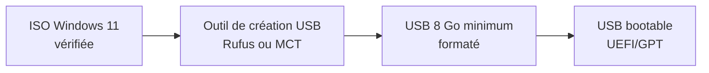

# 3.8 Installation Windows 11 Pro - Poste 1 (Compta)

!!! quote "L'analogie du coffre-fort de la PME"

    Dans une PME comme ARTECH, le poste de la comptable est l'équivalent du coffre-fort de l'entreprise. Il contient les factures, les bulletins de paie, les coordonnées bancaires des clients, les bilans. Sa compromission a des conséquences immédiates : ransomware = paralysie de la facturation, exfiltration = chantage RGPD. Pour cette raison, ce poste doit être configuré avec un niveau de sécurité supérieur au reste du parc. C'est exactement ce que vous allez faire ici.

## Métadonnées du chapitre

| Champ | Valeur |
|---|---|
| Durée estimée | 2 heures |
| Niveau | Pratique |
| Prérequis | 3.6 (serveur), 3.7 (services Samba) |
| Livrables | Poste WIN-COMPTA-01 opérationnel, baseline forensic |
| Auto-explication | 8 minutes |

## Objectifs pédagogiques

À l'issue de ce chapitre, vous serez capable de :

- Installer Windows 11 Pro proprement sur un poste reconditionné
- Configurer un poste destiné à un profil utilisateur sensible
- Activer et documenter BitLocker correctement
- Constituer une baseline forensic du poste (services, processus, registre)
- Préparer le poste pour les exercices d'attaque du cycle 1

## Profil de l'utilisatrice cible

```text
PROFIL UTILISATRICE - POSTE COMPTA
====================================

Nom métier      : Comptable principale
Profil ARTECH   : Sophie Dupont, 47 ans, 12 ans d'ancienneté
Compétences IT  : utilisatrice avancée Office, néophyte sécurité
Habitudes       : ouvre régulièrement des PJ Excel/Word de fournisseurs
Risques typiques: phishing factures, social engineering téléphone
Données traitées: factures, comptabilité, RH, coordonnées bancaires
```

## Caractéristiques cibles du poste

| Paramètre | Valeur |
|---|---|
| Hostname | WIN-COMPTA-01 |
| IP statique | 192.168.50.150 |
| Workgroup | ARTECH |
| Utilisateur local | compta |
| Mot de passe | Compta2026 |
| BitLocker | Activé (donnée sensible) |
| Antivirus | Defender actif |
| Patches Windows | À jour - 1 mois (réalisme PME) |
| Sysmon | Installé pour baseline forensic |

## 1. Prérequis matériels

### 1.1 Configuration minimale

| Composant | Mini Win 11 Pro |
|---|---|
| CPU | x86_64 dual core 1 GHz |
| RAM | 4 Go |
| Stockage | 64 Go SSD |
| TPM | Version 2.0 (obligatoire) |
| Secure Boot | UEFI compatible |
| Carte graphique | DirectX 12 compatible |

### 1.2 Recommandé pour le labo

| Composant | Valeur recommandée |
|---|---|
| CPU | Intel i5 8e gen ou AMD Ryzen 5 |
| RAM | 8 Go (Office + virtualisation légère) |
| Stockage | SSD 256 Go |
| Réseau | Gigabit Ethernet |

## 2. Téléchargement de l'ISO Windows 11

```powershell
# Source officielle UNIQUEMENT
# https://www.microsoft.com/software-download/windows11

# Trois options d'obtention :
# 1. Outil Media Creation Tool Microsoft (recommandé)
# 2. Téléchargement ISO direct depuis le site
# 3. ISO Évaluation 90 jours (Microsoft Evaluation Center)
```

### 2.1 Vérification de l'ISO

```powershell
# Calcul du hash SHA-256 de l'ISO téléchargée
Get-FileHash -Algorithm SHA256 .\Win11_French_x64v1.iso

# Comparaison avec le hash officiel publié par Microsoft
# Le hash doit correspondre exactement
```

## 3. Préparation USB d'installation



### 3.1 Avec Rufus

| Paramètre Rufus | Valeur |
|---|---|
| Périphérique | Clé USB de 8 Go ou plus |
| Type d'image | ISO standard Windows |
| Schéma de partition | GPT |
| Système cible | UEFI (non CSM) |
| Système de fichiers | NTFS |
| Taille de cluster | Par défaut |

## 4. Installation Windows 11 Pro

### 4.1 Boot sur USB

```text
DÉMARRAGE DE L'INSTALLATION
=============================

1. Brancher l'USB au poste cible
2. Allumer et entrer dans le BIOS/UEFI
   (touches courantes : F2, F12, DEL, ESC selon constructeur)
3. Vérifier les paramètres requis :
   - Secure Boot : Enabled
   - TPM 2.0 : Enabled
   - Boot Mode : UEFI uniquement
4. Définir le boot priority sur USB
5. Sauvegarder et redémarrer
```

### 4.2 Étapes de l'assistant

| Étape | Choix Poste Compta |
|---|---|
| 1 - Langue | Français (France) |
| 2 - Format heure | Français (France) |
| 3 - Clavier | Français (AZERTY) |
| 4 - Édition | Windows 11 Pro |
| 5 - Type d'installation | Personnalisée |
| 6 - Disque | Formatage complet, schéma GPT |
| 7 - Région | France |
| 8 - Disposition | Français |
| 9 - Réseau | Pas connecté pour l'instant |

### 4.3 Contournement compte Microsoft

Windows 11 force la création d'un compte Microsoft. Pour le labo, il faut un **compte local**.

```text
MÉTHODE DE CONTOURNEMENT
==========================

Option A : Pas de réseau
  Installer hors-ligne, le système proposera
  alors un compte local automatiquement

Option B : Bypass commande
  À l'écran de connexion réseau :
  1. Appuyer sur Shift + F10 (ouvre cmd)
  2. Taper :
     oobe\BypassNRO
  3. Le système redémarre puis propose
     "Je n'ai pas Internet" → "Continuer
     avec installation limitée"

Option C : Compte fictif
  Email : noreply@invalid.local
  Mot de passe : InvalidPwd123
  Le système refuse, propose alors compte local
```

### 4.4 Création du compte local

| Champ | Valeur |
|---|---|
| Nom d'utilisateur | compta |
| Mot de passe | Compta2026 |
| Question 1 | Préférée |
| Question 2 | Différente |
| Question 3 | Différente |

**Note** : ce mot de passe est volontairement faible pour les exercices d'attaque. Dans la vraie vie, ce serait inacceptable.

### 4.5 Paramètres de confidentialité

Pour le labo, désactiver autant d'options de télémétrie que possible :

| Option | Choix |
|---|---|
| Localisation | Désactivé |
| Recherche d'appareil | Désactivé |
| Données diagnostiques | Requis seulement |
| Encrage et frappe | Non |
| Publicité personnalisée | Non |
| Reconnaissance vocale | Non |

## 5. Configuration post-installation

### 5.1 Définition du hostname

```powershell
# Renommer le poste avec son rôle ARTECH
# Le préfixe WIN- standardise les hostnames Windows du parc
Rename-Computer -NewName "WIN-COMPTA-01" -Restart

# Le poste redémarre automatiquement après cette commande
```

### 5.2 Configuration réseau statique

```powershell
# Identification de l'interface réseau active
# La sortie liste toutes les interfaces, on cible "Ethernet"
Get-NetAdapter

# Configuration de l'IP statique pour ce poste
# 192.168.50.150 est l'IP réservée pour le poste compta
# /24 = masque 255.255.255.0
# Gateway 192.168.50.1 = routeur OpenWrt du labo
New-NetIPAddress `
    -InterfaceAlias "Ethernet" `
    -IPAddress "192.168.50.150" `
    -PrefixLength 24 `
    -DefaultGateway "192.168.50.1"

# Configuration DNS - routeur OpenWrt en primaire, Cloudflare secondaire
Set-DnsClientServerAddress `
    -InterfaceAlias "Ethernet" `
    -ServerAddresses "192.168.50.1", "1.1.1.1"

# Vérification de la configuration
ipconfig /all | Select-String "WIN-COMPTA-01", "192.168.50"
```

### 5.3 Workgroup ARTECH

```powershell
# Joindre le workgroup ARTECH (pas un domaine, juste un groupe de travail)
# Conforme à la réalité d'une PME sans serveur AD
Add-Computer -WorkgroupName "ARTECH" -Restart
```

## 6. Mises à jour Windows partielles

Pour le réalisme PME, on n'applique **pas** toutes les mises à jour. ARTECH a typiquement 1 mois de retard.

```powershell
# Installation de PSWindowsUpdate pour gestion fine
# AllowClobber accepte le remplacement de modules existants
Install-Module -Name PSWindowsUpdate -Force -AllowClobber

# Liste des mises à jour disponibles
Get-WindowsUpdate

# Installation des mises à jour critiques de sécurité uniquement
# On laisse volontairement les mises à jour optionnelles et facultatives
# pour reproduire un parc PME en retard
Get-WindowsUpdate -Category "Security Updates" -Install -AcceptAll -IgnoreReboot

# Reboot après application
Restart-Computer -Force
```

## 7. Activation de BitLocker

Le poste comptable contient des données sensibles. BitLocker est **obligatoire** ici.

### 7.1 Vérification des prérequis

```powershell
# Vérifier que TPM est présent et opérationnel
Get-Tpm

# La sortie attendue :
#   TpmPresent     : True
#   TpmReady       : True
#   TpmEnabled     : True
#   TpmActivated   : True
#   TpmOwned       : True
```

### 7.2 Activation du chiffrement

```powershell
# Activation BitLocker sur C: avec :
# - AES-256 (XTS-AES)
# - Protecteur TPM (clé liée au TPM matériel)
# - Protecteur Password en backup
$pwd = ConvertTo-SecureString "Compta2026Recovery!" -AsPlainText -Force

# Activation chiffrement
Enable-BitLocker `
    -MountPoint "C:" `
    -EncryptionMethod XtsAes256 `
    -TpmProtector

# Ajout d'un protecteur Password de récupération
Add-BitLockerKeyProtector `
    -MountPoint "C:" `
    -PasswordProtector `
    -Password $pwd
```

### 7.3 Sauvegarde de la clé de récupération

```powershell
# Récupération de la clé numérique de 48 chiffres
# C'est CETTE clé qui débloque le disque en cas de problème
$recoveryKey = (Get-BitLockerVolume -MountPoint "C:").KeyProtector |
    Where-Object { $_.KeyProtectorType -eq "RecoveryPassword" } |
    Select-Object -ExpandProperty RecoveryPassword

# Affichage à l'écran (à NOTER ABSOLUMENT)
Write-Host "CLÉ DE RÉCUPÉRATION BITLOCKER : $recoveryKey" -ForegroundColor Red

# Sauvegarde dans un fichier pour le labo
# IMPORTANT : ce fichier doit ensuite être COPIÉ sur clé USB et SUPPRIMÉ
$recoveryKey | Out-File "C:\bitlocker-recovery-key.txt"

# La clé de récupération doit être :
# 1. Imprimée sur papier
# 2. Stockée dans KeePass dédié au labo
# 3. Ne JAMAIS être laissée sur le poste lui-même
```

### 7.4 Vérification de l'état

```powershell
# État du chiffrement (peut prendre des heures pour gros disque)
manage-bde -status C:

# Pourcentage de progression
(Get-BitLockerVolume -MountPoint "C:").EncryptionPercentage
```

## 8. Configuration des partages Samba

### 8.1 Mappage du partage compta

```powershell
# Mappage du partage Samba "compta" en lecteur Z:
# Identifiants Samba (différents du compte Windows)
# /persistent:yes : remappe au prochain login
$user = "compta"
$pwd = "Compta2026"

# Commande net use avec persistance
cmd /c "net use Z: \\192.168.50.10\compta /user:$user $pwd /persistent:yes"

# Vérification
Get-PSDrive Z

# Test de lecture du partage
dir Z:\
```

## 9. Installation des logiciels métier

### 9.1 Microsoft Office (ou LibreOffice)

```powershell
# Option A : LibreOffice (gratuit, recommandé pour le labo)
# Téléchargement et installation silencieuse
$url = "https://download.documentfoundation.org/libreoffice/stable/24.8.X/win/x86_64/LibreOffice_24.8.X_Win_x86-64.msi"
$installer = "$env:TEMP\libreoffice.msi"
Invoke-WebRequest -Uri $url -OutFile $installer
Start-Process msiexec.exe -ArgumentList "/i $installer /quiet /norestart" -Wait

# Option B : Office 365 si licence professionnelle disponible
# Setup classique via portail Microsoft
```

### 9.2 Logiciels complémentaires

```powershell
# 7-Zip pour archives
winget install --id 7zip.7zip --silent

# Firefox comme navigateur professionnel
winget install --id Mozilla.Firefox --silent

# Adobe Reader pour PDF
winget install --id Adobe.Acrobat.Reader.64-bit --silent

# Outils sysinternals pour visibilité
winget install --id Microsoft.Sysinternals.Suite --silent
```

## 10. Configuration "vulnérable réaliste"

Pour les exercices d'attaque, on conserve quelques vulnérabilités typiques d'une PME.

### 10.1 Activation des macros Office

```powershell
# Word - autoriser les macros avec avertissement
# (réaliste pour comptable qui reçoit des factures Word)
# VBAWarnings = 2 : avertissement, mais possible d'activer
Set-ItemProperty `
    -Path "HKCU:\Software\Microsoft\Office\16.0\Word\Security" `
    -Name "VBAWarnings" `
    -Value 2 `
    -Force

# Excel - même configuration (factures et tableaux Excel)
Set-ItemProperty `
    -Path "HKCU:\Software\Microsoft\Office\16.0\Excel\Security" `
    -Name "VBAWarnings" `
    -Value 2 `
    -Force
```

### 10.2 Politique d'exécution PowerShell

```powershell
# RemoteSigned permet aux scripts locaux non signés
# (typique d'un poste métier où la comptable récupère des scripts)
Set-ExecutionPolicy -ExecutionPolicy RemoteSigned -Scope CurrentUser
```

### 10.3 Mots de passe enregistrés

Pour simuler une utilisatrice réelle :

| Type | Stockage |
|---|---|
| Mot de passe Samba | Enregistré (cmdkey) |
| Mots de passe sites web | Enregistrés dans Firefox |
| Mots de passe email | Enregistrés Outlook |
| RDP éventuels | Enregistrés |

## 11. Création de données fictives

```powershell
# Création de documents métier réalistes pour la comptable
# Ces documents serviront aux exercices d'attaque (exfiltration, ransomware)

$docs = @(
    @{Nom="Factures_Client_Q1_2026.xlsx"; Taille=15000},
    @{Nom="Facture_2026_001_Hopital_Lyon.xlsx"; Taille=8000},
    @{Nom="Facture_2026_002_CHU_Bordeaux.xlsx"; Taille=8000},
    @{Nom="Facture_2026_003_Clinique_Marseille.xlsx"; Taille=8000},
    @{Nom="Bulletins_Salaires_Mars_2026.xlsx"; Taille=25000},
    @{Nom="Bilan_Q1_2026.docx"; Taille=18000},
    @{Nom="Liste_Clients_Confidentielle.xlsx"; Taille=45000},
    @{Nom="Coordonnees_Bancaires_Fournisseurs.xlsx"; Taille=12000},
    @{Nom="Procedure_Validation_Facture.docx"; Taille=8000},
    @{Nom="Compte_Resultat_Annee_2025.xlsx"; Taille=22000},
    @{Nom="Lettre_Type_Relance_Impayes.docx"; Taille=5000}
)

# Création dans le dossier Documents de l'utilisatrice
$path = "$env:USERPROFILE\Documents"

foreach ($doc in $docs) {
    # Génération de contenu fictif de la taille spécifiée
    $content = "DOCUMENT FICTIF ARTECH - À usage de laboratoire forensic uniquement.`n"
    $content += "=" * 60 + "`n"
    $content += "Document : $($doc.Nom)`n"
    $content += "Société : ARTECH SAS`n"
    $content += "Confidentialité : Interne`n`n"
    $content += "Lorem ipsum dolor sit amet, consectetur adipiscing elit. " * ($doc.Taille / 60)

    $content | Out-File "$path\$($doc.Nom)" -Encoding UTF8
}

# Vérification
Get-ChildItem $path | Format-Table Name, Length
```

## 12. Installation Sysmon pour baseline forensic

Sysmon enregistre l'activité système au niveau noyau, indispensable pour la forensic.

```powershell
# Téléchargement Sysmon (suite Sysinternals)
$url = "https://download.sysinternals.com/files/Sysmon.zip"
$zip = "$env:TEMP\sysmon.zip"
Invoke-WebRequest -Uri $url -OutFile $zip

# Extraction
Expand-Archive -Path $zip -DestinationPath "C:\sysmon" -Force

# Téléchargement de la configuration de référence
# Configuration SwiftOnSecurity = standard de l'industrie
$configUrl = "https://raw.githubusercontent.com/SwiftOnSecurity/sysmon-config/master/sysmonconfig-export.xml"
Invoke-WebRequest -Uri $configUrl -OutFile "C:\sysmon\sysmonconfig.xml"

# Installation comme service avec configuration
cd C:\sysmon
.\Sysmon64.exe -i sysmonconfig.xml -accepteula

# Vérification que Sysmon tourne
Get-Service Sysmon64
Get-WinEvent -LogName "Microsoft-Windows-Sysmon/Operational" -MaxEvents 5
```

## 13. Constitution de la baseline forensic

C'est l'étape la plus importante du chapitre. Vous capturez l'**état "propre"** du poste avant toute attaque, pour pouvoir détecter les modifications ultérieures.

```powershell
# Création du dossier baseline
$baseline = "C:\baseline-$(Get-Date -Format 'yyyyMMdd')"
New-Item -ItemType Directory -Path $baseline -Force | Out-Null

# 1. Liste des services
Get-Service | Select-Object Name, Status, StartType, DisplayName |
    Export-Csv "$baseline\services.csv" -NoTypeInformation

# 2. Liste des processus
Get-Process | Select-Object Name, Id, Path, Company, Description |
    Export-Csv "$baseline\processes.csv" -NoTypeInformation

# 3. Tâches planifiées
Get-ScheduledTask | Select-Object TaskName, TaskPath, State, Author |
    Export-Csv "$baseline\scheduled_tasks.csv" -NoTypeInformation

# 4. Clés Run du registre
$runKeys = @(
    "HKLM:\SOFTWARE\Microsoft\Windows\CurrentVersion\Run",
    "HKLM:\SOFTWARE\Microsoft\Windows\CurrentVersion\RunOnce",
    "HKCU:\SOFTWARE\Microsoft\Windows\CurrentVersion\Run",
    "HKCU:\SOFTWARE\Microsoft\Windows\CurrentVersion\RunOnce"
)
foreach ($key in $runKeys) {
    if (Test-Path $key) {
        Get-ItemProperty $key | Out-File "$baseline\$(($key -replace '[\\:]', '_')).txt"
    }
}

# 5. Connexions réseau actives
Get-NetTCPConnection | Select-Object LocalAddress, LocalPort, RemoteAddress, RemotePort, State, OwningProcess |
    Export-Csv "$baseline\netconnections.csv" -NoTypeInformation

# 6. Liste des utilisateurs locaux
Get-LocalUser | Select-Object Name, Enabled, LastLogon, PasswordLastSet |
    Export-Csv "$baseline\users.csv" -NoTypeInformation

# 7. Membres du groupe Administrators
Get-LocalGroupMember -Group "Administrators" |
    Export-Csv "$baseline\admins.csv" -NoTypeInformation

# 8. Hash SHA-256 de la baseline
Get-ChildItem $baseline | Get-FileHash -Algorithm SHA256 |
    Export-Csv "$baseline\MANIFEST.csv" -NoTypeInformation

# Confirmation
Write-Host "Baseline sauvegardée dans $baseline" -ForegroundColor Green
Get-ChildItem $baseline | Format-Table Name, Length
```

## 14. Documentation du poste

```powershell
# Création de la fiche équipement
$ficheEquipement = @"
=== FICHE ÉQUIPEMENT - WIN-COMPTA-01 ===
Date création  : $(Get-Date -Format 'yyyy-MM-dd')
Hostname       : WIN-COMPTA-01
Rôle           : Poste comptable ARTECH
IP statique    : 192.168.50.150
MAC            : $((Get-NetAdapter Ethernet).MacAddress)
OS             : $((Get-CimInstance Win32_OperatingSystem).Caption)
Version        : $((Get-CimInstance Win32_OperatingSystem).Version)
Build          : $((Get-CimInstance Win32_OperatingSystem).BuildNumber)
CPU            : $((Get-CimInstance Win32_Processor).Name)
RAM totale     : $([math]::Round((Get-CimInstance Win32_ComputerSystem).TotalPhysicalMemory / 1GB, 2)) Go
Disque C:      : $([math]::Round((Get-CimInstance Win32_LogicalDisk -Filter "DeviceID='C:'").Size / 1GB, 2)) Go
BitLocker      : $((Get-BitLockerVolume -MountPoint "C:").VolumeStatus)
Workgroup      : ARTECH
Sysmon         : Installé
Baseline       : $baseline

UTILISATEUR LOCAL
  Nom : compta
  Mot de passe : Compta2026 (faible volontairement)

DOCUMENTS FICTIFS
  Localisation : $env:USERPROFILE\Documents
  Nombre : $((Get-ChildItem $env:USERPROFILE\Documents).Count) fichiers

PARTAGES MAPPÉS
  Z: \\192.168.50.10\compta

VULNÉRABILITÉS INTENTIONNELLES (pour exercices)
  - Macros Office actives avec avertissement
  - PowerShell RemoteSigned (pas Restricted)
  - Mises à jour Windows en retard 1 mois
  - Pas d'EDR (juste Defender)
  - Pas de MFA
"@

$ficheEquipement | Out-File "C:\fiche-equipement.txt" -Encoding UTF8
Write-Host "Fiche équipement créée : C:\fiche-equipement.txt"
```

## 15. Tests de validation

```powershell
# Script de validation automatique du poste
Write-Host "`n=== VALIDATION POSTE WIN-COMPTA-01 ===" -ForegroundColor Cyan

# Test 1 : Hostname
$hostnameOK = $env:COMPUTERNAME -eq "WIN-COMPTA-01"
Write-Host "Hostname : $env:COMPUTERNAME $(if($hostnameOK){'[OK]'}else{'[FAIL]'})"

# Test 2 : IP statique
$ip = (Get-NetIPAddress -InterfaceAlias Ethernet -AddressFamily IPv4).IPAddress
$ipOK = $ip -eq "192.168.50.150"
Write-Host "IP : $ip $(if($ipOK){'[OK]'}else{'[FAIL]'})"

# Test 3 : Ping serveur
$pingOK = Test-Connection 192.168.50.10 -Count 1 -Quiet
Write-Host "Ping serveur : $(if($pingOK){'[OK]'}else{'[FAIL]'})"

# Test 4 : BitLocker
$blStatus = (Get-BitLockerVolume -MountPoint "C:").VolumeStatus
$blOK = $blStatus -ne "FullyDecrypted"
Write-Host "BitLocker : $blStatus $(if($blOK){'[OK]'}else{'[FAIL]'})"

# Test 5 : Sysmon
$sysmonOK = (Get-Service Sysmon64 -ErrorAction SilentlyContinue).Status -eq "Running"
Write-Host "Sysmon : $(if($sysmonOK){'[OK]'}else{'[FAIL]'})"

# Test 6 : Partage compta mappé
$partageOK = Test-Path "Z:\"
Write-Host "Partage Z: : $(if($partageOK){'[OK]'}else{'[FAIL]'})"

# Test 7 : Documents fictifs
$nbDocs = (Get-ChildItem $env:USERPROFILE\Documents -ErrorAction SilentlyContinue).Count
$docsOK = $nbDocs -ge 10
Write-Host "Documents fictifs : $nbDocs $(if($docsOK){'[OK]'}else{'[FAIL]'})"

# Test 8 : Baseline
$baselineOK = Test-Path "C:\baseline-*"
Write-Host "Baseline : $(if($baselineOK){'[OK]'}else{'[FAIL]'})"

Write-Host "`n=== FIN VALIDATION ===" -ForegroundColor Cyan
```

## 16. Checklist finale poste Compta

| # | Vérification | Statut |
|---|---|---|
| 1 | Windows 11 Pro installé proprement | OK |
| 2 | Hostname WIN-COMPTA-01 | OK |
| 3 | IP statique 192.168.50.150 | OK |
| 4 | Workgroup ARTECH | OK |
| 5 | Compte local "compta" / Compta2026 | OK |
| 6 | LibreOffice ou Office installé | OK |
| 7 | Macros Office activées avec avertissement | OK |
| 8 | BitLocker activé en XTS-AES-256 | OK |
| 9 | Clé de récupération sauvegardée hors machine | OK |
| 10 | Mises à jour partielles (1 mois retard) | OK |
| 11 | Sysmon installé et fonctionnel | OK |
| 12 | Partage Samba "compta" mappé en Z: | OK |
| 13 | 11 documents fictifs métier créés | OK |
| 14 | Baseline forensic capturée | OK |
| 15 | Fiche équipement documentée | OK |

## 17. Auto-évaluation

| # | Question | Réponse |
|---|---|---|
| 1 | Pourquoi BitLocker sur ce poste ? | Données comptables sensibles |
| 2 | Pourquoi mises à jour incomplètes ? | Réalisme PME en retard |
| 3 | Méthode de chiffrement utilisée ? | XTS-AES-256 |
| 4 | Pourquoi capturer une baseline ? | Détecter modifications futures |
| 5 | Outil pour visibilité forensic ? | Sysmon |
| 6 | Lecteur du partage compta ? | Z: |
| 7 | Mot de passe utilisateur ? | Compta2026 (volontairement faible) |
| 8 | Pourquoi macros activées ? | Réalisme - comptable reçoit factures Office |

## 18. Synthèse mémo

```text
WIN-COMPTA-01 - POSTE COMPTABLE ARTECH

CONFIGURATION
  Hostname    : WIN-COMPTA-01
  IP          : 192.168.50.150
  User        : compta / Compta2026
  Workgroup   : ARTECH

SÉCURITÉ
  BitLocker   : ACTIF (XTS-AES-256)
  Sysmon      : INSTALLÉ
  Defender    : ACTIF
  MAJ         : 1 mois retard (réaliste)

VULNÉRABILITÉS LABO
  Macros      : avec avertissement
  PowerShell  : RemoteSigned
  Mdp local   : Compta2026 (faible)

DONNÉES
  ~/Documents : 11 docs fictifs métier
  Z:          : partage Samba compta

FORENSIC
  Baseline    : C:\baseline-YYYYMMDD\
  Fiche       : C:\fiche-equipement.txt
```

---

**Chapitre précédent** : [3.7 Configuration serveur (SSH, Samba, intranet)](03-7-config-serveur.md)

**Chapitre suivant** : [3.9 Installation Windows 11 Pro - Poste 2 (Stagiaire)](03-9-windows11-poste-stagiaire.md)
