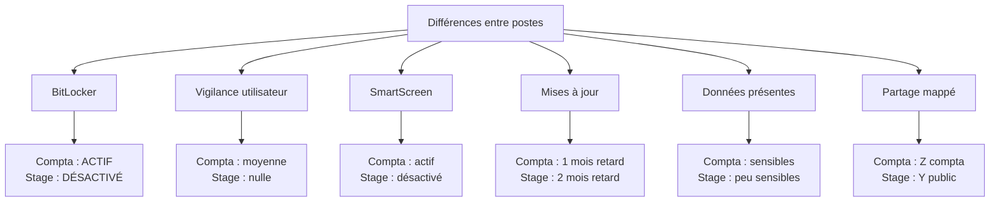

# 3.9 Installation Windows 11 Pro - Poste 2 (Stagiaire)

!!! quote "L'analogie du maillon faible de la chaîne"

    En sécurité, la chaîne ne vaut que ce que vaut son maillon le plus faible. Dans une PME comme ARTECH, ce maillon faible est presque toujours identifiable d'avance : c'est le poste du nouveau venu, du stagiaire, du contrat court qui n'a reçu aucune formation cybersécurité. C'est par lui que les attaquants entrent dans 80 % des cas. Ce chapitre vous fait construire ce maillon faible volontairement. Pas par négligence, mais pour comprendre pourquoi il est faible et apprendre à le protéger.

## Métadonnées du chapitre

| Champ | Valeur |
|---|---|
| Durée estimée | 2 heures |
| Niveau | Pratique |
| Prérequis | 3.6 (serveur), 3.7 (Samba), 3.8 (poste compta installé) |
| Livrables | Poste WIN-STAGE-01 vulnérable réaliste, baseline forensic |
| Auto-explication | 8 minutes |

## Objectifs pédagogiques

À l'issue de ce chapitre, vous serez capable de :

- Installer Windows 11 Pro sur un second poste rapidement
- Configurer un poste destiné à un profil utilisateur novice
- Identifier et reproduire les vulnérabilités typiques d'un poste stagiaire
- Comprendre pourquoi ces postes sont les cibles privilégiées
- Préparer le point d'entrée principal des exercices d'attaque du cycle 1

## Profil de l'utilisateur cible

```text
PROFIL UTILISATEUR - POSTE STAGIAIRE
======================================

Nom métier      : Stagiaire commerce / administration
Profil ARTECH   : Paul Dubois, 22 ans, stage 6 mois
Compétences IT  : utilisateur lambda, néophyte total sécurité
Habitudes       : Gmail perso, réseaux sociaux, téléchargements
Risques typiques: phishing total, social engineering facile
Données traitées: emails internes, documents en cours, accès limité

VULNÉRABILITÉS COMPORTEMENTALES TYPIQUES
  - Clique sur tout ce qui ressemble à un email officiel
  - Active les macros Office quand demandé
  - Télécharge des outils non autorisés
  - Branche des USB non vérifiés
  - Réutilise mots de passe perso
  - Pas de notion de SSL/HTTPS
```

## Caractéristiques cibles du poste

| Paramètre | Valeur |
|---|---|
| Hostname | WIN-STAGE-01 |
| IP statique | 192.168.50.151 |
| Workgroup | ARTECH |
| Utilisateur local | stagiaire |
| Mot de passe | Stage2026 |
| BitLocker | **DÉSACTIVÉ** (négligence réaliste) |
| Antivirus | Defender actif |
| SmartScreen | **Désactivé** (faute fréquente) |
| Patches Windows | À jour - 2 mois (plus en retard que Compta) |
| Sysmon | Installé pour baseline forensic |

## 1. Différences fondamentales avec le poste Compta

Comprendre les différences entre Compta et Stage est crucial pédagogiquement.



| Aspect | WIN-COMPTA-01 | WIN-STAGE-01 |
|---|---|---|
| Profil utilisateur | Expérimenté | Novice |
| Vigilance phishing | Modérée | Quasi-nulle |
| BitLocker | Activé | Désactivé |
| SmartScreen | Activé | Désactivé |
| Mises à jour | 1 mois retard | 2 mois retard |
| Mot de passe | Compta2026 | Stage2026 |
| Sensibilité données | Haute | Faible |
| Partage Samba | compta | public |
| Macros Office | Avertissement | Activées sans avertissement |

## 2. Téléchargement et préparation

Identique au chapitre 3.8 (vous pouvez réutiliser la même clé USB d'installation).

```powershell
# Vérification de l'ISO si nouveau téléchargement
Get-FileHash -Algorithm SHA256 .\Win11_French_x64v1.iso

# Comparaison hash officiel Microsoft
```

## 3. Installation Windows 11 Pro

### 3.1 Procédure de boot

| Étape | Action |
|---|---|
| 1 | Brancher l'USB sur le second poste |
| 2 | Boot UEFI sur USB |
| 3 | Vérifier TPM 2.0 + Secure Boot |
| 4 | Lancer l'installation |

### 3.2 Étapes spécifiques

| Étape | Choix Poste Stagiaire |
|---|---|
| Langue | Français (France) |
| Édition | Windows 11 Pro |
| Type d'installation | Personnalisée |
| Partitionnement | Formatage complet, schéma GPT |
| Région | France |
| Clavier | AZERTY |
| Réseau | Pas connecté pour contournement |

### 3.3 Création du compte local

Utilisation des mêmes méthodes de bypass qu'au chapitre 3.8.

| Champ | Valeur |
|---|---|
| Nom d'utilisateur | stagiaire |
| Mot de passe | Stage2026 |

**Note** : ce mot de passe est encore plus faible que celui du compte compta. C'est intentionnel, c'est une situation classique pour un stagiaire qui considère que "ce n'est qu'un stage, on s'en fiche".

## 4. Configuration post-installation

### 4.1 Hostname

```powershell
# Le préfixe WIN- standardise les hostnames Windows du parc
Rename-Computer -NewName "WIN-STAGE-01" -Restart
```

### 4.2 Configuration réseau statique

```powershell
# IP réservée pour ce poste (suit immédiatement WIN-COMPTA-01)
New-NetIPAddress `
    -InterfaceAlias "Ethernet" `
    -IPAddress "192.168.50.151" `
    -PrefixLength 24 `
    -DefaultGateway "192.168.50.1"

# DNS - même config que les autres postes
Set-DnsClientServerAddress `
    -InterfaceAlias "Ethernet" `
    -ServerAddresses "192.168.50.1", "1.1.1.1"

# Validation
Test-Connection -ComputerName 192.168.50.10 -Count 2
```

### 4.3 Workgroup ARTECH

```powershell
Add-Computer -WorkgroupName "ARTECH" -Restart
```

## 5. Mises à jour MOINS complètes que Compta

```powershell
# Installation PSWindowsUpdate
Install-Module -Name PSWindowsUpdate -Force -AllowClobber

# Pour le stagiaire, on applique encore moins de mises à jour
# Reproduit la situation d'un poste laissé sans maintenance régulière

# Liste mais pas d'installation systématique
Get-WindowsUpdate

# Installation des UPDATES CRITIQUES UNIQUEMENT
# (pas même les Security Updates standards)
Get-WindowsUpdate -Category "Critical Updates" -Install -AcceptAll -IgnoreReboot

# Reboot
Restart-Computer -Force
```

## 6. BitLocker DÉLIBÉRÉMENT désactivé

C'est le point le plus important du chapitre, pédagogiquement.

### 6.1 Vérification de l'état

```powershell
# Statut BitLocker sur C:
Get-BitLockerVolume -MountPoint "C:"

# La sortie attendue : VolumeStatus = FullyDecrypted
# Cela signifie que BitLocker N'EST PAS activé
```

### 6.2 Pourquoi laisser désactivé

```text
RAISONNEMENT - POURQUOI PAS DE BITLOCKER
==========================================

RÉALISME PME
  Beaucoup d'entreprises n'activent BitLocker
  que sur les postes "VIP" et oublient les autres.
  Le poste stagiaire est typiquement oublié.

RAISON HUMAINE
  L'admin IT (M. Lemoine pour ARTECH) considère
  que "le stagiaire ne reste que 6 mois, ce
  n'est pas la peine". Erreur classique.

EXPLOITATION FORENSIC
  Si le poste tombe (vol, ransomware), les
  données sont en clair. Acquisition
  forensic immédiate possible sans bypass.

EXERCICE PÉDAGOGIQUE
  Vous comparerez l'acquisition de ce poste
  (facile) avec celle du poste Compta
  (BitLocker = obstacle). Différence
  immédiate de complexité.
```

### 6.3 Documentation de l'absence

```powershell
# Documenter explicitement que BitLocker est désactivé
$noteBitLocker = @"
=== ATTENTION : BITLOCKER DÉSACTIVÉ ===
Date  : $(Get-Date -Format 'yyyy-MM-dd')
Poste : WIN-STAGE-01
Motif : Réalisme PME - poste stagiaire non protégé

CONSÉQUENCES
  - Données en clair sur disque
  - Vol matériel = compromission immédiate
  - Acquisition forensic facile

À CORRIGER en environnement réel
"@

$noteBitLocker | Out-File "C:\NOTE-BITLOCKER-DESACTIVE.txt"
```

## 7. Configuration partage Samba (différente de Compta)

```powershell
# Le stagiaire n'a accès qu'au partage public
# Pas d'accès aux partages compta ou direction
$user = "stagiaire"
$pwd = "Stage2026"

# Mappage du partage public en Y:
cmd /c "net use Y: \\192.168.50.10\public /user:$user $pwd /persistent:yes"

# Test
Get-PSDrive Y
dir Y:\
```

## 8. Installation des logiciels

```powershell
# Office ou LibreOffice (même que Compta)
$url = "https://download.documentfoundation.org/libreoffice/stable/24.8.X/win/x86_64/LibreOffice_24.8.X_Win_x86-64.msi"
$installer = "$env:TEMP\libreoffice.msi"
Invoke-WebRequest -Uri $url -OutFile $installer
Start-Process msiexec.exe -ArgumentList "/i $installer /quiet /norestart" -Wait

# Outils basiques
winget install --id 7zip.7zip --silent
winget install --id Mozilla.Firefox --silent
winget install --id Adobe.Acrobat.Reader.64-bit --silent

# Spotify (typique stagiaire qui écoute la musique)
winget install --id Spotify.Spotify --silent

# Discord (typique communication informelle)
winget install --id Discord.Discord --silent
```

## 9. Configuration "vulnérable réaliste" - Plus laxiste

Les vulnérabilités sont plus nombreuses et plus profondes que sur le poste Compta.

### 9.1 Macros Office activées sans avertissement

```powershell
# Word - macros activées DIRECTEMENT (sans avertissement)
# VBAWarnings = 1 : pas d'avertissement, macros actives par défaut
# C'est la configuration la plus dangereuse possible
Set-ItemProperty `
    -Path "HKCU:\Software\Microsoft\Office\16.0\Word\Security" `
    -Name "VBAWarnings" `
    -Value 1 `
    -Force

# Excel - même configuration laxiste
Set-ItemProperty `
    -Path "HKCU:\Software\Microsoft\Office\16.0\Excel\Security" `
    -Name "VBAWarnings" `
    -Value 1 `
    -Force

# PowerPoint et Outlook idem
@("PowerPoint", "Outlook") | ForEach-Object {
    $regPath = "HKCU:\Software\Microsoft\Office\16.0\$_\Security"
    if (Test-Path $regPath) {
        Set-ItemProperty -Path $regPath -Name "VBAWarnings" -Value 1 -Force
    }
}
```

### 9.2 SmartScreen désactivé

```powershell
# SmartScreen Windows désactivé
# Conséquence : l'utilisateur peut télécharger n'importe quel exécutable
# sans avertissement de sécurité
Set-ItemProperty `
    -Path "HKLM:\SOFTWARE\Policies\Microsoft\Windows\System" `
    -Name "EnableSmartScreen" `
    -Value 0 `
    -Force

# SmartScreen pour les apps Edge également désactivé
Set-ItemProperty `
    -Path "HKCU:\SOFTWARE\Microsoft\Windows\CurrentVersion\AppHost" `
    -Name "EnableWebContentEvaluation" `
    -Value 0 `
    -Force -ErrorAction SilentlyContinue
```

### 9.3 PowerShell sans restriction

```powershell
# Unrestricted = tous scripts s'exécutent sans signature ni avertissement
# C'est la pire configuration possible pour PowerShell
Set-ExecutionPolicy -ExecutionPolicy Unrestricted -Scope CurrentUser -Force

# Et au niveau LocalMachine également
Set-ExecutionPolicy -ExecutionPolicy Unrestricted -Scope LocalMachine -Force
```

### 9.4 UAC à un niveau bas

```powershell
# Réduction du niveau d'UAC (User Account Control)
# Niveau 0 = jamais de notification
# Niveau 5 = comportement par défaut (notifications standard)
# On met à 1 = uniquement quand un programme tente de modifier
Set-ItemProperty `
    -Path "HKLM:\SOFTWARE\Microsoft\Windows\CurrentVersion\Policies\System" `
    -Name "ConsentPromptBehaviorAdmin" `
    -Value 1 `
    -Force
```

### 9.5 Mots de passe enregistrés partout

Pour simuler un stagiaire négligent :

| Type | Configuration |
|---|---|
| Firefox | Tous mots de passe enregistrés |
| Edge | Tous mots de passe enregistrés |
| Identifiants Samba | cmdkey enregistré |
| Connexions Wi-Fi | Toutes en mémoire |

```powershell
# Enregistrement explicite des credentials Samba
cmdkey /add:192.168.50.10 /user:stagiaire /pass:Stage2026
```

### 9.6 Téléchargements non vérifiés

```powershell
# Désactivation de la vérification d'attachements potentiellement dangereux
Set-ItemProperty `
    -Path "HKCU:\Software\Microsoft\Windows\CurrentVersion\Policies\Attachments" `
    -Name "SaveZoneInformation" `
    -Value 1 `
    -Force -ErrorAction SilentlyContinue
```

## 10. Création de données fictives "stagiaire"

Données moins sensibles que sur le poste Compta, mais représentatives.

```powershell
# Documents typiques d'un stagiaire en commerce/administration
# Caractéristique : MIX professionnel et personnel sur le poste pro

$docs = @(
    # Professionnels
    @{Nom="Stage_Rapport_Provisoire_V2.docx";    Type="Pro"; Taille=12000},
    @{Nom="Stage_Notes_Reunion_Mars.docx";       Type="Pro"; Taille=4000},
    @{Nom="Tableau_Suivi_Clients.xlsx";          Type="Pro"; Taille=8000},
    @{Nom="Template_Email_Prospection.docx";     Type="Pro"; Taille=3000},

    # Mixtes (typique négligence stagiaire)
    @{Nom="Mots_de_passe_a_retenir.txt";         Type="Mixte"; Taille=500},
    @{Nom="CV_Paul_Dubois_2026.pdf";             Type="Mixte"; Taille=15000},
    @{Nom="Liste_Demandes_Stages_Suivants.docx"; Type="Mixte"; Taille=6000},

    # Personnels (faute professionnelle classique stagiaire)
    @{Nom="Photos_weekend_amis.zip";             Type="Perso"; Taille=50000},
    @{Nom="Bulletin_Universite_S5.pdf";          Type="Perso"; Taille=8000},
    @{Nom="Devis_garage_voiture.pdf";            Type="Perso"; Taille=4000}
)

$path = "$env:USERPROFILE\Documents"

foreach ($doc in $docs) {
    $content = "DOCUMENT FICTIF ARTECH/STAGIAIRE - $($doc.Type)`n"
    $content += "Pour usage de laboratoire forensic uniquement.`n"
    $content += "=" * 60 + "`n"
    $content += "Document : $($doc.Nom)`n"
    $content += "Type : $($doc.Type)`n`n"
    $content += "Lorem ipsum stagiaire dolor sit amet. " * ($doc.Taille / 60)

    $content | Out-File "$path\$($doc.Nom)" -Encoding UTF8
}

# Création d'un fichier "Mots_de_passe_a_retenir.txt" fictif (faute classique)
$mdpFichier = @"
=== MOTS DE PASSE À RETENIR ===
(Note : à mémoriser puis supprimer)

Mail Gmail perso  : Paul.Dubois.92@gmail.com / Footballista2003!
Mail pro stage    : p.dubois@artech.fr / Stage2026
Banque CIC        : 12345678 / Aoutninetytwo
Spotify           : Footballista2003!
Steam             : Footballista2003!
Discord           : Footballista2003!
Réseau Wi-Fi maison : Bouygues_F4_2GHz / 8c7d3b2a1f9e

Mot de passe ARTECH machine : Stage2026
"@

$mdpFichier | Out-File "$path\Mots_de_passe_a_retenir.txt" -Encoding UTF8

# Vérification
Get-ChildItem $path | Format-Table Name, Length
Write-Host "`nNote : le fichier Mots_de_passe_a_retenir.txt est volontairement présent"
Write-Host "Cette pratique est ULTRA-FRÉQUENTE chez les utilisateurs novices"
```

## 11. Installation Sysmon (identique au poste Compta)

```powershell
# Téléchargement Sysmon
$url = "https://download.sysinternals.com/files/Sysmon.zip"
$zip = "$env:TEMP\sysmon.zip"
Invoke-WebRequest -Uri $url -OutFile $zip

# Extraction
Expand-Archive -Path $zip -DestinationPath "C:\sysmon" -Force

# Configuration SwiftOnSecurity (référence)
$configUrl = "https://raw.githubusercontent.com/SwiftOnSecurity/sysmon-config/master/sysmonconfig-export.xml"
Invoke-WebRequest -Uri $configUrl -OutFile "C:\sysmon\sysmonconfig.xml"

# Installation service
cd C:\sysmon
.\Sysmon64.exe -i sysmonconfig.xml -accepteula

# Vérification
Get-Service Sysmon64
Get-WinEvent -LogName "Microsoft-Windows-Sysmon/Operational" -MaxEvents 5
```

## 12. Activité utilisateur simulée

Pour qu'une analyse forensic soit réaliste, il faut que le poste ait été "utilisé". On simule de l'activité.

```powershell
# Lancer Edge pour générer historique
Start-Process "msedge.exe" "https://www.google.com"
Start-Sleep -Seconds 3
Start-Process "msedge.exe" "https://www.youtube.com"
Start-Sleep -Seconds 3
Start-Process "msedge.exe" "https://www.francetvinfo.fr"
Start-Sleep -Seconds 3

# Fermer Edge
Get-Process msedge -ErrorAction SilentlyContinue | Stop-Process -Force

# Ouvrir et fermer Office
Start-Process "$env:USERPROFILE\Documents\Stage_Rapport_Provisoire_V2.docx"
Start-Sleep -Seconds 5
Get-Process WINWORD, soffice -ErrorAction SilentlyContinue | Stop-Process -Force

# Visite du partage public
dir Y:\

# Création de documents récents
"Tâches du jour - $(Get-Date -Format 'yyyy-MM-dd')" |
    Out-File "$env:USERPROFILE\Documents\Taches_du_jour.txt"
```

## 13. Constitution de la baseline forensic

```powershell
# Identique au poste Compta mais sur ce poste
$baseline = "C:\baseline-$(Get-Date -Format 'yyyyMMdd')"
New-Item -ItemType Directory -Path $baseline -Force | Out-Null

# Liste des services
Get-Service | Select-Object Name, Status, StartType, DisplayName |
    Export-Csv "$baseline\services.csv" -NoTypeInformation

# Liste des processus
Get-Process | Select-Object Name, Id, Path, Company, Description |
    Export-Csv "$baseline\processes.csv" -NoTypeInformation

# Tâches planifiées
Get-ScheduledTask | Select-Object TaskName, TaskPath, State, Author |
    Export-Csv "$baseline\scheduled_tasks.csv" -NoTypeInformation

# Clés Run du registre
$runKeys = @(
    "HKLM:\SOFTWARE\Microsoft\Windows\CurrentVersion\Run",
    "HKLM:\SOFTWARE\Microsoft\Windows\CurrentVersion\RunOnce",
    "HKCU:\SOFTWARE\Microsoft\Windows\CurrentVersion\Run",
    "HKCU:\SOFTWARE\Microsoft\Windows\CurrentVersion\RunOnce"
)
foreach ($key in $runKeys) {
    if (Test-Path $key) {
        Get-ItemProperty $key | Out-File "$baseline\$(($key -replace '[\\:]', '_')).txt"
    }
}

# Connexions réseau
Get-NetTCPConnection | Select-Object LocalAddress, LocalPort, RemoteAddress, RemotePort, State, OwningProcess |
    Export-Csv "$baseline\netconnections.csv" -NoTypeInformation

# Utilisateurs locaux
Get-LocalUser | Select-Object Name, Enabled, LastLogon, PasswordLastSet |
    Export-Csv "$baseline\users.csv" -NoTypeInformation

# Membres Administrators
Get-LocalGroupMember -Group "Administrators" |
    Export-Csv "$baseline\admins.csv" -NoTypeInformation

# Hash SHA-256
Get-ChildItem $baseline | Get-FileHash -Algorithm SHA256 |
    Export-Csv "$baseline\MANIFEST.csv" -NoTypeInformation

Write-Host "Baseline sauvegardée dans $baseline" -ForegroundColor Green
```

## 14. Documentation du poste

```powershell
$ficheEquipement = @"
=== FICHE ÉQUIPEMENT - WIN-STAGE-01 ===
Date création  : $(Get-Date -Format 'yyyy-MM-dd')
Hostname       : WIN-STAGE-01
Rôle           : Poste stagiaire ARTECH
IP statique    : 192.168.50.151
MAC            : $((Get-NetAdapter Ethernet).MacAddress)
OS             : $((Get-CimInstance Win32_OperatingSystem).Caption)
Version        : $((Get-CimInstance Win32_OperatingSystem).Version)
Build          : $((Get-CimInstance Win32_OperatingSystem).BuildNumber)
CPU            : $((Get-CimInstance Win32_Processor).Name)
RAM totale     : $([math]::Round((Get-CimInstance Win32_ComputerSystem).TotalPhysicalMemory / 1GB, 2)) Go
Disque C:      : $([math]::Round((Get-CimInstance Win32_LogicalDisk -Filter "DeviceID='C:'").Size / 1GB, 2)) Go
BitLocker      : DÉSACTIVÉ (volontairement, réalisme stagiaire)
SmartScreen    : DÉSACTIVÉ (faute fréquente)
Workgroup      : ARTECH
Sysmon         : Installé
Baseline       : $baseline

UTILISATEUR LOCAL
  Nom : stagiaire
  Mot de passe : Stage2026 (très faible)

DOCUMENTS FICTIFS
  Localisation : $env:USERPROFILE\Documents
  Particularité : mix pro/perso (faute typique stagiaire)
  Présence Mots_de_passe_a_retenir.txt (faute critique)

PARTAGES MAPPÉS
  Y: \\192.168.50.10\public

VULNÉRABILITÉS INTENTIONNELLES (multiples par rapport à Compta)
  - BitLocker DÉSACTIVÉ
  - SmartScreen DÉSACTIVÉ
  - Macros Office activées SANS AVERTISSEMENT
  - PowerShell Unrestricted
  - UAC réduit
  - Mots de passe en clair dans fichier
  - Mots de passe enregistrés partout
  - Mises à jour Windows en retard 2 mois
  - Pas d'EDR (juste Defender)
  - Documents personnels mêlés au pro
  - Pas de MFA

POINT D'ENTRÉE PRINCIPAL DES ATTAQUES
  Ce poste est le candidat naturel
  pour les exercices de :
  - Phishing avec macro Word
  - Exécution de payload PowerShell
  - Vol de credentials enregistrés
"@

$ficheEquipement | Out-File "C:\fiche-equipement.txt" -Encoding UTF8
Write-Host "Fiche équipement créée : C:\fiche-equipement.txt"
```

## 15. Tests de validation

```powershell
Write-Host "`n=== VALIDATION POSTE WIN-STAGE-01 ===" -ForegroundColor Cyan

# Hostname
$hostnameOK = $env:COMPUTERNAME -eq "WIN-STAGE-01"
Write-Host "Hostname : $env:COMPUTERNAME $(if($hostnameOK){'[OK]'}else{'[FAIL]'})"

# IP
$ip = (Get-NetIPAddress -InterfaceAlias Ethernet -AddressFamily IPv4).IPAddress
$ipOK = $ip -eq "192.168.50.151"
Write-Host "IP : $ip $(if($ipOK){'[OK]'}else{'[FAIL]'})"

# Ping serveur
$pingOK = Test-Connection 192.168.50.10 -Count 1 -Quiet
Write-Host "Ping serveur : $(if($pingOK){'[OK]'}else{'[FAIL]'})"

# BitLocker DOIT être désactivé sur ce poste
$blStatus = (Get-BitLockerVolume -MountPoint "C:").VolumeStatus
$blOK = $blStatus -eq "FullyDecrypted"
Write-Host "BitLocker désactivé : $blStatus $(if($blOK){'[OK]'}else{'[FAIL]'})"

# SmartScreen DOIT être désactivé
$ssValue = (Get-ItemProperty -Path "HKLM:\SOFTWARE\Policies\Microsoft\Windows\System" -Name "EnableSmartScreen" -ErrorAction SilentlyContinue).EnableSmartScreen
$ssOK = $ssValue -eq 0
Write-Host "SmartScreen désactivé : $(if($ssOK){'[OK]'}else{'[FAIL]'})"

# PowerShell Unrestricted
$psPolicy = (Get-ExecutionPolicy -Scope CurrentUser)
$psOK = $psPolicy -eq "Unrestricted"
Write-Host "PowerShell Unrestricted : $psPolicy $(if($psOK){'[OK]'}else{'[FAIL]'})"

# Sysmon
$sysmonOK = (Get-Service Sysmon64 -ErrorAction SilentlyContinue).Status -eq "Running"
Write-Host "Sysmon : $(if($sysmonOK){'[OK]'}else{'[FAIL]'})"

# Partage public mappé
$partageOK = Test-Path "Y:\"
Write-Host "Partage Y: : $(if($partageOK){'[OK]'}else{'[FAIL]'})"

# Documents fictifs
$nbDocs = (Get-ChildItem $env:USERPROFILE\Documents -ErrorAction SilentlyContinue).Count
$docsOK = $nbDocs -ge 10
Write-Host "Documents fictifs : $nbDocs $(if($docsOK){'[OK]'}else{'[FAIL]'})"

# Fichier mots de passe (faute volontaire)
$mdpOK = Test-Path "$env:USERPROFILE\Documents\Mots_de_passe_a_retenir.txt"
Write-Host "Fichier mdp en clair : $(if($mdpOK){'[OK]'}else{'[FAIL]'})"

# Baseline
$baselineOK = Test-Path "C:\baseline-*"
Write-Host "Baseline : $(if($baselineOK){'[OK]'}else{'[FAIL]'})"

Write-Host "`n=== FIN VALIDATION ===" -ForegroundColor Cyan
```

## 16. Comparaison récapitulative finale

| Élément | WIN-COMPTA-01 | WIN-STAGE-01 |
|---|---|---|
| BitLocker | XTS-AES-256 | Désactivé |
| SmartScreen | Activé | Désactivé |
| Macros Office | Avertissement | Activées directement |
| PowerShell | RemoteSigned | Unrestricted |
| UAC | Standard | Réduit |
| Mises à jour | 1 mois retard | 2 mois retard |
| Mot de passe | Compta2026 | Stage2026 |
| Mots de passe en clair | Non | Oui (fichier txt) |
| Données personnelles | Non | Oui (mix pro/perso) |
| Niveau de risque | Modéré | Élevé |

## 17. Auto-évaluation

| # | Question | Réponse |
|---|---|---|
| 1 | Pourquoi pas de BitLocker ? | Réalisme PME - poste stagiaire oublié |
| 2 | VBAWarnings = 1 vs 2 ? | 1 = sans avertissement, 2 = avec |
| 3 | ExecutionPolicy Unrestricted ? | Tous scripts sans restriction |
| 4 | Lecteur partagé ? | Y: (public uniquement) |
| 5 | Pourquoi données perso ? | Faute classique stagiaire |
| 6 | Vecteur attaque favori ? | Phishing avec macro |
| 7 | Combien de mois de retard MAJ ? | 2 mois |
| 8 | Pourquoi SmartScreen désactivé ? | Faute admin IT typique |

## 18. Synthèse mémo

```text
WIN-STAGE-01 - POSTE STAGIAIRE ARTECH

CONFIGURATION
  Hostname    : WIN-STAGE-01
  IP          : 192.168.50.151
  User        : stagiaire / Stage2026
  Workgroup   : ARTECH

SÉCURITÉ DÉLIBÉRÉMENT FAIBLE
  BitLocker     : DÉSACTIVÉ
  SmartScreen   : DÉSACTIVÉ
  Macros        : ACTIVÉES SANS AVERTISSEMENT
  PowerShell    : UNRESTRICTED
  UAC           : RÉDUIT
  MAJ           : 2 mois retard
  Mdp en clair  : OUI (fichier txt)

DONNÉES
  ~/Documents : 11 docs (mix pro/perso)
  Y:          : partage public uniquement

POINT D'ENTRÉE ATTAQUES
  Phishing macro Word/Excel
  Exécution PowerShell sans restriction
  Vol credentials Firefox/Edge
  Vol cmdkey Samba

FORENSIC
  Baseline    : C:\baseline-YYYYMMDD\
  Fiche       : C:\fiche-equipement.txt
  Note        : C:\NOTE-BITLOCKER-DESACTIVE.txt
```

---

**Chapitre précédent** : [3.8 Installation Windows 11 Pro - Poste 1 (Compta)](03-8-windows11-poste-compta.md)

**Chapitre suivant** : [3.10 Active Directory mini (optionnel)](03-10-ad-mini.md)
