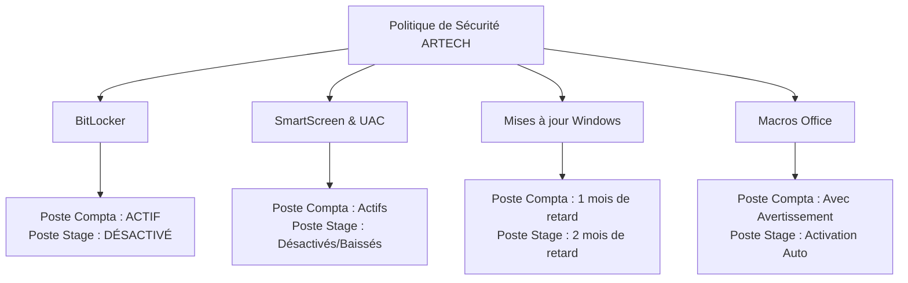
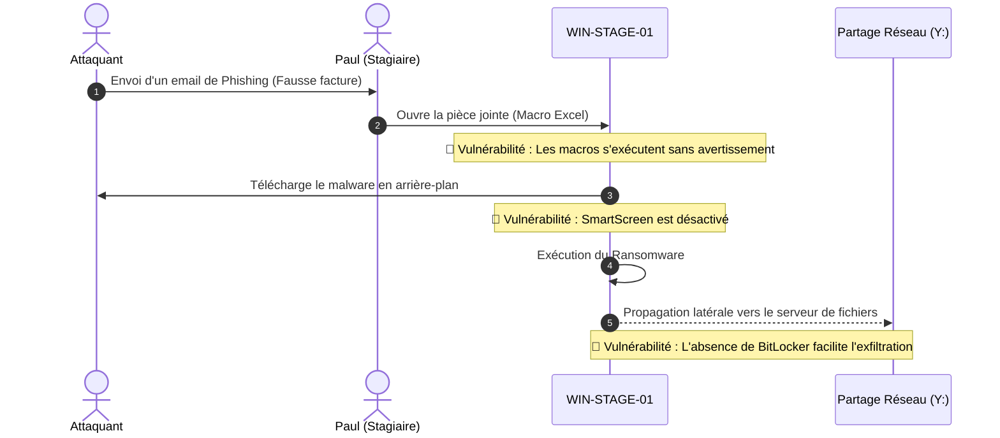

# Installation Windows 11 Pro - Poste 2 (Stagiaire)

<div
  class="omny-meta"
  data-level="🔴 Avancé"
  data-version="Modèle 2026"
  data-time="2 heures">
</div>

!!! note "**Livrables :** _Poste `WIN-STAGE-01` fonctionnel, vulnérable, et doté de sa baseline Forensic_"
!!! note "**Auto-explication :** _15 minutes_"

<br>

---

<br>

!!! quote "L'analogie du maillon faible de la chaîne"

    En sécurité, la chaîne ne vaut que ce que vaut son maillon le plus faible. Dans une PME comme ARTECH, ce maillon faible est presque toujours identifiable d'avance : c'est le poste du nouveau venu, du stagiaire ou du contrat court. Ce collaborateur n'a souvent reçu aucune formation à la cybersécurité. C'est par lui que les attaquants entrent dans 80% des cas. Ce chapitre vous fait construire ce maillon faible volontairement. Pas par négligence, mais pour reproduire la réalité et préparer le terrain de nos futures attaques (Phishing).

## Objectifs pédagogiques

!!! tip "À la fin de ce chapitre, vous serez capable de :"

    - Identifier et implémenter les vulnérabilités comportementales et techniques typiques d'un poste non maintenu.
    - Comprendre l'impact critique de l'absence de BitLocker sur l'investigation numérique.
    - Créer un jeu de fausses données incluant des erreurs humaines graves (Mots de passe en clair).
    - Préparer le "Patient Zéro" de nos scénarios d'attaque réseau.

<br>

---

<br>

## Le Profil de la Cible (Persona)

Contrairement au poste Comptabilité, très encadré, le poste Stagiaire est un "fourre-tout" numérique.

```text title="Profil ARTECH - Fiche RH - Stagiaire - Paul Dubois"
Nom métier        : Stagiaire administration et commerce
Identité          : Paul Dubois, 22 ans, stage de 6 mois
Compétences IT    : Utilisateur lambda, gamer, mais néophyte en sécurité
Habitudes         : Connecte son Gmail perso au travail, installe des jeux
Risques typiques  : Vulnérable au Phishing, Ingénierie sociale via les réseaux
Données traitées  : Emails internes, modèles de prospection, accès au partage public

COMPORTEMENTS À RISQUES (VULNÉRABILITÉS HUMAINES)

- Clique sans lire les alertes de sécurité (Fatigue d'alerte).
- Accepte systématiquement l'exécution des Macros Office.
- Branche des clés USB non vérifiées pour récupérer ses cours.
- Utilise le même mot de passe partout.
```

<br>

---

<br>

## Architecture de la Vulnérabilité (Compta vs Stagiaire)

Comprendre l'écart de sécurité entre les deux postes est l'enjeu central de ce laboratoire.



> Le tableau ci-dessous résume les différences techniques applicables lors de l'installation :

| Paramètre | WIN-COMPTA-01 | WIN-STAGE-01 |
|---|---|---|
| **Utilisateur** | `compta` | `stagiaire` |
| **Mot de passe** | Compta2026 | Stage2026 (Encore plus faible) |
| **IP Statique** | `192.168.50.150` | `192.168.50.151` |
| **BitLocker** | **Activé (XTS-AES)** | **Désactivé** |
| **Partage réseau** | `Z:` (Compta) | `Y:` (Public uniquement) |

<br>

---

<br>

## Installation et Contournement

La procédure de base (Clé USB Rufus, Contournement du compte Microsoft) est strictement identique au Chapitre 3.8. 

1. Nommez le PC : `WIN-STAGE-01`.
2. Configurez le compte local : `stagiaire` avec le mot de passe `Stage2026`.
3. Fixez l'IP à `192.168.50.151` (Gateway `192.168.50.1`).
4. Rejoignez le Workgroup `ARTECH`.

### Mises à jour partielles

!!! quote "**L'administrateur informatique d'ARTECH néglige ce poste**. Appliquons uniquement les patchs les plus critiques, en laissant volontairement 2 mois de failles béantes."

```powershell title="PowerShell ( Retard de patchs ) - PSWindowsUpdate"
# Installation du module de gestion des MAJ
Install-Module -Name PSWindowsUpdate -Force -AllowClobber

# Installation UNIQUEMENT des mises à jour extrêmement critiques (On ignore la catégorie Sécurité)
Get-WindowsUpdate -Category "Critical Updates" -Install -AcceptAll -IgnoreReboot
Restart-Computer -Force
```

<br>

---

<br>

## Le point clé : BitLocker délibérément désactivé

!!! danger "La réalité du terrain : _Beaucoup de PME n'activent **BitLocker** que sur les postes de Direction ou de Comptabilité. Le poste du stagiaire, prêté pour 6 mois, est "oublié". En Forensic, cela signifie que si ce poste est volé ou infecté, une acquisition bit-à-bit du disque dur nous donnera accès **immédiatement** aux données en clair, sans avoir besoin d'extraire de clés mémoire._"

```powershell title="PowerShell - Vérification et documentation de non-chiffrement - ( Audit BitLocker )"
# Le statut retourné DOIT être "FullyDecrypted"
Get-BitLockerVolume -MountPoint "C:"

# Création du fichier témoin pour nos exercices futurs
"ATTENTION : BITLOCKER DÉSACTIVÉ (RÉALISME PME)" | Out-File "C:\NOTE-BITLOCKER-DESACTIVE.txt"
```

> Ci dessus, le fichier généré par la commande PowerShell permettra de prouver, lors d'un incident, que l'administrateur n'a pas respecté les règles de sécurité de la société. Ce fichier sera ajouté à la baseline forensic du poste stagiaire. Il faudra veiller à le rendre non modifiable.

<br>

---

<br>

## Implémentation des vulnérabilités comportementales

!!! note "Nous allons forcer le système à être crédule. _En effet, les utilisateurs finaux sont souvent la première cause de compromission d'un système informatique._"

### Scénario d'Infection Typique (Le Patient Zéro)

Ce diagramme de séquence illustre exactement pourquoi nous allons abaisser les défenses du poste dans les étapes suivantes. Il montre l'enchaînement fatal (Kill Chain) qui se produit lorsqu'un utilisateur non formé reçoit un e-mail malveillant sur un poste mal sécurisé.



!!! note "Ce scénario est la base de notre préparation. En observant ce diagramme, nous comprenons que pour réussir notre attaque plus tard, nous devrons impérativement exploiter ces vulnérabilités spécifiques : Macros activées, SmartScreen désactivé, et absence de chiffrement du disque."

<br>

### Affaiblissement de Microsoft Office et SmartScreen

```powershell title="PowerShell ( Édition du Registre ) - Désactivation des défenses actives"
# 1. Macros Office activées SANS AUCUN AVERTISSEMENT (VBAWarnings = 1)
Set-ItemProperty -Path "HKCU:\Software\Microsoft\Office\16.0\Word\Security" -Name "VBAWarnings" -Value 1 -Force
Set-ItemProperty -Path "HKCU:\Software\Microsoft\Office\16.0\Excel\Security" -Name "VBAWarnings" -Value 1 -Force

# 2. Désactivation totale de SmartScreen (Permet de télécharger des malwares non signés)
Set-ItemProperty -Path "HKLM:\SOFTWARE\Policies\Microsoft\Windows\System" -Name "EnableSmartScreen" -Value 0 -Force

# 3. PowerShell ouvert à tous les vents (Unrestricted)
Set-ExecutionPolicy -ExecutionPolicy Unrestricted -Scope LocalMachine -Force

# 4. Baisse du niveau de l'UAC (Moins de pop-ups d'alerte pour l'utilisateur)
Set-ItemProperty -Path "HKLM:\SOFTWARE\Microsoft\Windows\CurrentVersion\Policies\System" -Name "ConsentPromptBehaviorAdmin" -Value 1 -Force
```

> En somme ici nous avons désactivé les protections de Windows pour rendre le poste plus vulnérable aux attaques. Dans ce type de situation, on force délibérément des actions qui facilitent l'action des attaquants. Nous créons ici les conditions idéales pour déclencher une attaque.

!!! warning "Comprendre cet affaiblissement du poste permettra plus tard de comprendre les failles de sécurité et ainsi permettre de les renforcer en adoptant les bonnes pratiques de sécurité."

### Fichiers de mots de passe en clair (Le Graal)

!!! quote "Pour simuler l'erreur fatale du novice, nous allons créer un fichier << Mots_de_passe_a_retenir.txt >> sur le bureau. Ce fichier est une vraie mine d'or pour les attaquants, en effet, il contient des informations sensibles qui pourront être utilisées pour compromettre le système."

```powershell title="PowerShell ( Création de la cible ) - Génération de données sensibles en clair"
$mdpFichier = @"
=== MOTS DE PASSE À RETENIR ===
(Note : à mémoriser puis supprimer)

Mail Gmail perso     : Paul.Dubois.92@gmail.com / Footballista2003!
Mail pro stage       : p.dubois@artech.fr / Stage2026
Spotify              : Footballista2003!
Réseau Wi-Fi maison  : Bouygues_F4_2GHz / 8c7d3b2a1f9e

Mot de passe PC      : Stage2026
"@

$mdpFichier | Out-File "$env:USERPROFILE\Desktop\Mots_de_passe_a_retenir.txt" -Encoding UTF8
```

!!! info "La mine d'or du Hacker"
    Lors de nos attaques, récupérer ce fichier texte sera notre objectif prioritaire. Il montre que Paul réutilise le même mot de passe racine (`Footballista2003!`) pour sa vie personnelle et professionnelle.

<br>

---

<br>

## Déploiement de Sysmon et Capture Forensic

Même si le poste est vulnérable, l'analyste Forensic (Vous) a besoin d'avoir des logs pour tracer l'infection. Installez Sysmon avec la même configuration (SwiftOnSecurity) que sur le poste Comptable.

### Génération d'activité (Bruit de fond)

!!! quote "Un poste "vierge" est louche. Simulons quelques recherches et ouvertures de fichiers."

```powershell title="PowerShell ( Simulation de vie ) - Script de génération d'historique"
# Lancement silencieux d'Edge
Start-Process "msedge.exe" "https://www.google.com"
Start-Sleep -Seconds 3
Start-Process "msedge.exe" "https://www.youtube.com"

# Fermeture abrupte
Get-Process msedge -ErrorAction SilentlyContinue | Stop-Process -Force
```

!!! abstract "Capture de la Baseline : _Appliquez le même script de Baseline (Capture d'empreinte SHA-256 de `Get-Process`, `Get-Service`, et `Get-NetTCPConnection`) que dans le Chapitre 3.8. Stockez l'empreinte dans `C:\baseline-$(Get-Date -Format 'yyyyMMdd')`._"

!!! warning "La baseline est une empreinte digitale du système à un instant T. Elle sert de référence pour détecter toute déviation (exécution d'un malware, modification d'une clé registre, etc.) lors de l'analyse post-incident."

<br>

---

<br>

## Conclusion   

!!! quote "Ce qu'il faut retenir"
    Vous venez de finaliser l'installation du poste le plus dangereux de l'entreprise ARTECH. Non pas parce qu'il contient des données Top Secrètes, mais parce que son bouclier est inexistant. Sans BitLocker, avec SmartScreen désactivé et des mots de passe en clair sur le bureau, `WIN-STAGE-01` n'attend plus que notre première campagne de Phishing pour s'effondrer et nous livrer l'accès au réseau interne.

> [Chapitre suivant : 3.10 Active Directory mini (optionnel) →](10-ad-mini.md)
>
> [Retour à l'index →](./index.md)

<br>
