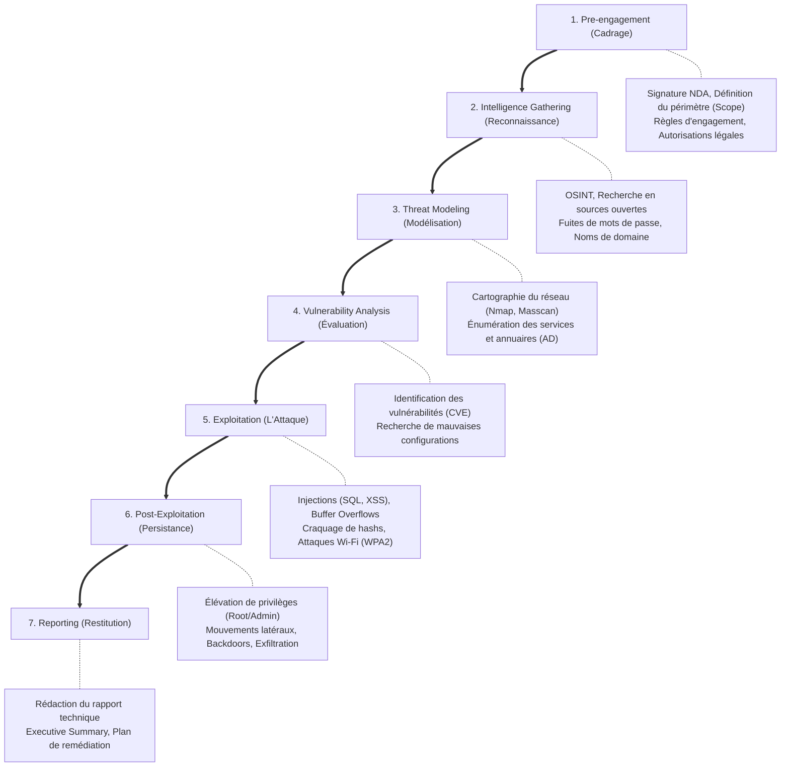

# Kali Linux portable attaquant

<div
  class="omny-meta"
  data-level="🔴 Avancé"
  data-version="Modèle 2026"
  data-time="3 heures">
</div>

!!! note "**Livrables :** _Un environnement Kali Linux fonctionnel, mis à jour, et doté de tous les outils offensifs configurés_"
!!! note "**Auto-explication :** _10 minutes_"

<br>

---

<br>

!!! quote "L'analogie de l'épéiste s'entraînant face à un mannequin"

    Un épéiste ne s'entraîne pas en face d'un autre épéiste tout de suite. Il commence avec un mannequin, qui ne riposte pas, ne triche pas, ne change pas de stratégie. Le mannequin permet de répéter mille fois le même geste pour le perfectionner. Votre laboratoire ARTECH est ce mannequin. Kali Linux est votre épée. Ce chapitre vous donne l'arme et vous explique comment la manier dans le respect strict de la loi (votre propre lab).

## Pourquoi Kali ?

> Les avantages de Kali Linux pour le pentest :

| Critère | Réponse |
|---|---|
| **Préinstallé** | 600+ outils offensifs intégrés |
| **Mises à jour** | Hebdomadaires (Rolling release) |
| **Documentation** | Très complète |
| **Communauté** | Énorme |
| **Support hardware** | Drivers Wi-Fi monitor inclus nativement |

_**Version cible** : `Kali Linux 2026.X` (rolling release)._

<br>

---

<br>

## Téléchargement de l'image ISO

> Il est impératif de vérifier l'intégrité du fichier téléchargé.

```bash title="Commandes Linux - Téléchargement et vérification"
wget https://kali.download/base-images/current/kali-linux-2026.X-installer-amd64.iso

# Vérification cryptographique SHA-256
wget https://kali.download/base-images/current/SHA256SUMS
sha256sum -c SHA256SUMS --ignore-missing
```

## Installation sur portable dédié ou USB live persistant

> Vous avez le choix entre deux options :

### Option A - Installation complète sur portable

Procédure standard d'installation Linux. Lors du setup, choisissez :

- Partitionnement guidé chiffré LVM
- Bureau XFCE (léger) ou GNOME
- Installer les outils par défaut

### Option B - USB live persistant (économique)

#### Création d'une clé USB Live Persistante

```bash title="Commandes Linux - Préparation de la clé USB"
# Créer USB persistant 64 Go
sudo dd if=kali-linux-2026.X-live-amd64.iso of=/dev/sdX bs=4M status=progress

# Ajouter partition persistance
sudo parted /dev/sdX mkpart primary ext4 4096MiB 100%
sudo mkfs.ext4 -L persistence /dev/sdX3
sudo mount /dev/sdX3 /mnt

# Configuration du montage persistant
echo "/ union" | sudo tee /mnt/persistence.conf
sudo umount /mnt
```
_Au boot, il faudra choisir "Live USB Persistence" dans le menu GRUB._

<br>

---

<br>

## Configuration post-installation

Une fois l'installation terminée, il faut mettre à jour l'arsenal et installer des listes de mots de passe.

### Mise à jour et préparation

```bash title="Commandes Linux - Mise à jour globale"
# Mise à jour
sudo apt update && sudo apt full-upgrade -y

# Outils complémentaires
sudo apt install -y \
    bettercap \
    seclists \
    rockyou \
    crackmapexec \
    impacket-scripts \
    responder \
    bloodhound

# Test wordlists
ls -la /usr/share/wordlists/
sudo gunzip /usr/share/wordlists/rockyou.txt.gz
```

### Description des outils installés

> Une brève description de chaque outil installé.

| Outil | Description |
|---|---|
| `bettercap` | Outil multifonction pour les attaques Man-in-the-Middle |
| `seclists` | Dictionnaire de mots de passe et d'informations |
| `rockyou` | Dictionnaire de mots de passe |
| `crackmapexec` | Outil de pentesting de réseaux Windows |
| `impacket-scripts` | Scripts Python pour les attaques sur les réseaux Windows |
| `responder` | Outil de récupération de mots de passe |
| `bloodhound` | Outil de cartographie des réseaux Windows |

<br>

---

<br>

## Outils essentiels par catégorie

Voici la cartographie exhaustive des outils par phase d'attaque.

!!! warning "Attention, il existe une multitude d'outils. Ceux listés ci-dessous sont les plus couramment utilisés et les plus efficaces pour la plupart des scénarios."

### Reconnaissance

> Outils d'énumération et d'OSINT :

| Outil | Usage |
|---|---|
| `nmap` | Scan réseau |
| `masscan` | Scan rapide gros réseaux |
| `recon-ng` | OSINT framework |
| `theHarvester` | Mails et noms |
| `spiderfoot` | OSINT massif |

### Wi-Fi

> Outils d'attaque sans-fil :

| Outil | Usage |
|---|---|
| `aircrack-ng` | Suite Wi-Fi |
| `wifite` | Automation Wi-Fi |
| `hashcat` | Cassage WPA2 GPU |
| `reaver` | WPS exploit |
| `kismet` | Détection passive |

### Web

> Outils d'exploitation applicative :

| Outil | Usage |
|---|---|
| `Burp Suite Community` | Proxy web |
| `OWASP ZAP` | Scanner web |
| `sqlmap` | SQL injection auto |
| `nikto` | Scanner web vulns |
| `wpscan` | WordPress |

### Réseau / pivoting

> Outils de mouvements latéraux :

| Outil | Usage |
|---|---|
| `Metasploit` | Framework exploit |
| `crackmapexec` | Pentest AD |
| `impacket` | Scripts Python AD |
| `responder` | LLMNR/NBT-NS poisoning |
| `bloodhound` | Cartographie AD |

### Mots de passe

> Outils de cassage (Cracking) :

| Outil | Usage |
|---|---|
| `hashcat` | GPU cracking |
| `john` | CPU cracking |
| `hydra` | Brute-force services |
| `medusa` | Alternative à hydra |

<br>

---

<br>

## Configuration réseau

> Il faut configurer le réseau pour que Kali puisse se connecter au réseau d'ARTECH Medical.

### Paramétrage des interfaces

```bash title="Commandes Linux - Gestion des connexions"
# Vérifier interfaces
ip a

# Connexion Wi-Fi en client (vers ARTECH-WIFI)
nmcli dev wifi connect ARTECH-WIFI password 'ArtechMedical2020!'

# Ou interface en mode monitor (pour capture/attaque)
sudo airmon-ng start wlan0
```

<br>

---

<br>

## Méthodologie offensive éthique

### Règle absolue

!!! danger "KALI LINUX - RÈGLE NUMÉRO UN"
    
    **JE N'UTILISE KALI QUE** :

    - Sur mon propre laboratoire
    - Avec autorisation écrite explicite
    - Dans le cadre d'un mandat de pentest
    
    **TOUTE AUTRE UTILISATION = INFRACTION PÉNALE**
    (Articles 323-1 à 323-7 du Code pénal français : Jusqu'à 7 ans de prison et 300 000 € d'amende)

### Méthodologie OSSTMM/PTES

Les phases standards d'un audit offensif :



_La méthodologie **OSSTMM** (Open Source Security Testing Manual) et **PTES** (Penetration Testing Execution Standard) sont des cadres de référence stricts pour les pentests professionnels. L'ordre des étapes est immuable._

<br>

### Documentation rigoureuse

> Toute opération sur Kali doit être tracée, c'est indispensable pour le rapport.

#### Traçabilité des commandes

```bash title="Commandes Linux - Enregistrement de session"
# Démarrer un script qui enregistre tout
script -t ~/labs/$(date +%Y%m%d_%H%M%S)_session.log

# ... vos commandes ...

exit
```

<br>

---

<br>

## Outils additionnels OmnyLearn

> Il faut installer des outils supplémentaires pour les exercices spécifiques OmnyLearn. Ou pour dupliquer l'environnement sur une autre machine.

### Installation de l'arsenal complémentaire

```bash title="Commandes Linux - Dépendances du cursus"
# Pour les exercices spécifiques OmnyLearn
sudo apt install -y \
    macchanger \
    proxychains \
    tor \
    onionscan
    
# Outils spécifiques cycle 1 ARTECH
sudo apt install -y \
    aircrack-ng \
    hashcat \
    hashcat-utils
```

<br>

### Description des outils installés

!!! quote "Voici la description des outils fraichement installés.

| Outil | Description | Utilité |
|---|---|---|
| `macchanger` | Change l'adresse MAC | Simulation d'identité |
| `proxychains` | Proxy versatile | Contournement réseau |
| `tor` | Réseau anonyme | Anonymisation des requêtes |
| `onionscan` | Scanner Tor | Détection de services cachés |
| `aircrack-ng` | Suite Wi-Fi | Attaques WPA/WPA2 |
| `hashcat` | Cassage GPU | Brute-force puissant |
| `hashcat-utils` | Outils Hashcat | Utilitaires Hashcat |

<br>

---

<br>

## Préparation Wi-Fi attack

!!! note "La préparation d'une attaque Wi-Fi est une étape cruciale pour s'assurer que tout est en place avant de commencer l'attaque. Il faut s'assurer que la carte Wi-Fi supporte le mode monitor. Pour cela, il faut utiliser la commande `airmon-ng` et vérifier que la carte est compatible. Si ce n'est pas le cas, il faut utiliser une carte externe compatible."

### Vérifier carte Wi-Fi avec mode monitor

> Il faut s'assurer que la carte Wi-Fi supporte le mode monitor. Pour cela, il faut utiliser la commande `airmon-ng` et vérifier que la carte est compatible. Si ce n'est pas le cas, il faut utiliser une carte externe compatible.

#### Activation de la surveillance radio

```bash title="Commandes Linux - Interface Monitor"
# Liste cartes
iwconfig

# Si carte interne ne supporte pas monitor → utiliser Alfa USB
# Branchement Alfa AWUS036ACS, vérifier
sudo airmon-ng

# Activer mode monitor sur Alfa
sudo airmon-ng start wlan1    # (ou wlanX selon nom)
```

### Préparation des dictionnaires

!!! note "La préparation des dictionnaires est une étape cruciale pour s'assurer que tout est en place avant de commencer l'attaque. Il faut s'assurer que la carte Wi-Fi supporte le mode monitor. Pour cela, il faut utiliser la commande `airmon-ng` et vérifier que la carte est compatible. Si ce n'est pas le cas, il faut utiliser une carte externe compatible."

#### Génération de listes mutées

!!! tip "L'objectif est de créer des dictionnaires spécifiques pour les mots de passe d'ARTECH"

```bash title="Commandes Linux - Utilisation de Crunch"
# rockyou.txt déjà décompressé
ls -la /usr/share/wordlists/rockyou.txt

# Génération wordlist ciblée ARTECH
crunch 8 17 -t 'ArtechMedical@@@@!' >> artech_dict.txt
crunch 8 17 -t 'Artech@@@@@@@@@!'  >> artech_dict.txt
```

<br>

---

<br>

## Sauvegarde de l'environnement

> Une fois Kali configuré, il est impératif de sauvegarder l'environnement pour pouvoir restaurer la configuration en cas de problème. Ou pour dupliquer l'environnement sur une autre machine.

### Archivage des configurations

```bash title="Commandes Linux - Sauvegarde des outils"
# Sauvegarde config /etc
sudo tar czf ~/kali-config-$(date +%Y%m%d).tar.gz /etc/

# Sauvegarde tools custom
tar czf ~/kali-tools-$(date +%Y%m%d).tar.gz ~/tools/

# Documentation labs
mkdir -p ~/labs
echo "Kali config OmnyLearn" > ~/labs/README.md
```

<br>

---

## Conclusion

!!! quote "Ce qu'il faut retenir"
    Kali Linux est votre arme de prédilection en tant qu'attaquant, mais elle doit être maniée avec une discipline stricte. La technique et l'abondance d'outils (Nmap, Hashcat, Metasploit) ne valent rien sans une méthodologie rigoureuse et une éthique irréprochable. Protégez-vous légalement, documentez minutieusement toutes vos actions, et entraînez-vous inlassablement sur votre propre laboratoire.

> [Chapitre suivant : 3.12 CAINE 13 portable analyste →](12-caine-analyste.md)
>
> [Retour à l'index →](./index.md)

<br>
