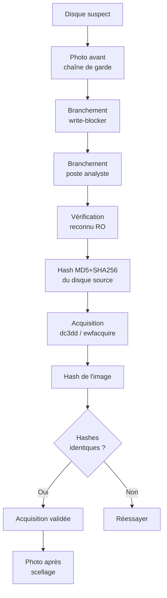

# 3.14 Write-blocker matériel

!!! quote "L'analogie du gant stérile"

    Un médecin légiste ne touche jamais une scène de crime sans gants stériles. Pas pour se protéger lui-même, mais pour ne pas y déposer ses propres traces. Le write-blocker matériel joue ce rôle pour les disques. Il garantit physiquement qu'aucune écriture ne peut atteindre le disque suspect, même par accident, même par défaut OS, même par une commande mal tapée. Sans write-blocker, un analyste forensic peut détruire involontairement des preuves en quelques secondes.

## Métadonnées

| Champ | Valeur |
|---|---|
| Durée | 1 heure |
| Niveau | Pratique |

## 1. Pourquoi un write-blocker

### 1.1 Le problème

Quand un disque est branché à un OS :
- L'OS peut monter le disque automatiquement
- Le simple fait de monter peut modifier des journaux
- Les antivirus peuvent scanner et altérer
- Les services peuvent indexer (Windows Search, Spotlight macOS)
- Une commande mal tapée peut écrire

Toute écriture **invalide juridiquement** la preuve.

### 1.2 La solution

Un write-blocker matériel coupe **physiquement** la possibilité d'écriture. Le disque apparaît à l'OS comme un périphérique en lecture seule absolue.

## 2. Types de write-blockers

| Type | Prix | Usage |
|---|---|---|
| USB write-blocker | 80-150 € | Standard OmnyAcademy |
| FireWire/Thunderbolt | 200-400 € | Acquisitions rapides |
| SATA / IDE | 100-200 € | Disques internes |
| Multi-format | 500-1500 € | Stations forensic pro |

## 3. Modèles recommandés

### 3.1 Tableau Forensic

| Modèle | Type | Prix | Note |
|---|---|---|---|
| Tableau T8u | USB 3.0 | ~150 € | Standard pro |
| Tableau T356789iu | Multi-format | ~700 € | Tout-en-un |

### 3.2 WiebeTech (CRU)

| Modèle | Type | Prix | Note |
|---|---|---|---|
| USB WriteBlocker | USB 3.0 | ~120 € | Compact |
| Forensic UltraDock v6 | Multi | ~700 € | Pro |

### 3.3 Solutions économiques

| Modèle | Type | Prix | Note |
|---|---|---|---|
| Boîtier USB générique avec interrupteur RO | Bricolage | 20-30 € | Pas certifié forensic |

**Pour OmnyAcademy** : Tableau T8u ou WiebeTech USB suffisent largement.

## 4. Méthodologie d'acquisition

### 4.1 Workflow standard



### 4.2 Hash systématique

Le hash **avant** et **après** acquisition doit être identique. C'est la **preuve mathématique** que rien n'a changé.

```bash
# Hash du disque source (avec write-blocker actif)
sudo sha256sum /dev/sdX > source.sha256

# Acquisition avec dc3dd (hash intégré)
sudo dc3dd if=/dev/sdX of=/media/storage/image.dd \
    hash=sha256 \
    log=/media/storage/acquisition.log

# Vérification image
sha256sum /media/storage/image.dd
```

### 4.3 Format E01 (recommandé)

```bash
# Avec ewfacquire (compression + métadonnées)
sudo ewfacquire /dev/sdX

# Renseigner :
# Case number : ARTECH-2026-XXX
# Description : Acquisition disque WIN-COMPTA-01
# Examiner : Zyrass (OmnyVia)
# Notes : ...
# Format : encase6
# Compression : best
# Sectors : 512
# Hash : SHA-256 (et MD5 pour compat)
```

## 5. Vérification du write-blocker

### 5.1 Test critique avant utilisation

```bash
# Brancher avec write-blocker
# Vérifier reconnu en RO
sudo blockdev --getro /dev/sdX
# Doit retourner : 1

# Tentative d'écriture (doit échouer)
echo "test" | sudo tee /dev/sdX
# Erreur : Read-only file system
```

### 5.2 Test sur fichier

```bash
# Si monté sur point de montage RO
sudo touch /mnt/forensic/test.txt
# Erreur : Read-only file system
```

## 6. Procédure documentée

```text
PROCÉDURE ACQUISITION FORENSIC OMNYVIA
========================================

PRÉ-ACQUISITION
1. Photographier le disque (numéro série, état)
2. Documenter contexte (où, quand, comment trouvé)
3. Préparer write-blocker et le tester
4. Préparer disque destination (formaté, vide)

ACQUISITION
1. Brancher write-blocker au PC analyste
2. Brancher disque suspect au write-blocker
3. Vérifier blockdev --getro = 1
4. Calculer hash source : sha256sum /dev/sdX
5. Lancer ewfacquire ou dc3dd
6. Surveiller progression (peut prendre des heures)
7. Calculer hash image
8. Comparer hashes : doivent être identiques

POST-ACQUISITION
1. Débrancher disque suspect
2. Photographier après acquisition
3. Sceller le disque suspect (sac, étiquette, date, signature)
4. Vérifier image : ewfverify image.E01
5. Stocker image dans coffre-fort numérique (chiffré)
6. Documenter dans le rapport

CHAÎNE DE GARDE
- Chaque manipulation tracée
- Chaque transmission consignée
- Hash conservé pour vérification ultérieure
```

## 7. Alternative logicielle (si pas de write-blocker matériel)

```bash
# Linux : monter en lecture seule strict
sudo mount -o ro,noload,noexec /dev/sdX /mnt/forensic

# Ou via udev pour empêcher montage auto
# /etc/udev/rules.d/99-forensic.rules
ACTION=="add", KERNEL=="sd[a-z]*", ENV{ID_FS_USAGE}=="filesystem", \
  ATTR{ro}="1"
```

**Limitation** : pas une garantie aussi forte qu'un write-blocker matériel. À utiliser uniquement en apprentissage.

---

**Chapitre suivant** : [3.15 Kit acquisition USB scellé](03-15-kit-acquisition.md)
