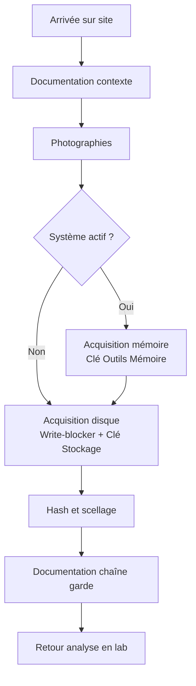

# 3.15 Kit acquisition USB scellé

## Métadonnées

| Champ | Valeur |
|---|---|
| Durée | 1 heure |
| Niveau | Pratique |

## 1. Pourquoi un kit USB scellé

Un investigateur forensic en intervention sur site doit pouvoir :

1. Disposer d'**outils non altérés** (les clés USB sont scellées)
2. Travailler **rapidement** (pas de téléchargement sur place)
3. **Tracer** chaque utilisation (chaîne de garde)
4. Avoir des **outils différents** selon les besoins (live triage, full acquisition, mémoire)

## 2. Composition recommandée

### 2.1 Quatre clés minimum

| Clé | Couleur étiquette | Contenu |
|---|---|---|
| Clé Live OS | Verte | CAINE 13 ou Tsurugi Linux Live |
| Clé Outils Windows | Bleue | KAPE, FTK Imager Lite, Autopsy portable |
| Clé Outils Mémoire | Rouge | AVML (Linux), DumpIt, WinPmem, magnet RAM |
| Clé Stockage | Noire | Vide pour acquisitions, formatée NTFS et exFAT |

### 2.2 Spécifications

| Spec | Valeur |
|---|---|
| Capacité | 64-128 Go par clé |
| Type | USB 3.0+ (lecture rapide) |
| Marque | Sandisk Extreme Pro / Kingston DT |
| État | Neuf, jamais utilisé pour autre chose |

## 3. Préparation des clés

### 3.1 Clé Live OS

```bash
# CAINE 13
sudo dd if=caine13.iso of=/dev/sdX bs=4M status=progress

# Ou Tsurugi Linux DFIR
# Téléchargement : https://tsurugi-linux.org/
sudo dd if=tsurugi.iso of=/dev/sdX bs=4M status=progress
```

### 3.2 Clé Outils Windows

```text
Structure :
USB:\
├── 01-Acquisition\
│   ├── KAPE\               (KAPE de SANS)
│   ├── FTK_Imager_Lite\
│   ├── Belkasoft_RAM_Capture\
│   └── AccessData_Imager\
├── 02-Triage\
│   ├── KAPE_Targets\
│   └── KAPE_Modules\
├── 03-Analyse\
│   ├── Autopsy_4.X.X_portable\
│   └── Volatility3\
├── 04-Network\
│   ├── Wireshark_portable\
│   └── nmap\
├── 05-Doc\
│   ├── procedures.pdf
│   └── checklist_intervention.pdf
└── README.txt
```

### 3.3 Clé Outils Mémoire

```text
USB:\
├── Windows\
│   ├── DumpIt.exe
│   ├── WinPmem.exe
│   ├── Magnet_RAM_Capture.exe
│   └── FTK_Imager_Lite_RAM.exe
├── Linux\
│   ├── AVML
│   └── lime-master\
├── macOS\
│   └── osxpmem.app\
└── README.txt
```

### 3.4 Clé Stockage

Formatée :
- exFAT pour compatibilité multi-OS (mais limitée à 4 Go par fichier)
- ou NTFS si Windows-only

```bash
# Formater NTFS
sudo mkfs.ntfs -f /dev/sdX -L "FORENSIC_DATA"

# Formater exFAT
sudo mkfs.exfat /dev/sdX -n "FORENSIC_DATA"
```

## 4. Hash et scellage

### 4.1 Hash de chaque clé

```bash
# Calculer hash de la clé entière (lecture seule)
sudo dd if=/dev/sdX bs=4M | sha256sum > clé_outils_windows.sha256

# Mettre l'étiquette
echo "Hash SHA-256 : $(cat clé_outils_windows.sha256)" >> README_seal.txt
echo "Date scellage : $(date -u)" >> README_seal.txt
echo "Examiner : Zyrass (OmnyVia)" >> README_seal.txt
```

### 4.2 Scellage physique

| Méthode | Description |
|---|---|
| Pochette plastique scellée | Étiquetée avec hash et date |
| Sac antistatique | Pour transport |
| Boîte hermétique | Stockage long terme |
| Étiquette holographique | Détection ouverture |

### 4.3 Documentation chaîne de garde

```text
CHAÎNE DE GARDE - KIT FORENSIC OMNYVIA
========================================

KIT N° : OMNYVIA-KIT-001
DATE PRÉPARATION : 2026-XX-XX
PRÉPARÉ PAR : Zyrass
HASH GLOBAL : ...

CLÉS INCLUSES :
1. CAINE 13 Live - SHA256: ...
2. Outils Windows - SHA256: ...
3. Outils Mémoire - SHA256: ...
4. Stockage vide - SHA256: ...

JOURNAL D'UTILISATION :

Date    Examiner    Cas    Action    Vérification hash
------  ----------  -----  --------  -----------------
[à compléter à chaque usage]
```

## 5. Procédure d'intervention type



## 6. Mise à jour périodique

Les outils évoluent. Recommandation OmnyAcademy :

| Périodicité | Action |
|---|---|
| Tous les 6 mois | Mise à jour outils (KAPE, Volatility) |
| Tous les ans | Mise à jour OS Live (CAINE) |
| Après chaque cas | Vérification hash |
| Après chaque cas | Re-scellage si ouvert |

---

**Chapitre suivant** : [3.16 Documentation labo](03-16-documentation.md)
