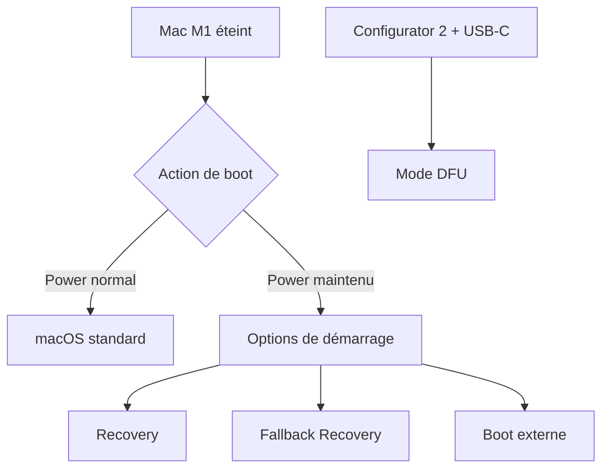
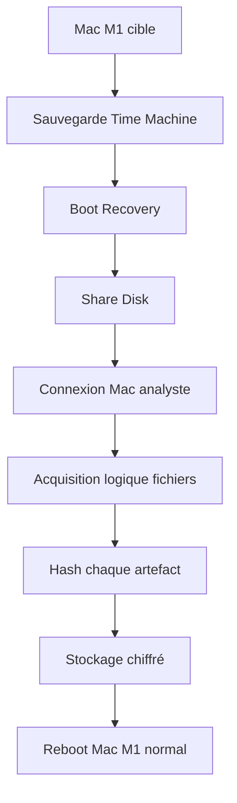

# 3.20 Mode Recovery et DFU Apple Silicon

!!! quote "L'analogie du coffre-fort à plusieurs combinaisons"

    Un coffre-fort de banque a plusieurs combinaisons d'accès. La combinaison principale pour les opérations courantes. Une combinaison de secours pour les cas exceptionnels. Une combinaison ultime gardée par les techniciens d'usine. Apple Silicon obéit au même principe. Le boot normal pour vous. Le mode Recovery pour la maintenance. Le mode Fallback Recovery pour quand Recovery est cassé. Le mode DFU pour les cas extrêmes. Chaque mode a ses possibilités forensic spécifiques.

## Métadonnées

| Champ | Valeur |
|---|---|
| Durée | 3 heures |
| Niveau | Pratique avancée |
| Prérequis | 2.4 bis, 3.18 |

## 1. Modes de boot Apple Silicon



## 2. Mode Recovery

### 2.1 Accès

| Étape | Action |
|---|---|
| 1 | Mac M1 entièrement éteint |
| 2 | Maintenir le bouton Power |
| 3 | Continuer à maintenir jusqu'à voir "Loading Startup Options" |
| 4 | Choisir "Options" |
| 5 | Cliquer "Continuer" |
| 6 | Authentification utilisateur admin |

### 2.2 Fonctions disponibles

| Fonction | Usage |
|---|---|
| Restauration depuis Time Machine | Reset système |
| Réinstallation macOS | Restoration OS |
| Disk Utility | Partitionnement, vérification |
| Terminal | Ligne de commande |
| Share Disk | Partage du Mac sur réseau (clé forensic) |
| Startup Security Utility | Politique de boot |

### 2.3 Share Disk - Méthode forensic clé

C'est la méthode **standard** pour acquérir un Mac M1.

```text
PROCÉDURE SHARE DISK
=====================

Sur Mac M1 cible :
1. Boot en Recovery (Power maintenu)
2. Utilities → Share Disk
3. Sélectionner le volume Macintosh HD - Data
4. Cliquer "Start Sharing"
5. Le Mac M1 se met en attente

Sur Mac analyste (autre Mac) :
1. Connecter les deux Mac (USB-C ou Wi-Fi)
2. Ouvrir Finder
3. Network ou Sidebar → Mac M1 cible apparaît
4. Connect As... → Authentification utilisateur
5. Le disque apparaît comme partage réseau

Acquisition :
1. Sur le Mac analyste, copier le contenu vers
   un disque externe en mode lecture seule
2. Hash systématique de chaque fichier acquis
3. Documentation chaîne de garde
```

### 2.4 Limites de Share Disk

| Limite | Précision |
|---|---|
| Vitesse | USB-C 3.1 ou Wi-Fi (pas Thunderbolt) |
| Authentification | Password admin requis |
| Volume Data uniquement | Volume System (SSV) inaccessible |
| FileVault déchiffré | Le partage déchiffre transparent |

## 3. Mode Fallback Recovery

### 3.1 Quand l'utiliser

Si le mode Recovery normal est endommagé (rare), Fallback Recovery prend le relais.

### 3.2 Accès

```text
FALLBACK RECOVERY
==================
1. Mac M1 éteint
2. Appuyer Power deux fois rapidement
3. Maintenir le second appui jusqu'à voir options
4. Continuer normalement
```

## 4. Mode DFU - Device Firmware Update

### 4.1 Concept

DFU est le mode le plus bas niveau. Il sert à :
- Réinstallation complète si recovery brisée
- Restauration firmware
- Acquisition forensic spécifique avec outils pro (Cellebrite, Magnet)

### 4.2 Activation DFU sur Mac M1

```text
PROCÉDURE DFU
==============
1. Mac M1 cible : éteint
2. Connecter par USB-C à un autre Mac (poste analyste)
3. Sur poste analyste : ouvrir Apple Configurator 2
   (téléchargeable App Store, gratuit)
4. Sur Mac cible : appuyer simultanément
   - Bouton droit du Shift
   - Bouton gauche du Option (alt)
   - Bouton gauche du Control
   - Bouton Power
5. Maintenir 10 secondes
6. Relâcher TOUT SAUF Power
7. Continuer Power 10 secondes
8. Le Mac apparaît dans Configurator 2 en mode DFU
```

### 4.3 Précaution critique

```text
ATTENTION DFU
==============
Toute action en DFU peut RÉINITIALISER le Mac
intégralement. Données effacées définitivement
si manipulation incorrecte.

Tester sur un Mac NON CRITIQUE avant le vôtre.

Pour le forensic OmnyAcademy, le mode DFU est
informatif. Les acquisitions réelles se font
plutôt via Share Disk (mode Recovery).
```

## 5. Apple Configurator 2

### 5.1 Installation

```text
1. App Store → "Apple Configurator 2"
2. Installation gratuite
3. Lancer
```

### 5.2 Fonctions

| Fonction | Usage |
|---|---|
| Restauration ipsw | Réinstallation firmware |
| Reviver | Réparation si Mac inaccessible |
| Update firmware | Mise à jour de bas niveau |
| Backup | Sauvegarde |

### 5.3 Restauration depuis fichier ipsw

```text
1. Télécharger ipsw correspondant à votre Mac M1
   Site officiel Apple uniquement
2. Apple Configurator 2 → Mac détecté en DFU
3. Action → Advanced → "Revive Device"
   (préserve les données)
   ou
   Action → Advanced → "Restore Device"
   (efface tout, neuf)
```

## 6. Politique de boot Security

### 6.1 Niveaux de sécurité

| Niveau | Description |
|---|---|
| Full Security | Standard, vérification stricte au boot |
| Reduced Security | Permet kernel extensions externes |
| Permissive Security | Désactive certaines vérifications (déconseillé) |

### 6.2 Configuration

```text
1. Boot en Recovery
2. Utilities → Startup Security Utility
3. Choix du niveau
4. Authentification
5. Reboot
```

### 6.3 Implications forensic

| Niveau | Forensic |
|---|---|
| Full Security | Boot externe impossible |
| Reduced Security | Boot externe possible avec autorisation |
| Permissive | Boot quasi-libre (rare) |

## 7. Cas pratique - Acquisition complète Mac M1

### 7.1 Workflow recommandé OmnyAcademy



### 7.2 Script d'acquisition côté analyste

```bash
#!/bin/bash
# Sur Mac analyste, après connexion au Share Disk

CIBLE="/Volumes/Macintosh\ HD\ -\ Data"
DEST="$HOME/Forensic/MacM1_$(date +%Y%m%d)"
mkdir -p "$DEST"

# Documents utilisateur
sudo rsync -av --progress "$CIBLE/Users/" "$DEST/Users/"

# Library système
sudo rsync -av "$CIBLE/Library/" "$DEST/Library/"

# /private/etc
sudo rsync -av "$CIBLE/private/etc/" "$DEST/private_etc/"

# /private/var/log
sudo rsync -av "$CIBLE/private/var/log/" "$DEST/var_log/"

# Hashs
cd "$DEST"
find . -type f -exec shasum -a 256 {} \; > MANIFEST.sha256

# Tamponnage
echo "Acquisition Mac M1 OmnyAcademy" > REPORT.txt
echo "Date : $(date -u)" >> REPORT.txt
echo "Examiner : Zyrass" >> REPORT.txt
echo "Hash MANIFEST : $(shasum -a 256 MANIFEST.sha256)" >> REPORT.txt
```

## 8. Auto-évaluation

| # | Question | Réponse |
|---|---|---|
| 1 | Comment booter en Recovery M1 ? | Power maintenu + Options |
| 2 | Outil clé pour acquisition Mac M1 ? | Share Disk (Recovery) |
| 3 | Mode le plus bas niveau ? | DFU |
| 4 | App pour DFU ? | Apple Configurator 2 |
| 5 | Volume accessible via Share Disk ? | Macintosh HD - Data |
| 6 | Volume inaccessible ? | Macintosh HD (SSV) |

## 9. Synthèse module 3

```text
MODULE 3 - CONFIGURATION LABORATOIRE FORENSIC
================================================

ACQUIS :
  Matériel reconditionné acheté et préparé
  Routeur OpenWrt configuré avec Wi-Fi WPA2 faible
  Serveur Debian opérationnel
  Postes Windows réalistes
  Active Directory mini (optionnel)
  Kali attaquant prêt
  CAINE analyste prêt
  Carte Wi-Fi Alfa AWUS036ACS opérationnelle
  Write-blocker matériel
  Kit USB scellé
  Documentation labo
  Script de validation
  MacBook M1 préparé en cible
  Outils forensic macOS installés
  Mode Recovery / DFU maîtrisés

LABO FONCTIONNEL ET DOCUMENTÉ
  Validation par script ./validate-lab.py
  Score attendu : 100% pour démarrer cycle 1
  
PRÊT POUR CYCLE 1
  Premier cas pratique forensic ARTECH
```

---

**Module 3 - Configuration laboratoire : VALIDÉ**

**Cycle 0 - Fondations : COMPLET**

**Module précédent** : [3.19 Outils forensic macOS](03-19-outils-forensic-macos.md)

**Cycle suivant** : [Cycle 1 - Premier cas pratique complet](../../02-cycle-1-premier-cas/) (à produire ultérieurement)
