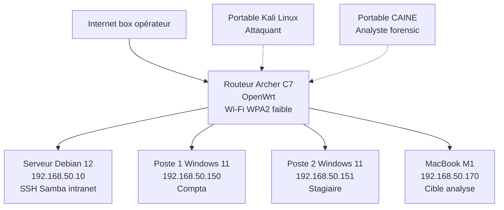

# Module 3 - Configuration du laboratoire forensic physique

!!! quote "L'analogie du gymnase de l'athlète"

    Un boxeur qui ne s'entraînerait que dans sa tête ou en lisant des manuels n'arriverait jamais sur le ring. Il a besoin d'un gymnase, d'un sac, d'un sparring-partner, d'un coach. L'analyste forensic obéit à la même règle. Il a besoin d'un laboratoire. Pas une VM dans Cloud, pas un docker éphémère, mais du matériel physique réel : un routeur Wi-Fi, des postes, un serveur, des disques. C'est sur ce gymnase que vous reproduirez les attaques, pratiquerez les acquisitions, manipulerez les write-blockers. Ce module construit votre gymnase.

## Présentation du module

Ce module est **résolument pratique**. Il vous accompagne dans :

1. **L'inventaire et l'achat** du matériel nécessaire (budget cible : 800-1 200 €)
2. **La topologie réseau** réaliste reproduisant une PME
3. **La configuration de chaque équipement** étape par étape
4. **La validation bout-en-bout** que tout fonctionne avant le cycle 1

### Pourquoi physique et pas virtuel

| Aspect | VM/Cloud | Physique |
|---|---|---|
| Wi-Fi WPA2 réel | Impossible | Indispensable |
| Capture trafic radio | Impossible | Réaliste |
| Acquisition mémoire à froid | Limité | Pratique réelle |
| Write-blocker matériel | Inexistant | Critique en forensic |
| Acquisition disque réel | Limité | Pratique standard |
| Apple Silicon authentique | Inexistant | MacBook M1 réel |

### Cibles du laboratoire



## Objectifs pédagogiques

À l'issue de ce module, vous serez capable de :

- Choisir et acheter du matériel reconditionné adapté
- Configurer un routeur OpenWrt avec Wi-Fi WPA2 délibérément faible
- Installer et durcir un serveur Debian 12
- Préparer des postes Windows 11 réalistes
- Configurer Active Directory en mini-mode (optionnel)
- Préparer Kali Linux portable comme attaquant
- Préparer CAINE 13 portable comme analyste forensic
- Utiliser une carte Wi-Fi externe (Alfa AWUS036ACS)
- Manipuler un write-blocker matériel
- Préparer un MacBook M1 comme cible forensic
- Documenter intégralement votre laboratoire

## Architecture pédagogique

| Caractéristique | Précision |
|---|---|
| Durée totale | 49 heures |
| Budget matériel | 800 à 1 200 € |
| Espace requis | Bureau de 2-3 m² minimum |
| Réseau | Internet stable et box configurable |
| Difficulté | Intermédiaire (pas débutant pur) |

## Plan détaillé du module

| # | Chapitre | Durée | Type |
|---|---|---|---|
| 3.1 | Liste matériel et budget | 2 h | Théorique |
| 3.2 | Achats reconditionnés - sources et précautions | 2 h | Pratique |
| 3.3 | Topologie réseau et plan d'adressage | 2 h | Théorique |
| 3.4 | Configuration OpenWrt sur TP-Link Archer C7 | 4 h | Pratique |
| 3.5 | Wi-Fi WPA2-PSK volontairement faible | 1 h | Pratique |
| 3.6 | Installation Debian 12 serveur | 2 h | Pratique |
| 3.7 | Configuration serveur (SSH, Samba, intranet) | 3 h | Pratique |
| 3.8 | Installation Windows 11 Pro - Poste 1 (Compta) | 2 h | Pratique |
| 3.9 | Installation Windows 11 Pro - Poste 2 (Stagiaire) | 2 h | Pratique |
| 3.10 | Active Directory mini (optionnel) | 4 h | Pratique avancé |
| 3.11 | Kali Linux portable attaquant | 3 h | Pratique |
| 3.12 | CAINE 13 portable analyste | 3 h | Pratique |
| 3.13 | Carte Wi-Fi Alfa AWUS036ACS | 2 h | Pratique |
| 3.14 | Write-blocker matériel | 1 h | Pratique |
| 3.15 | Kit acquisition USB scellé | 1 h | Pratique |
| 3.16 | Documentation labo | 2 h | Documentation |
| 3.17 | Script de validation bout-en-bout | 2 h | Pratique |
| 3.18 | Préparation MacBook M1 forensic | 4 h | Pratique |
| 3.19 | Outils forensic macOS (mac_apt, AutoMacTC) | 4 h | Pratique |
| 3.20 | Mode Recovery et DFU Apple Silicon | 3 h | Pratique |

**Total : 49 heures** sur 4-5 semaines.

## Prérequis matériels

### Indispensables

| Matériel | Estimation prix | Note |
|---|---|---|
| Routeur TP-Link Archer C7 V5 | 30-50 € reconditionné | Compatible OpenWrt |
| 2 postes Windows 11 (mini PC ou portables d'occasion) | 200-300 € chacun | i5 8e gen mini |
| Serveur Linux (mini PC ou Raspberry Pi 4) | 80-150 € | 8 Go RAM mini |
| Switch 8 ports gigabit | 20-30 € | Non managé suffit |
| Câbles RJ45 cat.6 | 15-20 € | Plusieurs longueurs |
| Carte Wi-Fi Alfa AWUS036ACS | 50-70 € | Mode monitor |
| Write-blocker USB | 80-120 € | Tableau ou WiebeTech |
| 2 disques SSD externes 256 Go | 60-80 € | Pour acquisitions |
| Clés USB 32-64 Go (x4) | 30-40 € | Outils, scellés |

### Déjà en votre possession

| Matériel | Usage |
|---|---|
| PC Windows 11 48 Go | Poste analyste principal |
| MacBook M1 8 Go | Cible analyse macOS |

### Optionnel

| Matériel | Usage |
|---|---|
| 2e portable d'occasion | Kali Linux dédié |
| 3e portable d'occasion | CAINE dédié |
| Hub USB alimenté | Connexions multiples |
| Lecteur disques externes | Acquisitions disques bruts |
| Faraday bag | Isolation cellulaire (optionnel) |

## Scénario fil rouge - ARTECH

Le laboratoire reproduit l'environnement de **ARTECH**, PME fictive de 42 salariés en distribution de matériel médical. Tous les exercices du cycle 1 et au-delà se baseront sur cette PME, ses équipements, ses utilisateurs.

```text
PROFIL ARTECH SAS
==================
Activité    : Distribution de matériel médical
Salariés    : 42
CA          : 12 M€
Localisation: Lyon
SI          : 3 PC + 1 serveur + Wi-Fi
Sécurité    : minimale (cible vulnérable réaliste)
```

## Méthodologie

| Étape | Action |
|---|---|
| 1 | Lire la totalité du module avant achats |
| 2 | Compléter la liste de matériel selon votre budget |
| 3 | Acheter en commandant les pièces les plus longues d'abord |
| 4 | Suivre les chapitres dans l'ordre |
| 5 | Documenter chaque étape dans votre wiki labo |
| 6 | Valider avec le script bout-en-bout |
| 7 | Faire les sauvegardes des configs avant cycle 1 |

## Sécurité du laboratoire

Votre laboratoire **doit être isolé** d'Internet pour les phases d'attaque. Recommandations :

- Réseau séparé de votre Wi-Fi domestique
- VLAN ou routeur dédié
- Box principale en upstream uniquement (pour mises à jour)
- Désactiver l'IPv6 si non maîtrisé
- Pas de configuration partagée avec votre vie professionnelle

## Documentation continue

Tout au long du module, tenez une **documentation lab** dans un fichier `lab-omnyvia.md` :

```text
LABORATOIRE FORENSIC OMNYVIA
==============================

ÉQUIPEMENTS
- TP-Link Archer C7 V5 - MAC XX:XX:XX:XX:XX:XX
- ...

PLAN D'ADRESSAGE
- 192.168.50.0/24
- 192.168.50.1     routeur
- 192.168.50.10    serveur
- ...

CREDENTIALS LAB
(stockés dans coffre-fort, hors fichier markdown)

JOURNAL D'INSTALLATION
- 2026-XX-XX : OpenWrt installé, configuration sauvée
- ...
```

---

**Démarrage** : commencer par le chapitre 3.1 (Liste matériel et budget).

**Module précédent** : [Module 2 - Prérequis techniques](../module-2-prerequis-techniques/README.md)

**Cycle suivant** : [Cycle 1 - Premier cas pratique](../../02-cycle-1-premier-cas/) (à produire ultérieurement)
