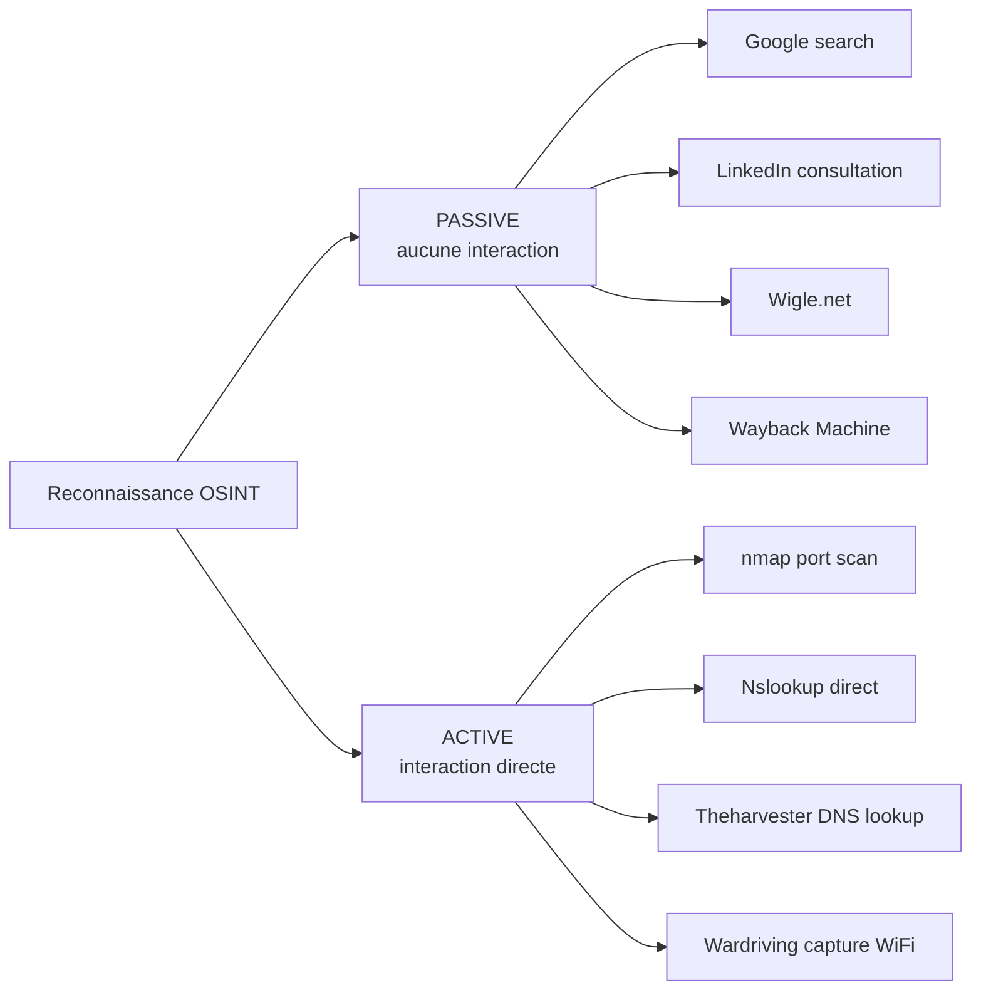

# 4.1 Méthodologie OSINT - framework et matrice

!!! quote "L'analogie de l'enquêteur sans méthode"

    Un enquêteur de police qui arrive sur une scène et fouille au hasard ne trouvera rien. Il piétinera des indices, oubliera des angles, contaminera des preuves. C'est pour cela que tous les services d'enquête utilisent des grilles structurées : qui, quoi, quand, où, pourquoi, comment. L'OSINT obéit à la même règle. Sans méthodologie, vous passerez à côté de 80 % des informations exploitables. Avec une méthodologie, vous remontez systématiquement chaque fil, vous croisez chaque source, et vous produisez un dossier exhaustif. Ce chapitre vous donne la grille.

## Métadonnées du chapitre

Ce chapitre ouvre le module 4 par la pose des bases méthodologiques. Voici ses caractéristiques principales.

| Champ | Valeur |
|---|---|
| Durée estimée | 2 heures |
| Niveau | Standard |
| Prérequis | Module 1 cycle 0 (juridique) |
| Livrables | Matrice OSINT personnelle, plan de reconnaissance ARTECH |
| Auto-explication | 8 minutes |

## Objectifs pédagogiques

À l'issue de ce chapitre, vous serez capable de :

- Construire un plan structuré de reconnaissance OSINT
- Utiliser le framework de référence (OSINT Framework)
- Articuler votre démarche avec MITRE ATT&CK TA0043
- Documenter votre collecte selon les exigences forensic
- Distinguer reconnaissance passive et active

---

## 1. Vocabulaire fondateur

Avant tout travail méthodologique, il convient de poser des définitions précises pour éviter les confusions courantes entre les différentes formes de renseignement.

### 1.1 Définitions clés

Voici les termes à maîtriser pour ce module et l'ensemble du cycle 1.

| Terme | Définition |
|---|---|
| OSINT | Open Source Intelligence - renseignement issu de sources publiques |
| Reconnaissance passive | Collecte sans interaction avec la cible (indétectable) |
| Reconnaissance active | Collecte avec interaction (scan, requête directe - détectable) |
| Footprinting | Cartographie de l'empreinte numérique d'une cible |
| Pivot | Élément faisant passer d'une source à une autre |
| Corroboration | Confirmation par une seconde source indépendante |
| Empreinte numérique | Ensemble des traces publiques d'une organisation/personne |

### 1.2 Différence passive / active

Cette distinction est critique car elle détermine la **détectabilité** de votre opération.



L'attaquant méthodique privilégie la phase passive aussi longtemps que possible.

### 1.3 Articulation MITRE ATT&CK

L'OSINT correspond précisément à la première tactique du référentiel MITRE ATT&CK, vu en module 2.11. Voici les techniques qui s'inscrivent dans ce module.

| ID MITRE | Nom | Application module 4 |
|---|---|---|
| TA0043 | Reconnaissance | Toute la phase OSINT |
| T1589 | Gather Victim Identity Information | Profilage employés |
| T1589.001 | Credentials | Email format, fuites |
| T1589.002 | Email Addresses | theHarvester, Hunter.io |
| T1589.003 | Employee Names | LinkedIn, organigrammes |
| T1590 | Gather Victim Network Information | Wigle, DNS |
| T1591 | Gather Victim Org Information | LinkedIn, site web |
| T1593 | Search Open Websites/Domains | Google dorks |
| T1596 | Search Open Technical Databases | Shodan (cycle 2) |

## 2. Le framework OSINT de référence

Plusieurs frameworks structurés existent dans le monde anglo-saxon et francophone. Voici les plus utilisés.

### 2.1 OSINT Framework de Michael Bazzell

Michael Bazzell est l'auteur de référence en OSINT. Son framework, accessible publiquement sur **osintframework.com**, classe les sources par catégorie.

Le framework propose les catégories suivantes pour structurer vos recherches.

| Catégorie | Type d'investigation |
|---|---|
| Username | Recherche de pseudo sur multiples plateformes |
| Email Address | Énumération, vérification, fuites |
| Domain Name | DNS, WHOIS, sous-domaines |
| IP Address | Géolocalisation, hostname |
| Images / Videos / Docs | Reverse search, métadonnées |
| Social Networks | Profilage par plateforme |
| Instant Messaging | Telegram, Signal, Discord |
| People Search Engines | Pipl, Spokeo, Whitepages |
| Dating | Profils dating publics |
| Telephone Numbers | Identité, opérateur, géolocalisation |
| Public Records | Cadastre, BODACC, INPI |
| Business Records | Société.com, Dun & Bradstreet |
| Transportation | Plaques, vols, navires |
| Geolocation Tools | Google Maps, OpenStreetMap |
| Search Engines | Au-delà de Google |
| Forums / Blogs / IRC | Sources communautaires |
| Archives | Wayback Machine, archives.org |
| Language Translation | DeepL, Google Translate |
| Metadata | EXIF, FOCA |
| Mobile Emulation | Tester apps sans device |
| Terrorism | Bases publiques anti-terrorisme |
| Dark Web | Tor, Onion (zone à risque légal) |
| Digital Currency | Blockchain explorers |
| Classifieds | Annonces classées |

### 2.2 OSINT Framework français (CIRCL)

Le **CIRCL** (Computer Incident Response Center Luxembourg) maintient également des ressources OSINT particulièrement adaptées au contexte européen.

### 2.3 Choix pour OmnyAcademy

Pour ce parcours, nous adoptons une **hybridation** des deux frameworks principaux.

| Source | Apport |
|---|---|
| Bazzell OSINT Framework | Structure par catégorie de cible |
| CIRCL | Sources européennes spécifiques |
| Maltego CE | Visualisation graphique |
| Méthode propre | Cadre légal français RGPD |

## 3. Méthodologie en 7 étapes appliquée à ARTECH

L'application pratique du framework suit toujours les mêmes étapes, ajustées au cas concret. Voici la méthodologie complète appliquée au scénario ARTECH du cycle 1.

### 3.1 Étape 1 - Cadrage

Avant toute action, vous devez documenter le périmètre et les autorisations.

Voici le format de cadrage type à utiliser pour chaque mission.

```text
CADRAGE OSINT - ARTECH 2026
==============================

PÉRIMÈTRE
  Cible : ARTECH SAS, distributeur médical Lyon
  Objectif : préparer un pentest WiFi + phishing
  Mandat : signé le 2026-XX-XX par Hélène Lefebvre, PDG
  Référence mandat : OmnyVia-PT-2026-001

LIMITES
  Pas de reconnaissance active sans validation
  Pas d'engagement employés (sock puppets exclus)
  Pas de collecte de mots de passe via fuites
  Conservation 6 mois post-livrable

ANALYSTE
  Zyrass / OmnyVia
  Outils : Kali Linux dédié labo

DURÉE
  Phase OSINT : 5 jours (du AAAA-MM-JJ au AAAA-MM-JJ)
```

### 3.2 Étape 2 - Reconnaissance passive

Cette phase consomme typiquement 50 % du temps OSINT. Elle repose entièrement sur des sources publiques sans interaction avec la cible.

Voici les sources à consulter dans cette phase.

| Source | Information cherchée |
|---|---|
| Google + opérateurs avancés | Site web, documents publics, mentions presse |
| Wayback Machine | Versions antérieures du site |
| Société.com / Pappers | Informations légales, dirigeants |
| BODACC | Annonces légales |
| LinkedIn | Organigramme, employés |
| Site web ARTECH | Trombinoscope, contacts, technologies |

### 3.3 Étape 3 - Énumération emails

À partir des informations de l'étape 2, vous construisez la liste des employés et leurs emails.

Cette étape utilise principalement deux outils complémentaires.

| Outil | Usage |
|---|---|
| theHarvester | Recherche multi-source automatisée |
| Hunter.io | Format d'email + emails publics |

### 3.4 Étape 4 - Profilage humain ciblé

Tous les employés ne sont pas des cibles équivalentes. Vous identifiez les **3-5 cibles privilégiées** pour le phishing.

Les critères de sélection des cibles privilégiées sont les suivants.

| Critère | Justification |
|---|---|
| Accès données sensibles | Compta, RH, Direction |
| Fragilité présumée | Stagiaire, nouveau venu |
| Surface OSINT importante | Beaucoup d'infos publiques |
| Activité réseaux sociaux élevée | Vecteur d'ingénierie sociale |
| Position publique externe | Communications, marketing |

### 3.5 Étape 5 - Cartographie infrastructure

Vous identifiez les actifs numériques publics d'ARTECH.

Voici les éléments d'infrastructure à cartographier.

| Actif | Outil |
|---|---|
| Domaine principal | WHOIS, DNS records |
| Sous-domaines | Sublist3r, amass |
| Adresses IP | Résolutions DNS |
| Services exposés | Shodan (cycle 2) |
| Technologies utilisées | Wappalyzer |
| Email server | MX records |

### 3.6 Étape 6 - Reconnaissance Wi-Fi

Spécifique à votre attaque physique sur ARTECH, cette étape repère les réseaux Wi-Fi exploitables.

Les sources Wi-Fi à exploiter dans cette phase sont les suivantes.

| Source | Information |
|---|---|
| Wigle.net | BSSID, SSID, position GPS |
| Photos satellites | Repérage du bâtiment |
| Wardriving (chapitre 4.8) | Confirmation sur place |

### 3.7 Étape 7 - Synthèse

Toute la collecte converge vers un livrable structuré. Voici la trame du livrable final.

```text
LIVRABLE OSINT ARTECH
======================

I.    Synthèse exécutive
II.   Méthodologie suivie
III.  Cartographie organisationnelle
IV.   Cartographie infrastructure
V.    Profils des cibles privilégiées
VI.   Cartographie WiFi
VII.  Analyse de surface d'attaque
VIII. Recommandations exploitation
IX.   Annexes (captures, hashes, sources)
```

## 4. Matrice de collecte ARTECH

Une matrice de collecte structure visuellement votre travail. Voici un modèle directement applicable au cas ARTECH.

| Catégorie | Sous-catégorie | Source | Statut | Référence |
|---|---|---|---|---|
| Identité | Raison sociale | Société.com | À faire | - |
| Identité | SIRET | Pappers | À faire | - |
| Identité | Dirigeants | BODACC | À faire | - |
| Localisation | Adresse | Site web | À faire | - |
| Localisation | Photos satellite | Google Earth | À faire | - |
| Personnel | Effectif | LinkedIn | À faire | - |
| Personnel | Organigramme | LinkedIn | À faire | - |
| Personnel | Trombinoscope | Site web | À faire | - |
| Personnel | Cibles privilégiées | Croisement | À faire | - |
| Email | Domaine | DNS MX | À faire | - |
| Email | Format adresses | Hunter.io | À faire | - |
| Email | Liste publique | theHarvester | À faire | - |
| Email | Comptes compromis | HIBP | À faire | - |
| Web | Site principal | Inspection | À faire | - |
| Web | Sous-domaines | Sublist3r | À faire | - |
| Web | Versions historiques | Wayback | À faire | - |
| Web | Technologies | Wappalyzer | À faire | - |
| Réseau | IP publiques | Résolution | À faire | - |
| Réseau | MX records | dig | À faire | - |
| Réseau | Whois domaine | whois | À faire | - |
| WiFi | SSID visibles | Wigle | À faire | - |
| WiFi | BSSID | Wardriving | À faire | - |
| WiFi | Niveau de signal | Wardriving | À faire | - |

Cette matrice peut être tenue dans un tableur ou un fichier markdown.

## 5. Documentation et chaîne de garde OSINT

Comme pour la forensic, votre OSINT doit produire des éléments **traçables**.

### 5.1 Pour chaque information collectée

Chaque pièce d'information doit être accompagnée des éléments suivants.

| Élément | Précision |
|---|---|
| URL source exacte | Toujours |
| Date et heure de capture | Format ISO 8601 UTC |
| Capture d'écran | PNG ou PDF horodaté |
| Hash SHA-256 de la capture | Pour intégrité |
| Méthode utilisée | Outil ou requête |
| Résultat Wayback (préservation) | Si pertinent |

### 5.2 Outil Hunchly (recommandé professionnel)

**Hunchly** est l'outil professionnel de référence pour la documentation OSINT continue. Voici ses caractéristiques.

| Caractéristique | Valeur |
|---|---|
| Capture automatique | Oui, à chaque page visitée |
| Hash automatique | Oui, SHA-256 |
| Annotations | Possibles |
| Export | Rapport structuré |
| Audit trail | Complet |
| Coût | ~130 USD/an |

### 5.3 Alternative gratuite

Pour le labo OmnyAcademy, voici une procédure manuelle gratuite équivalente fonctionnellement.

```bash
# Capture d'une page web complète au format PDF
wkhtmltopdf "https://exemple.fr/page" "page-$(date +%Y%m%d-%H%M%S).pdf"

# Calcul du hash SHA-256 de la capture
sha256sum page-*.pdf >> osint-manifest.sha256

# Préservation Wayback Machine pour pérennité
curl -s "https://web.archive.org/save/https://exemple.fr/page" \
    | grep -i "x-archive-orig"

# Documentation horodatée dans le journal
echo "$(date -u +%Y-%m-%dT%H:%M:%SZ) - Capture page : https://exemple.fr/page" \
    >> osint-journal.txt
```

## 6. Règles d'or de l'OSINT efficace

Plusieurs principes méthodologiques distinguent un OSINT amateur d'un OSINT professionnel. Voici les règles que vous devez intégrer dès maintenant.

### 6.1 Principe de corroboration

Toute information critique doit être confirmée par **au moins deux sources indépendantes**. Une seule source = hypothèse. Deux sources concordantes = fait probable. Trois ou plus = fait avéré.

### 6.2 Principe de moindre intrusion

Privilégier toujours la reconnaissance passive sur l'active. Vous ne lancez un outil actif (theHarvester avec DNS lookup, par exemple) qu'après avoir épuisé les sources passives.

### 6.3 Principe de pivot

Chaque information trouvée doit être considérée comme un **pivot vers d'autres informations**. Un username trouvé peut donner une présence sur d'autres plateformes. Un email peut donner des comptes oubliés. Un téléphone peut révéler une localisation.

### 6.4 Principe d'horodatage

Toute capture doit être horodatée précisément. Une information collectée sans horodatage perd sa valeur forensic.

### 6.5 Principe de minimisation

Ne collectez **que ce qui est nécessaire** à votre mandat. La collecte excessive expose à des sanctions RGPD et n'apporte aucune valeur supplémentaire.

## 7. Pièges classiques à éviter

Voici les erreurs les plus fréquentes des débutants en OSINT, avec leur mode de prévention.

| Piège | Mode d'évitement |
|---|---|
| S'enliser sur une cible secondaire | Time-boxer chaque cible (max 30 min initial) |
| Tomber dans des honeypots | Vigilance sur infos "trop faciles" |
| Oublier de documenter en temps réel | Hunchly ou équivalent obligatoire |
| Confondre homonymes | Croiser au moins 3 attributs |
| Conserver après mission | Calendrier de destruction RGPD |
| Mélanger comptes perso et OSINT | Sock puppets ou compartimenter |
| Faire de l'OSINT actif sans préparation | Toujours passif d'abord |

## 8. Travail pratique de fin de chapitre

Voici les exercices à réaliser pour valider ce premier chapitre.

### 8.1 Construction de votre matrice personnelle

Adaptez la matrice de la section 4 à votre style de travail. Ajoutez ou retirez des lignes selon votre préférence. Objectif : avoir un template réutilisable pour toute mission OSINT future.

### 8.2 Plan de reconnaissance ARTECH

Rédigez votre plan de reconnaissance ARTECH en suivant la trame ci-dessous.

```text
PLAN DE RECONNAISSANCE OSINT - ARTECH
======================================

CADRAGE
[à remplir selon section 3.1]

PHASES
Phase 1 - Reconnaissance passive (1 jour)
Phase 2 - Énumération emails (0.5 jour)
Phase 3 - Profilage humain (1 jour)
Phase 4 - Cartographie infrastructure (0.5 jour)
Phase 5 - Reconnaissance WiFi (1 jour)
Phase 6 - Synthèse (1 jour)

OUTILS
[liste]

LIVRABLES
[liste]

DURÉE TOTALE
5 jours environ
```

### 8.3 Mise en place de la documentation

Créez votre dossier de documentation OSINT dans votre lab.

```bash
# Création de la structure
mkdir -p ~/osint/artech-2026/{captures,sources,annexes,journal}

# Initialisation du journal
echo "JOURNAL OSINT ARTECH 2026" > ~/osint/artech-2026/journal/journal.md
echo "Démarré : $(date -u +%Y-%m-%dT%H:%M:%SZ)" >> ~/osint/artech-2026/journal/journal.md

# Initialisation du manifest des hashes
touch ~/osint/artech-2026/captures/MANIFEST.sha256
```

## 9. Auto-évaluation

Voici les questions à vous poser pour vérifier votre maîtrise du chapitre.

| # | Question | Réponse |
|---|---|---|
| 1 | Différence reconnaissance passive et active ? | Passive sans interaction, active avec |
| 2 | Auteur du framework OSINT de référence ? | Michael Bazzell |
| 3 | Tactique MITRE pour OSINT ? | TA0043 Reconnaissance |
| 4 | Combien de sources pour corroborer un fait critique ? | Au moins 2 indépendantes |
| 5 | Outil pro de documentation OSINT ? | Hunchly |
| 6 | 7 étapes méthodologiques ? | Cadrage, passive, emails, profilage, infra, WiFi, synthèse |
| 7 | Article pénal applicable à collecte déloyale ? | 226-18 |
| 8 | Pourquoi privilégier la passive ? | Indétectable par la cible |

## 10. Synthèse

Voici les points clés à retenir de ce chapitre méthodologique.

```text
MÉTHODOLOGIE OSINT - ESSENTIELS

CADRE LÉGAL
  226-18 : collecte déloyale
  RGPD 6.1.f : intérêt légitime
  Cadrage écrit obligatoire

DEUX MODES
  Passive (sans interaction)
  Active (avec interaction = détectable)

7 ÉTAPES
  1. Cadrage
  2. Reconnaissance passive
  3. Énumération emails
  4. Profilage humain
  5. Cartographie infra
  6. Reconnaissance WiFi
  7. Synthèse

PRINCIPES
  Corroboration (2 sources +)
  Moindre intrusion (passive d'abord)
  Pivot (chaque info = porte)
  Horodatage systématique
  Minimisation RGPD

OUTILS
  Hunchly (documentation pro)
  Maltego CE (graphes)
  theHarvester (emails)
  Hunter.io (formats email)
  Wigle (WiFi)

MITRE ATT&CK
  TA0043 Reconnaissance
  T1589 / T1590 / T1591 / T1593
```

---

**Chapitre suivant** : [4.2 Reconnaissance passive - Google dorks et archives](4-2-google-dorks-archives.md)
