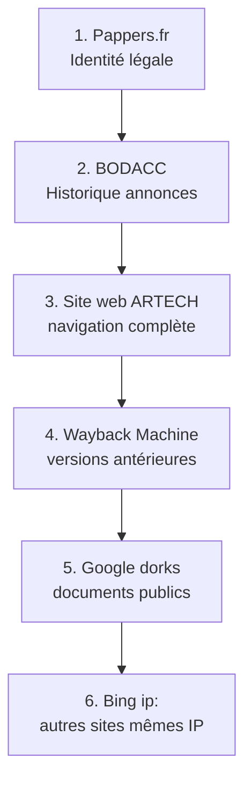

# 4.2 Reconnaissance passive - Google dorks et archives

!!! quote "L'analogie de l'archiviste municipal"

    Dans chaque mairie, il existe un archiviste municipal qui connaît mieux que personne l'histoire de la commune. Il sait que les permis de construire de 1985 sont au sous-sol, que les comptes-rendus de conseil sont au troisième étage, que les bulletins paroissiaux remontent à 1920. Quand un chercheur arrive avec une question précise, l'archiviste lui ouvre les bonnes étagères. Sans lui, le chercheur passerait des semaines à errer. Google et les archives Internet sont vos archivistes pour ARTECH. Ils savent où sont les documents publics, les versions effacées du site, les organigrammes oubliés. Encore faut-il leur poser les bonnes questions.

## Métadonnées du chapitre

Ce chapitre approfondit les techniques de recherche passive sur les moteurs et archives. Voici ses caractéristiques.

| Champ | Valeur |
|---|---|
| Durée estimée | 3 heures |
| Niveau | Standard |
| Prérequis | 4.1 |
| Livrables | Mémo de dorks personnels, captures Wayback ARTECH |
| Auto-explication | 12 minutes |

## Objectifs pédagogiques

À l'issue de ce chapitre, vous serez capable de :

- Maîtriser les opérateurs avancés Google, Bing et DuckDuckGo
- Construire des requêtes ciblées (dorks) efficaces
- Exploiter Wayback Machine pour les versions historiques
- Utiliser la Google Hacking Database (GHDB)
- Consulter les archives publiques françaises
- Documenter chaque source trouvée

---

## 1. Opérateurs avancés Google

Google supporte une vingtaine d'opérateurs avancés peu connus du grand public. Maîtrisés ensemble, ils décuplent l'efficacité de vos recherches.

### 1.1 Opérateurs essentiels

Voici les 10 opérateurs les plus utiles en OSINT.

| Opérateur | Effet | Exemple |
|---|---|---|
| `site:` | Restreint à un domaine | `site:artech.fr` |
| `inurl:` | Mot dans l'URL | `inurl:admin` |
| `intitle:` | Mot dans le titre | `intitle:"organigramme"` |
| `intext:` | Mot dans le contenu | `intext:"sophie.dupont"` |
| `filetype:` | Type de fichier | `filetype:pdf` |
| `cache:` | Version en cache Google | `cache:artech.fr` |
| `link:` | Pages qui pointent vers | `link:artech.fr` (deprecated mais tenter) |
| `related:` | Sites similaires | `related:artech.fr` |
| `OR` ou `\|` | Alternative | `compta OR finance` |
| `-` | Exclusion | `artech -recettes` |

### 1.2 Combinaisons puissantes

L'art du Google dorking consiste à combiner plusieurs opérateurs. Voici quelques combinaisons classiques.

```text
COMBINAISONS UTILES

# Documents publics ARTECH
site:artech.fr filetype:pdf

# Documents Office
site:artech.fr (filetype:doc OR filetype:docx OR filetype:xls OR filetype:xlsx)

# Pages d'admin oubliées
site:artech.fr inurl:admin

# Sous-domaines
site:*.artech.fr -site:www.artech.fr

# Mentions presse
"ARTECH" "Lyon" -site:artech.fr

# Profils LinkedIn
site:linkedin.com/in/ "ARTECH"

# Documents internes échappés
intext:"confidentiel" site:artech.fr
intext:"interne" filetype:pdf "ARTECH"

# Recherche contact
"ARTECH" intext:"@artech.fr" -site:artech.fr

# Trombinoscope
site:artech.fr (intitle:"équipe" OR intitle:"team" OR intitle:"about")

# Annuaires professionnels
"ARTECH" site:societe.com OR site:pappers.fr OR site:verif.com
```

### 1.3 Dorks pour fuites accidentelles

Certains dorks permettent de trouver des fichiers qui n'auraient jamais dû être publics. Cette catégorie illustre l'importance d'auditer son propre site.

| Dork | Cible |
|---|---|
| `site:artech.fr ext:log` | Fichiers de log oubliés |
| `site:artech.fr ext:env` | Fichiers .env (variables) |
| `site:artech.fr inurl:.git` | Repositories Git exposés |
| `site:artech.fr inurl:backup` | Sauvegardes accessibles |
| `site:artech.fr (ext:sql OR ext:dump)` | Dumps base de données |
| `site:artech.fr "Index of /"` | Listings de répertoires |

### 1.4 Outil dorks-collections-list

Pour aller plus loin, plusieurs collections de dorks sont maintenues par la communauté. Voici les plus utilisées.

| Source | URL |
|---|---|
| Google Hacking Database (Exploit-DB) | exploit-db.com/google-hacking-database |
| Pentest-Tools dorks | pentest-tools.com/information-gathering/google-hacking |
| Awesome Google Dorks | github.com/Z0fhadi/Awesome-Google-Dorking-Cheat-Sheet |
| OSINT Industries | osint.industries |

## 2. Bing et DuckDuckGo

Google n'est pas le seul moteur. Bing et DuckDuckGo retournent souvent des résultats différents, et certains opérateurs n'existent que chez l'un.

### 2.1 Spécificités Bing

Bing supporte des opérateurs propres particulièrement utiles pour l'OSINT.

| Opérateur Bing | Effet |
|---|---|
| `ip:` | Sites hébergés sur cette IP |
| `language:` | Langue cible |
| `location:` | Géolocalisation |
| `feed:` | Recherche dans flux RSS |
| `hasfeed:` | Pages avec flux RSS |

L'opérateur `ip:` est particulièrement utile pour identifier d'autres sites hébergés sur la même IP qu'ARTECH (mutualisation, vulnérabilités partagées).

### 2.2 DuckDuckGo

DuckDuckGo respecte la vie privée et propose des **bangs** (raccourcis) pour rediriger vers d'autres moteurs.

| Bang | Redirection |
|---|---|
| `!g terme` | Google |
| `!w terme` | Wikipedia |
| `!l terme` | LinkedIn |
| `!ggi terme` | Google Images |

### 2.3 Yandex

Yandex (moteur russe) excelle particulièrement sur la **reverse image search** des visages. C'est un complément précieux quand Google échoue.

## 3. Google Hacking Database (GHDB)

La GHDB est la collection de référence des dorks pour la sécurité offensive. Maintenue par Exploit-DB depuis 2002.

### 3.1 Catégories GHDB

La base classe les dorks en 14 catégories. Voici les plus pertinentes pour ARTECH.

| Catégorie | Usage |
|---|---|
| Footholds | Points d'entrée potentiels |
| Files containing usernames | Fichiers avec utilisateurs |
| Sensitive Directories | Répertoires sensibles |
| Web Server Detection | Identification de serveurs |
| Vulnerable Files | Fichiers exploitables |
| Vulnerable Servers | Serveurs vulnérables |
| Error Messages | Messages d'erreur révélateurs |
| Network or vulnerability data | Données réseau |
| Pages containing login portals | Portails d'authentification |
| Various Online Devices | IoT exposés |

### 3.2 Recherche dans GHDB

Pour interroger la GHDB, vous accédez à `exploit-db.com/google-hacking-database` et utilisez la recherche par mot-clé.

Voici quelques exemples de requêtes utiles pour auditer ARTECH.

```text
EXEMPLES DE REQUÊTES GHDB

Recherche : "phpinfo" → catégorie Sensitive Directories
  Trouve les pages phpinfo() exposées qui révèlent
  la configuration PHP du serveur

Recherche : "wp-admin" → catégorie Pages containing login portals
  Trouve les pages d'admin WordPress exposées

Recherche : "intitle:Index of" "/etc/passwd" → Footholds
  Cas extrême - serveur mal configuré exposant /etc
```

## 4. Wayback Machine - Archives.org

Wayback Machine est l'archive du web depuis 1996. Elle conserve des **snapshots** historiques de sites web.

### 4.1 Pourquoi c'est précieux

Plusieurs cas d'usage rendent cet outil indispensable en OSINT.

| Cas | Apport |
|---|---|
| Site refondu | Retrouver l'ancienne organisation |
| Trombinoscope effacé | Récupérer noms et photos |
| Pages d'erreur révélées | Voir si pages d'admin ont existé |
| Documents retirés | Récupérer fichiers PDF supprimés |
| Évolution des produits | Tracer changements d'offre |
| Articles supprimés | Garder traces de communications |

### 4.2 Utilisation basique

L'accès se fait via `web.archive.org`. Vous saisissez l'URL et choisissez une date dans le calendrier.

```text
EXEMPLE D'USAGE
================

URL d'origine     : https://artech.fr/equipe
URL Wayback       : https://web.archive.org/web/*/artech.fr/equipe
Date archivage    : 2018-03-15 (par exemple)
Capture complète  : page + images + CSS + JS

INTÉRÊT
  Si la page actuelle ne mentionne plus
  l'ancien DSI parti en 2020, l'archive
  de 2018 le mentionne encore.
```

### 4.3 Wayback CDX API

Pour automatiser, Wayback expose une API CDX. Voici un exemple d'utilisation pour récupérer toutes les URL archivées d'un domaine.

```bash
# Récupération de toutes les URLs uniques archivées pour artech.fr
curl -s "http://web.archive.org/cdx/search/cdx?url=artech.fr/*&output=json&fl=original&collapse=urlkey" \
    | jq -r '.[][]' \
    | sort -u \
    > artech-archived-urls.txt

# Comptage
wc -l artech-archived-urls.txt
```

### 4.4 Outil waybackurls

L'outil **waybackurls** automatise cette extraction. Voici son installation et son usage.

```bash
# Installation (Go requis)
go install github.com/tomnomnom/waybackurls@latest

# Usage
waybackurls artech.fr > artech-wayback-urls.txt

# Filtrage par extension
cat artech-wayback-urls.txt | grep -E "\.(pdf|doc|docx|xlsx)$"
```

### 4.5 Préservation forensic

Pour vos propres captures Wayback, sauvegardez avec horodatage.

```bash
# Capture forcée d'une page actuelle dans Wayback
curl -s "https://web.archive.org/save/https://artech.fr/page" \
    -o /tmp/wayback-result.html

# Lecture du header pour confirmation
curl -s -I "https://web.archive.org/save/https://artech.fr/page" \
    | grep -i "content-location"
```

## 5. Archives publiques françaises

La France dispose de plusieurs registres publics consultables gratuitement.

### 5.1 Société.com / Pappers

**Pappers.fr** est devenu en 2026 la référence pour les informations sur entreprises françaises. **Société.com** reste utile en complément.

Voici les informations accessibles gratuitement sur Pappers.

| Information | Disponibilité |
|---|---|
| Raison sociale | Gratuit |
| SIRET / SIREN | Gratuit |
| Adresse siège | Gratuit |
| Activité (code NAF) | Gratuit |
| Date création | Gratuit |
| Effectif (tranche) | Gratuit |
| Capital social | Gratuit |
| Dirigeants actuels | Gratuit |
| Dirigeants historiques | Payant ou Pappers Pro |
| Liens entre sociétés | Gratuit (graphique) |
| Comptes annuels | Gratuit (PDF intégral !) |
| Annonces BODACC | Gratuit |

Pour ARTECH, recherche directe : `pappers.fr` puis taper "ARTECH".

### 5.2 BODACC

Le **Bulletin Officiel des Annonces Civiles et Commerciales** publie toutes les opérations légales (créations, modifications, cessations). Accès libre via `bodacc.fr`.

Voici les types d'annonces utiles en OSINT.

| Type | Information |
|---|---|
| Création | Date, dirigeants initiaux |
| Modification | Changements dirigeants, capital |
| Cessation | Liquidation, redressement |
| Cession | Achats/ventes |
| Procédures collectives | Difficultés financières (vulnérabilité) |

### 5.3 INPI

L'**INPI** (Institut National de la Propriété Industrielle) fournit accès aux marques déposées. Site : `data.inpi.fr`.

Pour ARTECH, vérifiez les marques déposées qui pourraient révéler des produits ou des projets non publics.

### 5.4 Annuaire des entreprises (data.gouv.fr)

Le site `annuaire-entreprises.data.gouv.fr` croise INSEE, BODACC et INPI dans une interface unique. Particulièrement pratique pour une vue rapide.

### 5.5 Open Corporates

**OpenCorporates** (`opencorporates.com`) est la version internationale, particulièrement utile pour les groupes ayant des filiales à l'étranger.

## 6. Méthodologie pratique pour ARTECH

Voici un workflow concret applicable à ARTECH dans votre lab.

### 6.1 Workflow en 6 étapes

L'enchaînement type d'une session de reconnaissance passive ARTECH suit le schéma ci-dessous.



### 6.2 Checklist exécution

Pour ne rien oublier, voici la checklist à compléter par session.

```text
CHECKLIST RECONNAISSANCE PASSIVE - ARTECH
==========================================

PAPPERS.FR
[ ] Raison sociale exacte
[ ] SIREN / SIRET
[ ] Capital social
[ ] Dirigeants actuels (noms et fonctions)
[ ] Effectif (tranche)
[ ] Activité NAF
[ ] Comptes annuels téléchargés (3 derniers exercices)

BODACC
[ ] Annonces des 5 dernières années
[ ] Modifications statutaires
[ ] Pas de procédures collectives en cours

SITE WEB ARTECH
[ ] Navigation complète
[ ] Mentions légales
[ ] Page contact
[ ] Page équipe / about
[ ] Blog / actualités
[ ] Documents PDF accessibles

WAYBACK MACHINE
[ ] 3-5 captures récentes
[ ] 1-2 captures anciennes (3-5 ans)
[ ] Comparaison versions

GOOGLE DORKS
[ ] site:artech.fr filetype:pdf
[ ] site:artech.fr filetype:docx
[ ] "ARTECH" "lyon" -site:artech.fr
[ ] site:linkedin.com/in/ "ARTECH"
[ ] site:*.artech.fr -site:www.artech.fr

BING SPÉCIFIQUE
[ ] ip:[IP_ARTECH]
[ ] (autres sites sur la même IP)

DOCUMENTATION
[ ] Toutes captures hashées
[ ] Toutes URLs sauvegardées dans Wayback
[ ] Journal horodaté à jour
```

## 7. Cas pratique - Une session ARTECH

### 7.1 Mise en situation

Vous êtes en début de mission OSINT ARTECH. Voici la session de 1 heure type pour épuiser la reconnaissance passive.

### 7.2 Déroulement minute par minute

Voici le déroulé pédagogique d'une heure d'OSINT passif productif.

| Minute | Action | Outil |
|---|---|---|
| 0-5 | Pappers.fr → identité, dirigeants, comptes | Navigateur |
| 5-10 | BODACC → historique annonces | Navigateur |
| 10-15 | INPI → marques déposées | Navigateur |
| 15-25 | Site artech.fr → navigation exhaustive | Navigateur + Hunchly |
| 25-35 | Wayback → 5 captures historiques | Navigateur |
| 35-50 | Google dorks → 10 requêtes ciblées | Navigateur |
| 50-55 | Bing ip: → autres sites | Navigateur |
| 55-60 | Documentation et hashes | Terminal |

À l'issue : vous avez 80 % des informations exploitables sur ARTECH.

### 7.3 Sortie attendue

Voici le format du fichier de session que vous tenez à jour.

```text
SESSION OSINT PASSIF ARTECH - 2026-XX-XX
==========================================

DURÉE : 1h00 (08:30 - 09:30 UTC)
ANALYSTE : Zyrass

PAPPERS.FR
  ARTECH SAS
  SIRET : 123 456 789 00012
  Capital : 100 000 €
  Effectif : 20-49
  Dirigeante : Lefebvre Hélène (Présidente)
  NAF : 4646Z (Commerce de gros de produits pharmaceutiques)

BODACC
  Création 2018
  Augmentation de capital 2021
  Aucune procédure collective

SITE WEB
  Pages identifiées : 23
  Documents PDF : 12 (factures types, plaquettes)
  Page équipe : présente, 8 employés visibles

WAYBACK
  2018 : site basique
  2020 : refonte
  2024 : ajout blog
  2025 : ajout newsletter

GOOGLE DORKS RÉVÉLATIONS
  - 1 fichier .docx contenant ancien organigramme
  - Profils LinkedIn de 12 employés
  - Mention dans article presse local 2023

ARTEFACTS COLLECTÉS
  Fichier 1 : pappers-artech-2026XX.pdf [SHA-256: ...]
  Fichier 2 : wayback-artech-2018.pdf [SHA-256: ...]
  ...
```

## 8. Pièges et bonnes pratiques

Voici les pièges classiques de cette phase et comment les éviter.

### 8.1 Pièges fréquents

Cette phase est piégée par plusieurs erreurs typiques.

| Piège | Évitement |
|---|---|
| Cliquer sur des liens hors périmètre | Time-boxer sa session |
| Sauvegarder les fichiers sans hash | Hash systématique |
| Confondre ARTECH labo et homonymes | Vérifier SIRET à chaque pas |
| Faire des captures non datées | wkhtmltopdf avec timestamp |
| Oublier de sauver dans Wayback | curl save systématique |

### 8.2 Bonnes pratiques

À l'inverse, voici les pratiques qui font la différence entre amateur et professionnel.

| Pratique | Bénéfice |
|---|---|
| Hunchly actif | Documentation automatique |
| Sessions courtes (50 min) | Concentration optimale |
| Pause entre sessions | Recul nécessaire |
| Croiser au moins 2 sources par fait | Fiabilité |
| Notes en temps réel | Pas d'oubli |

## 9. Auto-évaluation

Vérifiez votre maîtrise par les questions suivantes.

| # | Question | Réponse |
|---|---|---|
| 1 | Opérateur pour limiter à un domaine ? | `site:` |
| 2 | Opérateur Bing pour sites sur même IP ? | `ip:` |
| 3 | URL Wayback Machine ? | web.archive.org |
| 4 | Site français pour info entreprise ? | Pappers.fr |
| 5 | Site officiel annonces légales ? | bodacc.fr |
| 6 | Outil pour extraire URLs Wayback ? | waybackurls |
| 7 | Catégorie GHDB pour fuites accidentelles ? | Sensitive Directories |
| 8 | Combien de captures Wayback recommandées ? | 3-5 récentes + 1-2 anciennes |

## 10. Synthèse

Voici les points clés à retenir.

```text
RECONNAISSANCE PASSIVE - ESSENTIELS

GOOGLE DORKS
  site: inurl: intitle: intext:
  filetype: cache: related:
  Combiner pour précision

BING SPÉCIFIQUE
  ip: pour mêmes IP

WAYBACK MACHINE
  web.archive.org
  3-5 captures récentes
  1-2 captures anciennes
  waybackurls pour extraction

ARCHIVES FRANCE
  Pappers.fr (référence 2026)
  BODACC pour annonces
  INPI pour marques
  data.gouv.fr pour synthèse

GHDB
  exploit-db.com/google-hacking-database
  14 catégories
  Sensitive Directories

WORKFLOW 6 ÉTAPES
  Pappers
  BODACC
  Site web
  Wayback
  Google dorks
  Bing ip:
```

---

**Chapitre précédent** : [4.1 Méthodologie OSINT](4-1-methodologie-osint.md)

**Chapitre suivant** : [4.3 theHarvester et énumération emails](4-3-theharvester-emails.md)
