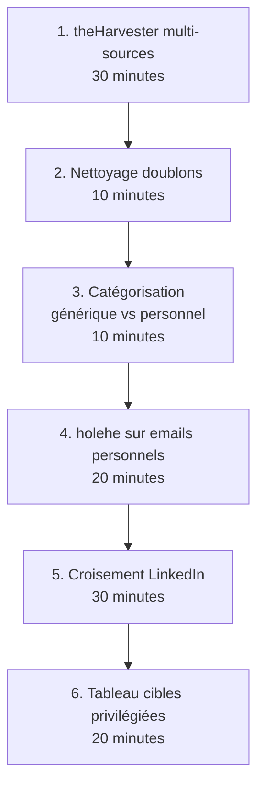

# 4.3 theHarvester et énumération emails

!!! quote "L'analogie du pêcheur au filet"

    Un pêcheur à la canne attrape un poisson à la fois. Patient, mais lent. Un pêcheur au filet, lui, ratisse une zone entière en une seule passe. Ce qui prendrait des heures à la canne se fait en quelques minutes. Pour un attaquant, lister manuellement les employés d'ARTECH page par page sur LinkedIn prend des journées. Avec theHarvester, le filet ramasse en une commande des dizaines d'emails depuis Google, Bing, LinkedIn, Hunter.io, et bien d'autres sources combinées. La compétence ne consiste pas à connaître l'outil, mais à savoir interpréter et nettoyer les prises.

## Métadonnées du chapitre

Ce chapitre est le premier chapitre purement pratique du module 4. Voici ses caractéristiques.

| Champ | Valeur |
|---|---|
| Durée estimée | 2 heures |
| Niveau | Pratique |
| Prérequis | 4.1, 4.2, Kali fonctionnel |
| Livrables | Liste emails ARTECH structurée, sous-domaines identifiés |
| Auto-explication | 8 minutes |

## Objectifs pédagogiques

À l'issue de ce chapitre, vous serez capable de :

- Installer et configurer theHarvester dans votre lab
- Configurer les clés API gratuites pour étendre la collecte
- Lancer une énumération multi-sources sur ARTECH
- Nettoyer et corréler les résultats
- Comparer avec d'autres outils (emailharvester, EmailFinder)

---

## 1. Présentation de theHarvester

**theHarvester** est l'outil de référence pour l'énumération OSINT. Maintenu par Christian Martorella depuis 2011, il est intégré par défaut dans Kali Linux.

### 1.1 Caractéristiques de l'outil

Voici les points forts qui en font un outil incontournable.

| Caractéristique | Précision |
|---|---|
| Open source | Oui (licence Apache 2.0) |
| Intégration Kali | Oui par défaut |
| Sources supportées | 30+ moteurs et services |
| Langages | Python 3.10+ |
| Format de sortie | JSON, XML, HTML |
| API requises | Certaines (gratuites pour la plupart) |
| Maintenu | Activement (commits récents) |

### 1.2 Sources de données

theHarvester interroge en parallèle de nombreuses sources. Les principales sources actives en 2026 sont listées ci-dessous.

| Source | Type | Clé API |
|---|---|---|
| anubis | DNS / sous-domaines | Non |
| baidu | Moteur recherche | Non |
| bing | Moteur recherche | Non |
| crtsh | Certificate Transparency | Non |
| duckduckgo | Moteur recherche | Non |
| google | Moteur (limité par captcha) | Non |
| hackertarget | Multi-source | Non |
| hunter | Hunter.io | Oui (gratuite limitée) |
| linkedin | Profils LinkedIn | Non |
| otx | AlienVault | Oui (gratuite) |
| rapiddns | DNS | Non |
| securityTrails | DNS étendu | Oui (gratuite limitée) |
| shodan | Infrastructure | Oui (payante) |
| sublist3r | Sous-domaines | Non |
| threatcrowd | Threat intel | Non |
| urlscan | URL scan | Non |
| virustotal | Domaines, IPs | Oui (gratuite limitée) |
| yahoo | Moteur recherche | Non |

## 2. Installation et configuration

### 2.1 Installation sur Kali Linux

theHarvester est déjà installé sur Kali Linux. Si nécessaire, voici la procédure de mise à jour.

```bash
# Mise à jour
sudo apt update
sudo apt install theharvester -y

# Ou installation directe depuis le repo (version la plus récente)
git clone https://github.com/laramies/theHarvester.git
cd theHarvester
pip3 install -r requirements/base.txt

# Vérification version
theHarvester --version
```

### 2.2 Configuration des clés API

Plusieurs sources nécessitent une clé API gratuite. Voici la procédure pour les obtenir.

| Source | URL d'inscription | Niveau |
|---|---|---|
| Hunter.io | hunter.io/api | Gratuit limité (50 req/mois) |
| AlienVault OTX | otx.alienvault.com/api | Gratuit |
| SecurityTrails | securitytrails.com | Gratuit limité (50 req/mois) |
| VirusTotal | virustotal.com/api | Gratuit limité |
| Shodan | shodan.io | Gratuit basique |

Une fois les clés obtenues, vous les configurez dans le fichier de configuration.

```bash
# Localisation du fichier (Kali récent)
sudo vi /etc/theHarvester/api-keys.yaml

# Ou depuis l'install git
vi ~/theHarvester/api-keys.yaml
```

Voici la structure du fichier de configuration.

```yaml
# /etc/theHarvester/api-keys.yaml

apikeys:
  bing:
    key: VOTRE_CLE_BING

  github:
    key: VOTRE_CLE_GITHUB

  hunter:
    key: VOTRE_CLE_HUNTER

  intelx:
    key: VOTRE_CLE_INTELX

  pentestTools:
    key: VOTRE_CLE_PENTESTTOOLS

  projectDiscovery:
    key: VOTRE_CLE_PROJECTDISCOVERY

  rocketreach:
    key: VOTRE_CLE_ROCKETREACH

  securityTrails:
    key: VOTRE_CLE_SECURITYTRAILS

  shodan:
    key: VOTRE_CLE_SHODAN

  virustotal:
    key: VOTRE_CLE_VIRUSTOTAL

  zoomeye:
    key: VOTRE_CLE_ZOOMEYE
```

**Sécurité** : ce fichier contient des secrets. Restreignez les permissions à 600.

```bash
sudo chmod 600 /etc/theHarvester/api-keys.yaml
```

## 3. Utilisation pratique

### 3.1 Syntaxe de base

La commande theHarvester suit une syntaxe simple. Voici les arguments principaux.

```bash
theHarvester -d <domaine> -b <sources> -l <limite> [autres options]
```

Voici le détail des options principales.

| Option | Effet |
|---|---|
| `-d` | Domaine cible |
| `-b` | Source(s) à utiliser (séparées par virgules ou `all`) |
| `-l` | Nombre de résultats max par source |
| `-s` | Décalage (offset pour sources avec pagination) |
| `-f` | Préfixe des fichiers de sortie |
| `-n` | DNS lookup activé |
| `-c` | DNS bruteforce |
| `-p` | Port scan rapide |
| `-v` | Vérification reverse DNS |
| `-h` | HTTP headers |

### 3.2 Première session sur ARTECH

Pour démarrer simplement, vous lancez une session basique sur les sources ne nécessitant pas de clé API.

```bash
# Recherche simple
theHarvester -d artech.fr -b bing,duckduckgo,crtsh,rapiddns -l 500

# Sortie avec rapport HTML
theHarvester -d artech.fr -b bing,duckduckgo,crtsh,rapiddns,hackertarget \
    -l 500 \
    -f artech-osint
```

La commande génère plusieurs fichiers dans le répertoire courant.

| Fichier | Contenu |
|---|---|
| `artech-osint.json` | Tous résultats au format JSON |
| `artech-osint.html` | Rapport HTML lisible |
| `artech-osint.xml` | Format XML |

### 3.3 Session complète multi-sources

Quand toutes vos clés API sont configurées, vous lancez une session exhaustive.

```bash
# Session complète avec toutes les sources
theHarvester -d artech.fr \
    -b "anubis,bing,crtsh,duckduckgo,hackertarget,hunter,otx,rapiddns,securityTrails,sublist3r,threatcrowd,urlscan,virustotal,yahoo" \
    -l 1000 \
    -f artech-osint-complet
```

Cette session prend 5-15 minutes selon la latence des sources et peut produire 50-200 résultats.

### 3.4 DNS bruteforce et résolution

Pour aller plus loin, vous activez le bruteforce de sous-domaines.

```bash
# Avec DNS bruteforce et résolution
theHarvester -d artech.fr \
    -b "bing,crtsh,sublist3r,otx" \
    -c \
    -n \
    -l 500 \
    -f artech-dns
```

L'option `-c` active le bruteforce en utilisant le wordlist par défaut. L'option `-n` résout les sous-domaines trouvés en IPs.

## 4. Interprétation des résultats

### 4.1 Format de sortie typique

Voici un exemple de sortie typique theHarvester sur ARTECH.

```text
*******************************************************************
*  _   _                                            _             *
* | |_| |__   ___    /\  /\__ _ _ ____   _____  ___| |_ ___ _ __  *
* | __|  _ \ / _ \  / /_/ / _` | '__\ \ / / _ \/ __| __/ _ \ '__| *
* | |_| | | |  __/ / __  / (_| | |   \ V /  __/\__ \ ||  __/ |    *
*  \__|_| |_|\___| \/ /_/ \__,_|_|    \_/ \___||___/\__\___|_|    *
*                                                                 *
* theHarvester 4.X.X                                              *
*******************************************************************

[*] Target: artech.fr

[*] Searching Bing.
[*] Searching DuckDuckGo.
[*] Searching CRTsh.
[*] Searching Hackertarget.

[*] No IPs Found.

[*] Emails found: 12
----------------------
contact@artech.fr
commercial@artech.fr
support@artech.fr
sophie.dupont@artech.fr
helene.lefebvre@artech.fr
jean.martin@artech.fr
paul.dubois@artech.fr
recrutement@artech.fr
sav@artech.fr
direction@artech.fr
compta@artech.fr
admin@artech.fr

[*] Hosts found: 8
---------------------
artech.fr:88.188.X.X
www.artech.fr:88.188.X.X
mail.artech.fr:88.188.X.Y
intranet.artech.fr:192.168.50.10 (interne, à exclure)
ftp.artech.fr:88.188.X.Z
admin.artech.fr:88.188.X.X
api.artech.fr:88.188.X.X
shop.artech.fr:88.188.X.W
```

### 4.2 Nettoyage des résultats

Les résultats bruts contiennent souvent du bruit. Voici les étapes de nettoyage typiques.

| Étape | Action |
|---|---|
| Doublons | dédupliquer la liste |
| Faux positifs | retirer adresses non-ARTECH |
| Adresses internes | retirer si laboratoire |
| Génériques | classer (contact@, support@) |
| Personnelles | classer (prenom.nom@) |
| Validation | vérifier existence (à éviter sans précaution) |

Voici un exemple de script de nettoyage simple.

```bash
# Extraction des emails uniques d'un export JSON
cat artech-osint.json | jq -r '.emails[]' | sort -u > emails-uniques.txt

# Tri par catégorie
grep -E "^(contact|support|info|sav|admin|webmaster)@" emails-uniques.txt > emails-generiques.txt
grep -vE "^(contact|support|info|sav|admin|webmaster)@" emails-uniques.txt > emails-personnels.txt

# Comptage
wc -l emails-*.txt
```

### 4.3 Valeur des emails personnels

Les emails personnels (`prenom.nom@`) sont **les plus précieux** pour préparer un phishing ciblé. Ils permettent de croiser avec LinkedIn pour identifier la fonction de la personne, sa séniorité, ses points faibles.

## 5. Validation des emails (avec précaution)

### 5.1 Pourquoi valider

Tous les emails listés ne sont pas forcément actifs. Une partie peut concerner d'anciens employés. Il est utile de savoir quelles adresses sont **encore en service**.

### 5.2 Méthodes de validation

Plusieurs méthodes existent, avec des niveaux de risque différents pour la discrétion de votre opération.

| Méthode | Détectabilité | Recommandation |
|---|---|---|
| Vérification syntaxique | Aucune | Toujours |
| Vérification MX records | Aucune | Toujours |
| SMTP VRFY | Détectable | Éviter |
| SMTP RCPT TO test | Détectable | Éviter |
| holehe (services tiers) | Aucune sur la cible | Recommandé |
| Hunter.io email-verifier | Aucune | Recommandé (clé API) |

### 5.3 Outil holehe

**holehe** vérifie si un email a un compte sur 100+ services en ligne, sans alerter la cible. Voici son installation et son usage.

```bash
# Installation
pip3 install holehe

# Vérification d'un email
holehe sophie.dupont@artech.fr

# Sortie typique
[+] sophie.dupont@artech.fr
[+] LinkedIn : Email used
[+] Twitter : Email not used
[+] Adobe : Email used
[+] Spotify : Email used
```

Une adresse listée sur LinkedIn et Adobe est probablement **active et en usage personnel/professionnel**.

## 6. Outils complémentaires

theHarvester n'est pas le seul outil. Voici les principaux compléments.

### 6.1 emailharvester

**emailharvester** est plus simple et ciblé sur les emails uniquement.

```bash
# Installation
pip3 install emailharvester

# Usage
emailharvester -d artech.fr -e bing
```

### 6.2 EmailFinder

**EmailFinder** est un agrégateur récent intégrant plusieurs API.

```bash
# Installation depuis GitHub
git clone https://github.com/Josue87/EmailFinder.git
cd EmailFinder
pip3 install -r requirements.txt

# Configuration des clés
vi config/api_keys.json

# Usage
python3 emailfinder.py -d artech.fr
```

### 6.3 Snov.io

**Snov.io** est un service commercial mais avec un palier gratuit. Il offre une qualité supérieure aux outils gratuits.

| Caractéristique | Valeur |
|---|---|
| Tarif gratuit | 100 vérifications/mois |
| Tarif payant | À partir de 39 USD/mois |
| Qualité | Supérieure à theHarvester |
| Discrétion | Très bonne |

### 6.4 Comparaison synthétique

Voici la comparaison des outils selon plusieurs critères pratiques.

| Outil | Gratuité | Sources | Qualité | Recommandé |
|---|---|---|---|---|
| theHarvester | Oui | 30+ | Bonne | Oui (référence) |
| emailharvester | Oui | 5 | Modérée | Complément |
| EmailFinder | Oui | 5+ avec API | Très bonne | Oui |
| Snov.io | Limité | Commercial | Excellente | Si budget |
| Hunter.io | Limité | Commercial | Excellente | Si budget |

## 7. Cas pratique - Énumération ARTECH

### 7.1 Mise en situation

Vous démarrez l'énumération emails ARTECH. Cible : produire la liste exhaustive des employés et leurs adresses pour préparer le phishing du module 6.

### 7.2 Workflow complet

Voici l'enchaînement d'actions à mener pour cette session.



### 7.3 Commandes de la session

Voici les commandes successives à exécuter dans le lab.

```bash
# Étape 1 - theHarvester
mkdir -p ~/osint/artech-2026/emails
cd ~/osint/artech-2026/emails

theHarvester -d artech.fr \
    -b "bing,duckduckgo,crtsh,rapiddns,hackertarget,otx" \
    -l 500 \
    -f session-1

# Étape 2 - Extraction emails uniques
cat session-1.json | jq -r '.emails[]?' | sort -u > emails-bruts.txt
wc -l emails-bruts.txt

# Étape 3 - Catégorisation
grep -E "^(contact|support|info|sav|admin|webmaster|root|noreply|hello)@" emails-bruts.txt \
    > emails-generiques.txt

grep -vE "^(contact|support|info|sav|admin|webmaster|root|noreply|hello)@" emails-bruts.txt \
    > emails-personnels.txt

# Étape 4 - Validation holehe
while read email; do
    echo "=== $email ==="
    holehe --no-color "$email" 2>/dev/null
done < emails-personnels.txt > validation-holehe.txt

# Étape 5 - Documentation
sha256sum *.txt session-1.* > MANIFEST.sha256
```

### 7.4 Livrable attendu

À l'issue, vous avez constitué le dossier suivant.

```text
~/osint/artech-2026/emails/
├── session-1.json         (export theHarvester)
├── session-1.html         (rapport visuel)
├── session-1.xml
├── emails-bruts.txt       (liste totale)
├── emails-generiques.txt  (sans intérêt phishing)
├── emails-personnels.txt  (cibles potentielles)
├── validation-holehe.txt  (services associés)
└── MANIFEST.sha256        (intégrité)
```

## 8. Limites et précautions

### 8.1 Faux positifs

theHarvester peut remonter des emails inexacts. Causes principales.

| Cause | Mitigation |
|---|---|
| Anciens employés | Vérifier avec LinkedIn |
| Erreur typo dans une source | Vérifier le format |
| Email d'un partenaire mentionnant ARTECH | Lire le contexte source |
| Adresse personnelle utilisant le nom ARTECH | Vérification holehe |

### 8.2 Limites de couverture

theHarvester ne trouvera **jamais** :

- Les emails non publiquement référencés
- Les emails créés récemment (latence indexation)
- Les emails employés sans présence web
- Les emails de filiales avec domaines différents

### 8.3 Légalité

L'énumération d'emails est légale en France quand elle :

- Vise une organisation cliente sous mandat
- Reste dans les sources publiques
- N'utilise pas de SMTP brute force (intrusion)
- Documente l'intérêt légitime RGPD

### 8.4 Discrétion

Les requêtes theHarvester ne sont pas adressées à la cible directement, donc **non détectables côté ARTECH**. C'est un avantage majeur de la phase passive.

## 9. Auto-évaluation

Vérifiez votre maîtrise par les questions suivantes.

| # | Question | Réponse |
|---|---|---|
| 1 | Auteur theHarvester ? | Christian Martorella |
| 2 | Combien de sources environ ? | 30+ |
| 3 | Option pour bruteforce DNS ? | `-c` |
| 4 | Outil pour vérifier services associés à un email ? | holehe |
| 5 | Format de sortie HTML ? | Option `-f` puis fichier `.html` |
| 6 | Localisation clés API Kali ? | `/etc/theHarvester/api-keys.yaml` |
| 7 | Email à privilégier pour phishing ? | prenom.nom@ (personnels) |
| 8 | Détectabilité theHarvester ? | Faible (sources tierces) |

## 10. Synthèse

Voici les points clés à retenir.

```text
THEHARVESTER ET ÉNUMÉRATION

OUTIL DE RÉFÉRENCE
  theHarvester (Kali Linux)
  30+ sources combinées
  Open source

CLÉS API GRATUITES UTILES
  Hunter.io
  AlienVault OTX
  SecurityTrails
  VirusTotal
  Shodan basique

COMMANDE TYPE
  theHarvester -d artech.fr -b sources -l 500 -f sortie

WORKFLOW SESSION
  1. theHarvester multi-sources
  2. Nettoyage doublons
  3. Catégorisation générique vs personnel
  4. holehe sur personnels
  5. Croisement LinkedIn
  6. Liste cibles privilégiées

OUTILS COMPLÉMENTAIRES
  emailharvester
  EmailFinder
  Snov.io (commercial)
  Hunter.io (commercial)

VALEUR FORENSIC
  Liste exploitable pour phishing module 6
  Identification cibles privilégiées
  Cartographie infrastructure email
```

---

**Chapitre précédent** : [4.2 Reconnaissance passive - Google dorks et archives](4-2-google-dorks-archives.md)

**Chapitre suivant** : [4.4 Recherche par BSSID Wigle.net et SSID](4-4-wigle-bssid-ssid.md)
